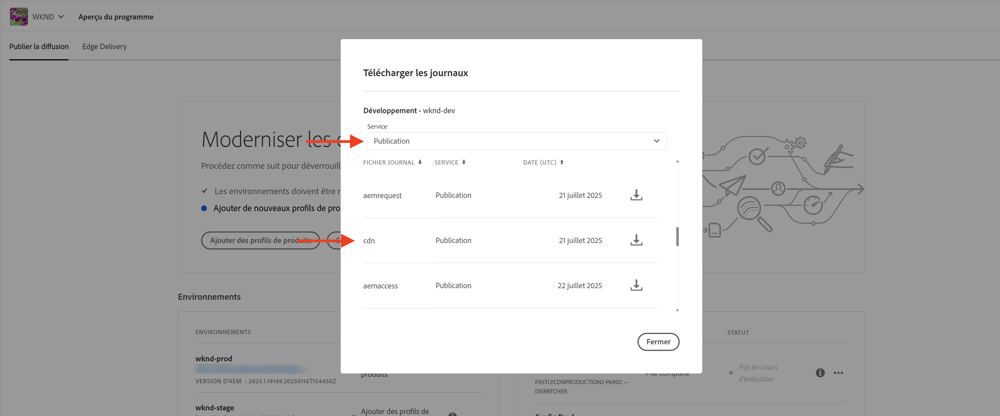

# Surveillance des requêtes sensibles

Découvrez comment surveiller les requêtes sensibles en les journalisant à l’aide des règles de filtrage du trafic dans AEM as a Cloud Service.

La journalisation vous permet d’observer les modèles de trafic sans affecter les utilisateurs et utilisatrices finaux ou les services. Il s’agit d’une première étape cruciale avant d’implémenter des règles de blocage.

Ce tutoriel explique comment **journaliser les demandes de connexion et de déconnexion de WKND** sur le service de publication AEM.

## Pourquoi et comment journaliser des requêtes

La journalisation de requêtes spécifiques est une pratique à faible risque et à forte valeur ajoutée qui permet de comprendre comment les utilisateurs et les utilisatrices, et les personnes potentiellement malveillantes, interagissent avec votre application AEM. Elle s’avère particulièrement utile avant d’appliquer des règles de blocage, ce qui vous permet d’affiner votre posture de sécurité sans interrompre le trafic légitime.

Les scénarios courants de journalisation sont les suivants :

- Valider l’impact et la portée d’une règle avant de la promouvoir en mode `block`.
- Surveiller les chemins de connexion/déconnexion et des points d’entrée d’authentification pour détecter les modèles inhabituels ou les tentatives de force brute.
- Suivre l’accès haute fréquence aux points d’entrée de l’API afin de détecter une utilisation abusive potentielle ou une activité DoS.
- Établir des références pour le comportement des robots avant d’appliquer des contrôles plus stricts.
- En cas d’incidents de sécurité, fournir des données forensiques pour comprendre la nature de l’attaque et les ressources affectées.

## Prérequis

Avant de poursuivre, assurez-vous d’avoir terminé la configuration requise, comme décrit dans le tutoriel [Configuration du filtre de trafic et des règles WAF](../setup.md). En outre, que vous avez cloné et déployé le [projet WKND AEM Sites](https://github.com/adobe/aem-guides-wknd) dans votre environnement AEM.

## Exemple : consigner les requêtes de connexion et de déconnexion WKND

Dans cet exemple, vous créez une règle de filtrage du trafic pour consigner les requêtes effectuées aux chemins de connexion et de déconnexion WKND sur le service de publication AEM. Cela vous permet de surveiller les tentatives d’authentification et d’identifier les problèmes de sécurité potentiels.

- Ajoutez la règle suivante au fichier de projet WKND `/config/cdn.yaml`.

```yaml
kind: "CDN"
version: "1"
metadata:
  envTypes: ["dev", "stage", "prod"]
data:
  trafficFilters:
    rules:
    # On AEM Publish service log WKND Login and Logout requests
    - name: publish-auth-requests
      when:
        allOf:
          - reqProperty: tier
            matches: publish
          - reqProperty: path
            in:
              - /system/sling/login/j_security_check
              - /system/sling/logout
      action: log   
```

- Validez et envoyez les modifications au référentiel Git de Cloud Manager.

- Déployez les modifications dans l’environnement AEM à l’aide du pipeline de configuration Cloud Manager [créé précédemment](../setup.md#deploy-rules-using-adobe-cloud-manager).

- Testez la règle en vous connectant et en vous déconnectant du site WKND de votre programme (par exemple, `https://publish-pXXXX-eYYYY.adobeaemcloud.com/us/en.html`). Vous pouvez utiliser `asmith/asmith` comme nom d’utilisation et mot de passe.

  

## Analyser

Analysons les résultats de la règle `publish-auth-requests` en téléchargeant les journaux de réseau CDN AEMCS depuis Cloud Manager et en utilisant l’[outil d’analyse de journal de réseau CDN AEMCS](../setup.md#setup-the-elastic-dashboard-tool).

- Cliquez sur la vignette **Environnements** de [Cloud Manager](https://my.cloudmanager.adobe.com/) et téléchargez les journaux du réseau CDN du service de **Publication** AEMCS.

  

  >[!TIP]
  >
  > 5 minutes peuvent s’écouler avant l’affichage des nouvelles requêtes dans les journaux du réseau CDN.

- Copiez le fichier journal téléchargé (par exemple, `publish_cdn_2023-10-24.log` dans la copie d’écran ci-dessous) dans le dossier `logs/dev` du projet d’outil de tableau de bord Elastic.

  

- Actualisez la page de l’outil de tableau de bord Elastic.
   - Dans la section supérieure **Filtre global**, modifiez le filtre `aem_env_name.keyword` et sélectionnez la valeur d’environnement `dev`.

     

   - Pour modifier l’intervalle de temps, cliquez sur l’icône de calendrier dans le coin supérieur droit et sélectionnez la valeur souhaitée.

     

- Consultez les panneaux **Requêtes analysées**, **Requêtes marquées** et **Détails des requêtes marquées**. Pour les entrées de journal du réseau CDN correspondantes, les panneaux doivent afficher les valeurs d’adresse IP du client ou de la cliente (cli_ip), d’hôte, d’url, d’action (waf_action) et de nom de règle (waf_match) de chaque entrée.

  
