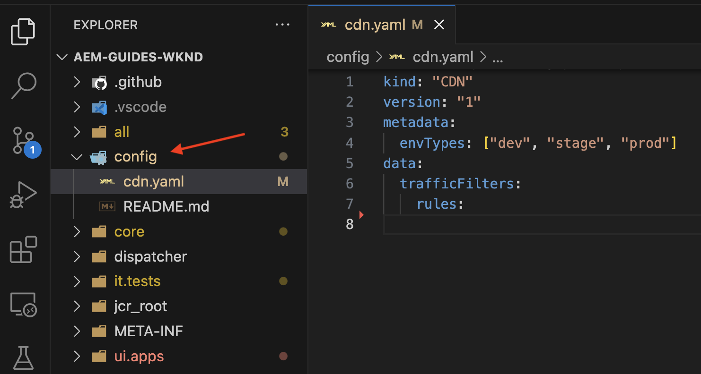
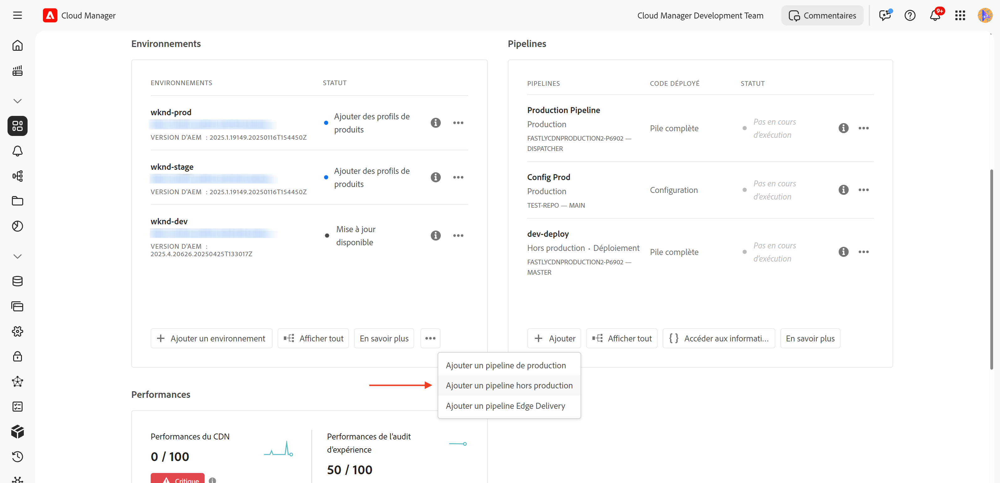
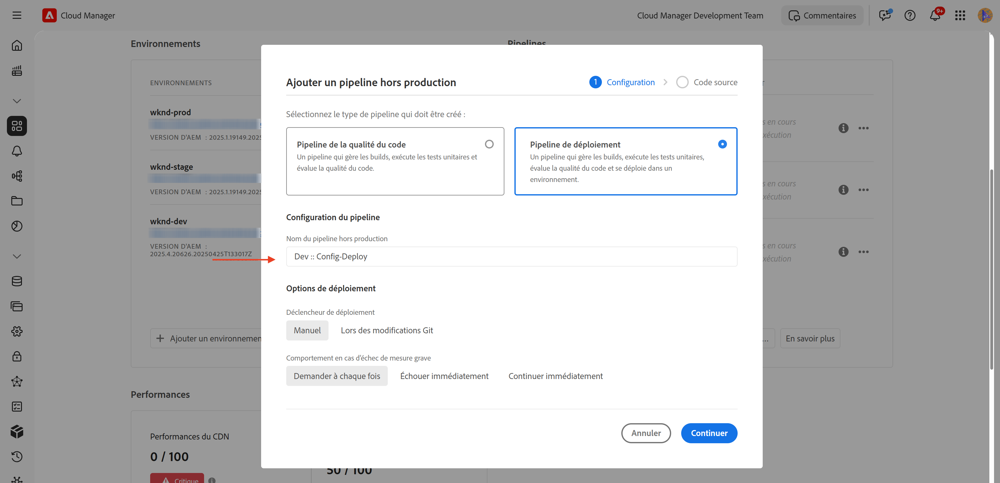
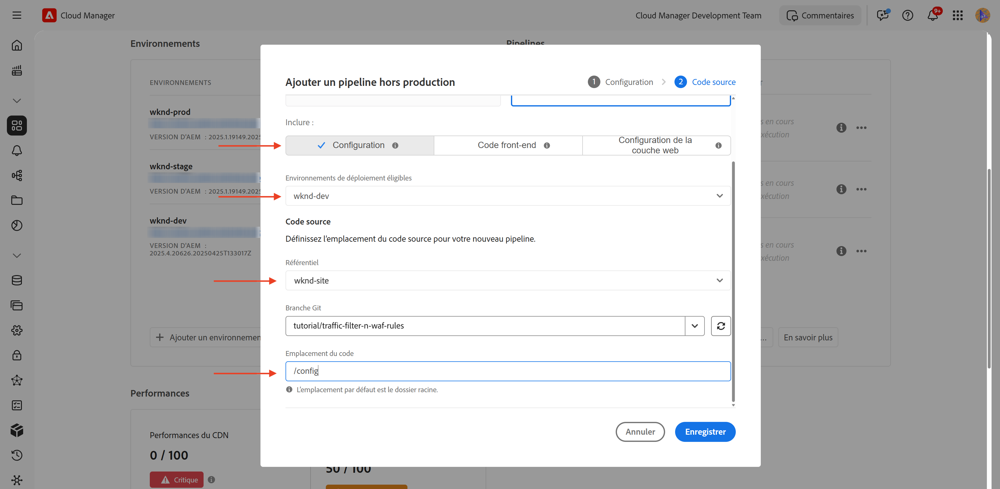
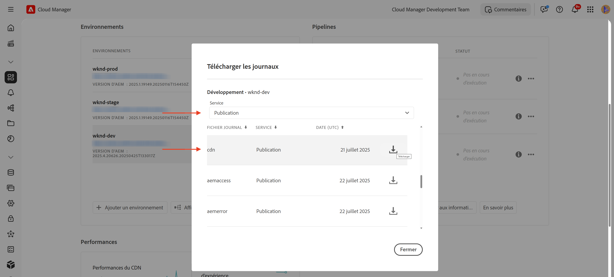

# Configuration des règles de filtrage du trafic, y compris les règles WAF

Découvrez **comment configurer** les règles de filtrage du trafic, y compris les règles du pare-feu d’application web (WAF). Dans ce tutoriel, nous avons préparé le terrain pour les tutoriels suivants, où vous allez configurer et déployer des règles, puis tester et analyser les résultats.

Pour démontrer le processus de configuration, le tutoriel utilise le [projet AEM WKND Sites](https://github.com/adobe/aem-guides-wknd).

>[!VIDEO](https://video.tv.adobe.com/v/3469396/?quality=12&learn=on)

## Présentation de la configuration

Les étapes de préparation des tutoriels suivants sont les suivantes :

- _Création de règles_ dans votre projet AEM, dans le dossier `config`
- _Déploiement de règles_ à l’aide du pipeline de configuration Adobe Cloud Manager.
- _Test des règles_ avec des outils tels que Curl, Vegeta et Nikto
- _Analyse des résultats_ à l’aide de l’outil d’analyse du journal CDN AEMCS

## Créer des règles dans votre projet AEM

Pour définir les règles de filtrage du trafic **standard** et **WAF** dans votre projet AEM, procédez comme suit :

1. Au niveau supérieur de votre projet AEM, créez un dossier nommé `config`.

2. Dans le dossier `config`, créez un fichier nommé `cdn.yaml`.

3. Utilisez la structure de métadonnées suivante dans `cdn.yaml` :

```yaml
kind: "CDN"
version: "1"
metadata:
  envTypes: ["dev", "stage", "prod"]
data:
  trafficFilters:
    rules:
```



Dans le [tutoriel suivant](#next-steps), vous apprendrez à ajouter Adobe **filtre de trafic standard recommandé et règles de WAF** au fichier ci-dessus en tant que base solide pour votre implémentation.

## Déploiement de règles à l’aide d’Adobe Cloud Manager

Pour préparer le déploiement des règles, procédez comme suit :

1. Connectez-vous à [my.cloudmanager.adobe.com](https://my.cloudmanager.adobe.com/) et sélectionnez votre programme.

2. Sur la page **Aperçu du programme**, accédez à la carte **Pipelines** et cliquez sur **+Ajouter** pour créer un pipeline.

   

3. Dans l’assistant de pipeline :

   - **Type** : pipeline de déploiement
   - **Nom du pipeline** : Dev-Config

   

4. Configuration du code Source :

   - **Code à déployer** : déploiement ciblé
   - **Inclure** : Config
   - **Environnement de déploiement** par exemple, `wknd-program-dev`
   - **Référentiel** : référentiel Git (par exemple, `wknd-site`).
   - **Branche Git** : votre branche de travail
   - **Emplacement du code** : `/config`

   

5. Vérifiez la configuration du pipeline et cliquez sur **Enregistrer**.

Dans le [tutoriel suivant](#next-steps), vous apprendrez à déployer le pipeline vers votre environnement AEM.

## Test de règles à l’aide d’outils

Pour tester l’efficacité de votre filtre de trafic standard et de vos règles WAF, vous pouvez utiliser divers outils pour simuler des requêtes et analyser la manière dont vos règles répondent.

Vérifiez que les outils suivants sont installés sur votre ordinateur local ou suivez les instructions pour les installer :

- [Curl](https://curl.se/) : flux de requête/réponse de test.
- [Vegeta](https://github.com/tsenart/vegeta) : Simuler une charge de requête élevée (test de déni de service).
- [Nikto](https://github.com/sullo/nikto/wiki) : recherche les vulnérabilités.

Vous pouvez vérifier l&#39;installation à l&#39;aide des commandes suivantes :

```shell
# Curl version check
$ curl --version

# Vegeta version check
$ vegeta -version

# Nikto version check
$ cd <PATH-OF-CLONED-REPO>/program
$ ./nikto.pl -Version
```

Dans le [tutoriel suivant](#next-steps), vous apprendrez à utiliser ces outils pour simuler des charges de requête élevées et des requêtes malveillantes afin de tester l’efficacité de votre filtre de trafic et de vos règles WAF.

## Analyse des résultats

Pour vous préparer à l’analyse des résultats, procédez comme suit :

1. Installez l’outil **AEMCS CDN Log Analysis Tooling** pour visualiser et analyser les modèles à l’aide de tableaux de bord préconfigurés.

2. Effectuez l’ingestion des journaux **CDN** en téléchargeant les journaux depuis l’interface utilisateur de Cloud Manager. Vous pouvez également transférer les journaux directement vers une destination de journalisation hébergée prise en charge, telle que Splunk ou Elasticsearch.

### Outil d’analyse du journal CDN AEMCS

Pour analyser les résultats de votre filtre de trafic et des règles de WAF, vous pouvez utiliser l’outil **AEMCS CDN Log Analysis Tooling**. Cet outil fournit des tableaux de bord préconfigurés pour visualiser le trafic du réseau CDN et l’activité de WAF en exploitant les journaux collectés à partir du réseau CDN AEMCS.

L’outil d’analyse du journal du réseau CDN AEMCS prend en charge deux plateformes d’observabilité, **ELK** (Elasticsearch, Logstash, Kibana) et **Splunk**.

Il est possible d’utiliser la fonction Transfert de journal pour diffuser vos journaux vers un service de journalisation ELK ou Splunk hébergé, où vous pouvez installer un tableau de bord pour visualiser et analyser les règles standard de filtrage du trafic et de WAF. Toutefois, pour ce tutoriel, vous allez configurer le tableau de bord sur une instance ELK locale installée sur votre ordinateur.

1. Clonez le référentiel [AEMCS-CDN-Log-Analysis-Tooling](https://github.com/adobe/AEMCS-CDN-Log-Analysis-Tooling).

2. Suivez le [Guide de configuration du conteneur ELK Docker](https://github.com/adobe/AEMCS-CDN-Log-Analysis-Tooling/blob/main/ELK/README.md) pour installer et configurer la pile ELK localement.

3. Grâce aux tableaux de bord ELK, vous pouvez explorer des mesures telles que les requêtes IP, le trafic bloqué, les modèles d’URI et les alertes de sécurité.

   

>[!NOTE]
> 
> Si les journaux ne sont pas encore ingérés à partir du réseau CDN AEM, les tableaux de bord apparaissent vides.

### Ingestion des journaux CDN

Pour ingérer des journaux CDN dans la pile ELK, procédez comme suit :

- Cliquez sur la vignette **Environnements** de [Cloud Manager](https://my.cloudmanager.adobe.com/) et téléchargez les journaux du réseau CDN du service de **Publication** AEMCS.

  

  >[!TIP]
  >
  > 5 minutes peuvent s’écouler avant l’affichage des nouvelles requêtes dans les journaux du réseau CDN.

- Copiez le fichier journal téléchargé (par exemple, `publish_cdn_2025-06-06.log` dans la copie d’écran ci-dessous) dans le dossier `logs/dev` du projet d’outil de tableau de bord Elastic.

  {width="800" zoomable="yes"}

- Actualisez la page de l’outil de tableau de bord Elastic.
   - Dans la section supérieure **Filtre global**, modifiez le filtre `aem_env_name.keyword` et sélectionnez la valeur d’environnement `dev`.

     

   - Pour modifier l’intervalle de temps, cliquez sur l’icône de calendrier dans le coin supérieur droit et sélectionnez la valeur souhaitée.

- Dans le [tutoriel suivant](#next-steps), vous apprendrez à analyser les résultats du filtre de trafic standard et des règles de filtre de trafic WAF à l’aide des tableaux de bord préconfigurés dans la pile ELK.

  

## Résumé

Vous avez correctement préparé le terrain pour l’implémentation des règles de filtrage du trafic, y compris les règles de WAF dans AEM as a Cloud Service. Vous avez créé une structure de fichiers de configuration, un pipeline pour le déploiement et préparé des outils pour tester et analyser les résultats.

## Étapes suivantes

Découvrez comment mettre en œuvre les règles recommandées d’Adobe à l’aide des tutoriels suivants :

<!-- CARDS
{target = _self}

* ./use-cases/using-traffic-filter-rules.md
  {title = Protecting AEM websites using standard traffic filter rules}
  {description = Learn how to protect AEM websites from DoS, DDoS and bot abuse using Adobe-recommended standard traffic filter rules in AEM as a Cloud Service.}
  {image = ./assets/use-cases/using-traffic-filter-rules.png}
  {cta = Apply Rules}

* ./use-cases/using-waf-rules.md
  {title = Protecting AEM websites using WAF traffic filter rules}
  {description = Learn how to protect AEM websites from sophisticated threats including DoS, DDoS, and bot abuse using Adobe-recommended Web Application Firewall (WAF) traffic filter rules in AEM as a Cloud Service.}
  {image = ./assets/use-cases/using-waf-rules.png}
  {cta = Activate WAF}
-->
<!-- START CARDS HTML - DO NOT MODIFY BY HAND -->
<div class="columns">
    <div class="column is-half-tablet is-half-desktop is-one-third-widescreen" aria-label="Protecting AEM websites using standard traffic filter rules">
        <div class="card" style="height: 100%; display: flex; flex-direction: column; height: 100%;">
            <div class="card-image">
                <figure class="image x-is-16by9">
                    <a href="./use-cases/using-traffic-filter-rules.md" title="Protection des sites web AEM à l’aide de règles de filtrage du trafic standard" target="_self" rel="referrer">
                        
                    </a>
                </figure>
            </div>
            <div class="card-content is-padded-small" style="display: flex; flex-direction: column; flex-grow: 1; justify-content: space-between;">
                <div class="top-card-content">
                    <p class="headline is-size-6 has-text-weight-bold">
                        <a href="./use-cases/using-traffic-filter-rules.md" target="_self" rel="referrer" title="Protection des sites web AEM à l’aide de règles de filtrage du trafic standard">Protection des sites web AEM à l’aide de règles de filtrage du trafic standard</a>
                    </p>
                    <p class="is-size-6">Découvrez comment protéger les sites web AEM contre les attaques par déni de service, par déni de service et les abus de robots à l’aide des règles de filtrage du trafic standard recommandées par Adobe dans AEM as a Cloud Service.</p>
                </div>
                <a href="./use-cases/using-traffic-filter-rules.md" target="_self" rel="referrer" class="spectrum-Button spectrum-Button--outline spectrum-Button--primary spectrum-Button--sizeM" style="align-self: flex-start; margin-top: 1rem;">
                    <span class="spectrum-Button-label has-no-wrap has-text-weight-bold">Appliquer des règles</span>
                </a>
            </div>
        </div>
    </div>
    <div class="column is-half-tablet is-half-desktop is-one-third-widescreen" aria-label="Protecting AEM websites using WAF traffic filter rules">
        <div class="card" style="height: 100%; display: flex; flex-direction: column; height: 100%;">
            <div class="card-image">
                <figure class="image x-is-16by9">
                    <a href="./use-cases/using-waf-rules.md" title="Protection des sites web AEM à l’aide des règles de filtrage du trafic WAF" target="_self" rel="referrer">
                        
                    </a>
                </figure>
            </div>
            <div class="card-content is-padded-small" style="display: flex; flex-direction: column; flex-grow: 1; justify-content: space-between;">
                <div class="top-card-content">
                    <p class="headline is-size-6 has-text-weight-bold">
                        <a href="./use-cases/using-waf-rules.md" target="_self" rel="referrer" title="Protection des sites web AEM à l’aide des règles de filtrage du trafic WAF">Protection des sites web AEM à l’aide des règles de filtrage du trafic WAF</a>
                    </p>
                    <p class="is-size-6">Découvrez comment protéger les sites web d’AEM contre les menaces sophistiquées, y compris les attaques par déni de service, les attaques DDoS et les attaques de robots, à l’aide des règles de filtrage du trafic WAF (Web Application Firewall) recommandées par Adobe dans AEM as a Cloud Service.</p>
                </div>
                <a href="./use-cases/using-waf-rules.md" target="_self" rel="referrer" class="spectrum-Button spectrum-Button--outline spectrum-Button--primary spectrum-Button--sizeM" style="align-self: flex-start; margin-top: 1rem;">
                    <span class="spectrum-Button-label has-no-wrap has-text-weight-bold">Activer WAF</span>
                </a>
            </div>
        </div>
    </div>
</div>
<!-- END CARDS HTML - DO NOT MODIFY BY HAND -->

## Cas d’utilisation avancés

Au-delà du filtre de trafic standard recommandé par Adobe et des règles WAF, vous pouvez implémenter des scénarios avancés pour répondre à des besoins commerciaux spécifiques. Ces scénarios sont les suivants :

<!-- CARDS
{target = _self}

* ./how-to/request-logging.md

* ./how-to/request-blocking.md

* ./how-to/request-transformation.md
-->
<!-- START CARDS HTML - DO NOT MODIFY BY HAND -->
<div class="columns">
    <div class="column is-half-tablet is-half-desktop is-one-third-widescreen" aria-label="Monitoring sensitive requests">
        <div class="card" style="height: 100%; display: flex; flex-direction: column; height: 100%;">
            <div class="card-image">
                <figure class="image x-is-16by9">
                    <a href="./how-to/request-logging.md" title="Surveillance des requêtes sensibles" target="_self" rel="referrer">
                        
                    </a>
                </figure>
            </div>
            <div class="card-content is-padded-small" style="display: flex; flex-direction: column; flex-grow: 1; justify-content: space-between;">
                <div class="top-card-content">
                    <p class="headline is-size-6 has-text-weight-bold">
                        <a href="./how-to/request-logging.md" target="_self" rel="referrer" title="Surveillance des requêtes sensibles">Surveillance des requêtes sensibles</a>
                    </p>
                    <p class="is-size-6">Découvrez comment surveiller les requêtes sensibles en les enregistrant à l’aide des règles de filtrage du trafic dans AEM as a Cloud Service.</p>
                </div>
                <a href="./how-to/request-logging.md" target="_self" rel="referrer" class="spectrum-Button spectrum-Button--outline spectrum-Button--primary spectrum-Button--sizeM" style="align-self: flex-start; margin-top: 1rem;">
<span class="spectrum-Button-label has-no-wrap has-text-weight-bold">En savoir plus</span>
</a>
            </div>
        </div>
    </div>
    <div class="column is-half-tablet is-half-desktop is-one-third-widescreen" aria-label="Restricting access">
        <div class="card" style="height: 100%; display: flex; flex-direction: column; height: 100%;">
            <div class="card-image">
                <figure class="image x-is-16by9">
                    <a href="./how-to/request-blocking.md" title="Limitation de l’accès" target="_self" rel="referrer">
                        
                    </a>
                </figure>
            </div>
            <div class="card-content is-padded-small" style="display: flex; flex-direction: column; flex-grow: 1; justify-content: space-between;">
                <div class="top-card-content">
                    <p class="headline is-size-6 has-text-weight-bold">
                        <a href="./how-to/request-blocking.md" target="_self" rel="referrer" title="Limitation de l’accès">Limitation de l’accès</a>
                    </p>
                    <p class="is-size-6">Découvrez comment restreindre l’accès en bloquant des requêtes spécifiques à l’aide des règles de filtrage du trafic dans AEM as a Cloud Service.</p>
                </div>
                <a href="./how-to/request-blocking.md" target="_self" rel="referrer" class="spectrum-Button spectrum-Button--outline spectrum-Button--primary spectrum-Button--sizeM" style="align-self: flex-start; margin-top: 1rem;">
<span class="spectrum-Button-label has-no-wrap has-text-weight-bold">En savoir plus</span>
</a>
            </div>
        </div>
    </div>
    <div class="column is-half-tablet is-half-desktop is-one-third-widescreen" aria-label="Normalizing requests">
        <div class="card" style="height: 100%; display: flex; flex-direction: column; height: 100%;">
            <div class="card-image">
                <figure class="image x-is-16by9">
                    <a href="./how-to/request-transformation.md" title="Normalisation des requêtes" target="_self" rel="referrer">
                        
                    </a>
                </figure>
            </div>
            <div class="card-content is-padded-small" style="display: flex; flex-direction: column; flex-grow: 1; justify-content: space-between;">
                <div class="top-card-content">
                    <p class="headline is-size-6 has-text-weight-bold">
                        <a href="./how-to/request-transformation.md" target="_self" rel="referrer" title="Normalisation des requêtes">Normalisation des requêtes</a>
                    </p>
                    <p class="is-size-6">Découvrez comment normaliser les requêtes en les transformant à l’aide de règles de filtrage du trafic dans AEM as a Cloud Service.</p>
                </div>
                <a href="./how-to/request-transformation.md" target="_self" rel="referrer" class="spectrum-Button spectrum-Button--outline spectrum-Button--primary spectrum-Button--sizeM" style="align-self: flex-start; margin-top: 1rem;">
<span class="spectrum-Button-label has-no-wrap has-text-weight-bold">En savoir plus</span>
</a>
            </div>
        </div>
    </div>
</div>
<!-- END CARDS HTML - DO NOT MODIFY BY HAND -->

## Ressources supplémentaires

- [Règles De Filtrage Du Trafic Incluant Les Règles WAF](https://experienceleague.adobe.com/fr/docs/experience-manager-cloud-service/content/security/traffic-filter-rules-including-waf)
