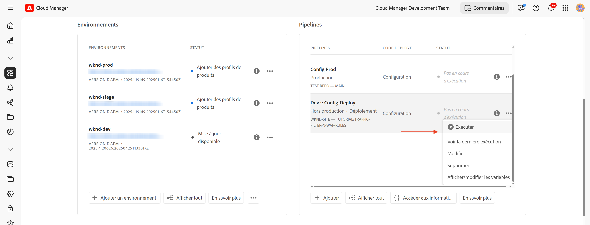

# Protection des sites web AEM à l’aide de règles de filtrage du trafic standard

Découvrez comment protéger les sites web d’AEM contre le déni de service (DoS), le déni de service distribué (DDoS) et les abus de robots à l’aide de _règles de filtrage du trafic standard_ **recommandées par Adobe** dans AEM as a Cloud Service.

## Objectifs d’apprentissage

- Examinez les règles de filtrage du trafic standard recommandées par Adobe.
- Définissez, déployez, testez et analysez les résultats des règles.
- savoir quand et comment affiner les règles en fonction des modèles de trafic ;
- Découvrez comment utiliser le Centre d’actions AEM pour passer en revue les alertes générées par les règles.

### Présentation de l’implémentation

Les étapes de mise en œuvre sont les suivantes :

- Ajout des règles de filtrage du trafic standard au fichier `/config/cdn.yaml` du projet WKND d’AEM.
- en validant et en envoyant les modifications au référentiel Git de Cloud Manager ;
- Déployez les modifications dans l’environnement AEM à l’aide du pipeline de configuration Cloud Manager.
- Test des règles en simulant une attaque DoS à l’aide de [Vegeta](https://github.com/tsenart/vegeta)
- Analyse des résultats à l’aide des journaux du réseau CDN AEM CS et de l’outil de tableau de bord ELK.

## Prérequis

Avant de poursuivre, assurez-vous d’avoir terminé le travail préparatoire requis, comme décrit dans le tutoriel [Comment configurer le filtre de trafic et les règles de WAF](../setup.md). En outre, vous avez cloné et déployé le [projet AEM WKND Sites](https://github.com/adobe/aem-guides-wknd) dans votre environnement AEM.

## Actions clés des règles

Avant d’examiner en détail les règles de filtrage du trafic standard, nous allons comprendre les actions clés qu’elles effectuent. L’attribut `action` dans chaque règle définit la manière dont le filtre de trafic doit répondre lorsque les conditions sont remplies. Ces actions comprennent :

- **Journal** : les règles consignent les événements pour la surveillance et l’analyse, ce qui vous permet de consulter les modèles de trafic et d’ajuster les seuils si nécessaire. Il est spécifié par l’attribut `type: log`.

- **Alerte** : les règles déclenchent des alertes lorsque les conditions sont remplies, ce qui vous aide à identifier les problèmes potentiels. Il est spécifié par l’attribut `alert: true`.

- **Bloquer** : les règles bloquent le trafic lorsque les conditions sont remplies, empêchant l’accès à votre site AEM. Il est spécifié par l’attribut `action: block`.

## Vérifier et définir des règles

Les règles de filtrage du trafic standard recommandées par Adobe constituent une couche fondamentale pour identifier les modèles de trafic potentiellement malveillants en consignant les événements tels que le dépassement des limites de débit basées sur les adresses IP et en bloquant le trafic provenant de pays spécifiques. Ces journaux aident les équipes à valider les seuils et à prendre des décisions éclairées pour la **transition vers le mode bloc** des règles sans interrompre le trafic légitime.

Examinons les trois règles de filtrage du trafic standard que vous devez ajouter au fichier `/config/cdn.yaml` du projet WKND d’AEM :

- **Empêcher les attaques par déni de service (DoS) au niveau d’Edge** : cette règle détecte les attaques par déni de service (DoS) potentielles au niveau de la périphérie du réseau CDN en surveillant les requêtes par seconde (RPS) provenant des adresses IP client.
- **Empêcher les attaques par déni de service (DoS) à l’origine** : cette règle détecte les attaques par déni de service (DoS) potentielles à l’origine en surveillant les requêtes de récupération des adresses IP clientes.
- **Bloquer les pays de l’OFAC** : cette règle bloque l’accès de pays spécifiques qui relèvent des restrictions de l’OFAC (Office of Foreign Assets Control).

### &#x200B;1. Empêcher les attaques par déni de service dans Edge

Cette règle **envoie une alerte** lorsqu’elle détecte une attaque par déni de service (DoS) potentielle sur le réseau CDN. Le critère de déclenchement de cette règle est le suivant : lorsqu’un client dépasse **500 requêtes par seconde** (en moyenne sur 10 secondes) par POP (point de présence) de réseau CDN en périphérie.

Il comptabilise **toutes** les requêtes et les regroupe par adresse IP du client.

```yaml
kind: "CDN"
version: "1"
metadata:
  envTypes: ["dev", "stage", "prod"]
data:
  trafficFilters:
    rules:
    - name: prevent-dos-attacks-edge
      when:
        reqProperty: tier
        equals: 'publish'
      rateLimit:
        limit: 500
        window: 10
        penalty: 300
        count: all
        groupBy:
          - reqProperty: clientIp
      action:
        type: log
        alert: true
```

L’attribut `action` spécifie que la règle doit consigner les événements et déclencher une alerte lorsque les conditions sont remplies. Il vous permet donc de surveiller les attaques par déni de service potentielles sans bloquer le trafic légitime. Cependant, votre objectif est de passer finalement à cette règle en mode bloc une fois que vous avez validé les modèles de trafic et ajusté les seuils.

### &#x200B;2. Empêcher les attaques par déni de service à l’origine

Cette règle **envoie une alerte** lorsqu’elle détecte une attaque par déni de service (DoS) potentielle à l’origine. Le critère de déclenchement de cette règle est le suivant : lorsqu’un client dépasse **100 requêtes par seconde** (en moyenne sur 10 secondes) par adresse IP du client à l’origine.

Il compte les **récupérations** (requêtes de contournement du cache) et les regroupe par adresse IP du client.

```yaml
...
    - name: prevent-dos-attacks-origin
      when:
        reqProperty: tier
        equals: 'publish'
      rateLimit:
        limit: 100
        window: 10
        penalty: 300
        count: fetches
        groupBy:
          - reqProperty: clientIp
      action:
        type: log
        alert: true
```

L’attribut `action` spécifie que la règle doit consigner les événements et déclencher une alerte lorsque les conditions sont remplies. Il vous permet donc de surveiller les attaques par déni de service potentielles sans bloquer le trafic légitime. Cependant, votre objectif est de passer finalement à cette règle en mode bloc une fois que vous avez validé les modèles de trafic et ajusté les seuils.

### &#x200B;3. Bloquer les pays OFAC

Cette règle bloque l’accès de pays spécifiques soumis à des restrictions [OFAC](https://ofac.treasury.gov/sanctions-programs-and-country-information).
Vous pouvez consulter et modifier la liste des pays selon vos besoins.

```yaml
...
    - name: block-ofac-countries
      when:
        allOf:
          - { reqProperty: tier, in: ["author", "publish"] }
          - reqProperty: clientCountry
            in:
              - SY
              - BY
              - MM
              - KP
              - IQ
              - CD
              - SD
              - IR
              - LR
              - ZW
              - CU
              - CI
      action: block
```

L’attribut `action` indique que la règle doit bloquer l’accès à partir des pays spécifiés. Cela vous permet d’empêcher l’accès à votre site AEM à partir de régions pouvant présenter des risques de sécurité.

Le fichier `cdn.yaml` complet avec les règles ci-dessus ressemble à ceci :


## Déployer les règles

Pour déployer les règles ci-dessus, procédez comme suit :

- Validez et envoyez les modifications au référentiel Git de Cloud Manager.

- Déployez les modifications dans l’environnement AEM à l’aide du pipeline de configuration Cloud Manager [créé précédemment](../setup.md#deploy-rules-using-adobe-cloud-manager).

  

## Tester les règles

Pour vérifier l’efficacité des règles de filtrage du trafic standard, au niveau des réseaux **Edge CDN** et **Origine**, simulez un trafic de requête élevé à l’aide de [Vegeta](https://github.com/tsenart/vegeta), un outil de test de chargement HTTP polyvalent.

- Testez la règle DoS au niveau d’Edge (limite de 500 tr/s). La commande suivante simule 200 requêtes par seconde pendant 15 secondes, ce qui dépasse le seuil d’Edge (500 tr/s).

  ```shell
  $echo "GET https://publish-p63947-e1249010.adobeaemcloud.com/us/en.html" | vegeta attack -rate=200 -duration=15s | vegeta report
  ```

  

  >[!IMPORTANT]
  >
  >  Notez les codes de succès *100 %* et de statut _200_ dans le rapport ci-dessus. Comme les règles sont définies sur `log` et `alert`, les requêtes ne sont _pas bloquées_ mais elles sont consignées à des fins de surveillance, d’analyse et d’alerte.

- Tester la règle DoS à l&#39;origine (limite de 100 rps). La commande suivante simule 110 requêtes de récupération par seconde pendant 1 seconde, ce qui dépasse le seuil d’origine (100 tr/s). Pour simuler les requêtes de contournement du cache, le fichier `targets.txt` est créé avec des paramètres de requête uniques afin de s’assurer que chaque requête est traitée comme une requête de récupération.

  ```shell
  # Create targets.txt with unique query parameters
  $for i in {1..110}; do
    echo "GET https://publish-p63947-e1249010.adobeaemcloud.com/us/en.html?ts=$(date +%s)$i"
  done > targets.txt
  
  # Use the targets.txt file to simulate fetch requests
  $vegeta attack -rate=110 -duration=1s -targets=targets.txt | vegeta report
  ```

  

  >[!IMPORTANT]
  >
  >  Notez les codes de succès *100 %* et de statut _200_ dans le rapport ci-dessus. Comme les règles sont définies sur `log` et `alert`, les requêtes ne sont _pas bloquées_ mais elles sont consignées à des fins de surveillance, d’analyse et d’alerte.

- Pour des raisons de simplicité, la règle OFAC n’est pas testée ici.

## Vérifier les alertes

Des alertes sont générées lorsque les règles de filtrage du trafic sont déclenchées. Vous pouvez consulter ces alertes dans le [Centre d’actions AEM](https://experience.adobe.com/aem/actions-center).


## Analyse des résultats

Pour analyser les résultats des règles de filtrage du trafic, vous pouvez utiliser les journaux du réseau CDN AEM CS et l’outil de tableau de bord ELK. Suivez les instructions de la section [ Configuration de l’ingestion des journaux CDN ](../setup.md#ingest-cdn-logs) pour ingérer les journaux CDN dans la pile ELK.

Dans la capture d’écran suivante, vous pouvez voir les journaux CDN de l’environnement de développement AEM ingérés dans la pile ELK.


Dans l’application ELK, le tableau de bord de trafic **CDN** doit afficher le pic au niveau de **Edge** et **Origin** lors des attaques par déni de service simulées.

Les deux panneaux, _Edge RPS par IP client et POP_ et _Origin RPS par IP client et POP_, affichent les requêtes par seconde (RPS) au niveau du serveur Edge et de l’origine, respectivement, regroupées par adresse IP client et par point de présence (POP).


Vous pouvez également utiliser d’autres panneaux dans le tableau de bord du trafic CDN pour analyser les modèles de trafic, tels que _Principales adresses IP client_, _Principaux pays_ et _Principaux agents utilisateur_. Ces panneaux vous aident à identifier les menaces potentielles et à ajuster vos règles de filtrage du trafic en conséquence.

### Intégration Splunk

Les clientes et clients qui ont [activé le transfert de journal Splunk](https://experienceleague.adobe.com/fr/docs/experience-manager-cloud-service/content/implementing/developing/logging#splunk-logs) peuvent créer un tableau de bord pour analyser les modèles de trafic.

Pour créer des tableaux de bord dans Splunk, suivez les étapes [Tableau de bord Splunk pour l’analyse de journaux de réseau CDN AEMCS](https://github.com/adobe/AEMCS-CDN-Log-Analysis-Tooling/blob/main/Splunk/README.md#splunk-dashboards-for-aemcs-cdn-log-analysis).

La capture d’écran suivante présente un exemple de tableau de bord Splunk qui affiche le nombre maximal de requêtes d’origine et de périphérie par adresse IP, ce qui peut vous aider à identifier les attaques par déni de service potentielles.


## Quand et comment affiner les règles

Votre objectif est d’éviter de bloquer le trafic légitime tout en protégeant votre site AEM des menaces potentielles. Les règles de filtrage du trafic standard sont conçues pour alerter et consigner (et finalement bloquer lorsque le mode est changé) les menaces sans bloquer le trafic légitime.

Pour affiner les règles, respectez les étapes suivantes :

- **Surveillance des modèles de trafic** : utilisez les journaux du réseau CDN et le tableau de bord ELK pour surveiller les modèles de trafic et identifier les anomalies ou les pics de trafic.
- **Ajuster les seuils** : en fonction des modèles de trafic, ajustez les seuils (augmentez ou réduisez les limites de taux) dans les règles pour mieux répondre à vos besoins spécifiques. Par exemple, si vous constatez que le trafic légitime a déclenché les alertes, vous pouvez augmenter les limites de taux ou ajuster les regroupements.
Le tableau suivant explique comment choisir les valeurs de seuil :

  | Variante | Valeur |
  | :--------- | :------- |
  | Origine | Prenez la valeur la plus élevée du nombre maximum de requêtes à l’origine par adresse IP/PoP dans des conditions **normales** de trafic (c’est-à-dire, pas lors d’un DDoS) et multipliez-la. |
  | Edge | Prenez la valeur la plus élevée du nombre maximum de requêtes Edge par adresse IP/PoP dans des conditions **normales** de trafic (c’est-à-dire, pas lors d’un DDoS) et multipliez-la. |

  Consultez également la section [ Choix des valeurs de seuil ](../../blocking-dos-attack-using-traffic-filter-rules.md#choosing-threshold-values) pour plus d’informations.

- **Passer aux règles de blocage** : une fois que vous avez validé les modèles de trafic et ajusté les seuils, vous devez passer aux règles en mode bloc.

## Résumé

Dans ce tutoriel, vous avez appris à protéger les sites web d’AEM contre les dénis de service (DoS), les dénis de service distribués (DDoS) et les abus de robots à l’aide des règles de filtrage de trafic standard recommandées par Adobe dans AEM as a Cloud Service.

## Règles WAF recommandées

Découvrez comment mettre en œuvre les règles de WAF recommandées par Adobe pour protéger vos sites web AEM contre les menaces sophistiquées qui utilisent des techniques avancées pour contourner les mesures de sécurité traditionnelles.

<!-- CARDS
{target = _self}

* ./using-waf-rules.md
  {title = Protecting AEM websites using WAF traffic filter rules}
  {description = Learn how to protect AEM websites from sophisticated threats including DoS, DDoS, and bot abuse using Adobe-recommended Web Application Firewall (WAF) traffic filter rules in AEM as a Cloud Service.}
  {image = ../assets/use-cases/using-waf-rules.png}
  {cta = Activate WAF}
-->
<!-- START CARDS HTML - DO NOT MODIFY BY HAND -->
<div class="columns">
    <div class="column is-half-tablet is-half-desktop is-one-third-widescreen" aria-label="Protecting AEM websites using WAF traffic filter rules">
        <div class="card" style="height: 100%; display: flex; flex-direction: column; height: 100%;">
            <div class="card-image">
                <figure class="image x-is-16by9">
                    <a href="./using-waf-rules.md" title="Protection des sites web AEM à l’aide des règles de filtrage du trafic WAF" target="_self" rel="referrer">
                        
                    </a>
                </figure>
            </div>
            <div class="card-content is-padded-small" style="display: flex; flex-direction: column; flex-grow: 1; justify-content: space-between;">
                <div class="top-card-content">
                    <p class="headline is-size-6 has-text-weight-bold">
                        <a href="./using-waf-rules.md" target="_self" rel="referrer" title="Protection des sites web AEM à l’aide des règles de filtrage du trafic WAF">Protection des sites web AEM à l’aide des règles de filtrage du trafic WAF</a>
                    </p>
                    <p class="is-size-6">Découvrez comment protéger les sites web d’AEM contre les menaces sophistiquées, y compris les attaques par déni de service, les attaques DDoS et les attaques de robots, à l’aide des règles de filtrage du trafic WAF (Web Application Firewall) recommandées par Adobe dans AEM as a Cloud Service.</p>
                </div>
                <a href="./using-waf-rules.md" target="_self" rel="referrer" class="spectrum-Button spectrum-Button--outline spectrum-Button--primary spectrum-Button--sizeM" style="align-self: flex-start; margin-top: 1rem;">
                    <span class="spectrum-Button-label has-no-wrap has-text-weight-bold">Activer WAF</span>
                </a>
            </div>
        </div>
    </div>
</div>
<!-- END CARDS HTML - DO NOT MODIFY BY HAND -->


## Cas d’utilisation : au-delà des règles standard

Pour des scénarios plus avancés, vous pouvez explorer les cas d’utilisation suivants, qui montrent comment implémenter des règles de filtrage de trafic personnalisées en fonction d’exigences commerciales spécifiques :

<!-- CARDS
{target = _self}

* ../how-to/request-logging.md

* ../how-to/request-blocking.md

* ../how-to/request-transformation.md
-->
<!-- START CARDS HTML - DO NOT MODIFY BY HAND -->
<div class="columns">
    <div class="column is-half-tablet is-half-desktop is-one-third-widescreen" aria-label="Monitoring sensitive requests">
        <div class="card" style="height: 100%; display: flex; flex-direction: column; height: 100%;">
            <div class="card-image">
                <figure class="image x-is-16by9">
                    <a href="../how-to/request-logging.md" title="Surveillance des requêtes sensibles" target="_self" rel="referrer">
                        
                    </a>
                </figure>
            </div>
            <div class="card-content is-padded-small" style="display: flex; flex-direction: column; flex-grow: 1; justify-content: space-between;">
                <div class="top-card-content">
                    <p class="headline is-size-6 has-text-weight-bold">
                        <a href="../how-to/request-logging.md" target="_self" rel="referrer" title="Surveillance des requêtes sensibles">Surveillance des requêtes sensibles</a>
                    </p>
                    <p class="is-size-6">Découvrez comment surveiller les requêtes sensibles en les enregistrant à l’aide des règles de filtrage du trafic dans AEM as a Cloud Service.</p>
                </div>
                <a href="../how-to/request-logging.md" target="_self" rel="referrer" class="spectrum-Button spectrum-Button--outline spectrum-Button--primary spectrum-Button--sizeM" style="align-self: flex-start; margin-top: 1rem;">
<span class="spectrum-Button-label has-no-wrap has-text-weight-bold">En savoir plus</span>
</a>
            </div>
        </div>
    </div>
    <div class="column is-half-tablet is-half-desktop is-one-third-widescreen" aria-label="Restricting access">
        <div class="card" style="height: 100%; display: flex; flex-direction: column; height: 100%;">
            <div class="card-image">
                <figure class="image x-is-16by9">
                    <a href="../how-to/request-blocking.md" title="Limitation de l’accès" target="_self" rel="referrer">
                        
                    </a>
                </figure>
            </div>
            <div class="card-content is-padded-small" style="display: flex; flex-direction: column; flex-grow: 1; justify-content: space-between;">
                <div class="top-card-content">
                    <p class="headline is-size-6 has-text-weight-bold">
                        <a href="../how-to/request-blocking.md" target="_self" rel="referrer" title="Limitation de l’accès">Limitation de l’accès</a>
                    </p>
                    <p class="is-size-6">Découvrez comment restreindre l’accès en bloquant des requêtes spécifiques à l’aide des règles de filtrage du trafic dans AEM as a Cloud Service.</p>
                </div>
                <a href="../how-to/request-blocking.md" target="_self" rel="referrer" class="spectrum-Button spectrum-Button--outline spectrum-Button--primary spectrum-Button--sizeM" style="align-self: flex-start; margin-top: 1rem;">
<span class="spectrum-Button-label has-no-wrap has-text-weight-bold">En savoir plus</span>
</a>
            </div>
        </div>
    </div>
    <div class="column is-half-tablet is-half-desktop is-one-third-widescreen" aria-label="Normalizing requests">
        <div class="card" style="height: 100%; display: flex; flex-direction: column; height: 100%;">
            <div class="card-image">
                <figure class="image x-is-16by9">
                    <a href="../how-to/request-transformation.md" title="Normalisation des requêtes" target="_self" rel="referrer">
                        
                    </a>
                </figure>
            </div>
            <div class="card-content is-padded-small" style="display: flex; flex-direction: column; flex-grow: 1; justify-content: space-between;">
                <div class="top-card-content">
                    <p class="headline is-size-6 has-text-weight-bold">
                        <a href="../how-to/request-transformation.md" target="_self" rel="referrer" title="Normalisation des requêtes">Normalisation des requêtes</a>
                    </p>
                    <p class="is-size-6">Découvrez comment normaliser les requêtes en les transformant à l’aide de règles de filtrage du trafic dans AEM as a Cloud Service.</p>
                </div>
                <a href="../how-to/request-transformation.md" target="_self" rel="referrer" class="spectrum-Button spectrum-Button--outline spectrum-Button--primary spectrum-Button--sizeM" style="align-self: flex-start; margin-top: 1rem;">
<span class="spectrum-Button-label has-no-wrap has-text-weight-bold">En savoir plus</span>
</a>
            </div>
        </div>
    </div>
</div>
<!-- END CARDS HTML - DO NOT MODIFY BY HAND -->


## Ressources supplémentaires

- [Règles de démarrage recommandées](https://experienceleague.adobe.com/fr/docs/experience-manager-cloud-service/content/security/traffic-filter-rules-including-waf#recommended-starter-rules)


