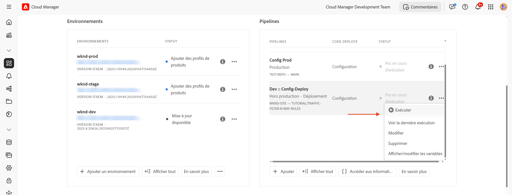
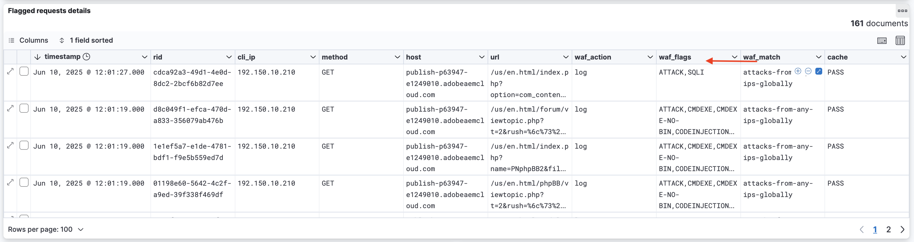

# Protection des sites web AEM à l’aide des règles de WAF

Découvrez comment protéger les sites web d’AEM contre les menaces sophistiquées, y compris les attaques par déni de service, les attaques DDoS et les abus de robots à l’aide des _règles recommandées par Adobe_ **Pare-feu d’application web (WAF)** dans AEM as a Cloud Service.

Les attaques sophistiquées se caractérisent par des taux de demande élevés, des schémas complexes et l&#39;utilisation de techniques avancées pour contourner les mesures de sécurité traditionnelles.

>[!IMPORTANT]
>
> Les règles de filtrage du trafic WAF nécessitent une licence supplémentaire de **protection WAF-DDoS** ou **sécurité renforcée**. Les règles de filtrage du trafic standard sont disponibles par défaut pour les clients Sites et Forms.

## Objectifs d’apprentissage

- Examinez les règles de WAF recommandées par Adobe.
- Définissez, déployez, testez et analysez les résultats des règles.
- savoir quand et comment affiner les règles en fonction des résultats ;
- Découvrez comment utiliser le Centre d’actions AEM pour passer en revue les alertes générées par les règles.

### Présentation de l’implémentation

Les étapes de mise en œuvre sont les suivantes :

- Ajout des règles de WAF au fichier `/config/cdn.yaml` du projet AEM WKND.
- en validant et en envoyant les modifications au référentiel Git de Cloud Manager ;
- Déployez les modifications dans l’environnement AEM à l’aide du pipeline de configuration Cloud Manager.
- Test des règles en simulant une attaque DDoS à l’aide de [Nikto](https://github.com/sullo/nikto/wiki).
- Analyse des résultats à l’aide des journaux du réseau CDN AEM CS et de l’outil de tableau de bord ELK.

## Prérequis

Avant de poursuivre, assurez-vous d’avoir terminé la configuration requise, comme décrit dans le tutoriel [Comment configurer le filtre de trafic et les règles de WAF](../setup.md). En outre, vous avez cloné et déployé le [projet AEM WKND Sites](https://github.com/adobe/aem-guides-wknd) dans votre environnement AEM.

## Vérifier et définir des règles

Les règles de pare-feu d’application web (WAF) recommandées par Adobe sont essentielles pour protéger les sites web d’AEM contre les menaces sophistiquées, notamment les attaques par déni de service, les attaques par déni de service et les abus de robots. Les attaques sophistiquées se caractérisent souvent par des taux de requête élevés, des schémas complexes et l&#39;utilisation de techniques avancées (attaques basées sur des protocoles ou sur des payload) pour contourner les mesures de sécurité traditionnelles.

Examinons trois règles de WAF recommandées qui doivent être ajoutées au fichier `cdn.yaml` dans le projet AEM WKND :

### &#x200B;1. Bloquez les attaques provenant d’adresses IP malveillantes connues

Cette règle **bloque** les requêtes qui ont l’air suspectes *et* proviennent d’adresses IP signalées comme malveillantes. Ces deux critères étant remplis, nous pouvons être sûrs que le risque de faux positifs (blocage du trafic légitime) est très faible. Les adresses IP erronées connues sont identifiées en fonction des flux de renseignements sur les menaces et d’autres sources.

L’indicateur WAF `ATTACK-FROM-BAD-IP` est utilisé pour identifier ces requêtes. Elle agrège plusieurs indicateurs WAF [répertoriés ici](https://experienceleague.adobe.com/fr/docs/experience-manager-cloud-service/content/security/traffic-filter-rules-including-waf#waf-flags-list).

```yaml
kind: "CDN"
version: "1"
metadata:
  envTypes: ["dev", "stage", "prod"]
data:
  trafficFilters:
    rules:
    - name: attacks-from-bad-ips-globally
      when:
        reqProperty: tier
        in: ["author", "publish"]
      action:
        type: block
        wafFlags:
          - ATTACK-FROM-BAD-IP
```

### &#x200B;2. Consigner (et bloquer ultérieurement) les attaques provenant de n’importe quelle adresse IP dans le monde

Cette règle **enregistre** les requêtes identifiées comme des attaques potentielles, même si les adresses IP ne figurent pas dans les flux de renseignements sur les menaces.

L’indicateur WAF `ATTACK` est utilisé pour identifier ces requêtes. Semblable au `ATTACK-FROM-BAD-IP`, il   agrège plusieurs indicateurs WAF.

Ces requêtes sont probablement malveillantes, mais comme les adresses IP ne sont pas identifiées dans les flux de renseignements sur les menaces, il peut être prudent de démarrer en mode `log` plutôt qu’en mode bloc. Analysez les journaux à la recherche de faux positifs et, une fois la validation effectuée, **assurez-vous de passer la règle en mode `block`**.

```yaml
...
    - name: attacks-from-any-ips-globally
      when:
        reqProperty: tier
        in: ["author", "publish"]
      action:
        type: log
        alert: true
        wafFlags:
          - ATTACK
```

Vous pouvez également choisir d’utiliser le mode `block` immédiatement, si les besoins de votre entreprise sont tels que vous ne souhaitez pas prendre le moindre risque d’autoriser le trafic malveillant.

Ces règles WAF recommandées fournissent une couche de sécurité supplémentaire contre les menaces connues et émergentes.


## Migration vers les règles de WAF recommandées par Adobe les plus récentes

Avant l’introduction des indicateurs WAF `ATTACK-FROM-BAD-IP` et `ATTACK` (en juillet 2025), les règles WAF recommandées étaient les suivantes. Ils contenaient une liste d’indicateurs WAF spécifiques pour bloquer les requêtes correspondant à certains critères, tels que `SANS`, `TORNODE`, `NOUA`, etc.

```yaml
...
data:
  trafficFilters:
    rules:
    ...
    # Enable WAF protections (only works if WAF is enabled for your environment)
      - name: block-waf-flags
        when:
          reqProperty: tier
          matches: "author|publish"
        action:
          type: block
          wafFlags:
            - SANS
            - TORNODE
            - NOUA
            - SCANNER
            - USERAGENT
            - PRIVATEFILE
            - ABNORMALPATH
            - TRAVERSAL
            - NULLBYTE
            - BACKDOOR
            - LOG4J-JNDI
            - SQLI
            - XSS
            - CODEINJECTION
            - CMDEXE
            - NO-CONTENT-TYPE
            - UTF8
...
```

La règle ci-dessus est toujours valide, mais il est recommandé de migrer vers les nouvelles règles qui utilisent les indicateurs `ATTACK-FROM-BAD-IP` et `ATTACK` WAF _à condition que vous n’ayez pas déjà personnalisé la `wafFlags` en fonction des besoins de votre entreprise_.

Vous pouvez migrer vers les nouvelles règles pour être cohérent avec les bonnes pratiques en procédant comme suit :

- Examinez les règles WAF existantes dans votre fichier `cdn.yaml`, qui peuvent ressembler à l’exemple ci-dessus. Vérifiez qu’il n’existe aucune personnalisation du `wafFlags` spécifique aux besoins de votre entreprise.

- Remplacez vos règles WAF existantes par les nouvelles règles WAF recommandées par Adobe qui utilisent les indicateurs `ATTACK-FROM-BAD-IP` et `ATTACK`. Assurez-vous que toutes les règles sont en mode bloc.

Si vous avez déjà personnalisé le `wafFlags`, vous pouvez toujours migrer vers ces nouvelles règles, mais faites-le avec précaution, en veillant à ce que toutes les personnalisations soient intégrées aux règles révisées.

La migration doit vous aider à simplifier vos règles WAF tout en offrant une protection robuste contre les menaces sophistiquées. Les nouvelles règles sont conçues pour être plus efficaces et plus faciles à gérer.


## Déployer les règles

Pour déployer les règles ci-dessus, procédez comme suit :

- Validez et envoyez les modifications au référentiel Git de Cloud Manager.

- Déployez les modifications dans l’environnement AEM à l’aide du pipeline de configuration Cloud Manager [créé précédemment](../setup.md#deploy-rules-using-adobe-cloud-manager).

  

## Tester les règles

Pour vérifier l’efficacité des règles de WAF, simulez une attaque à l’aide de [Nikto](https://github.com/sullo/nikto), un analyseur de serveur web qui détecte les vulnérabilités et les configurations incorrectes. La commande suivante déclenche des attaques par injection SQL contre le site Web WKND d’AEM, qui est protégé par les règles de WAF.

```shell
$./nikto.pl -useragent "AttackSimulationAgent (Demo/1.0)" -D V -Tuning 9 -ssl -h https://publish-pXXXX-eYYYY.adobeaemcloud.com/us/en.html
```


Pour en savoir plus sur la simulation des attaques, consultez la documentation [Nikto - Scan Tuning](https://github.com/sullo/nikto/wiki/Scan-Tuning), qui vous indique comment spécifier le type d’attaques de test à inclure ou à exclure.

## Vérifier les alertes

Des alertes sont générées lorsque les règles de filtrage du trafic sont déclenchées. Vous pouvez consulter ces alertes dans le [Centre d’actions AEM](https://experience.adobe.com/aem/actions-center).


## Analyse des résultats

Pour analyser les résultats des règles de filtrage du trafic, vous pouvez utiliser les journaux du réseau CDN AEM CS et l’outil de tableau de bord ELK. Suivez les instructions de la section [ Configuration de l’ingestion des journaux CDN ](../setup.md#ingest-cdn-logs) pour ingérer les journaux CDN dans la pile ELK.

Dans la capture d’écran suivante, vous pouvez voir les journaux CDN de l’environnement de développement AEM ingérés dans la pile ELK.


Dans l’application ELK, le tableau de bord **WAF** doit afficher la
Requêtes marquées et valeurs correspondantes dans les colonnes IP client (cli_ip), hôte, URL, action (waf_action) et nom de règle (waf_match).


De plus, les panneaux **Distribution des indicateurs WAF** et **Principales attaques** fourmillent de détails supplémentaires.




### Intégration Splunk

Les clientes et clients qui ont [activé le transfert de journal Splunk](https://experienceleague.adobe.com/fr/docs/experience-manager-cloud-service/content/implementing/developing/logging#splunk-logs) peuvent créer un tableau de bord pour analyser les modèles de trafic.

Pour créer des tableaux de bord dans Splunk, suivez les étapes [Tableau de bord Splunk pour l’analyse de journaux de réseau CDN AEMCS](https://github.com/adobe/AEMCS-CDN-Log-Analysis-Tooling/blob/main/Splunk/README.md#splunk-dashboards-for-aemcs-cdn-log-analysis).

## Quand et comment affiner les règles

Votre objectif est d’éviter de bloquer le trafic légitime tout en protégeant vos sites web AEM contre les menaces sophistiquées. Les règles WAF recommandées sont conçues pour servir de point de départ à votre stratégie de sécurité.

Pour affiner les règles, respectez les étapes suivantes :

- **Surveillance des modèles de trafic** : utilisez les journaux du réseau CDN et le tableau de bord ELK pour surveiller les modèles de trafic et identifier les anomalies ou les pics de trafic. Surveillez la distribution des indicateurs de WAF __ et les panneaux _Principales attaques_ dans le tableau de bord ELK pour comprendre les types d’attaques détectés.
- **Ajuster wafFlags** : si `ATTACK` indicateurs sont déclenchés trop fréquemment ou
Si vous devez affiner le vecteur d’attaque, vous pouvez créer des règles personnalisées avec des indicateurs WAF spécifiques. Consultez une liste complète des [indicateurs WAF](https://experienceleague.adobe.com/fr/docs/experience-manager-cloud-service/content/security/traffic-filter-rules-including-waf#waf-flags-list) dans la documentation. Envisagez d’abord de tester de nouvelles règles personnalisées en mode `log`.
- **Passer aux règles de blocage** : une fois que vous avez validé les modèles de trafic et ajusté les indicateurs WAF, vous pouvez envisager de passer aux règles de blocage.

## Résumé

Dans ce tutoriel, vous avez appris à protéger les sites web d’AEM contre les menaces sophistiquées, y compris les attaques par déni de service, les attaques par déni de service et les abus de robots à l’aide des règles de pare-feu d’application web (WAF) recommandées par Adobe.

## Cas d’utilisation : au-delà des règles standard

Pour des scénarios plus avancés, vous pouvez explorer les cas d’utilisation suivants, qui montrent comment implémenter des règles de filtrage de trafic personnalisées en fonction d’exigences commerciales spécifiques :

<!-- CARDS
{target = _self}

* ../how-to/request-logging.md

* ../how-to/request-blocking.md

* ../how-to/request-transformation.md
-->
<!-- START CARDS HTML - DO NOT MODIFY BY HAND -->
<div class="columns">
    <div class="column is-half-tablet is-half-desktop is-one-third-widescreen" aria-label="Monitoring sensitive requests">
        <div class="card" style="height: 100%; display: flex; flex-direction: column; height: 100%;">
            <div class="card-image">
                <figure class="image x-is-16by9">
                    <a href="../how-to/request-logging.md" title="Surveillance des requêtes sensibles" target="_self" rel="referrer">
                        
                    </a>
                </figure>
            </div>
            <div class="card-content is-padded-small" style="display: flex; flex-direction: column; flex-grow: 1; justify-content: space-between;">
                <div class="top-card-content">
                    <p class="headline is-size-6 has-text-weight-bold">
                        <a href="../how-to/request-logging.md" target="_self" rel="referrer" title="Surveillance des requêtes sensibles">Surveillance des requêtes sensibles</a>
                    </p>
                    <p class="is-size-6">Découvrez comment surveiller les requêtes sensibles en les enregistrant à l’aide des règles de filtrage du trafic dans AEM as a Cloud Service.</p>
                </div>
                <a href="../how-to/request-logging.md" target="_self" rel="referrer" class="spectrum-Button spectrum-Button--outline spectrum-Button--primary spectrum-Button--sizeM" style="align-self: flex-start; margin-top: 1rem;">
<span class="spectrum-Button-label has-no-wrap has-text-weight-bold">En savoir plus</span>
</a>
            </div>
        </div>
    </div>
    <div class="column is-half-tablet is-half-desktop is-one-third-widescreen" aria-label="Restricting access">
        <div class="card" style="height: 100%; display: flex; flex-direction: column; height: 100%;">
            <div class="card-image">
                <figure class="image x-is-16by9">
                    <a href="../how-to/request-blocking.md" title="Limitation de l’accès" target="_self" rel="referrer">
                        
                    </a>
                </figure>
            </div>
            <div class="card-content is-padded-small" style="display: flex; flex-direction: column; flex-grow: 1; justify-content: space-between;">
                <div class="top-card-content">
                    <p class="headline is-size-6 has-text-weight-bold">
                        <a href="../how-to/request-blocking.md" target="_self" rel="referrer" title="Limitation de l’accès">Limitation de l’accès</a>
                    </p>
                    <p class="is-size-6">Découvrez comment restreindre l’accès en bloquant des requêtes spécifiques à l’aide des règles de filtrage du trafic dans AEM as a Cloud Service.</p>
                </div>
                <a href="../how-to/request-blocking.md" target="_self" rel="referrer" class="spectrum-Button spectrum-Button--outline spectrum-Button--primary spectrum-Button--sizeM" style="align-self: flex-start; margin-top: 1rem;">
<span class="spectrum-Button-label has-no-wrap has-text-weight-bold">En savoir plus</span>
</a>
            </div>
        </div>
    </div>
    <div class="column is-half-tablet is-half-desktop is-one-third-widescreen" aria-label="Normalizing requests">
        <div class="card" style="height: 100%; display: flex; flex-direction: column; height: 100%;">
            <div class="card-image">
                <figure class="image x-is-16by9">
                    <a href="../how-to/request-transformation.md" title="Normalisation des requêtes" target="_self" rel="referrer">
                        
                    </a>
                </figure>
            </div>
            <div class="card-content is-padded-small" style="display: flex; flex-direction: column; flex-grow: 1; justify-content: space-between;">
                <div class="top-card-content">
                    <p class="headline is-size-6 has-text-weight-bold">
                        <a href="../how-to/request-transformation.md" target="_self" rel="referrer" title="Normalisation des requêtes">Normalisation des requêtes</a>
                    </p>
                    <p class="is-size-6">Découvrez comment normaliser les requêtes en les transformant à l’aide de règles de filtrage du trafic dans AEM as a Cloud Service.</p>
                </div>
                <a href="../how-to/request-transformation.md" target="_self" rel="referrer" class="spectrum-Button spectrum-Button--outline spectrum-Button--primary spectrum-Button--sizeM" style="align-self: flex-start; margin-top: 1rem;">
<span class="spectrum-Button-label has-no-wrap has-text-weight-bold">En savoir plus</span>
</a>
            </div>
        </div>
    </div>
</div>
<!-- END CARDS HTML - DO NOT MODIFY BY HAND -->

## Ressources supplémentaires

- [Règles de démarrage recommandées](https://experienceleague.adobe.com/fr/docs/experience-manager-cloud-service/content/security/traffic-filter-rules-including-waf#recommended-nonwaf-starter-rules)
- [liste des indicateurs WAF](https://experienceleague.adobe.com/fr/docs/experience-manager-cloud-service/content/security/traffic-filter-rules-including-waf#waf-flags-list)
