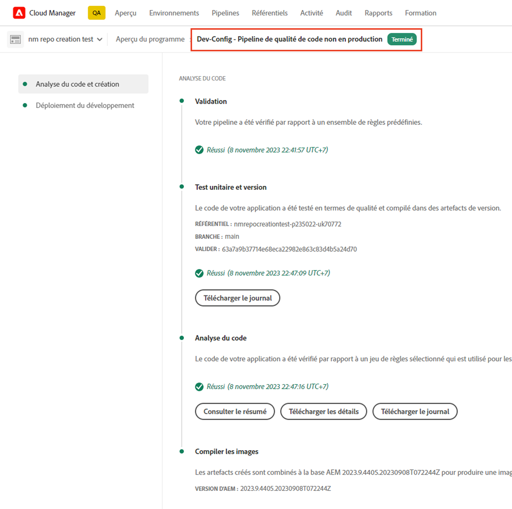
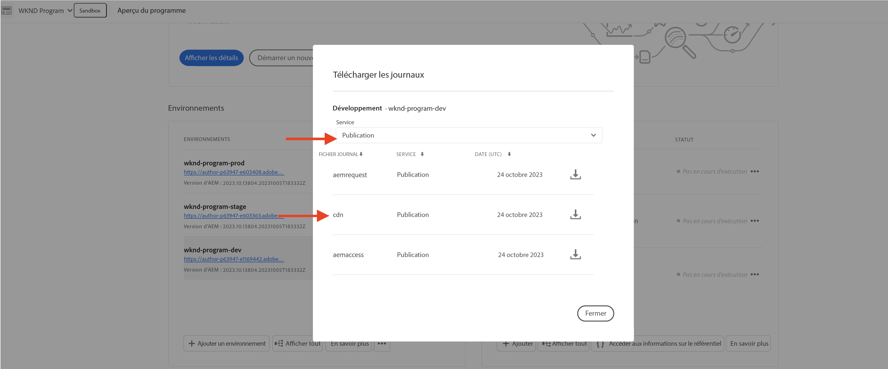
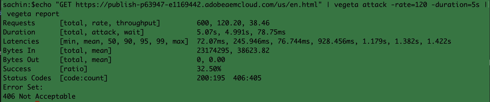
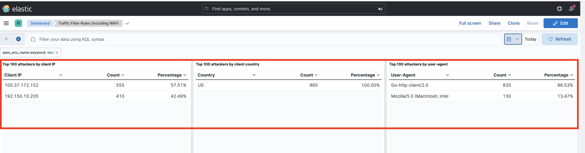
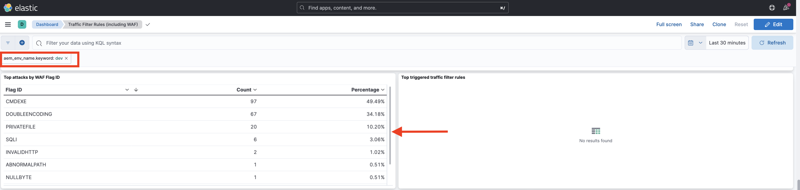
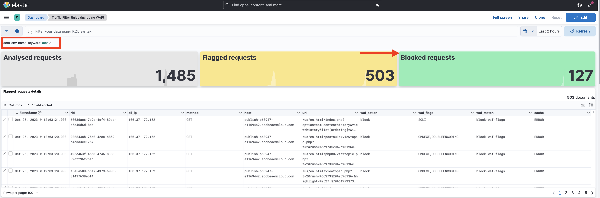

# Exemples et analyse des résultats de règles de filtrage du trafic, y compris des règles WAF

Découvrez comment déclarer différents types de règles de filtrage du trafic et analyser les résultats à l’aide des journaux du réseau CDN Adobe Experience Manager as a Cloud Service (AEMCS) et des outils de tableau de bord.

Dans cette section, découvrez quelques exemples pratiques de règles de filtrage du trafic, y compris les règles WAF. Vous apprendrez à consigner, autoriser et bloquer les demandes en fonction de l’URI (ou chemin), de l’adresse IP, du nombre de demandes et de différents types d’attaques à l’aide du [Projet AEM Sites WKND](https://github.com/adobe/aem-guides-wknd#aem-wknd-sites-project).

Vous découvrirez également comment utiliser des outils de tableau de bord qui ingèrent des journaux du réseau CDN AEMCS pour visualiser des mesures essentielles au moyen d’exemples de tableaux de bord Adobe fournis.

Pour répondre à vos besoins spécifiques, vous pouvez améliorer et créer des tableaux de bord personnalisés, afin d’obtenir des informations approfondies et d’optimiser les configurations de règles pour AEM Sites.

>[!VIDEO](https://video.tv.adobe.com/v/3425404?quality=12&learn=on)

## Exemples

Consultons quelques exemples de règles de filtrage du trafic, y compris des règles WAF. Assurez-vous d’avoir effectué le processus de configuration requis, comme décrit dans la section de [configuration](./how-to-setup.md) précédente et que vous avez cloné le [Projet AEM Sites WKND](https://github.com/adobe/aem-guides-wknd#aem-wknd-sites-project).

### Journaliser les requêtes

Commencez par **journaliser les demandes de connexion et de déconnexion de WKND** sur le service de publication AEM.

- Ajoutez la règle suivante au fichier de projet WKND `/config/cdn.yaml`.

```yaml
kind: CDN
version: '1'
metadata:
  envTypes:
    - dev
    - stage
    - prod
data:
  trafficFilters:
    rules:
    # On AEM Publish service log WKND Login and Logout requests 
      - name: publish-auth-requests
        when:
          allOf:
            - reqProperty: tier
              matches: publish
            - reqProperty: path
              in:
                - /system/sling/login/j_security_check
                - /system/sling/logout
        action: log
```

- Validez et envoyez les modifications au référentiel Git de Cloud Manager.

- Déployez les modifications dans l’environnement de développement AEM à l’aide du pipeline Cloud Manager `Dev-Config` [créé précédemment](how-to-setup.md#deploy-rules-through-cloud-manager).

  

- Testez la règle en vous connectant et en vous déconnectant du site WKND de votre programme sur le service de publication (par exemple, `https://publish-pXXXX-eYYYY.adobeaemcloud.com/us/en.html`). Vous pouvez utiliser `asmith/asmith` comme nom d’utilisation et mot de passe.

  

#### Analyser{#analyzing}

Analysons les résultats de la règle `publish-auth-requests` en téléchargeant les journaux du réseau CDN AEM à partir de Cloud Manager et en utilisant les [outils du tableau de bord](how-to-setup.md#analyze-results-using-elk-dashboard-tool), que vous avez configurés dans le chapitre précédent.

- Cliquez sur la vignette **Environnements** de [Cloud Manager](https://my.cloudmanager.adobe.com/) et téléchargez les journaux du réseau CDN du service de **Publication** AEMCS.

  

  >[!TIP]
  >
  >    5 minutes peuvent s’écouler avant l’affichage des nouvelles requêtes dans les journaux du réseau CDN.

- Copiez le fichier journal téléchargé (par exemple, `publish_cdn_2023-10-24.log` dans la copie d’écran ci-dessous) dans le dossier `logs/dev` du projet d’outil de tableau de bord Elastic.

  {width="800" zoomable="yes"}

- Actualisez la page de l’outil de tableau de bord Elastic.
   - Dans la section supérieure **Filtre global**, modifiez le filtre `aem_env_name.keyword` et sélectionnez la valeur d’environnement `dev`.

     

   - Pour modifier l’intervalle de temps, cliquez sur l’icône de calendrier dans le coin supérieur droit et sélectionnez la valeur souhaitée.

     

- Consultez les panneaux **Requêtes analysées**, **Requêtes marquées** et **Détails des requêtes marquées**. Pour les entrées de journal du réseau CDN correspondantes, les panneaux doivent afficher les valeurs d’adresse IP du client ou de la cliente (cli_ip), d’hôte, d’url, d’action (waf_action) et de nom de règle (waf_match) de chaque entrée.

  


### Bloquer des requêtes

Dans l’exemple suivant, nous allons ajouter une page dans le dossier _internal_, situé sous `/content/wknd/internal` dans le projet WKND déployé. Appliquez ensuite une règle de filtrage du trafic qui **bloque le trafic** vers les sous-pages, sauf pour une adresse IP correspondant à votre entreprise (par exemple, un VPN d’entreprise).

Vous pouvez créer votre propre page interne (par exemple, `demo-page.html`) ou utiliser le [package joint](./assets/demo-internal-pages-package.zip).

- Ajoutez la règle suivante dans le fichier `/config/cdn.yaml` du projet WKND :

```yaml
kind: CDN
version: '1'
metadata:
  envTypes:
    - dev
    - stage
    - prod
data:
  trafficFilters:
    rules:
    ...

    # Block requests to (demo) internal only page/s from public IP address but allow from internal IP address.
    # Make sure to replace the IP address with your own IP address.
      - name: block-internal-paths
        when:
          allOf:
            - reqProperty: path
              matches: /content/wknd/internal
            - reqProperty: clientIp
              notIn: [192.150.10.0/24]
        action: block
```

- Validez et envoyez les modifications au référentiel Git de Cloud Manager.

- Déployez les modifications dans l’environnement de développement AEM à l’aide du pipeline de configuration `Dev-Config` [créé précédemment](how-to-setup.md#deploy-rules-through-cloud-manager) dans Cloud Manager.

- Testez la règle en accédant à la page interne du site WKND, par exemple `https://publish-pXXXX-eYYYY.adobeaemcloud.com/content/wknd/internal/demo-page.html` ou à l’aide de la commande CURL ci-dessous :

  ```bash
  $ curl -I https://publish-pXXXX-eYYYY.adobeaemcloud.com/content/wknd/internal/demo-page.html
  ```

- Répétez l’étape ci-dessus à partir de l’adresse IP que vous avez utilisée dans la règle, puis d’une autre adresse IP (en utilisant votre téléphone mobile, par exemple).

#### Analyser

Pour analyser les résultats de la règle `block-internal-paths`, suivez les mêmes étapes que celles décrites dans l’[exemple précédent](#analyzing).

Cependant, cette fois, vous devriez voir les **Requêtes bloquées** et les valeurs correspondantes dans les colonnes adresse IP du client ou de la cliente (cli_ip), hôte, URL, action (waf_action) et nom de la règle (waf_match).


### Empêcher les attaques DoS

Pour **empêcher les attaques DoS**, nous allons bloquer pendant 5 minutes les adresses IP réalisant 100 requêtes par seconde.

- Ajoutez la [règle de filtrage du trafic limitant le débit](https://experienceleague.adobe.com/docs/experience-manager-cloud-service/content/security/traffic-filter-rules-including-waf.html?lang=fr#ratelimit-structure) dans le fichier `/config/cdn.yaml` du projet WKND.

```yaml
kind: CDN
version: '1'
metadata:
  envTypes:
    - dev
    - stage
    - prod
data:
  trafficFilters:
    rules:
    ...
    #  Prevent DoS attacks by blocking client for 5 minutes if they make more than 100 requests in 1 second.
      - name: prevent-dos-attacks
        when:
          reqProperty: path
          like: '*'
        rateLimit:
          limit: 100
          window: 1
          penalty: 300
          groupBy:
            - reqProperty: clientIp
        action: block     
```

>[!WARNING]
>
>Pour votre environnement de production, collaborez avec votre équipe de sécurité web afin de déterminer les valeurs appropriées pour `rateLimit`.

- Validez, envoyez et déployez les modifications comme indiqué dans les [exemples précédents](#logging-requests).

- Pour simuler l’attaque DoS, entrez la commande [Vegeta](https://github.com/tsenart/vegeta) suivante.

  ```shell
  $ echo "GET https://publish-pXXXX-eYYYY.adobeaemcloud.com/us/en.html" | vegeta attack -rate=120 -duration=5s | vegeta report
  ```

  Cette commande effectue 120 demandes pendant 5 secondes et génère un rapport. Comme vous pouvez le constater, le taux de réussite est de 32,5 % et un code de réponse HTTP 406 est reçu pour le reste, ce qui démontre que le trafic a été bloqué.

  

#### Analyser

Pour analyser les résultats de la règle `prevent-dos-attacks`, suivez les mêmes étapes que celles décrites dans l’[exemple précédent](#analyzing).

Cette fois, vous devriez voir beaucoup de **Requêtes bloquées** et les valeurs correspondantes dans les colonnes adresse IP du client ou de la cliente (cli_ip), hôte, URL, action (waf_action) et nom de la règle (waf_match).


En outre, les panneaux **100 principales attaques par adresse IP du client ou de la cliente, pays et agent utilisateur** affichent des détails supplémentaires, qui peuvent être utilisés pour optimiser davantage la configuration des règles.



### Règles WAF

Les exemples de règles de filtrage du trafic présentés jusqu’à présent peuvent être configurés par tous les clientes et clients Sites et Forms.

Penchons-nous à présent sur l’expérience d’une personne qui a acquis une licence de protection améliorée ou WAF-DDoS, qui lui permet de configurer des règles avancées pour protéger les sites web contre des attaques plus sophistiquées.

Avant de poursuivre, activez la protection WAF-DDoS pour votre programme, comme décrit dans la documentation des règles de filtrage du trafic, à la section [Procédure de configuration](https://experienceleague.adobe.com/docs/experience-manager-cloud-service/content/security/traffic-filter-rules-including-waf.html?lang=fr#setup).

#### Sans WAFFlags

Commençons par évaluer la situation avant la création des règles WAF. Lorsque la protection WAF-DDoS est activée sur votre programme, votre réseau CDN consigne par défaut toutes les occurences de trafic malveillant. Vous disposez donc des informations pertinentes à l’établissement des règles.

Commençons par attaquer le site WKND sans ajouter de règle WAF (ou en utilisant la propriété `wafFlags`) et analysons les résultats.

- Pour simuler une attaque, utilisez la commande [Nikto](https://github.com/sullo/nikto) ci-dessous, qui envoie environ 700 requêtes malveillantes en l’espace de 6 minutes.

  ```shell
  $ ./nikto.pl -useragent "AttackSimulationAgent (Demo/1.0)" -D V -Tuning 9 -ssl -h https://publish-pXXXX-eYYYY.adobeaemcloud.com/us/en.html
  ```

  

  Pour en savoir plus sur la simulation des attaques, consultez la documentation [Nikto - Scan Tuning](https://github.com/sullo/nikto/wiki/Scan-Tuning), qui vous indique comment spécifier le type d’attaques de test à inclure ou à exclure.

##### Analyser

Pour analyser les résultats de la simulation d’attaque, procédez comme stipulé dans l’[exemple précédent](#analyzing).

Cependant, cette fois, vous devriez voir les **Requêtes marquées** et les valeurs correspondantes dans les colonnes adresse IP du client ou de la cliente (cli_ip), hôte, URL, action (waf_action) et nom de la règle (waf_match). Ces informations vous permettent d’analyser les résultats et d’optimiser la configuration des règles.


Notez comment les panneaux **Distribution des indicateurs WAF** et **Principales attaques** affichent des détails supplémentaires, qui peuvent être utilisés pour optimiser davantage la configuration des règles.





#### Avec WAFFlags

Ajoutons maintenant une règle WAF qui contient la propriété `wafFlags` dans le cadre de la propriété `action` et **bloquons les requêtes d’attaque simulées**.

Du point de vue de la syntaxe, les règles WAF sont similaires à celles que nous avons vues précédemment, à ceci près que la propriété `action` référence une ou plusieurs valeurs `wafFlags`. Pour en savoir plus sur la propriété `wafFlags`, consultez la section [Liste des indicateurs WAF](https://experienceleague.adobe.com/docs/experience-manager-cloud-service/content/security/traffic-filter-rules-including-waf.html?lang=fr#waf-flags-list).

- Ajoutez la règle suivante dans le fichier `/config/cdn.yaml` du projet WKND. Notez comment la règle `block-waf-flags` inclut certains des « wafFlags » qui s’affichaient dans l’outil de tableau de bord lors de l’attaque simulant un trafic malveillant. En effet, dans un paysage sécuritaire en constante évolution, il est recommandé d’analyser les journaux en continu afin de déterminer les nouvelles règles à instaurer.

```yaml
kind: CDN
version: '1'
metadata:
  envTypes:
    - dev
    - stage
    - prod
data:
  trafficFilters:
    rules:
    ...     
    # Enable WAF protections (only works if WAF is enabled for your environment)
      - name: block-waf-flags
        when:
          reqProperty: tier
          matches: "author|publish"
        action:
          type: block
          wafFlags:
            - SANS
            - SIGSCI-IP
            - TORNODE
            - NOUA
            - SCANNER
            - USERAGENT
            - PRIVATEFILE
            - ABNORMALPATH
            - TRAVERSAL
            - NULLBYTE
            - BACKDOOR
            - LOG4J-JNDI
            - SQLI
            - XSS
            - CODEINJECTION
            - CMDEXE
            - NO-CONTENT-TYPE
            - UTF8        
```

- Validez, envoyez et déployez les modifications comme indiqué dans les [exemples précédents](#logging-requests).

- Pour simuler une attaque, utiliser la même commande [Nikto](https://github.com/sullo/nikto) décrite précédemment.

  ```shell
  $ ./nikto.pl -useragent "AttackSimulationAgent (Demo/1.0)" -D V -Tuning 9 -ssl -h https://publish-pXXXX-eYYYY.adobeaemcloud.com/us/en.html
  ```

##### Analyser

Répétez les mêmes étapes que pour l’[exemple précédent](#analyzing).

Cette fois, vous devriez voir des entrées sous **Requêtes bloquées** et les valeurs correspondantes dans les colonnes adresse IP du client ou de la cliente (cli_ip), hôte, URL, action (waf_action) et nom de la règle (waf_match).



De plus, les panneaux **Distribution des indicateurs WAF** et **Principales attaques** fourmillent de détails supplémentaires.


### Analyse exhaustive

Dans les sections d’_analyse_ ci-dessus, vous avez appris à analyser les résultats de règles spécifiques à l’aide de l’outil de tableau de bord. Pour approfondir l’analyse des résultats, consultez les autres panneaux de tableau de bord disponibles, notamment :


- Requêtes analysées, marquées et bloquées
- Distribution des indicateurs WAF dans le temps
- Règles de filtrage du trafic déclenchées dans le temps
- Principales attaques par identifiant d’indicateur WAF
- Filtre de trafic principal déclenché
- 100 principaux attaquants par adresse IP du client ou de la cliente, pays et agent utilisateur


## Étape suivante

Consultez les [bonnes pratiques](./best-practices.md) afin de réduire le risque de violation de sécurité.

## Ressources supplémentaires

[Syntaxe des règles de filtrage du trafic](https://experienceleague.adobe.com/docs/experience-manager-cloud-service/content/security/traffic-filter-rules-including-waf.html?lang=fr#rules-syntax)

[Format de journal de réseau CDN](https://experienceleague.adobe.com/docs/experience-manager-cloud-service/content/security/traffic-filter-rules-including-waf.html?lang=fr#cdn-log-format)
