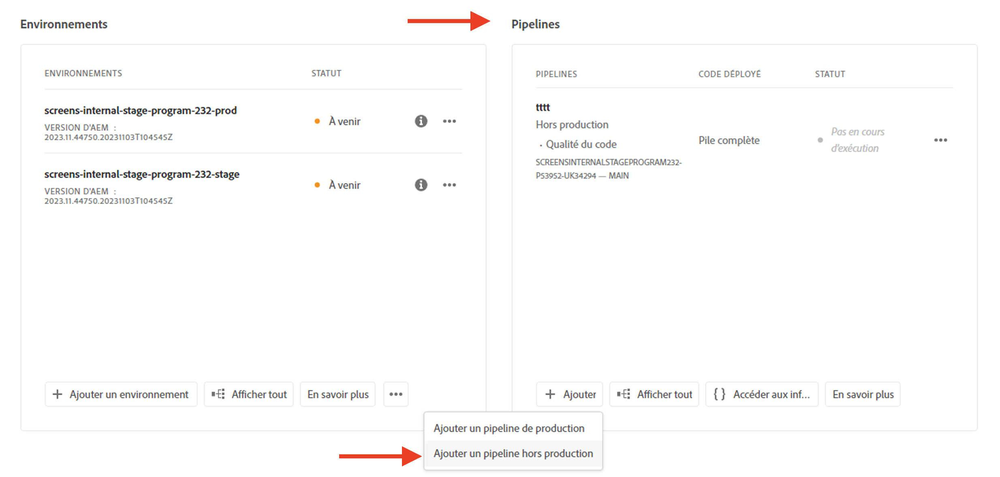
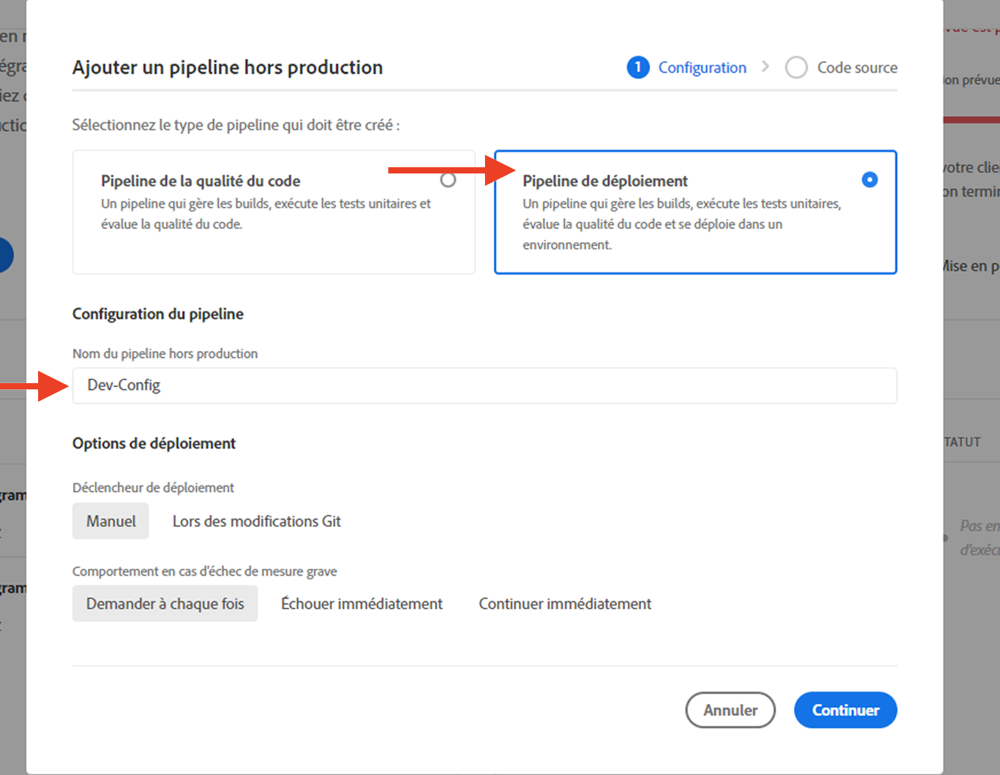
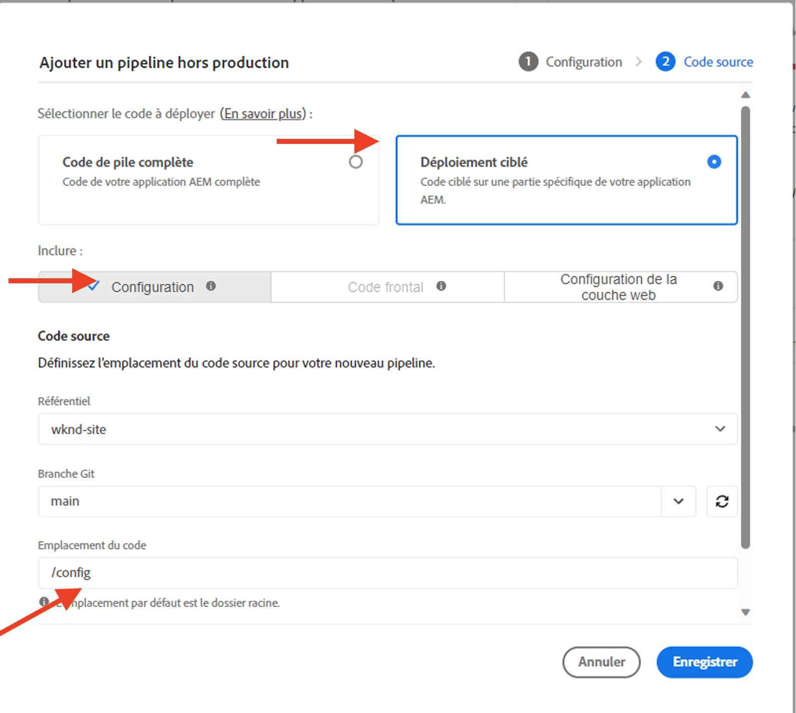
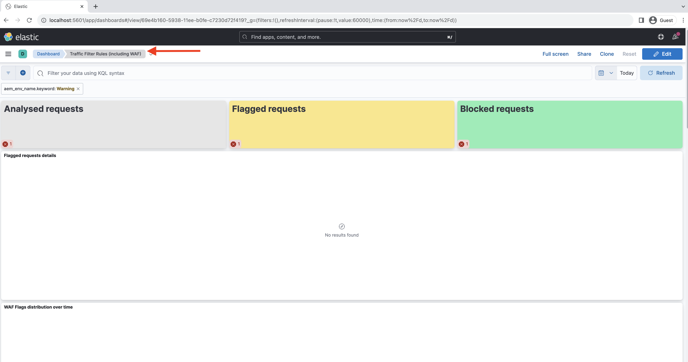

# Configurer des règles de filtrage du trafic, y compris des règles WAF

Découvrez **comment configurer** des règles de filtrage du trafic, y compris des règles WAF. Consultez cet article pour apprendre à créer, déployer et tester les règles, puis analyser les résultats.

>[!VIDEO](https://video.tv.adobe.com/v/3425407?quality=12&learn=on)

## Configuration

Le processus de configuration comprend les éléments suivants :

- _Créer des règles_ avec une structure de projet AEM et un fichier de configuration appropriés.
- _Déployer les règles_ à l’aide du pipeline de configuration d’Adobe Cloud Manager.
- _Tester les règles_ à l’aide de divers outils pour générer du trafic.
- _Analyser les résultats_ à l’aide des journaux du réseau CDN AEMCS et des outils du tableau de bord.

### Créer des règles dans votre projet AEM

Pour créer des règles, procédez comme suit :

1. Au niveau supérieur de votre projet AEM, créez le dossier `config`.

1. Dans le dossier `config`, créez un fichier nommé `cdn.yaml`.

1. Ajoutez les métadonnées suivantes au fichier `cdn.yaml` :

```yaml
kind: CDN
version: '1'
metadata:
  envTypes:
    - dev
    - stage
    - prod
data:
  trafficFilters:
    rules:
```

Consultez un exemple de fichier `cdn.yaml` dans le projet AEM Guides Sites WKND :

{width="800" zoomable="yes"}

### Déployer les règles via Cloud Manager {#deploy-rules-through-cloud-manager}

Pour déployer les règles, procédez comme suit :

1. Connectez-vous à Cloud Manager à l’adresse [my.cloudmanager.adobe.com](https://my.cloudmanager.adobe.com/) et sélectionnez l’organisation et le programme appropriés.

1. Accédez à la vignette _Pipelines_ de la page _Vue d’ensemble du programme_, cliquez sur le bouton **+Ajouter** et sélectionnez le type de pipeline souhaité.

   

   Dans l’exemple ci-dessus et à des fins de démonstration, _Ajouter un pipeline hors production_ est sélectionné en raison de l’utilisation d’un environnement de développement.

1. Dans la boîte de dialogue _Ajouter un pipeline hors production_, sélectionnez et saisissez les détails suivants :

   1. Étape de configuration :

      - **Type** : pipeline de déploiement
      - **Nom du pipeline** : Dev-Config

      

   2. Étape de code source :

      - **Code à déployer** : déploiement ciblé
      - **Inclure** : Config
      - **Environnement de déploiement** : nom de votre environnement, par exemple wknd-program-dev.
      - **Référentiel** : référentiel Git à partir duquel le pipeline doit récupérer le code. Par exemple, `wknd-site`.
      - **Branche Git** : nom de la branche du référentiel Git.
      - **Emplacement du code** : `/config`, correspondant au dossier de configuration de niveau supérieur créé à l’étape précédente.

      

### Tester les règles en générant du trafic

Pour tester les règles, choisissez parmi les outils tiers disponibles en fonction des préférences de votre entreprise. À des fins de démonstration, nous allons utiliser les outils suivants :

- [Curl](https://curl.se/) pour les tests de base, comme appeler une URL et vérifier le code de réponse.

- [Vegeta](https://github.com/tsenart/vegeta) pour effectuer un déni de service (DOS). Suivez les instructions d’installation de la section [Vegeta GitHub](https://github.com/tsenart/vegeta#install).

- [Nikto](https://github.com/sullo/nikto/wiki) pour rechercher des problèmes potentiels et des vulnérabilités de sécurité telles que XSS, l’injection SQL, etc. Suivez les instructions d’installation de la section [Nikto GitHub](https://github.com/sullo/nikto).

- Vérifiez que les outils sont installés et disponibles dans votre terminal en exécutant les commandes ci-dessous :

  ```shell
  # Curl version check
  $ curl --version
  
  # Vegeta version check
  $ vegeta -version
  
  # Nikto version check
  $ cd <PATH-OF-CLONED-REPO>/program
  ./nikto.pl -Version
  ```

### Analyser les résultats à l’aide des outils du tableau de bord

Une fois que vous avez créé, déployé et testé les règles, vous pouvez analyser les résultats à l’aide des outils du tableau de bord **Elasticsearch, Logstash et Kibana (ELK)**. Ces outils permettent d’analyser les journaux du réseau CDN AEMCS et de visualiser les résultats sous forme de graphiques.

Les outils du tableau de bord peuvent être clonés directement à partir du [référentiel GitHub AEMCS-CDN-Log-Analysis-ELK-Tool](https://github.com/adobe/AEMCS-CDN-Log-Analysis-ELK-Tool). Suivez également les étapes d’installation et de chargement du tableau de bord **Règles de filtrage de trafic (y compris WAF)**.

- Une fois que vous avez chargé l’exemple de tableau de bord, la page d’outils du tableau de bord Elastic doit se présenter comme suit :

  

>[!NOTE]
>
>    Comme aucun journal de réseau CDN AEM n’a encore été ingéré, le tableau de bord est vide.


## Étape suivante

Pour en savoir plus sur les règles de filtrage du trafic, y compris des règles WAF, consultez le chapitre [Exemples et analyse des résultats](./examples-and-analysis.md) du projet AEM Sites WKND.
