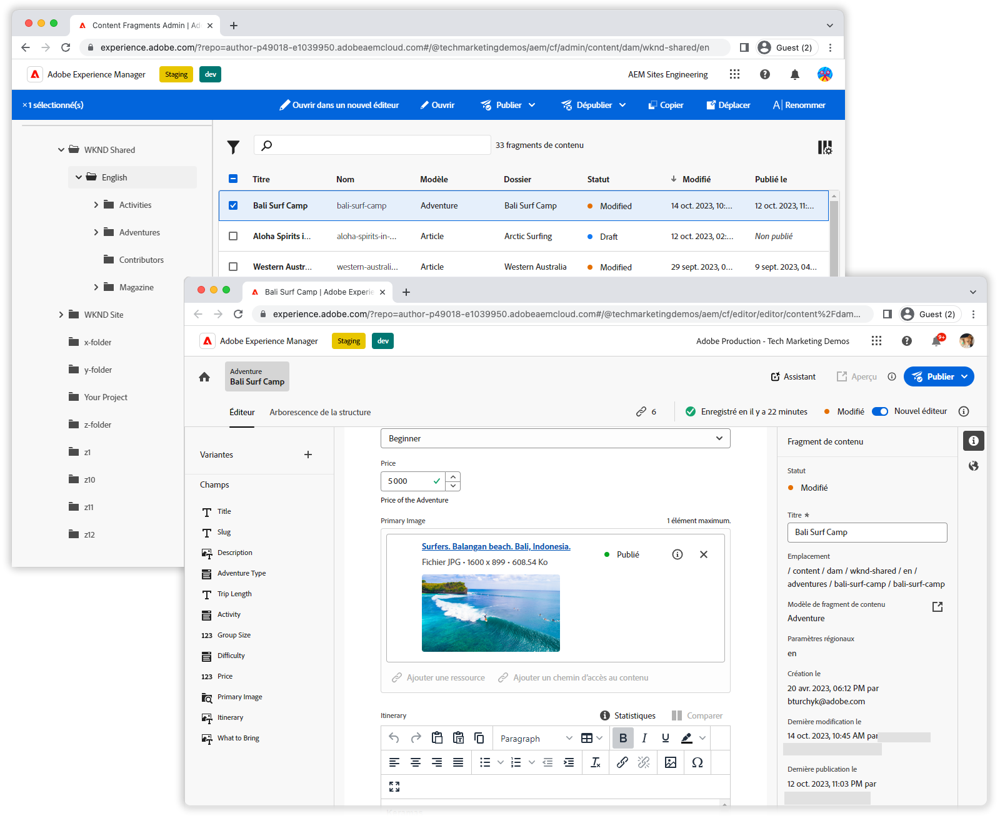

# Vidéos de la console Fragments de contenu

La console Fragments de contenu d’Adobe Experience Manager facilite la gestion et la création de fragments de contenu. Découvrez comment tirer le meilleur parti de la console Fragments de contenu avec ces vidéos.

Consultez la section [Documentation](https://experienceleague.adobe.com/docs/experience-manager-cloud-service/content/sites/administering/content-fragments/content-fragments-console.html?lang=fr) pour obtenir des détails complets sur la console Fragments de contenu et ses fonctionnalités.

## Vidéos

    <!-- Console overview -->
    

      

        

          <figure class="image is-16by9">
            
          </figure>
        

        

          

            
5 minutes

            

              <a href="./basics/content-fragments-console.md" title="Vue d’ensemble">Vue d’ensemble de la console</a>
            

            
Vue d’ensemble rapide de la console Fragments de contenu.

            <a href="./basics/content-fragments-console.md" class="spectrum-Button
              spectrum-Button--outline spectrum-Button--primary
              spectrum-Button--sizeM">
Regarder la vidéo
</a>
          

        

      

    

    <!-- Editor overview -->
    

      

        

          <figure class="image is-16by9">
            
          </figure>
        

        

          

            
4 minutes

            

              <a href="./basics/content-fragment-editor.md" title="Vue d’ensemble">Vue d’ensemble de l’éditeur</a>
            

            
Vue d’ensemble rapide de l’éditeur de Fragments de contenu.

            <a href="./basics/content-fragment-editor.md" class="spectrum-Button
              spectrum-Button--outline spectrum-Button--primary
              spectrum-Button--sizeM">
Regarder la vidéo
</a>
          

        

      

    
    
    <!-- Fast filtering -->
    

      

        

          <figure class="image is-16by9">
            
          </figure>
        

        

          

            
1 minute

            

              <a href="./search/fast-filtering.md" title="Filtrage rapide">Filtrage rapide</a>
            

            
Localisez rapidement des fragments de contenu avec le filtrage intégré.

            <a href="./search/fast-filtering.md" class="spectrum-Button
              spectrum-Button--outline spectrum-Button--primary
              spectrum-Button--sizeM">
Regarder la vidéo
</a>
          

        

      

    

    <!-- New Editor toggle -->
    

      

        

          <figure class="image is-16by9">
            
          </figure>
        

        

          

            
1 minute

            

              <a href="./editor/new-editor-toggle.md" title="Nouveau bouton (bascule) d’éditeur">Nouveau bouton (bascule) d’éditeur</a>
            

            
Transition fluide entre l’éditeur classique et le nouvel éditeur.

            <a href="./editor/new-editor-toggle.md" class="spectrum-Button
              spectrum-Button--outline spectrum-Button--primary
              spectrum-Button--sizeM">
Regarder la vidéo
</a>
          

        

      

    

    <!-- Non-asset content references --->
    

      

        

          <figure class="image is-16by9">
            
          </figure>
        

        

          

            
1 minute

            

              <a href="./editor/non-asset-content-references.md" title="Références de contenu autre que des ressources">Références de contenu autre que des ressources</a>
            

            
Incorporez des fragments d’expérience et des pages dans vos fragments de contenu.

            <a href="./editor/non-asset-content-references.md"
              class="spectrum-Button spectrum-Button--outline
              spectrum-Button--primary spectrum-Button--sizeM">
Regarder la vidéo
</a>
          

        

      

    

    <!-- RTE variant compare -->
    

      

        

          <figure class="image is-16by9">
            
          </figure>
        

        

          

            
1 minute

            

              <a href="./editor/rte-variant-compare.md" title="Comparaison des variantes de l’éditeur de texte enrichi">Comparaison des variantes de l’éditeur de texte enrichi</a>
            

            
Alignez facilement votre contenu de texte enrichi sur plusieurs canaux.

            <a href="./editor/rte-variant-compare.md" class="spectrum-Button
              spectrum-Button--outline spectrum-Button--primary
              spectrum-Button--sizeM">
Regarder la vidéo
</a>
          

        

      

    

    <!-- Language copies -->
    

      

        

          <figure class="image is-16by9">
            
          </figure>
        

        

          

            
1 minute

            

              <a href="./editor/language-copies.md" title="Copies de langue">Copies de langue</a>
            

            
Gérez facilement vos copies de langue de fragment de contenu

            <a href="./editor/language-copies.md" class="spectrum-Button
              spectrum-Button--outline spectrum-Button--primary
              spectrum-Button--sizeM">
Regarder la vidéo
</a>
          

        

      

    

     <!-- References -->
    

      

        

          <figure class="image is-16by9">
            
          </figure>
        

        

          

            
2 minutes

            

              <a href="./search/references.md" title="Références">Références</a>
            

            
Présentation des références et des relations de fragments de contenu.

            <a href="./search/references.md" class="spectrum-Button
              spectrum-Button--outline spectrum-Button--primary
              spectrum-Button--sizeM">
Regarder la vidéo
</a>
          

        

      

    

  

