# Chapitre 1 - Concepts, modèles et antimodèles du répartiteur

## Présentation

Ce chapitre présente brièvement l&#39;histoire et les mécanismes du répartiteur et explique comment cela influence la façon dont un développeur AEM conçoit ses composants.

## Pourquoi les développeurs devraient-ils se préoccuper des infrastructures ?

Le Répartiteur est un élément essentiel de la plupart des installations, sinon de toutes les installations AEM. Vous trouverez de nombreux articles en ligne qui expliquent comment configurer le Répartiteur ainsi que des conseils et astuces.

Ces éléments d&#39;information, cependant, sont toujours débuts sur un niveau très technique - en supposant que vous savez déjà ce que vous voulez faire et donc fournir seulement des détails sur la façon de réaliser ce que vous voulez. Nous n&#39;avons jamais trouvé d&#39;articles conceptuels décrivant ce qui est _et pourquoi_ quand il s&#39;agit de ce que vous pouvez et ne pouvez pas faire avec le répartiteur.

### Antimotif : Répartiteur en tant qu&#39;après-pensée

Ce manque d&#39;informations de base conduit à un certain nombre de modèles anti-conformistes que nous avons vus dans un certain nombre de projets AEM :

1. Comme le Répartiteur est installé sur le serveur Web Apache, c&#39;est le travail des &quot;dieux Unix&quot; du projet de le configurer. Un &quot;développeur de java mortel&quot; n&#39;a pas besoin de s&#39;en préoccuper.

2. Le développeur Java doit s&#39;assurer que son code fonctionne... le répartiteur le fera par magie plus vite. Le répartiteur est toujours une réflexion. Cependant, cela ne fonctionne pas. Un développeur doit concevoir son code en tenant compte du répartiteur. Et il a besoin de connaître ses concepts de base pour faire ça.

### &quot;D&#39;abord faire en sorte qu&#39;il fonctionne - puis qu&#39;il soit rapide&quot; n&#39;a pas toujours raison

Vous avez peut-être entendu le conseil de programmation _&quot;Commencez par le faire marcher, puis faites-le vite.&quot;_. Ce n&#39;est pas entièrement faux. Toutefois, sans le contexte approprié, il est généralement mal interprété et mal appliqué.

Ce conseil doit empêcher le développeur d&#39;optimiser prématurément le code, qui ne peut jamais être exécuté - ou est exécuté si rarement, qu&#39;une optimisation n&#39;aurait pas un impact suffisant pour justifier l&#39;effort d&#39;optimisation. En outre, l&#39;optimisation pourrait conduire à un code plus complexe et ainsi introduire des bogues. Donc, si vous êtes développeur, ne passez pas trop de temps à la micro-optimisation de chaque ligne de code. Il vous suffit de choisir les structures de données, les algorithmes et les bibliothèques appropriés et d’attendre l’analyse de la zone réactive d’un profileur pour savoir où une optimisation plus poussée pourrait augmenter les performances globales.

### Décisions architecturales et artefacts

Cependant, le conseil &quot;D&#39;abord, il faut que ça marche, puis ça va vite&quot; est totalement faux quand il s&#39;agit de décisions &quot;architecturales&quot;. Quelles sont les décisions architecturales ? En termes simples, ce sont les décisions qui sont chères, difficiles et/ou impossibles à changer après. Gardez à l&#39;esprit que &quot;cher&quot; est parfois le même que &quot;impossible&quot;.  Par exemple, lorsque votre projet manque de budget, il est impossible de mettre en oeuvre des modifications coûteuses. Les changements d&#39;infrastructures sont le tout premier type de changements dans cette catégorie qui viennent à l&#39;esprit de la plupart des gens. Mais il y a aussi une autre sorte d&#39;artefacts &quot;architecturaux&quot; qui peuvent devenir très difficiles à changer :

1. Des morceaux de code au &quot;centre&quot; d&#39;une application, sur lesquels beaucoup d&#39;autres pièces s&#39;appuient. Pour les modifier, toutes les dépendances doivent être modifiées et testées à nouveau en même temps.

2. Les artefacts, qui sont impliqués dans un scénario asynchrone dépendant du timing où l&#39;entrée - et donc le comportement du système peuvent varier de façon très aléatoire. Les changements peuvent avoir des effets imprévisibles et peuvent être difficiles à tester.

3. Des modèles de logiciels qui sont utilisés et réutilisés encore et encore, dans toutes les pièces et parties du système. Si le modèle logiciel se révèle sous-optimal, tous les artefacts qui l&#39;utilisent doivent être recodés.

Mémoriser? En haut de cette page, nous avons dit que le Répartiteur est un élément essentiel d&#39;une application AEM. L&#39;accès à une application web est très aléatoire : les utilisateurs arrivent et vont à des moments imprévisibles. En fin de compte, tout le contenu sera (ou devrait) mis en cache dans le Répartiteur. Donc, si vous avez prêté une attention particulière, vous vous êtes peut-être rendu compte que la mise en cache pouvait être vue comme un artefact &quot;architectural&quot; et que, par conséquent, elle devrait être comprise par tous les membres de l&#39;équipe, développeurs et administrateurs.

Nous ne disons pas qu&#39;un développeur devrait configurer le Répartiteur. Ils doivent connaître les concepts - en particulier les limites - pour s&#39;assurer que leur code peut également être exploité par le Répartiteur.

Le répartiteur n&#39;améliore pas par magie la vitesse du code. Un développeur doit créer ses composants avec le Répartiteur en tête. Par conséquent, il doit savoir comment cela fonctionne.

## Mise en cache des répartiteurs - Principes de base

### Répartiteur en tant que cache Http - Équilibreur de charge

Qu&#39;est-ce que le Répartiteur et pourquoi est-ce qu&#39;il s&#39;appelle &quot;Répartiteur&quot; en premier lieu ?

Le répartiteur est

* D&#39;abord et avant tout un cache

* Un proxy inverse

* Un module pour le serveur web httpd Apache, ajoutant AEM fonctionnalités liées à la polyvalence d&#39;Apache et travaillant en douceur avec tous les autres modules Apache (tels que SSL ou même SSI, comme nous le verrons plus loin)

Dans les premiers jours du web, vous vous attendiez à quelques centaines de visiteurs sur un site. Configuration d’un Répartiteur, &quot;distribué&quot; ou équilibré la charge des requêtes à un certain nombre de serveurs de publication AEM et qui était généralement suffisant - par conséquent, le nom &quot;Répartiteur&quot;. Aujourd&#39;hui, cependant, cette configuration n&#39;est plus utilisée très fréquemment.

Dans la suite de cet article, nous verrons différentes manières de configurer les répartiteurs et les systèmes de publication. Commençons par début avec quelques principes de base de la mise en cache http.

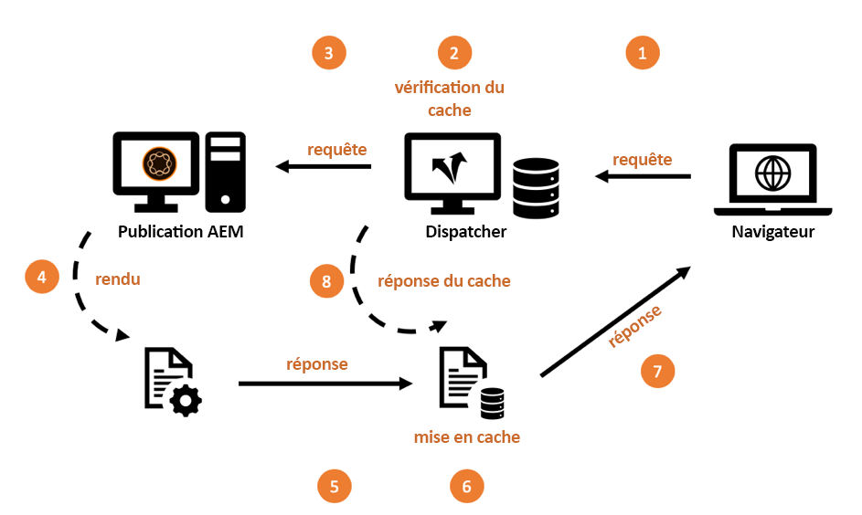

*Fonctionnalité de base d&#39;un cache de répartiteur*

<br> 

Les bases du répartiteur sont expliquées ici. Le répartiteur est un simple proxy inverse de mise en cache permettant de recevoir et de créer des requêtes HTTP. Un cycle de demande/réponse normal se présente comme suit :

1. Un utilisateur demande une page.
2. Le répartiteur vérifie s’il possède déjà une version rendue de cette page. Supposons qu’il s’agit de la toute première demande pour cette page et que le répartiteur ne trouve pas de copie mise en cache locale.
3. Le répartiteur demande la page au système de publication.
4. Sur le système de publication, la page est rendue par un JSP ou un modèle HTML.
5. La page est renvoyée au répartiteur.
6. Le répartiteur met la page en cache
7. Le répartiteur renvoie la page au navigateur.
8. Si la même page est demandée une deuxième fois, elle peut être diffusée directement à partir du cache du répartiteur sans qu’il soit nécessaire de la rendre à nouveau sur l’instance de publication. Cela permet d’économiser du temps d’attente pour les cycles d’utilisation et de processeur sur l’instance de publication.

Nous parlions de &quot;pages&quot; dans la dernière section. Mais le même schéma s’applique également à d’autres ressources telles que les images, les fichiers CSS, les téléchargements de fichiers PDF, etc.

#### Mise en cache des données

Le module Répartiteur utilise les installations fournies par le serveur Apache d&#39;hébergement. Les ressources telles que les pages HTML, les téléchargements et les images sont stockées sous la forme de fichiers simples dans le système de fichiers Apache. C&#39;est aussi simple que ça.

Le nom de fichier est dérivé de l&#39;URL de la ressource demandée. Si vous demandez un fichier `/foo/bar.html`, il est stocké par exemple sous /`var/cache/docroot/foo/bar.html`.

En principe, si tous les fichiers sont mis en cache et donc stockés de manière statique dans le Répartiteur, vous pouvez extraire le module externe du système de publication et le Répartiteur servirait de serveur Web simple. Mais ceci n&#39;est que pour illustrer le principe. La vie réelle est plus compliquée. Vous ne pouvez pas tout mettre en cache et le cache n’est jamais complètement &quot;plein&quot; car le nombre de ressources peut être infini en raison de la nature dynamique du processus de rendu. Le modèle d&#39;un système de fichiers statique permet de générer une image approximative des capacités du répartiteur. Et cela aide à expliquer les limites du répartiteur.

#### Structure de l’URL AEM et mappage du système de fichiers

Pour comprendre le Répartiteur de manière plus détaillée, revoyons la structure d’un simple exemple d’URL.  Examinons l&#39;exemple ci-dessous :

`http://domain.com/path/to/resource/pagename.selectors.html/path/suffix.ext?parameter=value&amp;otherparameter=value#fragment`

* `http` indique le protocole

* `domain.com` est le nom de domaine

* `path/to/resource` est le chemin sous lequel la ressource est stockée dans CRX et par la suite dans le système de fichiers du serveur Apache.

A partir de là, les choses diffèrent un peu entre le système de fichiers AEM et le système de fichiers Apache.

Dans AEM,

* `pagename` est l&#39;étiquette des ressources

* `selectors` représente un certain nombre de sélecteurs utilisés dans Sling pour déterminer comment la ressource est rendue. Une URL peut comporter un nombre arbitraire de sélecteurs. Ils sont séparés par un point. Une section de sélecteurs peut par exemple être quelque chose comme &quot;French.mobile.fancy&quot;. Les sélecteurs ne doivent contenir que des lettres, des chiffres et des tirets.

* `html` comme étant le dernier des &quot;sélecteurs&quot; est appelé une extension. Dans AEM/Sling, il détermine également en partie le script de rendu.

* `path/suffix.ext` est une expression de type chemin d’accès qui peut être un suffixe à l’URL.  Il peut être utilisé dans les scripts AEM pour contrôler davantage la manière dont une ressource est rendue. Nous aurons plus tard une section complète sur cette partie. Pour l&#39;instant, il devrait suffire de savoir que vous pouvez l&#39;utiliser comme paramètre supplémentaire. Les suffixes doivent avoir une extension.

* `?parameter=value&otherparameter=value` est la section requête de l’URL. Il est utilisé pour transmettre des paramètres arbitraires à AEM. Les URL avec des paramètres ne peuvent pas être mises en cache et, par conséquent, les paramètres doivent être limités aux cas où ils sont absolument nécessaires.

* `#fragment`, la partie de fragment d’une URL n’est pas transmise à AEM elle est utilisée uniquement dans le navigateur ; soit dans les cadres JavaScript sous la forme de &quot;paramètres de routage&quot;, soit pour accéder à une certaine partie de la page.

Dans Apache (*référencez le diagramme ci-dessous*),

* `pagename.selectors.html` est utilisé comme nom de fichier dans le système de fichiers du cache.

Si l’URL comporte un suffixe `path/suffix.ext`,

* `pagename.selectors.html` est créé en tant que dossier

* `path` un dossier dans le  `pagename.selectors.html` dossier

* `suffix.ext` est un fichier du  `path` dossier. Remarque : Si le suffixe n’a pas d’extension, le fichier n’est pas mis en cache.


*Disposition du système de fichiers après l’obtention des URL du répartiteur*

<br> 

#### Limites de base

Le mappage entre une URL, la ressource et le nom de fichier est assez simple.

Cependant, vous avez peut-être remarqué quelques pièges :

1. Les URL peuvent devenir très longues. Ajouter la partie &quot;path&quot; d&#39;un `/docroot` sur le système de fichiers local pourrait facilement dépasser les limites de certains systèmes de fichiers. L&#39;exécution du répartiteur dans NTFS sous Windows peut s&#39;avérer difficile. Cependant, vous êtes en sécurité avec Linux.

2. Les URL peuvent contenir des caractères spéciaux et des valeurs cumulées. Ce n&#39;est généralement pas un problème pour le répartiteur. Cependant, gardez à l’esprit que l’URL est interprétée à de nombreux endroits de votre application. La plupart du temps, nous avons vu des comportements étranges d&#39;une application - juste pour découvrir qu&#39;une partie du code (personnalisé) rarement utilisé n&#39;a pas été soigneusement testée pour les caractères spéciaux. Tu devrais les éviter si tu peux. Et si vous ne pouvez pas, planifiez des tests minutieux.

3. Dans CRX, les ressources ont des sous-ressources. Par exemple, une page comporte plusieurs sous-pages. Il n&#39;est pas possible d&#39;établir une correspondance dans un système de fichiers, car les systèmes de fichiers comportent des fichiers ou des dossiers.

#### Les URL sans extension ne sont pas mises en cache

Les URL doivent toujours avoir une extension. Bien que vous puissiez diffuser des URL sans extensions dans AEM. Ces URL ne seront pas mises en cache dans le répartiteur.

**Exemples**

`http://domain.com/home.html` est  **mis en cache**

`http://domain.com/home` n&#39;est  **pas mis en cache**

La même règle s’applique lorsque l’URL contient un suffixe. Le suffixe doit avoir une extension pour pouvoir être mis en cache.

**Exemples**

`http://domain.com/home.html/path/suffix.html` est  **mis en cache**

`http://domain.com/home.html/path/suffix` n&#39;est  **pas mis en cache**

Vous vous demandez peut-être, que se passe-t-il si la partie ressource n&#39;a pas d&#39;extension, mais que le suffixe en a une ? Dans ce cas, l&#39;URL n&#39;a aucun suffixe. Examinez l’exemple suivant :

**Exemple**

`http://domain.com/home/path/suffix.ext`

`/home/path/suffix` est le chemin d&#39;accès à la ressource... Il n&#39;y a donc aucun suffixe dans l&#39;URL.

**Conclusion**

Ajoutez toujours des extensions au chemin et au suffixe. Les personnes qui prennent en compte le référencement affirment parfois que cela vous place en bas dans les résultats de recherche. Mais une page non mise en cache serait super lente et classée encore plus bas.

#### URL de suffixes en conflit

Supposons que vous ayez deux URL valides

`http://domain.com/home.html`

et

`http://domain.com/home.html/suffix.html`

Ils sont absolument valables en AEM. Vous ne verriez aucun problème sur votre machine de développement local (sans Répartiteur). Il est probable que vous ne rencontrerez aucun problème dans les tests UAT ou de charge. Le problème auquel nous sommes confrontés est si subtil qu&#39;il passe par la plupart des tests.  Il vous frappera durement lorsque vous serez à l&#39;heure de pointe et que vous serez limité à temps pour y faire face, sans accès au serveur, ni ressources pour le réparer. Nous y sommes allés...

Alors... quel est le problème ?

`home.html` dans un système de fichiers peut être un fichier ou un dossier. Pas les deux en même temps qu&#39;en AEM.

Si vous demandez d&#39;abord `home.html`, il sera créé sous la forme d&#39;un fichier.

Les requêtes suivantes envoyées à `home.html/suffix.html` retournent des résultats valides, mais comme le fichier `home.html` &quot;bloque&quot; la position dans le système de fichiers, `home.html` ne peut pas être créé une deuxième fois en tant que dossier et donc `home.html/suffix.html` n&#39;est pas mis en cache.


*Position de blocage des fichiers dans le système de fichiers empêchant la mise en cache des sous-ressources*

<br> 

Si vous le faites de l&#39;autre côté, demandez d&#39;abord `home.html/suffix.html` `suffix.html`, puis  est mis en cache sous un dossier `/home.html` au début. Cependant, ce dossier est supprimé et remplacé par un fichier `home.html` lorsque vous demandez par la suite `home.html` en tant que ressource.


*Suppression d’une structure de chemin lorsqu’un parent est récupéré en tant que ressource*

<br> 

Ainsi, le résultat de ce qui est mis en cache est entièrement aléatoire et dépend de l’ordre des requêtes entrantes. Ce qui rend les choses encore plus délicates, c&#39;est le fait que vous avez habituellement plus d&#39;un répartiteur. Et les performances, le taux d&#39;accès et le comportement du cache peuvent varier d&#39;un Répartiteur à l&#39;autre. Si vous voulez savoir pourquoi votre site Web ne répond pas, vous devez vous assurer que vous consultez le répartiteur correct avec l&#39;ordre de mise en cache malheureux. Si vous cherchez sur le Répartiteur qui - par chance - a eu un modèle de demande plus favorable, vous serez perdu à essayer de trouver le problème.

#### Éviter les URL conflictuelles

Vous pouvez éviter les &quot;URL conflictuelles&quot;, où un nom de dossier et un nom de fichier &quot;entrent en concurrence&quot; pour le même chemin dans le système de fichiers, lorsque vous utilisez une extension différente pour la ressource lorsque vous avez un suffixe.

**Exemple**

* `http://domain.com/home.html`

* `http://domain.com/home.dir/suffix.html`

Les deux sont parfaitement accessibles.


Choisir une extension dédiée &quot;dir&quot; pour une ressource lorsque vous demandez un suffixe ou que vous évitez d&#39;utiliser le suffixe. Il y a de rares cas où elles sont utiles. Et il est facile de mettre en oeuvre ces cas correctement.  Comme nous le verrons dans le prochain chapitre lorsque nous parlons d&#39;invalidation et de vidange de cache.

#### Demandes non mises en cache

Examinons un bref résumé du dernier chapitre et d&#39;autres exceptions. Le répartiteur peut mettre en cache une URL si elle est configurée comme pouvant être mise en cache et s’il s’agit d’une demande de GET. Il ne peut pas être mis en cache sous l’une des exceptions suivantes.

**Demandes mises en cache**

* La demande est configurée pour être mise en cache dans la configuration du répartiteur
* La demande est une demande de GET ordinaire

**Demandes ou réponses non mises en cache**

* Demande refusée par la mise en cache par configuration (chemin, modèle, type MIME)
* Réponses renvoyant un &quot;Répartiteur : en-tête &quot;no-cache&quot;
* Réponse qui renvoie un &quot;Cache-Control: no-cache|private&quot; header
* Réponse qui renvoie un &quot;Pragma : en-tête &quot;no-cache&quot;
* Demande avec paramètres de requête
* URL sans extension
* URL avec un suffixe qui ne comporte pas d’extension
* Réponse qui renvoie un code d&#39;état autre que 200
* Demande de POST

## Invalidation et vidage du cache

### Présentation

Le dernier chapitre répertorie un grand nombre d’exceptions lorsque le répartiteur ne peut pas mettre en cache une requête. Mais il y a plus à prendre en compte : Tout simplement parce que le Répartiteur _peut_ mettre en cache une requête, cela ne signifie pas nécessairement qu&#39;il _devrait_.

L&#39;important est : La mise en cache est généralement facile. Le répartiteur doit simplement stocker le résultat d&#39;une réponse et le renvoyer la prochaine fois que la même requête est reçue. Droite? Faux !

La partie difficile est l&#39;_invalidation_ ou _vidange_ du cache. Le répartiteur doit savoir quand une ressource a changé et doit être rendu à nouveau.

Cela semble être une tâche triviale à première vue... mais ce n&#39;est pas le cas. Lisez plus loin et vous découvrirez quelques différences délicates entre des ressources simples et simples et des pages qui dépendent d&#39;une structure très maillée de plusieurs ressources.

### Ressources simples et vidage

Nous avons mis en place notre système AEM pour créer dynamiquement un rendu miniature pour chaque image lorsque cela est demandé avec un sélecteur spécial &quot;pouce&quot; :

`/content/dam/path/to/image.thumb.png`

Et - bien sûr - nous fournissons une URL pour servir l&#39;image originale avec une URL sans sélecteur :

`/content/dam/path/to/image.png`

Si nous téléchargeons les deux, la miniature et l&#39;image originale, nous finirons avec quelque chose comme,

```
/var/cache/dispatcher/docroot/content/dam/path/to/image.thumb.png

/var/cache/dispatcher/docroot/content/dam/path/to/image.png
```

dans le système de fichiers du répartiteur.

Désormais, l’utilisateur télécharge et active une nouvelle version de ce fichier. En fin de compte, une demande d&#39;invalidation est envoyée par AEM au Répartiteur,

```
GET /invalidate
invalidate-path:  /content/dam/path/to/image

<no body>
```

L&#39;invalidation est si facile : Demande de GET simple à une URL spéciale &quot;/invalidate&quot; sur le répartiteur. Un HTTP-body n’est pas requis, la &quot;charge utile&quot; est simplement l’en-tête &quot;invalidate-path&quot;. Notez également que le chemin invalidate-path dans l&#39;en-tête est la ressource que AEM connaît - et non le fichier ou les fichiers mis en cache par le répartiteur. AEM ne connaît que les ressources. Les extensions, sélecteurs et suffixes sont utilisés lors de l&#39;exécution lorsqu&#39;une ressource est demandée. AEM n&#39;effectue pas de consignation sur les sélecteurs qui ont été utilisés sur une ressource ; le chemin de ressource est donc tout ce qu&#39;il sait avec certitude lors de l&#39;activation d&#39;une ressource.

C&#39;est suffisant dans notre cas. Si une ressource a changé, nous pouvons supposer sans risque que tous les rendus de cette ressource ont également changé. Dans notre exemple, si l’image a été modifiée, une nouvelle miniature sera également générée.

Le répartiteur peut supprimer la ressource en toute sécurité avec tous les rendus qu&#39;il a mis en cache. Il fera quelque chose comme :

`$ rm /content/dam/path/to/image.*`

suppression de `image.png` et `image.thumb.png` et de tous les autres rendus correspondant à ce modèle.

Très simple en effet... tant que vous n&#39;utilisez qu&#39;une seule ressource pour répondre à une demande.

### Références et contenu maillé

#### Le problème du contenu maillé

Contrairement aux images ou autres fichiers binaires téléchargés sur AEM, les pages HTML ne sont pas des animaux solitaires. Ils vivent dans des troupeaux et sont très interconnectés les uns avec les autres par des hyperliens et des références. Le simple lien est inoffensif, mais il devient délicat lorsque nous parlons de références de contenu. La navigation supérieure ou les faiseurs de navigation omniprésents sur les pages sont des références de contenu.

#### Références du contenu et pourquoi elles posent problème

Examinons un exemple simple. Une agence de voyages a une page Web qui fait la promotion d&#39;un voyage au Canada. Cette promotion est présentée dans la section bande-annonce sur deux autres pages, sur la page &quot;Accueil&quot; et sur une page &quot;Spéciaux d&#39;hiver&quot;.

Comme les deux pages affichent la même bande-annonce, il serait inutile de demander à l&#39;auteur de créer la bande-annonce plusieurs fois pour chaque page sur laquelle elle doit être affichée. La page de cible &quot;Canada&quot; se réserve une section dans les propriétés de la page pour fournir les informations pour le teaser, ou mieux pour fournir une URL qui génère est tout simplement ce teaser :

`<sling:include resource="/content/home/destinations/canada" addSelectors="teaser" />`

ou

`<sling:include resource="/content/home/destinations/canada/jcr:content/teaser" />`

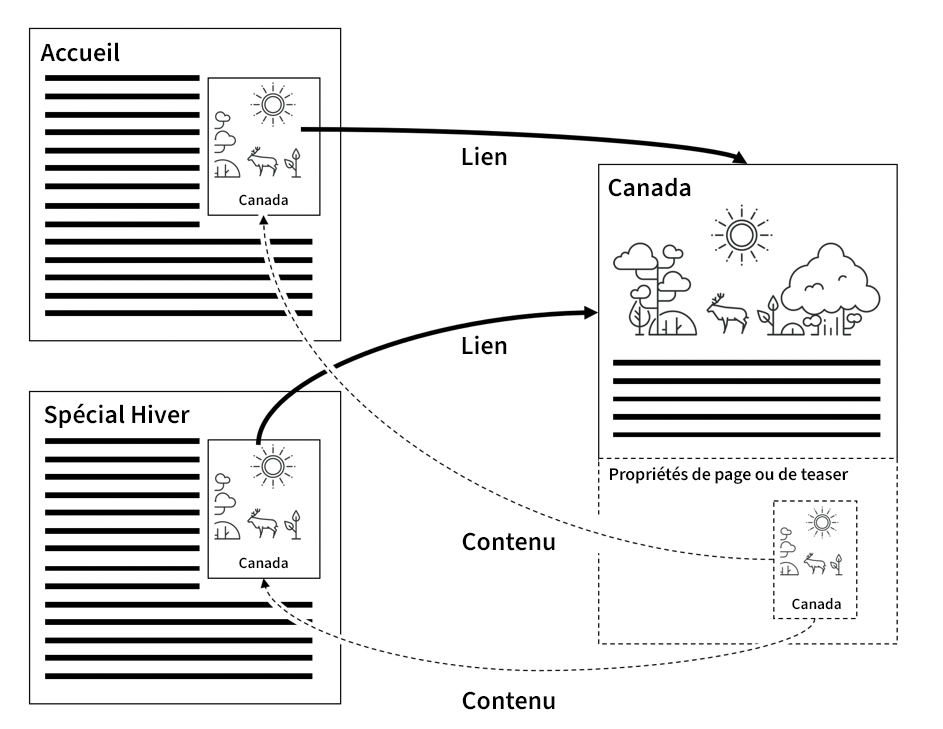

En AEM seulement cela fonctionne comme du charme, mais si vous utilisez un Répartiteur sur l’instance de publication, quelque chose d’étrange se produit.

Imaginez, vous avez publié votre site web. Le titre de votre page Canada est &quot;Canada&quot;. Lorsqu’un visiteur demande votre page d&#39;accueil - qui comporte une référence au teaser de cette page - le composant de la page &quot;Canada&quot; effectue le rendu d’un élément comme

```
<div class="teaser">
  <h3>Canada</h3>
  
</div>
```

** dans la page d&#39;accueil. La page d&#39;accueil est stockée par le Répartiteur sous la forme d’un fichier .html statique, comprenant la bande annonce et le titre du fichier.

Le spécialiste du marketing a maintenant appris que les titres de bande dessinée devraient être exploitables. Il décide donc de changer le titre de &quot;Canada&quot; en &quot;Visite du Canada&quot; et met à jour l&#39;image.

Il publie la page modifiée &quot;Canada&quot; et revisite la page d&#39;accueil précédemment publiée pour voir ses modifications. Mais rien n&#39;a changé là-bas. Il affiche toujours le vieux teaser. Le doublon vérifie le &quot;spécial d&#39;hiver&quot;. Cette page n’a jamais été demandée auparavant et n’est donc pas mise en cache de manière statique dans le répartiteur. Cette page est donc rendue de nouveau par Publier et contient maintenant le nouveau teaser &quot;Visitez le Canada&quot;.

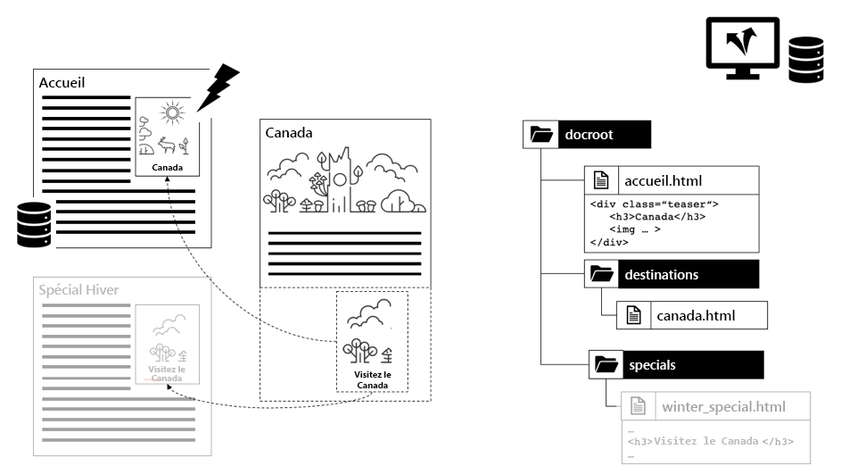

*Répartiteur stockant le contenu obsolète inclus dans la page d&#39;accueil*

<br> 

Que s&#39;est-il passé ? Le répartiteur stocke une version statique d’une page contenant tout le contenu et les balises qui ont été extraits d’autres ressources lors du rendu.

Le Répartiteur, qui n&#39;est qu&#39;un simple serveur Web basé sur un système de fichiers, est rapide mais aussi relativement simple. Si une ressource incluse change, elle ne s&#39;en rend pas compte. Il reste collé au contenu qui se trouvait alors lors du rendu de la page d’inclusion.

La page &quot;Offre spéciale d&#39;hiver&quot; n&#39;a pas encore été rendue. Il n&#39;y a donc pas de version statique sur le Répartiteur et sera donc affichée avec le nouveau teaser car il sera rendu sur demande.

Vous pensez peut-être que le Répartiteur suivrait toutes les ressources qu&#39;il touche tout en affichant et en vidant toutes les pages qui ont utilisé cette ressource, lorsque cette ressource change. Mais le Répartiteur ne rend pas les pages. Le rendu est effectué par le système de publication. Le Répartiteur ne sait pas quelles ressources vont dans un fichier .html rendu.

Toujours pas convaincu ? Vous pouvez penser que *&quot;il doit y avoir un moyen d&#39;implémenter une sorte de suivi des dépendances&quot;*. Eh bien il y en a, ou plus précisément il *était*. Communiqué 3, l&#39;arrière-arrière-arrière-grand-père de AEM a eu un outil de suivi des dépendances mis en oeuvre dans la _session_ qui a été utilisée pour générer une page.

Au cours d’une requête, chaque ressource acquise via cette session était suivie en tant que dépendance de l’URL actuellement générée.

Mais il s&#39;est avéré que garder le suivi des dépendances était très cher. Les internautes ont rapidement découvert que le site Web était plus rapide s’ils désactivaient complètement la fonction de suivi des dépendances et s’ils s’appuyaient sur le rendu de toutes les pages html après qu’une page html ait été modifiée. En outre, ce projet n&#39;était pas parfait non plus - il y avait un certain nombre d&#39;écueils et d&#39;exceptions en chemin. Dans certains cas, vous n’utilisiez pas la session par défaut des requêtes pour obtenir une ressource, mais une session d’administration pour obtenir des ressources d’aide pour générer une requête. Ces dépendances n&#39;étaient généralement pas suivies et entraînaient des maux de tête et des appels téléphoniques à l&#39;équipe d&#39;op-team demandant de vider manuellement le cache. Vous avez eu de la chance s&#39;ils avaient une procédure standard pour faire ça. Il y avait d&#39;autres pièges en chemin mais... arrêtons de nous en souvenir. Cela remonte à 2005. En fin de compte, cette fonction a été désactivée par défaut dans le Communiqué 4 et elle n&#39;a pas été reprise dans le CQ5 successeur qui est devenu AEM.

### Invalidation automatique

#### Lorsque Le Flux Complet Est Moins Cher Que Le Suivi Des Dépendances

Puisque CQ5 nous nous contentons entièrement d&#39;invalider, plus ou moins, l&#39;ensemble du site si seulement une des pages change. Cette fonction est appelée &quot;Invalidation automatique&quot;.

Mais encore une fois - comment cela peut-il être, que jeter et rendre des centaines de pages est moins cher que de faire un suivi approprié des dépendances et un rendu partiel ?

Il y a deux raisons principales :

1. Sur un site Web moyen, seul un petit sous-ensemble de pages est fréquemment demandé. Ainsi, même si vous jetez tout le contenu rendu, seules quelques douzaines seront effectivement demandées immédiatement après. Le rendu de la longue traîne de pages peut être distribué au fil du temps, lorsqu’il est effectivement demandé. En fait, la charge sur les pages de rendu n’est pas aussi élevée que prévu. Bien sûr, il y a toujours des exceptions... nous discuterons plus tard de quelques astuces sur la façon de gérer les loady distribuées de manière égale sur les sites Web plus grands avec des caches Dispatcher vides.

2. De toute façon, toutes les pages sont connectées par la navigation principale. Donc presque toutes les pages sont en fin de compte dépendantes les unes des autres. Cela signifie que même le suivi des dépendances le plus intelligent trouvera ce que nous savons déjà : Si l&#39;une des pages change, vous devez invalider toutes les autres.

Vous n&#39;y croyez pas ? Examinons le dernier point.

Nous utilisons le même argument que dans le dernier exemple avec des teasers faisant référence au contenu d’une page distante. Ce n&#39;est que maintenant que nous utilisons un exemple plus extrême : Navigation principale automatiquement générée. Comme pour le teaser, le titre de navigation est tiré de la page liée ou &quot;distante&quot; comme référence de contenu. Les titres de navigation distante ne sont pas stockés dans la page actuellement générée. N’oubliez pas que la navigation est générée sur chaque page de votre site Web. Ainsi, le titre d’une page est utilisé encore et encore sur toutes les pages qui disposent d’une navigation principale. Et si vous souhaitez modifier un titre de navigation, vous ne souhaitez le faire qu&#39;une seule fois sur la page distante - pas sur chaque page référençant la page.

Ainsi, dans notre exemple, la navigation relie toutes les pages en utilisant &quot;NavTitle&quot; de la page de cible pour générer un nom dans la navigation. Le titre de navigation pour &quot;Islande&quot; est tiré de la page &quot;Islande&quot; et affiché dans chaque page qui comporte un navigateur principal.

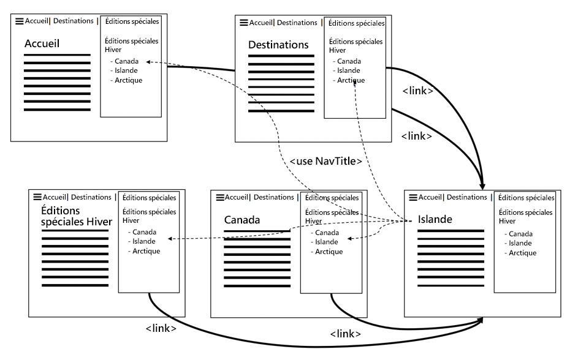

*La navigation principale imbrique inévitablement le contenu de toutes les pages ensemble en extrayant leurs &quot;NavTitles&quot;*

<br> 

Si vous changez le NavTitle sur la page Islande de &quot;Islande&quot; en &quot;Belle Islande&quot;, ce titre change immédiatement dans le menu principal de toutes les autres pages. Ainsi, les pages rendues et mises en cache avant cette modification deviennent toutes obsolètes et doivent être invalidées.

#### Mise en oeuvre de l’invalidation automatique : Le fichier .stat

Maintenant, si vous avez un site de grande taille avec des milliers de pages, il faudrait un certain temps pour parcourir toutes les pages et les supprimer physiquement. Pendant cette période, le Répartiteur pourrait fournir involontairement du contenu obsolète. Pire encore, il peut y avoir des conflits lors de l&#39;accès aux fichiers de cache, peut-être qu&#39;une page est demandée alors qu&#39;elle est simplement en cours de suppression ou qu&#39;une page est à nouveau supprimée en raison d&#39;une seconde invalidation qui s&#39;est produite après une activation ultérieure immédiate. Pensez à quel désordre cela pourrait être. Heureusement, ce n&#39;est pas ce qui se passe. Le répartiteur utilise une astuce astucieuse pour éviter cela : Au lieu de supprimer des centaines et des milliers de fichiers, il place un fichier simple et vide dans la racine de votre système de fichiers lorsqu&#39;un fichier est publié et que tous les fichiers dépendants sont donc considérés comme non valides. Ce fichier est appelé &quot;statfile&quot;. Le fichier d&#39;état est un fichier vide - ce qui importe dans le fichier d&#39;état, c&#39;est sa date de création.

Tous les fichiers du répartiteur, dont la date de création est antérieure au fichier d’état, ont été rendus avant la dernière activation (et invalidation) et sont donc considérés comme &quot;non valides&quot;. Ils sont toujours physiquement présents dans le système de fichiers, mais le Répartiteur les ignore. Ils sont &quot;obsolètes&quot;. Chaque fois qu&#39;une requête est envoyée à une ressource obsolète, le Répartiteur demande au système AEM de rendre à nouveau la page. Cette page nouvellement rendue est ensuite stockée dans le système de fichiers - maintenant avec une nouvelle date de création et elle est de nouveau actualisée.

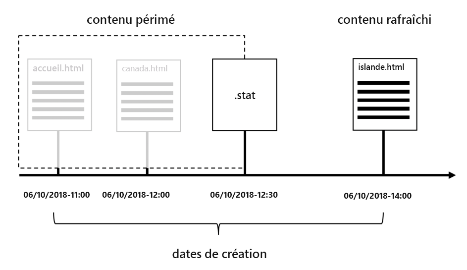

*La date de création du fichier .stat définit quel contenu est obsolète et quel contenu est actualisé.*

<br> 

Vous pouvez demander pourquoi il s&#39;appelle &quot;.stat&quot; ? Et peut-être pas &quot;.invalidé&quot; ? Eh bien, vous pouvez imaginer, avoir ce fichier dans votre système de fichiers aide le Répartiteur à déterminer quelles ressources peuvent *statiquement* être servies - tout comme un serveur web statique. Ces fichiers n’ont plus besoin d’être rendus dynamiquement.

La vraie nature du nom, cependant, est moins métaphorique. Il est dérivé de l&#39;appel système Unix `stat()`, qui renvoie l&#39;heure de modification d&#39;un fichier (entre autres propriétés).

#### Mélange de validation simple et automatique

Mais attendez... plus tôt nous avons dit que les ressources uniques sont physiquement supprimées. Nous disons maintenant qu&#39;un fichier d&#39;état plus récent les rendrait virtuellement invalides aux yeux du Répartiteur. Pourquoi alors la suppression physique, d&#39;abord ?

La réponse est simple. Vous utilisez généralement les deux stratégies en parallèle, mais pour différents types de ressources. Les fichiers binaires, tels que les images, sont autonomes. Ils ne sont pas connectés à d&#39;autres ressources dans un sens où ils ont besoin que leurs informations soient rendues.

Les pages HTML, en revanche, sont fortement interdépendantes. Donc, vous appliqueriez l&#39;auto-invalidation sur ceux-là. Il s’agit du paramètre par défaut dans le répartiteur. Tous les fichiers appartenant à une ressource invalidée sont physiquement supprimés. En outre, les fichiers qui se terminent par &quot;.html&quot; sont automatiquement invalidés.

Le répartiteur décide de l&#39;extension de fichier, qu&#39;il s&#39;agisse d&#39;appliquer ou non un schéma d&#39;auto-invalidation.

Les fins de fichier pour l’invalidation automatique peuvent être configurées. En théorie, vous pourriez inclure toutes les extensions d&#39;auto-invalidation. Mais gardez à l&#39;esprit que cela a un prix très élevé. Vous ne verrez pas les ressources obsolètes livrées de manière involontaire, mais les performances de la diffusion se dégradent considérablement en raison d’une invalidation excessive.

Imaginez, par exemple, que vous implémentiez un schéma dans lequel les fichiers PNG et JPG sont rendus dynamiquement et dépendent d’autres ressources pour le faire. Vous pouvez redimensionner des images haute résolution pour obtenir une résolution compatible avec le Web plus petite. Tant que vous y êtes, changez également le taux de compression. La résolution et le taux de compression dans cet exemple ne sont pas des constantes fixes mais des paramètres configurables dans le composant qui utilise l&#39;image. Si ce paramètre est modifié, vous devez invalider les images.

Pas de problème - nous venons d&#39;apprendre, que nous pourrions ajouter des images à l&#39;auto-invalidation et avoir toujours des images fraîchement rendues chaque fois que quelque chose change.

#### Jeter le bébé avec l&#39;eau de la baignoire

C&#39;est exact - et c&#39;est un énorme problème. Lis à nouveau le dernier paragraphe. &quot;...images fraîchement rendues chaque fois que quelque chose change.&quot;. Comme vous le savez, un bon site Web est constamment modifié. ajout de nouveau contenu ici, correction d&#39;une faute de frappe là, modification d&#39;un teaser ailleurs. Cela signifie que toutes vos images sont invalidées en permanence et doivent être restituées à nouveau. Ne sous-estimez pas cela. Le rendu et le transfert dynamiques des données d’image fonctionnent en millisecondes sur votre machine de développement local. Votre environnement de production doit le faire cent fois plus souvent - par seconde.

Soyons clairs, vos jpgs doivent être rendus à nouveau, lorsqu’une page html change et vice versa. Il n’existe qu’un seul &quot;compartiment&quot; de fichiers à invalider automatiquement. Il est vidé dans son ensemble. Sans aucun moyen de se diviser en structures plus détaillées.

Il existe une bonne raison pour laquelle l’invalidation automatique est conservée par défaut sur &quot;.html&quot;. L&#39;objectif est de garder ce seau aussi petit que possible. Ne jetez pas le bébé avec l&#39;eau du bain en invalidant tout simplement - juste pour être sur le côté sûr.

Les ressources autonomes devraient être servies sur le chemin de cette ressource. Cela aide beaucoup à l&#39;invalidation. Restez simple, ne créez pas de schémas de mappage comme &quot;resource /a/b/c&quot; est servi à partir de &quot;/x/y/z&quot;. Faites en sorte que vos composants fonctionnent avec les paramètres d’auto-invalidation du répartiteur par défaut. N&#39;essayez pas de réparer un composant mal conçu avec une invalidation excessive dans le Répartiteur.

##### Exceptions à l’auto-invalidation : Invalidation ResourceOnly

La demande d’invalidation du répartiteur est généralement déclenchée à partir du ou des systèmes de publication par un agent de réplication.

Si vous êtes très confiant dans vos dépendances, vous pouvez essayer de construire votre propre agent de réplication invalidant.

Ce serait un peu plus que ce guide d&#39;entrer dans les détails, mais nous voulons vous donner au moins quelques conseils.

1. Sais vraiment ce que tu fais. Obtenir l&#39;invalidation correctement est vraiment difficile. C&#39;est l&#39;une des raisons pour lesquelles l&#39;auto-invalidation est si rigoureuse ; pour éviter de diffuser du contenu obsolète.

2. Si votre agent envoie un en-tête HTTP `CQ-Action-Scope: ResourceOnly`, cela signifie que cette demande d’invalidation unique ne déclenche pas une invalidation automatique. Cet élément de code ( [https://github.com/cqsupport/webinar-dispatchercache/tree/master/src/refetching-flush-agent/refetch-bundle](https://github.com/cqsupport/webinar-dispatchercache/tree/master/src/refetching-flush-agent/refetch-bundle)) peut être un bon point de départ pour votre propre agent de réplication.

3. `ResourceOnly`, empêche uniquement l’invalidation automatique. Pour résoudre et invalider les dépendances nécessaires, vous devez déclencher vous-même les demandes d&#39;invalidation. Vous pouvez vérifier les règles de vidage du répartiteur de package ([https://adobe-consulting-services.github.io/acs-aem-commons/features/dispatcher-flush-rules/index.html](https://adobe-consulting-services.github.io/acs-aem-commons/features/dispatcher-flush-rules/index.html)) pour savoir comment cela pourrait se produire.

Nous ne vous recommandons pas de créer un schéma de résolution des dépendances. Il y a tout simplement trop d&#39;efforts et peu de bénéfices - et comme on l&#39;a dit précédemment, il y a trop de choses que vous vous trompez.

Au contraire, ce que vous devriez faire est de découvrir quelles ressources n&#39;ont aucune dépendance sur d&#39;autres ressources et peuvent être invalidées sans invalidation automatique. Il n&#39;est pas nécessaire d&#39;utiliser un agent de réplication personnalisé pour cela. Il vous suffit de créer une règle personnalisée dans votre configuration Répartiteur qui exclut ces ressources de l’invalidation automatique.

Nous avons dit que la navigation principale ou les faiseurs sont une source de dépendances. Eh bien, si vous chargez la navigation et les faiseurs de manière asynchrone ou si vous les incluez avec un script SSI dans Apache, vous n&#39;aurez pas cette dépendance à suivre. Nous allons développer le chargement asynchrone des composants plus loin dans ce document lorsque nous parlerons de &quot;Sling Dynamic Incluts&quot;.

Il en va de même pour les fenêtres contextuelles ou le contenu chargé dans un cadre lumineux. Ces éléments ont rarement des navigations (c&#39;est-à-dire des &quot;dépendances&quot;) et peuvent être invalidés en tant que ressource unique.

## Création de composants avec le répartiteur en tête

### L&#39;application du mécanisme du répartiteur dans un exemple concret

Dans le dernier chapitre, nous avons expliqué comment fonctionne la mécanique de base du Répartiteur, comment elle fonctionne en général et quelles sont les limites.

Nous voulons maintenant appliquer ces mécanismes à un type de composants que vous trouverez très probablement dans les exigences de votre projet. Nous choisissons délibérément le composant pour montrer les problèmes auxquels vous devrez faire face tôt ou tard. La peur ne l&#39;est pas - tous les éléments n&#39;ont pas besoin de cette considération que nous présenterons. Mais si vous voyez la nécessité de construire un tel composant, vous êtes bien conscient des conséquences et savez comment les gérer.

### Modèle de composant de saut (anti)

#### Composant d’image réactive

Illustrons un schéma commun (ou anti-schéma) d&#39;un composant avec des binaires interconnectés. Nous allons créer un composant &quot;respi&quot; - pour &quot;réactive-image&quot;. Ce composant doit pouvoir adapter l’image affichée au périphérique sur lequel elle s’affiche. Sur les ordinateurs de bureau et tablettes, il montre la résolution complète de l&#39;image, sur les téléphones une version plus petite avec un recadrage étroit - ou peut-être même un motif complètement différent (on appelle cela &quot;direction de l&#39;art&quot; dans le monde réactif).

Les ressources sont téléchargées dans la zone DAM de l’AEM et uniquement _référencées_ dans le composant réactive-image.

Le composant respi-component s’occupe à la fois du rendu de l’annotation et de la diffusion des données image binaires.

La façon dont nous la mettons en oeuvre ici est un schéma commun que nous avons vu dans de nombreux projets et même un des éléments de base de l&#39;AEM est basé sur ce schéma. Il est donc très probable que vous, en tant que développeur, adaptiez ce modèle. Il a ses points forts en termes d&#39;encapsulation, mais il a besoin de beaucoup d&#39;efforts pour le préparer au Répartiteur. Nous discuterons plus tard de plusieurs options pour atténuer le problème.

Nous appelons le schéma utilisé ici le &quot;modèle spouleur&quot;, parce que le problème remonte aux premiers jours du Communiqué 3 où il y avait une méthode &quot;spool&quot; qui pouvait être appelée sur une ressource pour diffuser ses données brutes binaires dans la réponse.

Le terme original &quot;spooling&quot; fait en fait référence aux périphériques hors ligne lents partagés, tels que les imprimantes, de sorte qu’il n’est pas correctement appliqué ici. Mais nous aimons le terme de toute façon parce qu&#39;il est rarement dans le monde en ligne ainsi distinguable. Et chaque modèle devrait avoir un nom distinctif de toute façon, n&#39;est-ce pas ? C&#39;est à vous de décider si c&#39;est un motif ou un anti-motif.

#### Mise en œuvre

Voici comment notre composant d’image réactive est implémenté :

Le composant comporte deux parties; la première partie effectue le rendu de l’annotation HTML de l’image, la seconde partie &quot;efface&quot; les données binaires de l’image référencée. Comme il s’agit d’un site Web moderne avec une conception adaptée, nous ne rendons pas une balise `` simple, mais un ensemble d’images dans la balise `<picture/>`. Pour chaque périphérique, nous téléchargeons deux images différentes dans le DAM et nous les référençons depuis notre composant d’image.

Le composant comprend trois scripts de rendu (implémentés dans JSP, HTL ou en tant que servlet), chacun étant traité avec un sélecteur dédié :

1. `/respi.jsp` - sans sélecteur pour le rendu des balises HTML
2. `/respi.img.java` pour générer la version de bureau
3. `/respi.img.mobile.java` pour effectuer le rendu de la version mobile.


Le composant est placé dans les paramètres de la page d&#39;accueil. La structure résultante du CRX est illustrée ci-dessous.


*Structure des ressources de l’image réactive dans CRX*

<br> 

L&#39;annotation des composants est rendue de la manière suivante,

```plain
  #GET /content/home.html

  <html>

  …

  <div class="responsive-image>

  <picture>
    <source src="/content/home/jcr:content/par/respi.img.mobile.jpg" …/>
    <source src="/content/home/jcr:content/par/respi.img.jpg …/>

    …

  </picture>
  </div>
  …
```

et... nous avons fini avec notre composant bien encapsulé.

#### Composant d’image réactive en action

Désormais, un utilisateur demande la page et les ressources via le répartiteur. Les fichiers du système de fichiers du répartiteur sont ainsi générés, comme illustré ci-dessous,

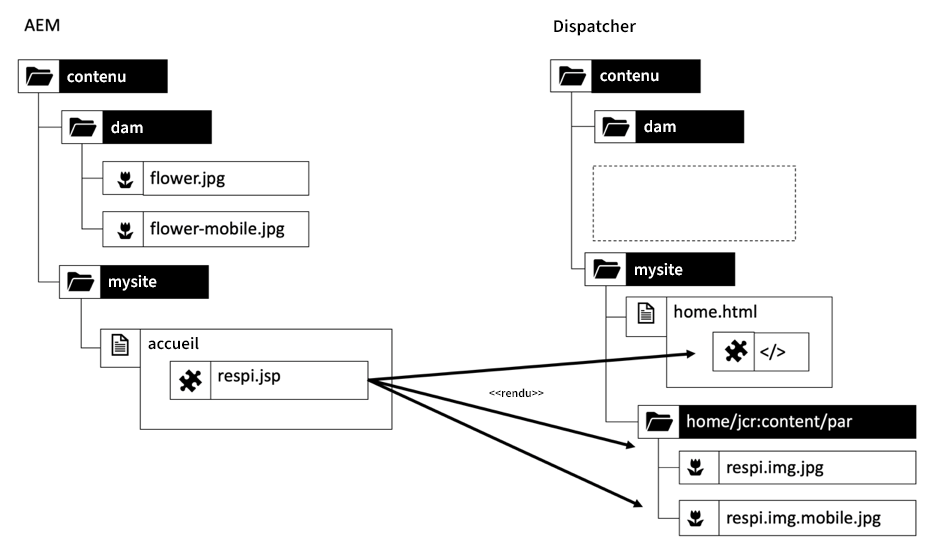

*Structure mise en cache du composant d’image réactive encapsulé*

<br> 

Prenons l’exemple d’un utilisateur qui télécharge et active une nouvelle version des deux images de fleurs dans le DAM. AEM envoie une demande d’invalidation pour

`/content/dam/flower.jpg`

et

`/content/dam/flower-mobile.jpg`

au répartiteur. Ces demandes sont cependant vaines. Le contenu a été mis en cache sous forme de fichiers sous la sous-structure du composant. Ces fichiers sont maintenant obsolètes mais sont toujours traités sur demande.

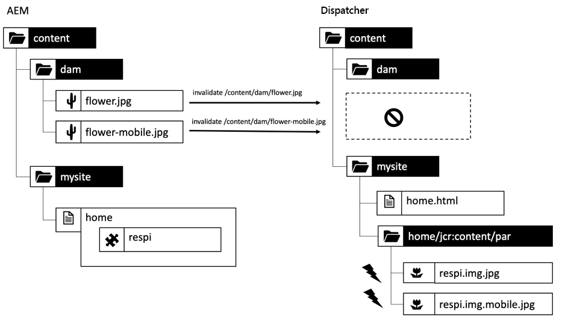

*Non-correspondance de structure conduisant à un contenu obsolète*

<br> 

Il y a une autre mise en garde contre cette approche. Pensez à utiliser le même fichier flower.jpg sur plusieurs pages. Vous aurez ensuite la même ressource mise en cache sous plusieurs URL ou fichiers,

```
/content/home/products/jcr:content/par/respi.img.jpg

/content/home/offers/jcr:content/par/respi.img.jpg

/content/home/specials/jcr:content/par/respi.img.jpg

…
```

Chaque fois qu’une nouvelle page n’est pas mise en cache, les ressources sont extraites d’AEM à différentes URL. Aucune mise en cache du répartiteur et aucune mise en cache du navigateur ne peuvent accélérer la diffusion.

#### Là où le motif du spouleur brille

Il y a une exception naturelle, où ce modèle, même sous sa forme simple, est utile : Si le binaire est stocké dans le composant lui-même, et non dans le DAM. Cela n’est toutefois utile que pour les images utilisées une seule fois sur le site Web et le fait de ne pas stocker de ressources dans le module de gestion des actifs numériques vous rend difficile de gérer vos ressources. Imaginez que votre licence d’utilisation pour un fichier particulier soit épuisée. Comment savoir quels composants vous avez utilisés la ressource ?

Vous voyez ? Le &quot;M&quot; dans la gestion des actifs numériques signifie &quot;gestion&quot;, comme dans la gestion des actifs numériques. Vous ne voulez pas donner cette fonction.

#### Conclusion

Du point de vue d&#39;un AEM développeur, le motif semblait super élégant. Mais avec le Répartiteur pris en compte dans l&#39;équation, vous pourriez être d&#39;accord, que l&#39;approche naïve pourrait ne pas être suffisante.

Nous vous laissons décider s&#39;il s&#39;agit d&#39;un schéma ou d&#39;un anti-schéma pour l&#39;instant. Et peut-être avez-vous déjà quelques bonnes idées en tête pour atténuer les problèmes expliqués ci-dessus ? Bien. Vous serez alors impatient de voir comment d&#39;autres projets ont résolu ces problèmes.

### Résolution des problèmes courants du répartiteur

#### Présentation

Parlons de la façon dont cela aurait pu être mis en oeuvre un peu plus en mémoire cache. Il existe plusieurs options. Parfois, on ne peut pas choisir la meilleure solution. Peut-être que vous venez dans un projet déjà en cours et que vous avez un budget limité pour résoudre le &quot;problème de cache&quot; à portée de main et pas assez pour faire une refactorisation complète. Ou vous faites face à un problème, qui est plus complexe que l&#39;exemple de composant d&#39;image.

Nous présenterons les principes et les mises en garde dans les sections suivantes.

Encore une fois, ceci est basé sur l&#39;expérience de la vie réelle. Nous avons déjà vu tous ces modèles dans la nature, donc ce n&#39;est pas un exercice universitaire. C&#39;est pourquoi nous vous montrons quelques anti-modèles, donc vous avez la chance d&#39;apprendre des erreurs que d&#39;autres ont déjà faites.

#### Tueur de cache

>[!WARNING]
>
>C&#39;est un anti-schéma. Ne l&#39;utilisez pas. Jamais.

Avez-vous déjà vu des paramètres de requête tels que `?ck=398547283745` ? Ils sont appelés cache-killer (&quot;ck&quot;). L&#39;idée est que si vous ajoutez un paramètre de requête, la ressource ne sera pas mise en cache. De plus, si vous ajoutez un nombre aléatoire en tant que valeur du paramètre (comme &quot;398547283745&quot;), l’URL devient unique et vous assurez qu’aucun autre cache entre le système AEM et votre écran ne peut être mis en cache. Habituellement, les suspects se retrouvent dans un cache &quot;vernis&quot; devant le Répartiteur, un CDN ou même le cache du navigateur. Encore : Ne fais pas ça. Vous souhaitez que vos ressources soient mises en cache autant et aussi longtemps que possible. Le cache est votre ami. Ne tuez pas d&#39;amis.

#### Invalidation automatique

>[!WARNING]
>
>C&#39;est un anti-schéma. Evitez de l’utiliser pour les ressources numériques. Essayez de conserver la configuration par défaut du Répartiteur, qui > est l’invalidation automatique des fichiers &quot;.html&quot;, uniquement

A court terme, vous pouvez ajouter &quot;.jpg&quot; et &quot;.png&quot; à la configuration d’invalidation automatique dans le répartiteur. Cela signifie que, chaque fois qu’une invalidation se produit, tous les fichiers &quot;.jpg&quot;, &quot;.png&quot; et &quot;.html&quot; doivent être rendus à nouveau.

Ce modèle est très facile à mettre en oeuvre si les propriétaires d&#39;entreprise se plaignent de ne pas voir leurs modifications se matérialiser suffisamment rapidement sur le site en ligne. Mais cela ne peut vous faire gagner qu&#39;un peu de temps pour trouver une solution plus sophistiquée.

Assurez-vous de bien comprendre les vastes répercussions sur les performances. Cela ralentira considérablement votre site Web et pourrait même avoir un impact sur la stabilité, si votre site est un site Web à forte charge avec des modifications fréquentes, tel qu&#39;un portail d&#39;informations.

#### Identification de l’URL

Une empreinte URL ressemble à un tueur de cache. Mais ce n&#39;est pas le cas. Ce n&#39;est pas un nombre aléatoire mais une valeur qui caractérise le contenu de la ressource. Il peut s&#39;agir d&#39;un hachage du contenu de la ressource ou, plus simple encore, d&#39;un horodatage lorsque la ressource a été téléchargée, modifiée ou mise à jour.

Un horodatage Unix est suffisant pour une implémentation dans le monde réel. Pour une meilleure lisibilité, nous utilisons un format plus lisible dans ce tutoriel : `2018 31.12 23:59 or fp-2018-31-12-23-59`.

L’empreinte digitale ne doit pas être utilisée comme paramètre de requête, comme URL avec des paramètres de requête.   ne peut pas être mis en cache. Vous pouvez utiliser un sélecteur ou le suffixe pour l’empreinte digitale.

Supposons que le fichier `/content/dam/flower.jpg` ait une date `jcr:lastModified` du 31 décembre 2018, 23:59. L&#39;URL avec l&#39;empreinte digitale est `/content/home/jcr:content/par/respi.fp-2018-31-12-23-59.jpg`.

Cette URL reste stable tant que le fichier de ressources référencées (`flower.jpg`) n’est pas modifié. Il peut donc être mis en cache pour une durée indéterminée et il n&#39;est pas un tueur de cache.

Remarque : cette URL doit être créée et diffusée par le composant d’image dynamique. Ce n&#39;est pas une fonctionnalité AEM prête à l&#39;emploi.

C&#39;est le concept de base. Il y a cependant quelques détails qui peuvent facilement être négligés.

Dans notre exemple, le composant a été rendu et mis en cache à 23:59. Maintenant l&#39;image a été changée disons à 00:00.  Le composant _génère_ une nouvelle URL d’empreinte digitale dans son balisage.

Vous pourriez penser que _devrait_... mais ce n&#39;est pas le cas. Comme seul le binaire de l’image a été modifié et que la page incluse n’a pas été modifiée, le rendu de l’annotation HTML n’est pas obligatoire. Ainsi, le répartiteur sert la page avec l&#39;ancienne empreinte, et donc l&#39;ancienne version de l&#39;image.

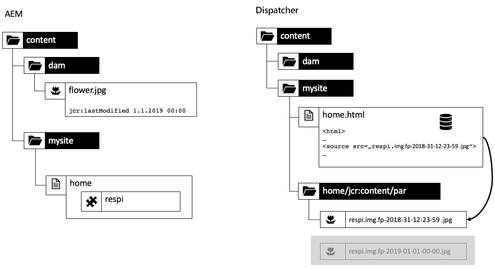

*Composant d’image plus récent que l’image référencée, aucune empreinte nouvelle n’est rendue.*

<br> 

Désormais, si vous réactivez la page d&#39;accueil (ou toute autre page de ce site), le fichier d’état est mis à jour, le répartiteur considère que la page home.html est obsolète et le rend à nouveau avec une nouvelle empreinte dans le composant d’image.

Mais nous n&#39;avons pas activé la page d&#39;accueil, n&#39;est-ce pas ? Et pourquoi devrions-nous activer une page que nous n&#39;avons pas touchée de toute façon ? De plus, peut-être que nous n&#39;avons pas les droits suffisants pour activer les pages ou que le processus d&#39;approbation est si long et chronophage, que nous ne pouvons tout simplement pas le faire à court terme. Alors - que faire ?

#### Outil de l&#39;administrateur différé - Diminution des niveaux de fichier d&#39;état

>[!WARNING]
>
>C&#39;est un anti-schéma. Utilisez-le seulement à court terme pour gagner du temps et trouver une solution plus sophistiquée.

En règle générale, l’administrateur différé &quot;_définit l’auto-invalidation sur jpgs et le niveau du fichier statfile sur zéro - ce qui permet toujours de mettre en cache des problèmes de tous types_&quot;. Vous trouverez ce conseil dans les forums technologiques, et il vous aidera à résoudre votre problème d&#39;invalidation.

Jusqu&#39;à présent, nous n&#39;avons pas discuté du niveau du fichier d&#39;état. En gros, l’invalidation automatique ne fonctionne que pour les fichiers de la même sous-arborescence. Cependant, le problème est que les pages et les ressources ne vivent généralement pas dans la même sous-arborescence. Les pages sont quelque part en dessous de `/content/mysite` tandis que les ressources vivent en dessous de `/content/dam`.

Le &quot;niveau de fichier de statistiques&quot; définit où se trouvent les noeuds racine de profondeur des sous-arbres. Dans l’exemple ci-dessus, le niveau serait &quot;2&quot; (1=/content, 2=/mysite, dam)

L’idée de &quot;réduire&quot; le niveau du fichier d’état à 0 consiste en fait à définir l’arborescence complète /content comme la seule et unique sous-arborescence pour que les pages et les ressources vivent dans le même domaine d’invalidation automatique. Nous n&#39;aurions donc que sur un grand arbre au niveau (au point &quot;/&quot;). Mais cela invalide automatiquement tous les sites sur le serveur chaque fois qu&#39;un élément est publié - même sur des sites complètement indépendants. Faites-nous confiance : C&#39;est une mauvaise idée à long terme, parce que vous allez sérieusement dégrader le taux d&#39;accès global au cache. Tout ce que vous pouvez faire, c&#39;est espérer que vos serveurs AEM disposent de suffisamment de puissance de feu pour fonctionner sans cache.

Vous comprendrez tous les avantages d&#39;un niveau plus profond de fichier d&#39;état un peu plus tard.

#### Implémentation d’un agent d’invalidation personnalisé

Quoi qu&#39;il en soit, nous devons avertir le Répartiteur d&#39;une manière ou d&#39;une autre, d&#39;invalider les pages HTML si un fichier &quot;.jpg&quot; ou &quot;.png&quot; a été modifié pour autoriser le rendu avec une nouvelle URL.

Ce que nous avons vu dans les projets est, par exemple, des agents de réplication spéciaux sur le système de publication qui envoient des demandes d&#39;invalidation pour un site chaque fois qu&#39;une image de ce site est publiée.

Ici, cela aide beaucoup si vous pouvez dériver le chemin du site du chemin d’accès du fichier en utilisant la convention d’affectation de nom.

D&#39;une manière générale, il est préférable de faire correspondre les sites et les chemins d&#39;accès aux ressources comme celui-ci :

**Exemple**

```
/content/dam/site-a
/content/dam/site-b

/content/site-a
/content/site-b
```

Ainsi, votre agent de vidage Dispatcher personnalisé peut facilement envoyer et invalider une demande à /content/site-a lorsqu&#39;il rencontre une modification sur `/content/dam/site-a`.

En fait, peu importe le chemin que vous dites au Répartiteur d&#39;invalider - tant qu&#39;il est dans le même site, dans la même &quot;sous-arborescence&quot;. Vous n&#39;avez même pas besoin d&#39;utiliser un véritable chemin de ressources. Il peut également être &quot;virtuel&quot; :

`GET /dispatcher-invalidate
Invalidate-path /content/mysite/dummy`

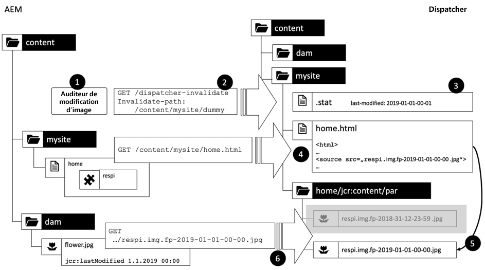

1. Un écouteur sur le système de publication est déclenché lorsqu’un fichier dans le DAM change

2. Le processus d’écoute envoie une demande d’invalidation au Répartiteur. En raison de l&#39;auto-invalidation, peu importe le chemin que nous envoyons dans l&#39;auto-invalidation, sauf s&#39;il se trouve sous la page d&#39;accueil du site - ou plus précis au niveau du fichier de site.

3. Le fichier d&#39;état est mis à jour.

4. La prochaine fois que la page d&#39;accueil sera demandée, elle sera rendue à nouveau. La nouvelle empreinte/date est prélevée à partir de la propriété lastModified de l’image en tant que sélecteur supplémentaire.

5. Cela crée implicitement une référence à une nouvelle image.

6. Si l&#39;image est réellement demandée, un nouveau rendu est créé et stocké dans le répartiteur.


#### La nécessité de nettoyer

Ouf. Terminé. Hourra !

Et bien... pas encore tout à fait.

Le chemin,

`/content/mysite/home/jcr:content/par/respi.img.fp-2018-31-12-23-59.jpg`

ne concerne aucune des ressources invalidées. Mémoriser? Nous avons seulement invalidé une ressource &quot;factice&quot; et nous nous sommes appuyés sur l&#39;auto-invalidation pour considérer que &quot;maison&quot; n&#39;est pas valide. L’image elle-même ne peut jamais être _physiquement_ supprimée. Ainsi, le cache grandira, grandira et grandira. Lorsque les images sont modifiées et activées, elles obtiennent de nouveaux noms de fichier dans le système de fichiers du répartiteur.

Il existe trois problèmes pour ne pas supprimer physiquement les fichiers mis en cache et les conserver indéfiniment :

1. Vous gaspillez la capacité d&#39;enregistrement - bien sûr. Certes, l&#39;enregistrement est devenu moins cher et moins cher ces dernières années. Mais les résolutions d&#39;images et la taille des fichiers ont également augmenté ces dernières années - avec l&#39;avènement d&#39;écrans à la rétine qui ont faim d&#39;images nettes en cristal.

2. Même si les disques durs sont devenus moins chers, &quot;enregistrement&quot; n&#39;est peut-être pas devenu moins cher. Nous avons vu une tendance à ne pas avoir d&#39;enregistrement de disque dur métallique nu (bon marché) mais de location d&#39;enregistrement virtuel sur un NAS par votre fournisseur de datacenter. Ce type d&#39;enregistrement est un peu plus fiable et évolutif mais aussi un peu plus cher. Il se peut que vous ne vouliez pas le gaspiller en stockant des ordures obsolètes. Cela ne concerne pas seulement l&#39;Principal enregistrement - pensez aussi aux sauvegardes. Si vous disposez d’une solution de sauvegarde prête à l’emploi, vous ne pourrez peut-être pas exclure les répertoires de cache. En fin de compte, vous sauvegardez également les données sur les ordures.

3. Pire encore : Vous avez peut-être acheté des licences d’utilisation pour certaines images seulement pendant une durée limitée, tant que vous en avez besoin. Maintenant, si vous stockez toujours l&#39;image après l&#39;expiration d&#39;une licence, cela peut être considéré comme une infraction au droit d&#39;auteur. Vous n&#39;utiliserez peut-être plus l&#39;image dans vos pages Web, mais Google les trouvera toujours.

Donc finalement, vous allez trouver un travail ménager pour nettoyer tous les fichiers plus vieux que... disons une semaine pour garder ce genre de détritus sous contrôle.

#### Abus d&#39;empreintes digitales d&#39;URL pour les attaques par déni de service

Mais attendez, il y a un autre défaut dans cette solution :

Nous abusons en quelque sorte d&#39;un sélecteur comme paramètre : fp-2018-31-12-23-59 est généré dynamiquement comme une sorte de &quot;cache-killer&quot;. Mais peut-être un enfant ennuyé (ou un moteur de recherche qui s&#39;est déchaîné) débuts demandant les pages :

```
/content/mysite/home/jcr:content/par/img.fp-0000-00-00-00-00.jpg
/content/mysite/home/jcr:content/par/img.fp-0000-00-00-00-01.jpg
/content/mysite/home/jcr:content/par/img.fp-0000-00-00-00-02.jpg

…
```

Chaque requête ignore le répartiteur, ce qui entraîne le chargement d’une instance de publication. Et, pire encore, créez un fichier d&#39;application sur le Répartiteur.

Donc... au lieu de simplement utiliser l&#39;empreinte digitale comme un simple tueur de cache, vous devriez vérifier la date jcr:lastModified de l&#39;image et retourner un 404 si ce n&#39;est pas la date prévue. Cela prend du temps et des cycles de processeur sur le système de publication... ce que vous vouliez éviter en premier lieu.

#### Avertissements d’empreintes digitales d’URL dans les versions à haute fréquence

Vous pouvez utiliser le schéma d’empreinte digitale non seulement pour les fichiers provenant du module DAM, mais également pour les fichiers JS- et CSS et les ressources connexes.

[Versioned ](https://adobe-consulting-services.github.io/acs-aem-commons/features/versioned-clientlibs/index.html) Clientlibsis est un module qui utilise cette approche.

Mais ici, vous pouvez faire face à une autre mise en garde avec des empreintes URL : Il lie l’URL au contenu. Vous ne pouvez pas modifier le contenu sans modifier également l’URL (c’est-à-dire, mettre à jour la date de modification). C&#39;est pour cela que les empreintes digitales sont conçues en premier lieu. Mais pensez à lancer une nouvelle version, avec de nouveaux fichiers CSS et JS et donc de nouvelles URL avec de nouvelles empreintes digitales. Toutes vos pages HTML contiennent toujours des références aux anciennes URL empreintes. Ainsi, pour que la nouvelle version fonctionne de manière cohérente, vous devez invalider toutes les pages HTML en même temps pour forcer un nouveau rendu avec des références aux fichiers nouvellement imprimés. Si vous avez plusieurs sites qui reposent sur les mêmes bibliothèques, cela peut être un grand nombre de retours. Ici, vous ne pouvez pas exploiter le `statfiles`. Soyez donc prêt à voir les pics de charge sur vos systèmes de publication après un déploiement. Vous pouvez envisager un déploiement bleu-vert avec réchauffement du cache ou peut-être un cache basé sur TTL devant votre Répartiteur ... les possibilités sont infinies.

#### Bref saut

Waouh - C&#39;est beaucoup de détails à prendre en compte, non ? Et il refuse d&#39;être compris, testé et débogué facilement. Et tout cela pour une solution apparemment élégante. Il est vrai qu&#39;elle est élégante - mais seulement d&#39;un point de vue AEM seulement. Avec le Répartiteur, ça devient méchant.

Et pourtant, cela ne résout pas une seule mise en garde de base, si une image est utilisée plusieurs fois sur des pages différentes, elles seront mises en cache sous ces pages. Il n&#39;y a pas beaucoup de synergie de mise en cache ici.

En général, l&#39;empreinte d&#39;URL est un bon outil à utiliser dans votre boîte à outils, mais vous devez l&#39;appliquer avec soin, car elle peut causer de nouveaux problèmes tout en n&#39;en résolvant que quelques-uns existants.

Donc... c&#39;était un long chapitre. Mais nous avons vu ce schéma si souvent, que nous avons senti qu&#39;il était nécessaire de vous donner une vue d&#39;ensemble avec tous les pour et les contre. Les empreintes digitales URL résolvent quelques-uns des problèmes inhérents au modèle de spouleur, mais l&#39;effort de mise en oeuvre est assez important et vous devez également envisager d&#39;autres solutions plus faciles. Nous vous conseillons de toujours vérifier si vous pouvez baser vos URL sur les chemins des ressources fournies et ne pas avoir de composant intermédiaire. Nous y reviendrons dans le prochain chapitre.

##### Résolution de la dépendance d’exécution

La résolution des dépendances d&#39;exécution est un concept que nous avons envisagé dans un projet. Mais y penser est devenu assez complexe et nous avons décidé de ne pas l&#39;appliquer.

Voici l&#39;idée de base :

Le Répartiteur ne connaît pas les dépendances des ressources. C&#39;est juste un tas de fichiers uniques avec peu de sémantique.

AEM sait aussi peu de choses sur les dépendances. Il manque une sémantique correcte ou un &quot;suivi des dépendances&quot;.

AEM connaît certaines des références. Il utilise ces connaissances pour vous avertir lorsque vous essayez de supprimer ou de déplacer une page ou une ressource référencée. Pour ce faire, elle interroge la recherche interne lors de la suppression d’un fichier. Les références au contenu ont un formulaire très particulier. Ce sont des expressions de chemin commençant par &quot;/content&quot;. Ils peuvent donc facilement être indexés en texte intégral - et interrogés lorsque cela est nécessaire.

Dans notre cas, nous aurions besoin d’un agent de réplication personnalisé sur le système de publication, qui déclenche une recherche d’un chemin spécifique lorsque ce chemin d’accès a changé.

Disons :

`/content/dam/flower.jpg`

A changé lors de la publication. L&#39;agent déclenche une recherche pour &quot;/content/dam/flower.jpg&quot; et trouve toutes les pages référençant ces images.

Il pourrait alors émettre un certain nombre de demandes d&#39;invalidation au Répartiteur. Un pour chaque page contenant la ressource.

En théorie, cela devrait fonctionner. Mais seulement pour les dépendances de premier niveau. Vous ne souhaitez pas appliquer ce schéma aux dépendances à plusieurs niveaux, par exemple lorsque vous utilisez l’image sur un fragment d’expérience utilisé sur une page. En fait, nous pensons que cette approche est trop complexe - et qu&#39;il pourrait y avoir des problèmes d&#39;exécution. Et généralement, le meilleur conseil est de ne pas faire l&#39;informatique coûteuse dans les gestionnaires de événements. Et surtout la recherche peut devenir très coûteuse.

##### Conclusion

Nous espérons que nous avons discuté suffisamment en détail du modèle de spouleur pour vous aider à décider quand l&#39;utiliser et ne pas l&#39;utiliser dans votre implémentation.

## Eviter les problèmes du répartiteur

### URL basées sur des ressources

Une manière bien plus élégante de résoudre le problème de la dépendance est de ne pas avoir de dépendances du tout. Evitez les dépendances artificielles qui se produisent lors de l&#39;utilisation d&#39;une ressource pour simplement en proxy une autre, comme nous l&#39;avons fait dans le dernier exemple. Essayez de voir les ressources comme des entités &quot;solitaires&quot; aussi souvent que possible.

Notre exemple est facile à résoudre :

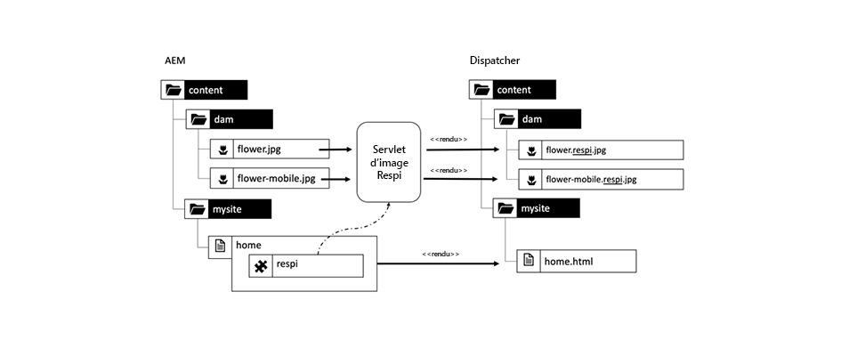

*Refroidissement de l’image à l’aide d’une servlet liée à l’image, et non du composant.*

<br> 

Nous utilisons les ressources d&#39;origine des chemins de ressources pour générer les données. Si nous devons rendre l’image d’origine telle quelle, nous pouvons simplement utiliser AEM rendu par défaut pour les ressources.

Si nous devons effectuer un traitement spécial pour un composant spécifique, nous enregistrerions une servlet dédiée sur ce chemin et un sélecteur pour effectuer la transformation au nom du composant. Nous l&#39;avons fait ici exemplaire avec le &quot;.respi&quot;. sélecteur. Il est recommandé de suivre les noms des sélecteurs utilisés dans l’espace URL global (tel que `/content/dam`) et de disposer d’une convention d’affectation de nom efficace pour éviter les conflits d’affectation de nom.

Au fait, nous ne voyons aucun problème de cohérence du code. La servlet peut être définie dans le même package Java que le modèle sling des composants.

Nous pouvons même utiliser des sélecteurs supplémentaires dans l&#39;espace global, tels que,

`/content/dam/flower.respi.thumbnail.jpg`

Facile, non ? Alors pourquoi les gens ont-ils des modèles compliqués comme le Spooler ?

Eh bien, nous pourrions résoudre le problème en évitant la référence de contenu interne parce que le composant externe ajoute peu de valeur ou d&#39;information au rendu de la ressource interne, qu&#39;il pourrait facilement être encodé dans un ensemble de sélecteurs statiques qui contrôlent la représentation d&#39;une ressource solitaire.

Mais il y a une classe de cas que vous ne pouvez pas résoudre facilement avec une URL basée sur des ressources. Nous appelons ce type de cas, &quot;Paramètre injectant des composants&quot;, et nous en discutons dans le chapitre suivant.

### Paramètre d&#39;injection de composants

#### Présentation

Le Spooler du dernier chapitre n&#39;était qu&#39;un mince emballage autour d&#39;une ressource. Cela a causé plus de problèmes que d&#39;aider à résoudre le problème.

Nous pourrions facilement substituer ce wrapping en utilisant un sélecteur simple et en ajoutant une servlet d&#39;application pour répondre à de telles requêtes.

Mais que se passe-t-il si le composant &quot;respi&quot; est plus qu&#39;un simple proxy. Que se passe-t-il si le composant contribue réellement au rendu du composant ?

Introduisons une petite extension de notre composante &quot;respi&quot;, qui change un peu la donne. Encore une fois, nous allons d&#39;abord introduire des solutions naïves pour relever les nouveaux défis et montrer où elles sont insuffisantes.

#### Composant Respi2

Le composant respi2 est un composant qui affiche une image réactive, tout comme le composant respi. Mais il y a un léger complément,


*Structure CRX : composant respi2 ajoutant une propriété de qualité à la diffusion*

<br> 

Les images sont des jpegs et les jpegs peuvent être compressés. Lorsque vous compressez une image jpeg, vous échangez la qualité pour la taille du fichier. La compression est définie comme un paramètre numérique de &quot;qualité&quot; compris entre &quot;1&quot; et &quot;100&quot;. &quot;1&quot; signifie &quot;petite mais mauvaise qualité&quot;, &quot;100&quot; signifie &quot;excellente qualité mais fichiers volumineux&quot;. Quelle est alors la valeur parfaite ?

Comme dans tous les domaines de l&#39;informatique, la réponse est : &quot;Ça dépend.&quot;

Ici, cela dépend du motif. Les motifs aux bords contrastés tels que les motifs écrits, les photos de bâtiments, les illustrations, les croquis ou les photos de boîtes de produits (avec des contours nets et du texte écrit dessus) tombent généralement dans cette catégorie. Les motifs avec des transitions de couleur et de contraste plus douces comme des paysages ou des portraits peuvent être compressés un peu plus sans perte de qualité visible. Les photos de la nature tombent généralement dans cette catégorie.

En outre, selon l’emplacement d’utilisation de l’image, vous pouvez utiliser un autre paramètre. Une petite miniature dans une bande annonce peut supporter une meilleure compression que celle utilisée dans une bannière à forte identification à l’échelle de l’écran. Cela signifie que le paramètre de qualité n&#39;est pas lié à l&#39;image, mais à l&#39;image et au contexte. Et au goût de l&#39;auteur.

En bref : Il n&#39;y a pas de cadre parfait pour toutes les photos. Il n&#39;y a pas de solution unique. C&#39;est mieux que l&#39;auteur décide. Il modifiera le paramètre de &quot;qualité&quot; comme propriété dans le composant jusqu&#39;à ce qu&#39;il soit satisfait de la qualité et n&#39;ira pas plus loin pour ne pas sacrifier la bande passante.

Nous avons maintenant un fichier binaire dans la gestion des actifs numériques et un composant, qui fournit une propriété de qualité. À quoi doit ressembler l’URL ? Quel est le composant responsable de la mise en file d&#39;attente ?

#### Approche naïve 1 : Transmettre les propriétés en tant que paramètres de Requête

>[!WARNING]
>
>C&#39;est un anti-schéma. Ne l&#39;utilisez pas.

Dans le dernier chapitre, l’URL de l’image rendue par le composant ressemblait à ceci :

`/content/dam/flower.respi.jpg`

Tout ce qui manque, c&#39;est la valeur de la qualité. Le composant sait quelle propriété est saisie par l&#39;auteur... Il peut facilement être transmis à la servlet de rendu d&#39;image en tant que paramètre de requête lorsque l&#39;annotation est rendue, par exemple `flower.respi2.jpg?quality=60` :

```plain
  <div class="respi2">
  <picture>
    <source src="/content/dam/flower.respi2.jpg?quality=60" …/>
    …
  </picture>
  </div>
  …
```

C&#39;est une mauvaise idée. Mémoriser? Les requêtes avec des paramètres de requête ne peuvent pas être mises en cache.

#### Approche naïve 2 : Transmettre des informations supplémentaires en tant que sélecteur

>[!WARNING]
>
>Cela pourrait devenir un anti-schéma. Utilise-le attentivement.

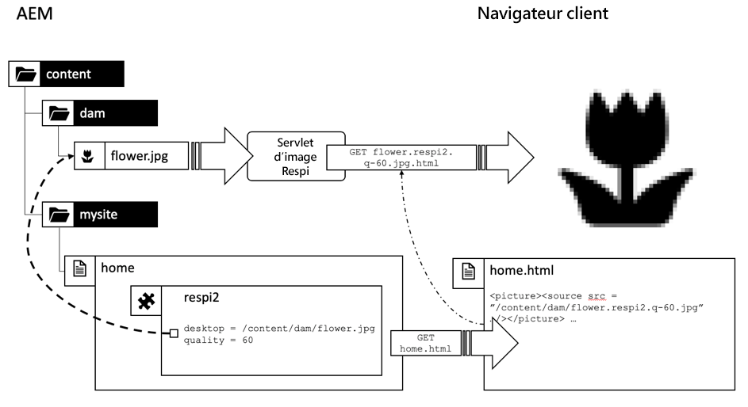

*Transmission des propriétés du composant en tant que sélecteurs*

<br> 

Il s’agit d’une légère variation de la dernière URL. Ce n&#39;est que cette fois que nous utilisons un sélecteur pour transmettre la propriété à la servlet, de sorte que le résultat puisse être mis en cache :

`/content/dam/flower.respi.q-60.jpg`

C&#39;est bien mieux, mais souvenez-vous de ce méchant scénariste du dernier chapitre qui cherche de tels modèles ? Il verrait jusqu&#39;où il peut aller en survolant les valeurs :

```plain
  /content/dam/flower.respi.q-60.jpg
  /content/dam/flower.respi.q-61.jpg
  /content/dam/flower.respi.q-62.jpg
  /content/dam/flower.respi.q-63.jpg
  …
```

Cette fois encore, le cache est contourné et la charge est créée sur le système de publication. Donc, ça pourrait être une mauvaise idée. Vous pouvez atténuer ce problème en filtrant uniquement un petit sous-ensemble de paramètres. Vous souhaitez n’autoriser que `q-20, q-40, q-60, q-80, q-100`.

#### Filtrage des requêtes non valides lors de l’utilisation de sélecteurs

Réduire le nombre de sélecteurs était un bon début. En règle générale, vous devez toujours limiter le nombre de paramètres valides à un minimum absolu. Si vous faites cela intelligemment, vous pouvez même tirer parti d&#39;un pare-feu d&#39;Application web en dehors de AEM en utilisant un ensemble statique de filtres sans avoir une connaissance approfondie du système AEM sous-jacent pour protéger vos systèmes :

`Allow: /content/dam/(-\_/a-z0-9)+/(-\_a-z0-9)+
\.respi\.q-(20|40|60|80|100)\.jpg`

Si vous n&#39;avez pas de pare-feu d&#39;Application web, vous devez filtrer dans le Répartiteur ou dans AEM lui-même. Si vous le faites en AEM, assurez-vous que

1. Le filtre est implémenté de façon très efficace, sans accéder trop à CRX et perdre de la mémoire et du temps.

2. Le filtre répond à un message d’erreur &quot;404 - Non trouvé&quot;.

Mettons de nouveau l&#39;accent sur le dernier point. La conversation HTTP se présenterait comme suit :

```plain
  GET /content/dam/flower.respi.q-41.jpg

  Response: 404 – Not found
  << empty response body >>
```

Nous avons également vu des implémentations qui filtraient des paramètres non valides mais renvoyaient un rendu de secours valide lorsqu&#39;un paramètre non valide est utilisé. Supposons que nous n&#39;autorisons que les paramètres de 20 à 100. Les valeurs comprises entre les deux sont mises en correspondance avec les valeurs valides. Donc,

`q-41, q-42, q-43, …`

répondrait toujours à la même image que q-40 :

```plain
  GET /content/dam/flower.respi.q-41.jpg

  Response: 200 – OK
  << flower.jpg with quality = 40 >>
```

Cette approche n&#39;aide en rien. Ces requêtes sont en fait des requêtes valides.  Ils consomment de la puissance de traitement et occupent de l&#39;espace dans le répertoire de cache du répartiteur.

Il est préférable de renvoyer un `301 – Moved permanently` :

```plain
  GET /content/dam/flower.respi.q-41.jpg

  Response: 301 – Moved permanently
  Location: /content/dam/flower.respi.q-40.jpg
```

Ici AEM dit au navigateur. &quot;Je n&#39;ai pas `q-41`. Mais hé - vous pouvez me poser des questions sur `q-40` &quot;.

Cela ajoute une boucle de réponse à la demande à la conversation, ce qui représente un peu de frais généraux, mais c&#39;est moins cher que d&#39;effectuer le traitement complet sur `q-41`. Vous pouvez également exploiter le fichier qui est déjà mis en cache sous `q-40`. Vous devez comprendre, cependant, que 302 réponses ne sont pas mises en cache dans le Répartiteur, nous parlons de logique qui est exécutée dans l&#39;AEM. Encore et encore. Donc vous feriez mieux de le rendre mince et rapide.

Nous aimons personnellement le 404 répondre le plus. Cela rend très évident ce qui se passe. Il permet également de détecter les erreurs sur votre site Web lorsque vous analysez des fichiers journaux. 301 peut être prévu, où 404 doit toujours être analysé et éliminé.

## Sécurité - Excursion

### Filtrage des requêtes

#### Où filtrer le mieux

À la fin du dernier chapitre, nous avons souligné la nécessité de filtrer le trafic entrant pour les sélecteurs connus. Reste la question : Où dois-je réellement filtrer les requêtes ?

Eh bien, ça dépend. Le plus tôt sera le mieux.

#### application web pare-feu

Si vous disposez d&#39;une appliance de pare-feu d&#39;Application web ou &quot;WAF&quot; conçue pour la sécurité Web, vous devez absolument exploiter ces fonctionnalités. Mais vous pouvez découvrir que le WAF est géré par des personnes qui ne connaissent que peu votre application de contenu et qui filtrent les requêtes valides ou laissent passer trop de requêtes nocives. Vous découvrirez peut-être que les gens qui gèrent le WAF sont affectés à un autre service avec des horaires et des horaires différents, la communication peut ne pas être aussi serrée qu&#39;avec vos coéquipiers directs et vous n&#39;obtenez pas toujours les changements dans le temps, ce qui signifie que finalement votre développement et votre vitesse de contenu souffrent.

Vous pourriez finir avec quelques règles générales ou même une liste bloquée, que votre instinct vous dit, pourrait être renforcée.

#### Filtrage du répartiteur et de la publication

L’étape suivante consiste à ajouter des règles de filtrage d’URL dans le noyau Apache et/ou dans le répartiteur.

Vous n’avez ici accès qu’aux URL. Vous êtes limité aux filtres basés sur des modèles. Si vous devez configurer un filtrage basé sur le contenu (par exemple en n’autorisant les fichiers qu’avec un horodatage correct) ou si vous souhaitez que le filtrage soit contrôlé par votre Auteur, vous finirez par écrire quelque chose comme un filtre de servlet personnalisé.

#### Surveillance et débogage

En pratique, vous aurez une certaine sécurité à chaque niveau. Mais s&#39;il vous plaît, assurez-vous que vous avez les moyens de savoir à quel niveau une requête est filtrée. Assurez-vous d’avoir un accès direct au système de publication, au Répartiteur et aux fichiers journaux du WAF pour savoir quel filtre de la chaîne bloque les requêtes.

### Sélecteurs et prolifération des sélecteurs

L&#39;approche utilisant les &quot;paramètres de sélecteur&quot; dans le dernier chapitre est rapide et facile et peut accélérer le temps de développement de nouveaux composants, mais elle a des limites.

La définition d’une propriété de &quot;qualité&quot; n’est qu’un exemple simple. Par exemple, la servlet s&#39;attend également à ce que les paramètres de &quot;largeur&quot; soient plus polyvalents.

Vous pouvez réduire le nombre d’URL valides en réduisant le nombre de valeurs de sélecteur possibles. Vous pouvez faire de même avec la largeur :

qualité = q-20, q-40, q-60, q-80, q-100

largeur = w-100, w-200, w-400, w-800, w-1000, w-1200

Mais toutes les combinaisons sont désormais des URL valides :

```
/content/dam/flower.respi.q-40.w-200.jpg
/content/dam/flower.respi.q-60.w-400.jpg
…
```

Désormais, nous avons déjà 5x6=30 URL valides pour une ressource. Chaque propriété supplémentaire ajoute à la complexité. Et il peut y avoir des propriétés, qui ne peuvent pas être réduites à une quantité raisonnable de valeurs.

Donc, cette approche a aussi des limites.

#### Exposition accidentelle d’une API

Que se passe-t-il ici ? Si nous regardons attentivement, nous voyons, que nous passons progressivement d’un site Web rendu statique à un site Web très dynamique. Et nous présentons par inadvertance une API de rendu d&#39;image au navigateur du client qui était en fait destiné à être utilisé par les auteurs uniquement.

La définition de la qualité et de la taille d’une image doit être effectuée par l’auteur qui modifie la page. Le fait d&#39;avoir les mêmes capacités exposées par une servlet peut être considéré comme une fonction ou comme un vecteur pour une attaque par déni de service. Ce que c&#39;est, en fait, dépend du contexte. Quel est le degré d&#39;importance économique du site Web ? Quelle charge y a-t-il sur les serveurs ? Combien reste-t-il de place de tête ? Quel budget avez-vous pour la mise en oeuvre ? Vous devez équilibrer ces facteurs. Vous devriez être conscient des avantages et des inconvénients.

## Le modèle du spouleur - Revisité et remis en état

### Comment le spouleur évite d&#39;exposer l&#39;API

Nous avons en quelque sorte discrédité le modèle du Spooler dans le dernier chapitre. Il est temps de la réhabiliter.

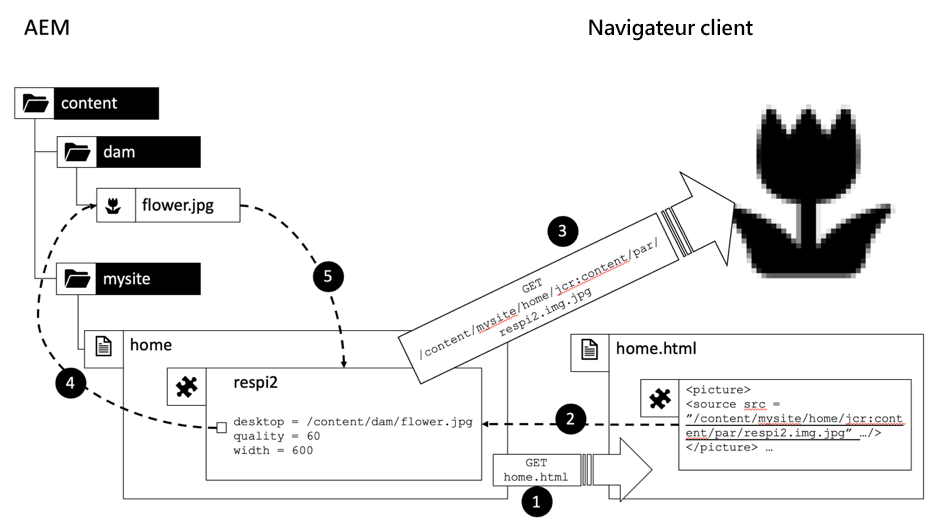

Le modèle de spouleur empêche le problème d&#39;exposer une API dont nous avons parlé dans le dernier chapitre. Les propriétés sont stockées et encapsulées dans le composant. Tout ce dont nous avons besoin pour accéder à ces propriétés est le chemin d&#39;accès au composant. Il n’est pas nécessaire d’utiliser l’URL comme véhicule pour transmettre les paramètres entre le balisage et le rendu binaire :

1. Le client effectue le rendu des balises HTML lorsque le composant est demandé dans la boucle de demande Principale.

2. Le chemin d&#39;accès au composant sert de référence arrière à partir de l&#39;annotation vers le composant.

3. Le navigateur utilise cette référence arrière pour demander le fichier binaire

4. Lorsque la requête touche le composant, nous avons toutes les propriétés dans notre main pour redimensionner, compresser et spool les données binaires.

5. L’image est transmise par le composant au navigateur client.

Après tout, le modèle de spouleur n&#39;est pas si mauvais, c&#39;est pourquoi il est si populaire. S&#39;il n&#39;est que là où pas si lourd quand il s&#39;agit d&#39;invalidation de cache...

### Le spouleur inversé - Le meilleur des deux mondes ?

Cela nous amène à la question. Pourquoi ne pouvons-nous pas simplement avoir le meilleur des deux mondes ? La bonne encapsulation du modèle de spouleur et les propriétés de mise en cache agréables d&#39;une URL basée sur les ressources ?

Nous devons admettre que nous n&#39;avons pas vu ça dans un vrai projet en direct. Mais osons de toute façon faire une petite expérience de pensée - comme point de départ pour votre propre solution.

Nous appellerons ce modèle le &lt; a0/>spouleur inversé&#x200B;_._ Le spouleur inversé doit être basé sur la ressource d&#39;images, pour avoir toutes les propriétés d&#39;invalidation du cache sympa.

Mais il ne doit exposer aucun paramètre. Toutes les propriétés doivent être encapsulées dans le composant. Mais nous pouvons exposer le chemin des composants - comme une référence opaque aux propriétés.

Cela conduit à une URL sous la forme suivante :

`/content/dam/flower.respi3.content-mysite-home-jcrcontent-par-respi.jpg`

`/content/dam/flower` est le chemin d’accès à la ressource de l’image.

`.respi3` est un sélecteur permettant de sélectionner la servlet appropriée pour diffuser l’image.

`.content-mysite-home-jcrcontent-par-respi` est un sélecteur supplémentaire. Il code le chemin d’accès au composant qui stocke la propriété nécessaire à la transformation de l’image. Les sélecteurs sont limités à une plage de caractères inférieure à celle des chemins. Le schéma de codage ici est juste exemplaire. Il remplace &quot;/&quot; par &quot;-&quot;. Il n&#39;est pas tenu compte du fait que le chemin lui-même peut également contenir &quot;-&quot;. Un système de codage plus sophistiqué serait conseillé dans un exemple concret. Base64 devrait être ok. Mais cela rend le débogage un peu plus difficile.

`.jpg` est le suffixe des fichiers

### Conclusion

Waouh... la discussion sur le spouleur est devenue plus longue et plus compliquée que prévu. Nous vous devons une excuse. Mais nous avons estimé qu&#39;il était nécessaire de vous présenter une multitude d&#39;aspects - bons et mauvais - pour que vous puissiez développer une certaine intuition sur ce qui fonctionne bien dans Dispatcher-land et ce qui ne fonctionne pas.

## Statfile et Statfile-Level

### Principes élémentaires

#### Présentation

Nous avons déjà brièvement mentionné le _fichier_état_ précédemment. Il est lié à l’invalidation automatique :

Tous les fichiers de cache du système de fichiers du répartiteur configurés pour être automatiquement invalidés sont considérés comme non valides si leur date de dernière modification est antérieure à la date de dernière modification `statfile's`.

>[!NOTE]
>
>La dernière date de modification dont nous parlons est le fichier mis en cache, c&#39;est la date à laquelle le fichier a été demandé au navigateur du client et finalement créé dans le système de fichiers. Il ne s&#39;agit pas de la date `jcr:lastModified` de la ressource.

La date de dernière modification du fichier d&#39;état (`.stat`) est la date à laquelle la demande d&#39;invalidation de l&#39;AEM a été reçue sur le Répartiteur.

Si vous avez plusieurs Répartiteurs, cela peut avoir des effets étranges. Votre navigateur peut avoir une version plus récente de Répartiteurs (si vous avez plusieurs Répartiteurs). Ou un Répartiteur peut penser que la version du navigateur qui a été émise par l&#39;autre Répartiteur est obsolète et envoie inutilement une nouvelle copie. Ces effets n&#39;ont pas d&#39;impact significatif sur les performances ou les exigences fonctionnelles. Et ils se stabiliseront au fil du temps, lorsque le navigateur aura la dernière version. Cependant, cela peut être un peu déroutant lorsque vous optimisez et déboguez le comportement de mise en cache du navigateur. Soyez donc avertis.

#### Configuration de domaines d&#39;invalidation avec /statfileslevel

Lorsque nous avons introduit l&#39;auto-invalidation et le fichier d&#39;état que nous avons dit, que *tous* fichiers sont considérés comme non valides en cas de modification et que tous les fichiers sont interdépendants de toute façon.

Ce n&#39;est pas tout à fait exact. En général, tous les fichiers qui partagent une racine de navigation principale commune sont interdépendants. Mais une instance AEM peut héberger un certain nombre de sites Web - *indépendants*. Ne pas partager une navigation commune - en fait, ne rien partager.

Ne serait-ce pas un gaspillage d&#39;invalider le site B parce qu&#39;il y a un changement dans le site A ? Oui, c&#39;est vrai. Et ça n&#39;a pas besoin d&#39;être comme ça.

Le répartiteur fournit un moyen simple de séparer les sites les uns des autres : Le `statfiles-level`.

Il s’agit d’un nombre qui définit à partir de quel niveau du système de fichiers se trouve deux sous-arbres considérés comme &quot;indépendants&quot;.

Examinons le cas par défaut où le niveau des états est 0.

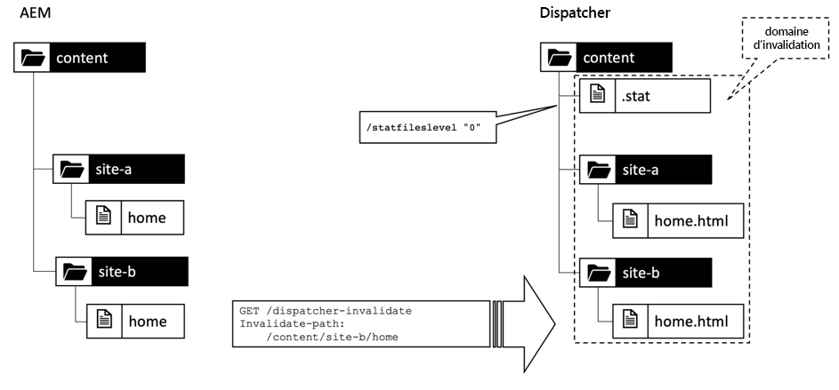

`/statfileslevel "0":` Le  `.stat` fichier est créé dans le dossier. Le domaine d’invalidation couvre toute l’installation, y compris tous les sites.

Quel que soit le fichier invalidé, le fichier `.stat` situé tout en haut du docroot des répartiteurs est toujours mis à jour. Ainsi, lorsque vous invalidez `/content/site-b/home`, tous les fichiers de `/content/site-a` sont également invalidés, car ils sont désormais plus anciens que le fichier `.stat` dans le docroot. Clairement pas ce dont vous avez besoin, lorsque vous invalidez `site-b`.

Dans cet exemple, vous préférez définir `statfileslevel` sur `1`.

Désormais, si vous publiez - et par conséquent invalidez `/content/site-b/home` ou toute autre ressource inférieure à `/content/site-b`, le fichier `.stat` est créé à `/content/site-b/`.

Le contenu ci-dessous `/content/site-a/` n’est pas affecté. Ce contenu serait comparé à un fichier `.stat` à `/content/site-a/`. Nous avons créé deux domaines d&#39;invalidation distincts.

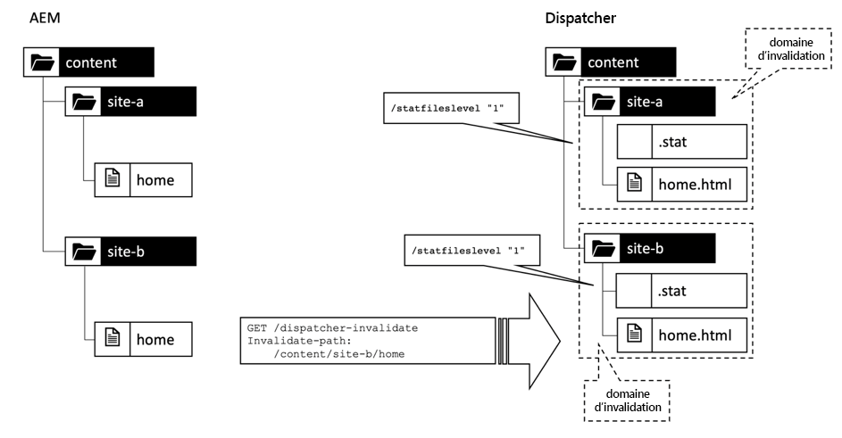

*Un niveau de fichier d’état &quot;1&quot; crée différents domaines d’invalidation.*

<br> 

Les grandes installations sont généralement structurées un peu plus complexes et plus profondes. Un schéma commun consiste à structurer les sites par marque, pays et langue. Dans ce cas, vous pouvez définir le niveau des états encore plus élevé. _1_ créerait des domaines d’invalidation par marque,  _2_ par pays et  _3_ par langue.

### Nécessité d&#39;une structure de site homogène

Le niveau des états est appliqué de manière égale à tous les sites de votre configuration. Il est donc nécessaire que tous les sites suivent la même structure et le même début au même niveau.

Pensez que votre portefeuille contient des marques qui ne sont vendues que sur quelques petits marchés tandis que d&#39;autres sont vendues dans le monde entier. Il se trouve que les petits marchés n&#39;ont qu&#39;une seule langue locale tandis que sur le marché mondial, il y a des pays où plusieurs langues sont parlées :

```plain
  /content/tiny-local-brand/finland/home
  /content/tiny-local-brand/finland/products
  /content/tiny-local-brand/finland/about
                              ^
                          /statfileslevel "2"
  …

  /content/tiny-local-brand/norway
  …

  /content/shiny-global-brand/canada/en
  /content/shiny-global-brand/canada/fr
  /content/shiny-global-brand/switzerland/fr
  /content/shiny-global-brand/switzerland/de
  /content/shiny-global-brand/switzerland/it
                                          ^
                                /statfileslevel "3"
  ..
```

La première exigerait un `statfileslevel` de _2_, tandis que la seconde exige _3_.

Pas une situation idéale. Si vous la définissez sur _3_, l&#39;invalidation automatique ne fonctionnerait pas dans les sites plus petits entre les sous-branches `/home`, `/products` et `/about`.

La définition de _2_ signifie que, dans les sites les plus volumineux, vous déclarez `/canada/en` et `/canada/fr` dépendants, ce qui n&#39;est peut-être pas le cas. Ainsi, chaque invalidation dans `/en` invaliderait également `/fr`. Cela entraînera une légère baisse du taux d’accès au cache, mais reste préférable à la diffusion de contenu obsolète en cache.

La meilleure solution, bien sûr, est de rendre les racines de tous les sites aussi profondes :

```
/content/tiny-local-brand/finland/fi/home
/content/tiny-local-brand/finland/fi/products
/content/tiny-local-brand/finland/fi/about
…
/content/tiny-local-brand/norway/no/home
                                 ^
                        /statfileslevel "3"
```

### Liens intersites

Quel est le bon niveau ? Cela dépend du nombre de dépendances que vous avez entre les sites. Les inclusions que vous résolvez pour le rendu d’une page sont considérées comme des &quot;dépendances dures&quot;. Nous avons démontré une telle _inclusion_ lorsque nous avons présenté le composant _Teaser_ au début de ce guide.

_Les_ hyperliens sont une forme plus souple de dépendances. Il est très probable que vous utilisiez des hyperliens dans un site Web... et il n&#39;est pas improbable que vous ayez des liens entre vos sites Web. Les hyperliens simples ne créent généralement pas de dépendances entre les sites Web. Pensez simplement à un lien externe que vous avez défini de votre site à facebook... Vous n&#39;auriez pas à rendre votre page si quelque chose change sur facebook et vice versa, n&#39;est-ce pas ?

Une dépendance survient lorsque vous lisez le contenu de la ressource liée (par exemple, le titre de navigation). De telles dépendances peuvent être évitées si vous vous contentez d’utiliser des titres de navigation entrés localement et ne les tracez pas à partir de la page de cible (comme vous le feriez avec les liens externes).

#### Une dépendance inattendue

Cependant, il peut y avoir une partie de votre configuration, où - soi-disant indépendant - les sites se réunissent. Regardons un scénario du monde réel que nous avons découvert dans l&#39;un de nos projets.

Le client avait une structure de site similaire à celle esquissée dans le dernier chapitre :

```
/content/brand/country/language
```

Par exemple,

```
/content/shiny-brand/switzerland/fr
/content/shiny-brand/switzerland/de

/content/shiny-brand/france/fr

/content/shiny-brand/germany/de
```

Chaque pays avait son propre domaine,

```
www.shiny-brand.ch

www.shiny-brand.fr

www.shiny-brand.de
```

Il n&#39;y avait aucun lien navigable entre les sites de langues et aucune inclusion apparente, nous avons donc défini le niveau de fichier stats à 3.

Tous les sites diffusaient en gros le même contenu. La seule différence majeure a été la langue.

Les moteurs de recherche comme Google considèrent que le même contenu sur différentes URL est &quot;trompeur&quot;. Un utilisateur peut tenter d’être classé plus haut ou plus souvent en créant des fermes proposant un contenu identique. Les moteurs de recherche reconnaissent ces tentatives et classent en fait les pages plus basses qui recyclent simplement le contenu.

Vous pouvez éviter d’être classé de bas niveau en rendant transparente, que vous avez en fait plusieurs pages avec le même contenu et que vous n’essayez pas de &quot;jouer&quot; au système (voir [&quot;Parlez à Google des versions localisées de votre page&quot;](https://support.google.com/webmasters/answer/189077?hl=en)) en définissant des balises `<link rel="alternate">` pour chaque page associée dans la section d’en-tête de chaque page :

```
# URL: www.shiny-brand.fr/fr/home/produits.html

<head>

  <link rel="alternate" 
        hreflang="fr-ch" 
        href="http://www.shiny-brand.ch/fr/home/produits.html">
  <link rel="alternate" 
        hreflang="de-ch" 
        href="http://www.shiny-brand.ch/de/home/produkte.html">
  <link rel="alternate" 
        hreflang="de-de" 
        href="http://www.shiny-brand.de/de/home/produkte.html">

</head>

----

# URL www.shiny-brand.de/de/home/produkte.html

<head>

  <link rel="alternate" 
        hreflang="fr-fr" 
        href="http://www.shiny-brand.fr/fr/home/produits.html">
  <link rel="alternate" 
        hreflang="fr-ch" 
        href="http://www.shiny-brand.ch/fr/home/produits.html">
  <link rel="alternate" 
        hreflang="de-ch"
         href="http://www.shiny-brand.ch/de/home/produits.html">

</head>
```


*Inter-relier tous*

<br> 

Certains experts de l&#39;optimisation du référencement prétendent même que cela pourrait transférer la réputation ou &quot;link-jus&quot; d&#39;un site web de haut niveau dans une langue vers le même site web dans une autre langue.

Ce système a créé non seulement un certain nombre de liens mais aussi quelques problèmes. Le nombre de liens requis pour _p_ en _n_ langues est _p x (n<sup>2</sup>-n)_ : Chaque page est liée à une autre page (_n x n_) sauf à elle-même (_-n_). Ce schéma est appliqué à chaque page. Si nous disposons d&#39;un petit site en 4 langues avec 20 pages, chacune correspond à des liens _240_.

Tout d&#39;abord, vous ne souhaitez pas qu&#39;un éditeur ait à gérer manuellement ces liens ; ils doivent être générés automatiquement par le système.

Deuxièmement, ils devraient être précis. Chaque fois que le système détecte un nouveau &quot;parent&quot;, vous souhaitez le lier à partir de toutes les autres pages avec le même contenu (mais dans une langue différente).

Dans notre projet, de nouvelles pages relatives apparaissaient fréquemment. Mais ils ne se sont pas matérialisés comme des liens &quot;alternatifs&quot;. Par exemple, lorsque la page `de-de/produkte` a été publiée sur le site Web allemand, elle n’était pas immédiatement visible sur les autres sites.

La raison était que dans notre configuration les sites étaient censés être indépendants. Un changement sur le site allemand n&#39;a donc pas déclenché une invalidation sur le site français.

Vous connaissez déjà une solution pour résoudre ce problème. Il vous suffit de réduire le niveau des états à 2 pour élargir le domaine d’invalidation. Bien sûr, cela diminue également le taux d&#39;accès au cache - en particulier lorsque des publications - et donc des invalidations surviennent plus fréquemment.

Dans notre cas, c&#39;était encore plus compliqué :

Bien que nous disposions du même contenu, les noms de marque ne sont pas identiques dans chaque pays.

`shiny-brand` a été appelé  `marque-brillant` en France et  `blitzmarke` en Allemagne :

```
/content/marque-brillant/france/fr
/content/shiny-brand/switzerland/fr
/content/shiny-brand/switzerland/de
/content/blitzmarke/germany/de
…
```

Cela aurait signifié de définir le niveau `statfiles` sur 1, ce qui aurait abouti à un domaine d&#39;invalidation trop important.

La restructuration du site aurait corrigé cela. Fusionner toutes les marques ensemble sous une seule racine commune. Mais nous n&#39;avions pas la capacité à l&#39;époque, et - cela nous aurait donné seulement un niveau 2.

Nous avons décidé de nous en tenir au niveau 3 et de payer le prix de ne pas toujours avoir des liens &quot;alternatifs&quot; à jour. Pour atténuer ce problème, nous avions une tâche de &quot;réécriture&quot; qui s&#39;exécutait sur le Répartiteur et qui nettoyait de toute façon les fichiers dont la date était plus d&#39;une semaine. Finalement, toutes les pages ont été de toute façon rendues à un moment donné. Mais c&#39;est un compromis qui doit être décidé individuellement dans chaque projet.

## Conclusion

Nous avons traité quelques principes de base sur la façon dont le Répartiteur fonctionne en général et nous vous avons donné quelques exemples où vous pourriez avoir à mettre un peu plus d&#39;effort de mise en oeuvre pour le faire correctement et où vous pourriez vouloir faire des compromis.

Nous n&#39;avons pas donné d&#39;informations détaillées sur la configuration dans le Répartiteur. Nous voulions que vous compreniez d&#39;abord les concepts de base et les problèmes, sans vous perdre trop tôt dans la console. Et - le travail de configuration réel est bien documenté - si vous comprenez les concepts de base, vous devriez savoir à quoi les différents commutateurs sont utilisés.

## Conseils et astuces sur le répartiteur

Nous conclurons la première partie de ce livre par une série aléatoire de conseils et de trucs qui pourraient être utiles dans une situation ou une autre. Comme nous l&#39;avons fait auparavant, nous ne présentons pas la solution, mais l&#39;idée pour que vous puissiez comprendre l&#39;idée, le concept et le lien vers des articles décrivant la configuration réelle de manière plus détaillée.

### Correction du minutage d’invalidation

Si vous installez un auteur AEM et une publication prêts à l’emploi, la topologie est un peu bizarre. L’auteur envoie simultanément le contenu aux systèmes de publication et la demande d’invalidation aux Répartiteurs. Comme les systèmes de publication et le répartiteur sont découplés de l’auteur par des files d’attente, le timing peut être un peu malheureux. Le répartiteur peut recevoir la demande d’invalidation de l’auteur avant que le contenu ne soit mis à jour sur le système de publication.

Si un client demande ce contenu entre-temps, le répartiteur demande et stocke le contenu obsolète.

Une configuration plus fiable envoie la demande d’invalidation des systèmes de publication _après avoir reçu le contenu_. L’article &quot;[Invalidation du cache du répartiteur à partir d’une instance de publication](https://helpx.adobe.com/experience-manager/dispatcher/using/page-invalidate.html#InvalidatingDispatcherCachefromaPublishingInstance)&quot; décrit les détails.

**Références**

[helpx.adobe.com - Invalidation du cache du répartiteur à partir d’une instance de publication](https://helpx.adobe.com/experience-manager/dispatcher/using/page-invalidate.html#InvalidatingDispatcherCachefromaPublishingInstance)

### Mise en cache des en-têtes et en-têtes HTTP

Auparavant, le Répartiteur ne stockait que des fichiers simples dans le système de fichiers. Si vous aviez besoin que des en-têtes HTTP soient distribués au client, vous l&#39;avez fait en configurant Apache en fonction des peu d&#39;informations que vous disposiez du fichier ou de l&#39;emplacement. Cela était particulièrement gênant lorsque vous implémentiez une application Web dans AEM qui dépendait fortement des en-têtes HTTP. Tout fonctionnait bien dans l&#39;instance AEM uniquement mais pas lorsque vous utilisiez un Répartiteur.

Habituellement, vous avez commencé à réappliquer les en-têtes manquants aux ressources du serveur Apache avec `mod_headers` en utilisant des informations que vous pourriez dériver par le chemin et le suffixe des ressources. Mais cela n&#39;a pas toujours été suffisant.

Ce qui est particulièrement gênant, c&#39;est que même avec le Répartiteur la première réponse _non mise en cache_ au navigateur provenait du système de publication avec une plage complète d&#39;en-têtes, tandis que les réponses suivantes étaient générées par le Répartiteur avec un ensemble limité d&#39;en-têtes.

À partir de Dispatcher 4.1.11, le Répartiteur peut stocker les en-têtes générés par les systèmes de publication.

Cela vous évite de dupliquer la logique d’en-tête dans le Répartiteur et libère toute la puissance expressive du HTTP et de l’AEM.

**Références**

* [helpx.adobe.com - Mise en cache des en-têtes de réponse](https://helpx.adobe.com/experience-manager/kb/dispatcher-cache-response-headers.html)

### Exceptions de mise en cache individuelles

Vous pouvez mettre en cache toutes les pages et images en général, mais vous pouvez faire exception dans certains cas. Par exemple, vous souhaitez mettre en cache des images PNG, mais pas des images PNG affichant une capture (qui doit changer à chaque requête). Le Répartiteur pourrait ne pas reconnaître un captcha comme un captcha... mais AEM l&#39;est certainement. Il peut demander au Répartiteur de ne pas mettre en cache cette requête en envoyant un en-tête conforme avec la réponse :

```plain
  response.setHeader("Dispatcher", "no-cache");

  response.setHeader("Cache-Control: no-cache");

  response.setHeader("Cache-Control: private");

  response.setHeader("Pragma: no-cache");
```

Cache-Control et Pragma sont des en-têtes HTTP officiels, propagés et interprétés par les couches de mise en cache supérieures, telles qu’un CDN. L&#39;en-tête `Dispatcher` n&#39;est qu&#39;un indice que le Répartiteur ne doit pas mettre en cache. Il peut être utilisé pour indiquer au Répartiteur de ne pas mettre en cache, tout en permettant aux calques de mise en cache supérieure de le faire. En fait, il est difficile de trouver un cas où cela pourrait être utile. Mais nous sommes sûrs qu&#39;il y en a, quelque part.

**Références**

* [Répartiteur - Aucun cache](https://helpx.adobe.com/experience-manager/kb/DispatcherNoCache.html)

### Mise en cache du navigateur

La réponse http la plus rapide est la réponse donnée par le navigateur lui-même. Lorsque la demande et la réponse n&#39;ont pas à passer d&#39;un réseau à un serveur Web à forte charge.

Vous pouvez aider le navigateur à décider quand demander au serveur une nouvelle version du fichier en définissant une date d&#39;expiration sur une ressource.

En général, vous faites cela de manière statique en utilisant `mod_expires` d&#39;Apache ou en stockant l&#39;en-tête Cache-Control et Expires qui vient d&#39;AEM si vous avez besoin d&#39;un contrôle plus individuel.

Un document mis en cache dans le navigateur peut comporter trois niveaux d’actualité.

1. _Garanti frais_  - Le navigateur peut utiliser le document mis en cache.

2. _Potentiellement obsolète_  : le navigateur doit d’abord demander au serveur si le document mis en cache est toujours à jour,

3. _Stale_  - Le navigateur doit demander au serveur une nouvelle version.

Le premier est garanti par la date d’expiration définie par le serveur. Si une ressource n&#39;est pas expirée, il n&#39;est pas nécessaire de demander de nouveau au serveur.

Si le document a atteint sa date d&#39;expiration, il peut encore être neuf. La date d’expiration est définie lors de la livraison du document. Mais souvent vous ne savez pas à l&#39;avance quand de nouveaux contenus sont disponibles - c&#39;est donc une estimation prudente.

Pour déterminer si le document dans le cache du navigateur est toujours identique à celui qui serait diffusé sur une nouvelle demande, le navigateur peut utiliser la date `Last-Modified` du document. Le navigateur demande au serveur :

&quot;_J&#39;ai une version du 10 juin... ai-je besoin d&#39;une mise à jour ?_&quot; Et le serveur peut répondre par

&quot;_304 - Votre version est toujours à jour_&quot; sans retransmettre la ressource, ou le serveur peut répondre par

&quot;_200 - voici une version plus récente_&quot; dans l&#39;en-tête HTTP et le contenu actuel plus récent dans le corps HTTP.

Pour que cette deuxième partie fonctionne, veillez à transmettre la date `Last-Modified` au navigateur afin qu’il dispose d’un point de référence pour demander des mises à jour.

Nous avons expliqué plus tôt que lorsque la date `Last-Modified` est générée par le répartiteur, elle peut varier selon les requêtes, car le fichier mis en cache - et sa date - est généré lorsque le fichier est demandé par le navigateur. Une alternative serait d’utiliser des &quot;e-tags&quot;, c’est-à-dire des nombres qui identifient le contenu réel (par exemple en générant un code de hachage) au lieu d’une date.

&quot;[Prise en charge des balises ](https://adobe-consulting-services.github.io/acs-aem-commons/features/etag/index.html)&quot; du _progiciel ACS Commons_ utilise cette approche. Mais cela a un prix : Comme la balise E doit être envoyée sous forme d&#39;en-tête, mais que le calcul du code de hachage nécessite la lecture complète de la réponse, celle-ci doit être entièrement mise en mémoire tampon dans la mémoire principale avant d&#39;être livrée. Cela peut avoir un impact négatif sur la latence lorsque votre site Web est plus susceptible d’avoir des ressources non mises en cache et, bien sûr, vous devez garder un oeil sur la mémoire consommée par votre système AEM.

Si vous utilisez des empreintes URL, vous pouvez définir des dates d’expiration très longues. Vous pouvez toujours mettre en cache les ressources empreintes digitales dans le navigateur. Une nouvelle version est marquée par une nouvelle URL et les versions plus anciennes n’ont jamais à être mises à jour.

Nous avons utilisé des empreintes URL quand nous avons introduit le modèle de spouleur. Les fichiers statiques provenant de `/etc/design` (CSS, JS) sont rarement modifiés, ce qui en fait également de bons candidats à l&#39;utilisation comme empreintes digitales.

Pour les fichiers ordinaires, nous configurons généralement un schéma fixe, comme la réanalyse du code HTML toutes les 30 minutes, des images toutes les 4 heures, etc.

La mise en cache du navigateur est extrêmement utile sur le système d’auteur. Vous souhaitez mettre en cache autant que possible dans le navigateur pour améliorer l’expérience de modification. Malheureusement, les ressources les plus coûteuses, les pages html ne peuvent pas être mises en cache... elles sont censées changer fréquemment sur l&#39;auteur.

Les bibliothèques de granit, qui constituent AEM interface utilisateur, peuvent être mises en cache pendant pas mal de temps. Vous pouvez également mettre en cache les fichiers statiques de vos sites (polices, CSS et JavaScript) dans le navigateur. Même les images de `/content/dam` peuvent généralement être mises en cache pendant environ 15 minutes, car elles ne sont pas modifiées aussi souvent que du texte copié sur les pages. Les images ne sont pas modifiées de manière interactive dans AEM. Ils sont d’abord modifiés et approuvés, avant d’être téléchargés vers AEM. Vous pouvez donc supposer qu’ils ne changent pas aussi souvent que du texte.

La mise en cache des fichiers d’interface utilisateur, des fichiers de bibliothèque de sites et des images peut accélérer considérablement le rechargement des pages lorsque vous êtes en mode d’édition.


**Références**

*[developer.mozilla.org - Mise en cache](https://developer.mozilla.org/en-US/docs/Web/HTTP/Caching)

* [apache.org - Expire Mod](https://httpd.apache.org/docs/current/mod/mod_expires.html)

* [ACS Commons - Prise en charge des balises Etag](https://adobe-consulting-services.github.io/acs-aem-commons/features/etag/index.html)

### Tronquer les URL

Vos ressources sont stockées sous

`/content/brand/country/language/…`

Mais bien sûr, il ne s&#39;agit pas de l&#39;URL que vous souhaitez afficher au client. Pour des raisons esthétiques, de lisibilité et d’optimisation du référencement, vous pouvez tronquer la pièce déjà représentée dans le nom de domaine.

Si vous avez un domaine

`www.shiny-brand.fi`

en général, il n&#39;est pas nécessaire de mettre la marque et le pays sur la voie. Au lieu de

`www.shiny-brand.fi/content/shiny-brand/finland/fi/home.html`

vous voudriez,

`www.shiny-brand.fi/home.html`

Vous devez implémenter cette mise en correspondance sur AEM, car AEM doit savoir comment rendre les liens selon ce format tronqué.

Mais ne comptez pas uniquement sur l&#39;AEM. Si vous le faites, vous aurez des chemins d’accès tels que `/home.html` dans le répertoire racine de votre cache. Est-ce là la &quot;maison&quot; pour le site web finlandais, allemand ou canadien ? Et s&#39;il y a un fichier `/home.html` dans le Répartiteur, comment le Répartiteur sait-il que cela doit être invalidé lorsqu&#39;une demande d&#39;invalidation de `/content/brand/fi/fi/home` arrive.

Nous avons vu un projet qui avait des docroots distincts pour chaque domaine. C&#39;était un cauchemar à déboguer et à entretenir - et en fait, nous ne l&#39;avons jamais vu fonctionner de manière impeccable.

Nous pourrions résoudre les problèmes en réstructurant le cache. Nous avions un point unique pour tous les domaines et les demandes d&#39;invalidation pouvaient être gérées 1:1 car tous les fichiers du serveur commençaient par `/content`.

La partie tronquée était aussi très facile.  AEM a généré des liens tronqués en raison d&#39;une configuration conforme dans `/etc/map`.

Désormais, lorsqu’une requête `/home.html` atteint le Répartiteur, la première chose qui se produit est d’appliquer une règle de réécriture qui développe le chemin en interne.

Cette règle a été configurée de manière statique dans chaque configuration de vhost. En bref, les règles ressemblaient à ça,

```plain
  # vhost www.shiny-brand.fi

  RewriteRule "^(.\*\.html)" "/content/shiny-brand/finland/fi/$1"
```

Dans le système de fichiers, nous avons maintenant des chemins simples basés sur `/content`, qui se trouvent également sur l&#39;auteur et la publication - ce qui a beaucoup aidé à déboguer. Sans parler de l&#39;invalidation correcte - ce n&#39;était plus un problème.

Notez que nous avons fait cela uniquement pour les URL &quot;visibles&quot;, URL qui s’affichent dans l’emplacement URL du navigateur. Les URL des images, par exemple, étaient toujours des URL &quot;/content&quot; pures. Nous pensons que embellir l&#39;URL &quot;principale&quot; est suffisant en termes d&#39;optimisation des moteurs de recherche.

Avoir un point commun a aussi une autre caractéristique intéressante. Quand quelque chose s&#39;est mal passé dans le Répartiteur, nous pouvions nettoyer tout le cache en exécutant,

`rm -rf /cache/dispatcher/*`

(ce que vous pouvez ne pas faire à des pics de charge élevés).

**Références**

* [apache.org - Mod Rewrite](https://httpd.apache.org/docs/2.4/mod/mod_rewrite.html)

* [helpx.adobe.com - Mappage des ressources](https://helpx.adobe.com/experience-manager/6-4/sites/deploying/using/resource-mapping.html)

### Gestion des erreurs

Dans AEM cours, vous apprenez à programme d’un gestionnaire d’erreurs dans Sling. Ce n&#39;est pas si différent de l&#39;écriture d&#39;un modèle habituel. Vous écrivez simplement un modèle dans JSP ou HTL, n&#39;est-ce pas ?

Oui - mais c&#39;est la partie AEM, seulement. Rappelez-vous : le répartiteur ne met pas en cache les réponses `404 – not found` ou `500 – internal server error`.

Si vous effectuez un rendu dynamique de ces pages pour chaque demande (ayant échoué), vous aurez une charge excessive inutile sur les systèmes de publication.

Ce que nous avons trouvé utile, c&#39;est de ne pas rendre la page d&#39;erreur complète lorsqu&#39;une erreur se produit, mais seulement une version très simplifiée et petite - même statique de cette page, sans aucun ornement ou logique.

Ce n&#39;est bien sûr pas ce que le client a vu. Dans le Répartiteur, nous nous sommes inscrits `ErrorDocuments` comme suit :

```
ErrorDocument 404 "/content/shiny-brand/fi/fi/edocs/error-404.html"
ErrorDocument 500 "/content/shiny-brand/fi/fi/edocs/error-500.html"
```

Le système d&#39;AEM pouvait simplement avertir le Répartiteur que quelque chose n&#39;allait pas, et le Répartiteur pouvait fournir une belle et brillante version du document d&#39;erreur.

Deux choses méritent d&#39;être notées ici.

Tout d&#39;abord, `error-404.html` est toujours la même page. Il n’existe donc aucun message personnel tel que &quot;Votre recherche de &quot;_produkten_&quot; n’a pas donné de résultat&quot;. Nous pourrions facilement vivre avec ça.

Deuxièmement.. Eh bien, si nous voyons une erreur de serveur interne - ou pire encore nous rencontrons une panne du système AEM, il n&#39;y a aucun moyen de demander à AEM de rendre une page d&#39;erreur, n&#39;est-ce pas ? La demande ultérieure nécessaire, telle que définie dans la directive `ErrorDocument`, échouerait également. Nous avons contourné ce problème en exécutant une tâche cron qui extrairait périodiquement les pages d&#39;erreur de leurs emplacements définis via `wget` et les stockait dans des emplacements de fichiers statiques définis dans la directive `ErrorDocuments`.

**Références**

* [apache.org - Documents d’erreur personnalisés](https://httpd.apache.org/docs/2.4/custom-error.html)

### Mise en cache du contenu protégé

Le répartiteur ne vérifie pas les autorisations lorsqu&#39;il fournit une ressource par défaut. Il est mis en oeuvre de la sorte exprès - pour accélérer votre site Web public. Si vous souhaitez protéger certaines ressources par une connexion, vous disposez en gros de trois options :

1. Protect la ressource avant que la requête n’atteigne le cache - c’est-à-dire par une passerelle SSO (authentification unique) devant le Répartiteur ou en tant que module dans le serveur Apache

2. Exclure les ressources sensibles de la mise en cache et, par conséquent, les diffuser en direct depuis le système de publication.

3. Utilisation de la mise en cache sensible aux autorisations dans le répartiteur

Et bien sûr, vous pouvez appliquer votre propre combinaison des trois approches.

**Option 1**. Une passerelle &quot;SSO&quot; peut de toute façon être appliquée par votre organisation. Si votre système d&#39;accès est très grossier, vous n&#39;aurez peut-être pas besoin de renseignements de l&#39;AEM pour décider si vous voulez accorder ou refuser l&#39;accès à une ressource.

>[!NOTE]
>
>Ce modèle requiert une _passerelle_ que _intercepte_ chaque requête et exécute l&#39;autorisation _réelle_ - qui accorde ou refuse les requêtes au Répartiteur. Si votre système d’authentification unique est un _authentificateur_, cela n’établit que l’identité d’un utilisateur que vous devez implémenter l’option 3. Si vous lisez des termes tels que &quot;SAML&quot; ou &quot;OAauth&quot; dans le manuel de votre système d’authentification unique, c’est un indicateur puissant que vous devez implémenter l’option 3.


**Option 2**. &quot;Ne pas mettre en cache&quot; est généralement une mauvaise idée. Si vous optez pour cette méthode, assurez-vous que le trafic et le nombre de ressources sensibles qui sont exclues sont faibles. Ou assurez-vous que le système de publication dispose d’un cache en mémoire pour que les systèmes de publication puissent gérer la charge qui en résulte - plus à ce sujet dans la partie III de cette série.

**Option 3**. &quot;Mise en cache sensible aux autorisations&quot; est une approche intéressante. Le Répartiteur met en cache une ressource, mais avant de la distribuer, il demande au système AEM s&#39;il le peut. Cela crée une requête supplémentaire du répartiteur vers la publication, mais évite généralement au système de publication de restituer à nouveau une page si elle est déjà mise en cache. Cependant, cette approche nécessite une mise en oeuvre personnalisée. Pour plus d&#39;informations, reportez-vous à l&#39;article [Mise en cache sensible aux autorisations](https://helpx.adobe.com/experience-manager/dispatcher/using/permissions-cache.html).

**Références**

* [helpx.adobe.com - Mise en cache sensible aux autorisations](https://helpx.adobe.com/experience-manager/dispatcher/using/permissions-cache.html)

### Définition de la période de grâce

Si vous êtes souvent invalidé en peu de suite - par exemple, par une activation d&#39;arbre ou simplement par nécessité de garder votre contenu à jour, il peut arriver que vous videz constamment le cache et que vos visiteurs touchent presque toujours un cache vide.

Le diagramme ci-dessous illustre un timing possible lors de l’accès à une seule page.  Bien sûr, le problème s&#39;aggrave lorsque le nombre de pages demandées augmente.

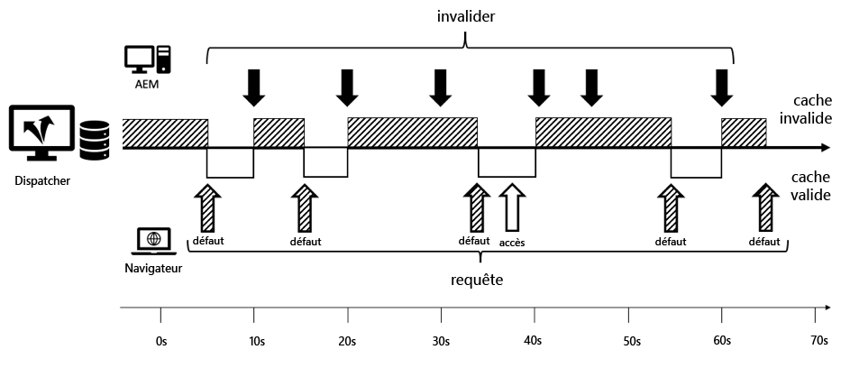

*Activations fréquentes conduisant à un cache non valide la plupart du temps*

<br> 

Pour atténuer le problème de cette &quot;tempête d&#39;invalidation de cache&quot; comme on l&#39;appelle parfois, vous pouvez être moins rigoureux sur l&#39;interprétation de `statfile`.

Vous pouvez définir le Répartiteur pour qu’il utilise `grace period` pour l’invalidation automatique. Cela ajouterait en interne un peu de temps supplémentaire à la date de modification `statfiles`.

Supposons que votre `statfile` a une heure de modification d&#39;aujourd&#39;hui à 12h00 et que votre `gracePeriod` soit définie sur 2 minutes. Ensuite, tous les fichiers auto-invalidés seront considérés comme valides à 12h01 et à 12h02. Ils seront rendus à nouveau après 12h02.

La configuration de référence propose un `gracePeriod` de deux minutes pour une bonne raison. Vous pourriez penser &quot;Deux minutes ? C&#39;est presque rien. Je peux facilement attendre 10 minutes pour que le contenu s&#39;affiche...&quot;.  Vous pourriez donc être tenté de définir une période plus longue - disons 10 minutes, en supposant que votre contenu s&#39;affiche au moins après ces 10 minutes.

>[!WARNING]
>
>`gracePeriod` ne fonctionne pas ainsi. La période de grâce est _non_ le moment après lequel un document est garanti invalidé, mais une période n&#39;est pas invalidée. Chaque invalidation subséquente qui se trouve dans ce cadre _prolonge_ la période, ce qui peut être indéfiniment long.

Examinons comment `gracePeriod` fonctionne réellement avec un exemple :

Supposons que vous gérez un site multimédia et que votre équipe de rédaction fournit régulièrement des mises à jour de contenu toutes les 5 minutes. Pensez à définir la période de grâce sur 5 minutes.

Nous allons début avec un exemple rapide à 12h00.

12:00 - Statfile a la valeur 12:00. Tous les fichiers mis en cache sont considérés comme valides jusqu’à 12h05.

12:01 - Une invalidation se produit. Ceci prolonge la période de grillage jusqu’à 12h06.

12:05 - Un autre éditeur publie son article - prolongeant le temps de grâce par une autre période de grâce à 12:10.

Et ainsi de suite... le contenu n&#39;est jamais invalidé. Chaque invalidation *dans* la période de grâce prolonge efficacement le délai de grâce. Le `gracePeriod` est conçu pour résister à la tempête d&#39;invalidation... mais vous devez sortir par la pluie... donc, garder le `gracePeriod` considérablement court pour éviter de vous cacher à jamais dans l&#39;abri.

#### Une période de grâce déterministe

Nous aimerions vous présenter une autre idée de la façon dont vous pourriez traverser une tempête d&#39;invalidation. Ce n&#39;est qu&#39;une idée. Nous ne l&#39;avons pas essayé en production, mais nous avons trouvé le concept assez intéressant pour partager l&#39;idée avec vous.

`gracePeriod` peut devenir inéluctablement long si votre intervalle de réplication régulier est plus court que votre `gracePeriod`.

L&#39;autre idée est la suivante : Invalider uniquement dans des intervalles de temps fixes. Le délai entre les deux signifie toujours la diffusion de contenu obsolète. L’invalidation arrivera un jour, mais un certain nombre d’invalidations sont collectées pour une invalidation &quot;en masse&quot;, de sorte que le Répartiteur a la possibilité de diffuser du contenu mis en cache entre-temps et de donner un peu d’air au système de publication.

La mise en oeuvre se présenterait comme suit :

Vous utilisez un &quot;script d’invalidation personnalisé&quot; (voir référence) qui s’exécuterait après l’invalidation. Ce script lit la date de la dernière modification `statfile's` et l&#39;arrondit à l&#39;intervalle suivant. La commande Unix shell `touch --time`, vous permet de spécifier une heure.

Par exemple, si vous définissez la période de grâce sur 30 secondes, le Répartiteur arrondit la date de la dernière modification du fichier d’état aux 30 secondes suivantes. Les demandes d&#39;invalidation qui se produisent entre les deux ne font que définir le même 30 sec complet suivant.

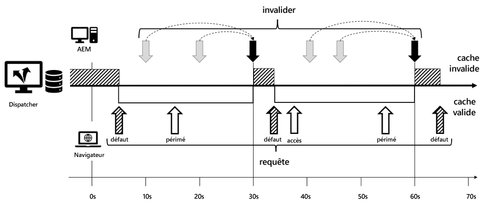

*Le report de l’invalidation à la 30 seconde complète suivante augmente le taux d’accès.*

<br> 

Les accès au cache qui surviennent entre la demande d&#39;invalidation et l&#39;emplacement tour suivant de 30 s sont alors considérés comme obsolètes ; Il y a eu une mise à jour sur Publier, mais le Répartiteur diffuse toujours un contenu ancien.

Cette approche pourrait aider à définir des périodes de grâce plus longues sans avoir à craindre que les demandes ultérieures prolongent la période de manière indéterministe. Bien que, comme nous l&#39;avons déjà dit, ce n&#39;est qu&#39;une idée et nous n&#39;avons pas eu la chance de la tester.

**Références**

[helpx.adobe.com - Configuration du répartiteur](https://helpx.adobe.com/experience-manager/dispatcher/using/dispatcher-configuration.html)

### Récupération automatique

Votre site a un modèle d&#39;accès très particulier. Vous avez une charge importante de trafic entrant et la majeure partie du trafic est concentrée sur une petite fraction de vos pages. La page d&#39;accueil, vos landings page de campagne et vos pages de détails sur les produits les plus phare reçoivent 90 % du trafic. Ou si vous exploitez un nouveau site, les articles les plus récents ont un trafic plus élevé que les articles plus anciens.

Désormais, ces pages sont très probablement mises en cache dans le répartiteur, car elles sont demandées si fréquemment.

Une demande d’invalidation arbitraire est envoyée au répartiteur, ce qui entraîne l’invalidation de toutes les pages, y compris la plus populaire une fois,.

Par la suite, comme ces pages sont si populaires, de nouvelles requêtes entrantes proviennent de différents navigateurs. Prenons la page d&#39;accueil comme exemple.

Comme le cache n’est plus valide, toutes les requêtes envoyées à la page d&#39;accueil en même temps sont transférées au système de publication, ce qui génère une charge élevée.

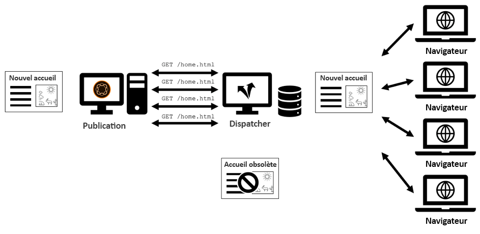

*Demandes parallèles à la même ressource sur le cache vide : Les requêtes sont transférées à la publication*

Avec la récupération automatique, vous pouvez atténuer cela dans une certaine mesure. La plupart des pages invalidées sont toujours physiquement stockées sur le répartiteur après l’invalidation automatique. Ils sont seulement _considérés_ obsolètes. _La_ récupération automatique signifie que vous conservez ces pages obsolètes pendant quelques secondes tout en lançant  _une demande_ unique au système de publication pour récupérer à nouveau le contenu obsolète :

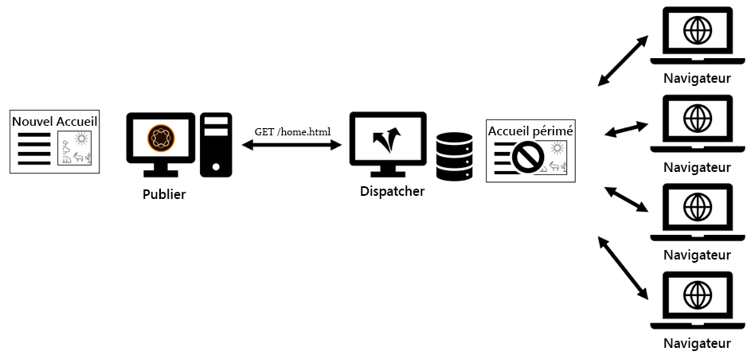

*Diffusion de contenu obsolète lors de la récupération en arrière-plan*

<br> 

Pour activer la récupération à nouveau, vous devez indiquer au Répartiteur les ressources à récupérer après une invalidation automatique. N&#39;oubliez pas que toute page que vous activez invalide automatiquement toutes les autres pages, y compris les plus populaires.

Rerécupérer signifie en fait informer le Répartiteur dans chaque (!) demande d’invalidation pour récupérer les plus populaires - et les plus populaires.

Pour ce faire, vous devez placer une liste d’URL de ressources (URL réelles - et pas seulement chemins) dans le corps des requêtes d’invalidation :

```
POST /dispatcher/invalidate.cache HTTP/1.1

CQ-Action: Activate
CQ-Handle: /content/my-brand/home/path/to/some/resource
Content-Type: Text/Plain
Content-Length: 207

/content/my-brand/home.html
/content/my-brand/campaigns/landing-page-1.html
/content/my-brand/campaigns/landing-page-2.html
/content/my-brand/products/product-1.html
/content/my-brand/products/product-2.html
```

Lorsque le répartiteur voit une telle demande, elle déclenche l’invalidation automatique comme d’habitude et met immédiatement en file d’attente les demandes pour récupérer du contenu neuf à partir du système de publication.

Comme nous utilisons maintenant un corps de requête, nous devons également définir le type de contenu et la longueur du contenu selon la norme HTTP.

Le répartiteur marque également les URL en fonction en interne afin qu’il sache qu’il peut fournir ces ressources directement, même si elles sont considérées comme non valides par l’invalidation automatique.

Toutes les URL répertoriées sont demandées une par une. Ainsi, vous n’avez pas besoin de vous inquiéter de la création d’une charge trop élevée sur les systèmes de publication. Mais vous ne voudriez pas mettre trop d&#39;URL dans cette liste non plus. En fin de compte, la file d&#39;attente doit être traitée dans un délai limité pour ne pas diffuser trop longtemps de contenu obsolète. Il vous suffit d&#39;inclure vos 10 pages les plus consultées.

Si vous cherchez dans le répertoire cache de votre répartiteur, vous verrez des fichiers temporaires marqués d’horodatages. Il s’agit des fichiers actuellement chargés en arrière-plan.

**Références**

[helpx.adobe.com - Invalidation des pages mises en cache à partir d’AEM](https://helpx.adobe.com/experience-manager/dispatcher/using/page-invalidate.html)

### Protection du système de publication

Le répartiteur offre un peu de sécurité supplémentaire en protégeant le système de publication des requêtes qui ne sont destinées qu’à des fins de maintenance. Par exemple, vous ne souhaitez pas exposer au public les URL `/crx/de` ou `/system/console`.

Il n&#39;est pas dangereux d&#39;avoir un pare-feu d&#39;application Web (WAF) installé sur votre système. Mais cela ajoute un nombre important à votre budget et tous les projets ne sont pas dans une situation où ils peuvent se permettre et - ne l&#39;oubliez pas - opérer et maintenir un WAF.

Ce que nous voyons souvent, c&#39;est un ensemble de règles Apache réécrites dans la configuration du répartiteur qui empêchent l&#39;accès aux ressources les plus vulnérables.

Mais vous pouvez aussi envisager une approche différente :

Selon la configuration du répartiteur, le module Répartiteur est lié à un certain répertoire :

```
<Directory />
  SetHandler dispatcher-handler
  …
</Directory>
```

Mais pourquoi lier le gestionnaire au docroot entier, quand vous devez filtrer par la suite ?

Vous pouvez d’abord affiner la liaison du gestionnaire. `SetHandler` il suffit de lier un gestionnaire à un répertoire pour le lier à une URL ou à un modèle d’URL :

```
<LocationMatch "^(/content|/etc/design|/dispatcher/invalidate.cache)/.\*">
  SetHandler dispatcher-handler
</LocationMatch>

<LocationMatch "^/dispatcher/invalidate.cache">
  SetHandler dispatcher-handler
</LocationMatch>

…
```

Si vous faites cela, n&#39;oubliez pas de toujours lier le répartiteur-gestionnaire à l&#39;URL d&#39;invalidation du répartiteur - sinon vous ne pourrez pas envoyer de demandes d&#39;invalidation de l&#39;AEM au Répartiteur.

Une autre alternative à l&#39;utilisation du répartiteur comme filtre consiste à configurer les directives de filtrage dans le `dispatcher.any`

```
/filter {
  /0001  { /glob "\*" /type "deny" }
  /0002  { /type "allow"  /url "/content\*"  }
```

Nous n&#39;imposons pas l&#39;utilisation d&#39;une directive plutôt que de l&#39;autre, mais nous recommandons plutôt une combinaison appropriée de toutes les directives.

Mais nous proposons que vous envisagiez de réduire l&#39;espace URL le plus tôt possible dans la chaîne, autant que vous le souhaitez, et ce de la manière la plus simple possible. Gardez à l&#39;esprit que ces techniques ne remplacent pas un WAF sur des sites Web très sensibles. Certains appellent ces techniques &quot;le pare-feu du pauvre&quot; - pour une raison.

**Références**

[apache.org- directive sethandler](https://httpd.apache.org/docs/2.4/mod/core.html#sethandler)

[helpx.adobe.com - Configuration de l’accès au filtre de contenu](https://helpx.adobe.com/experience-manager/dispatcher/using/dispatcher-configuration.html#ConfiguringAccesstoContentfilter)

### Filtrage à l’aide d’Expressions régulières et de Globales

Dans les premiers temps, vous ne pouviez utiliser que des &quot;globs&quot; - des espaces réservés simples pour définir des filtres dans la configuration du répartiteur.

Heureusement, cela a changé dans les versions ultérieures du Répartiteur. Vous pouvez désormais utiliser des expressions régulières POSIX et accéder à diverses parties d&#39;une requête pour définir un filtre. Pour quelqu&#39;un qui vient de commencer avec le Répartiteur qui pourrait être considéré comme acquis. Mais si vous avez l&#39;habitude d&#39;avoir seulement des globes, c&#39;est une sorte de surprise et on peut facilement l&#39;ignorer. En plus de la syntaxe des globs et des regexes est tout simplement trop similaire. Comparons deux versions qui font de même :

```
# Version A

/filter {
  /0001  { /glob "\*" /type "deny" }
  /0002  { /type "allow"  /url "/content\*"  }

# Version B

/filter {
  /0001  { /glob "\*" /type "deny" }
  /0002  { /type "allow"  /url '/content.\*'  }
```

Vous voyez la différence ?

La version B utilise des guillemets simples `'` pour marquer un modèle d&#39;expression _normal_. &quot;N&#39;importe quel caractère&quot; est exprimé en utilisant `.*`.

_Les modèles_ de Globbing, en revanche, utilisent des guillemets de doublon  `"` et vous ne pouvez utiliser que de simples espaces réservés comme  `*`les autres.

Si vous connaissez cette différence, c&#39;est trivial - mais si ce n&#39;est pas le cas, vous pouvez facilement mélanger les citations et passer un après-midi ensoleillé à déboguer votre configuration. Maintenant vous êtes prévenus.

&quot;Je reconnais `'/url'` dans la configuration ... Mais qu&#39;est-ce que `'/glob'` dans le filtre que vous pouvez demander ?

Cette directive représente l&#39;ensemble de la chaîne de requête, y compris la méthode et le chemin. Il pourrait être

`"GET /content/foo/bar.html HTTP/1.1"`

il s&#39;agit de la chaîne par rapport à laquelle votre modèle est comparé. Les débutants ont tendance à oublier la première partie, la `method` (GET, POST, ...). Donc, un modèle

`/0002  { /glob "/content/\*" /type "allow" }`

échouerait toujours, car &quot;/content&quot; ne correspond pas à &quot;GET&quot;. de la demande.

Donc, quand vous voulez utiliser Globs,

`/0002  { /glob "GET /content/\*" /type "allow" }`

aurait raison.

Pour une règle de refus initiale, comme

`/0001  { /glob "\*" /type "deny" }`

tout va bien. Cependant, pour les autorisations suivantes, il est plus expressif et plus sûr d&#39;utiliser les parties d&#39;une requête :

```
/method
/url
/path
/selector
/extension
/suffix
```

Comme si :

```
/005  {

  /type "allow"
  /method "GET"
  /extension '(css|gif|ico|js|png|swf|jpe?g)' }
```

Notez que vous pouvez mélanger des expressions regex et glob dans une règle.

Un dernier mot sur les &quot;numéros de ligne&quot;, comme `/005` devant chaque définition,

Ils n&#39;ont aucun sens ! Vous pouvez choisir des dénominateurs arbitraires pour les règles. L&#39;utilisation des chiffres ne nécessite pas beaucoup d&#39;efforts pour penser à un schéma, mais gardez à l&#39;esprit que l&#39;ordre est important.

Si vous avez des centaines de règles de ce type :

```
/001
/002
/003
…
/100
…
```

et vous voulez insérer un entre /001 et /002 que se passe-t-il avec les numéros suivants ? Augmentez-vous leur nombre ? Insérez-vous des nombres intermédiaires ?

```
/001
/001a
/002
/003
…
/100
…
```

Ou que se passe-t-il si vous changez l&#39;ordre /003 et /001 changez-vous les noms et leurs identités ou êtes-vous

```
/003
/002
/001
…
/100
…
```

La numérotation, tout en semblant un choix simple en premier lieu, atteint ses limites à long terme. Soyons honnêtes, choisir des nombres comme identifiants est de toute façon un mauvais style de programmation.

Nous voudrions proposer une approche différente : Il est probable que vous ne trouverez pas d’identifiants significatifs pour chaque règle de filtre individuelle. Mais ils ont probablement un but plus important, et peuvent donc être regroupés d&#39;une manière ou d&#39;une autre selon ce but. Par exemple, &quot;configuration de base&quot;, &quot;exceptions spécifiques à l’application&quot;, &quot;exceptions globales&quot; et &quot;sécurité&quot;.

Vous pouvez ensuite nommer et regrouper les règles en conséquence et fournir au lecteur de la configuration (votre cher collègue), une certaine orientation dans le fichier :

```plain
  # basic setup:

  /filter {

    # basic setup

    /basic_01  { /glob "\*"             /type "deny"  }
    /basic_02  { /glob "/content/\*"    /type "allow" }
    /basic_03  { /glob "/etc/design/\*" /type "allow" }

    /basic_04  { /extension '(json|xml)'  /type "deny"  }
    …


    # login

    /login_01 { /glob "/api/myapp/login/\*" /type "allow" }
    /login_02 { … }

    # global exceptions

    /global_01 { /method "POST" /url '.\*contact-form.html' }
```


Il est probable que vous ajouterez une nouvelle règle à l&#39;un des groupes - ou même que vous créerez un nouveau groupe. Dans ce cas, le nombre d’éléments à renommer/renuméroter est limité à ce groupe.

>[!WARNING]
>
>Les configurations plus sophistiquées divisent les règles de filtrage en plusieurs fichiers, qui sont inclus dans le fichier de configuration principal `dispatcher.any`. Un nouveau fichier n&#39;introduit toutefois pas un nouvel espace de nommage. Ainsi, si vous avez une règle &quot;001&quot; dans un fichier et &quot;001&quot; dans un autre, vous obtiendrez une erreur. Encore plus de raisons de trouver des noms sémantiquement forts.

**Références**

[helpx.adobe.com - Création de modèles pour les propriétés glob](https://helpx.adobe.com/experience-manager/dispatcher/using/dispatcher-configuration.html#DesigningPatternsforglobProperties)

### Spécification du protocole

Le dernier pourboire n&#39;est pas un vrai pourboire, mais nous avons senti que ça valait la peine de le partager avec vous de toute façon.

Dans la plupart des cas, AEM et le répartiteur fonctionnent à l&#39;improviste. Par conséquent, vous ne trouverez pas de spécification complète du protocole Dispatcher sur le protocole d&#39;invalidation pour créer votre propre application. L&#39;information est publique, mais un peu éparpillée sur un certain nombre de ressources.

Nous essayons de combler le vide dans une certaine mesure ici. Voici à quoi ressemble une requête d’invalidation :

```
POST /dispatcher/invalidate.cache HTTP/1.1
CQ-Action: <action>
CQ-Handle: <path-pattern>
[CQ-Action-Scope]
[Content-Type: Text/Plain]
[Content-Length: <bytes in request body>]

<newline>

<refetch-url-1>
<refetch-url-2>

…

<refetch-url-n>
```

`POST /dispatcher/invalidate.cache HTTP/1.1` - La première ligne est l&#39;URL du point de terminaison du contrôle Répartiteur et il est probable que vous ne la modifiez pas.

`CQ-Action: <action>` - Ce qui devrait se passer. `<action>` est :

* `Activate:` supprime  `/path-pattern.*`
* `Deactive:` supprimer  `/path-pattern.*`
ET supprimer  `/path-pattern/*`
* `Delete:`   supprimer  `/path-pattern.*`
ET supprimer 
`/path-pattern/*`
* `Test:`   Retourner &quot;ok&quot; mais ne rien faire

`CQ-Handle: <path-pattern>` - Le chemin d&#39;accès de la ressource de contenu à invalider. Remarque : `<path-pattern>` est en fait un &quot;chemin&quot; et non un &quot;modèle&quot;.

`CQ-Action-Scope: ResourceOnly` - Facultatif : Si cet en-tête est défini, le  `.stat` fichier n’est pas touché.

```
[Content-Type: Text/Plain]
[Content-Length: <bytes in request body>]
```

Définissez ces en-têtes si vous définissez une liste d’URL de récupération automatique. `<bytes in request body>` est le nombre de caractères dans le corps HTTP

`<newline>` - Si vous disposez d’un corps de requête, il doit être séparé de l’en-tête par une ligne vide.

```
<refetch-url-1>
<refetch-url-2>
…
<refetch-url-n>
```

Liste des URL que vous souhaitez récupérer immédiatement après l’invalidation.

## Ressources supplémentaires

Présentation et présentation de la mise en cache du répartiteur : [https://helpx.adobe.com/experience-manager/dispatcher/using/dispatcher.html](https://helpx.adobe.com/experience-manager/dispatcher/using/dispatcher.html)

Autres conseils et astuces d’optimisation : [https://helpx.adobe.com/experience-manager/kb/optimizing-the-dispatcher-cache.html#use-ttls](https://helpx.adobe.com/experience-manager/kb/optimizing-the-dispatcher-cache.html#use-ttls)

Documentation du répartiteur avec toutes les directives expliquées : [https://helpx.adobe.com/experience-manager/dispatcher/using/dispatcher-configuration.html](https://helpx.adobe.com/experience-manager/dispatcher/using/dispatcher-configuration.html)

Quelques questions fréquentes : [https://helpx.adobe.com/experience-manager/using/dispatcher-faq.html](https://helpx.adobe.com/experience-manager/using/dispatcher-faq.html)

Enregistrement d&#39;un webinaire sur l&#39;optimisation du répartiteur - fortement recommandé : [https://my.adobeconnect.com/p7th2gf8k43?proto=true](https://my.adobeconnect.com/p7th2gf8k43?proto=true)

Présentation &quot;Le pouvoir sous-estimé de l&#39;invalidation du contenu&quot;, conférence &quot;adaptTo()&quot; à Potsdam 2018 [https://adapt.to/2018/en/schedule/the-underappreciated-power-of-content-invalidation.html](https://adapt.to/2018/en/schedule/the-underappreciated-power-of-content-invalidation.html)

Invalidation des pages mises en cache à partir des AEM : [https://helpx.adobe.com/experience-manager/dispatcher/using/page-invalidate.html](https://helpx.adobe.com/experience-manager/dispatcher/using/page-invalidate.html)

## Étape suivante

* [2 - Modèle d&#39;infrastructure](chapter-2.md)
