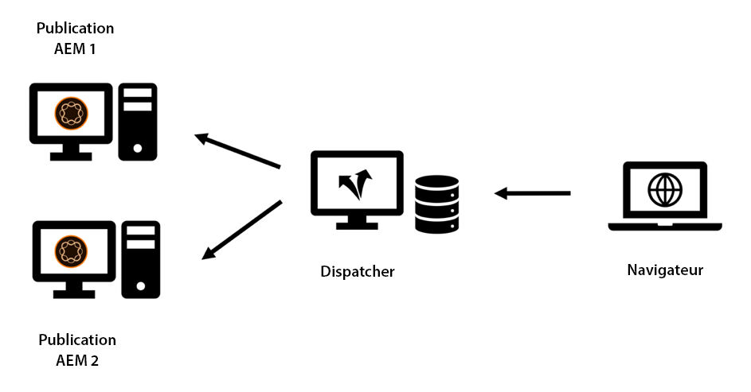
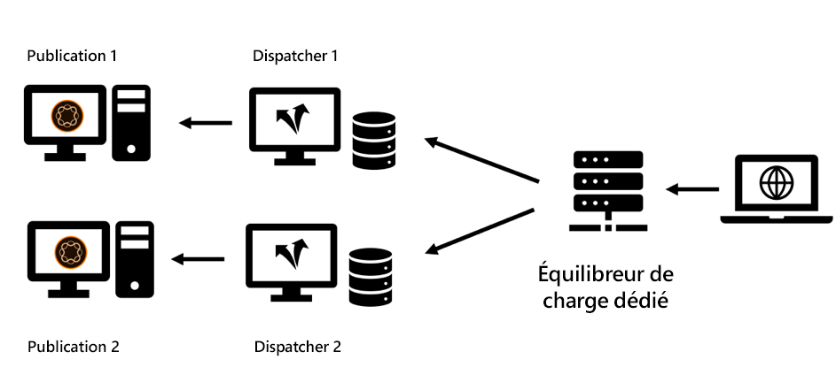
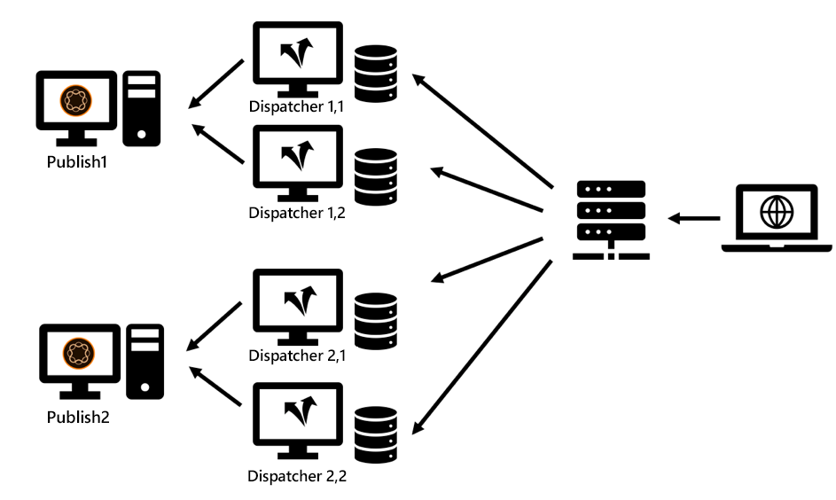
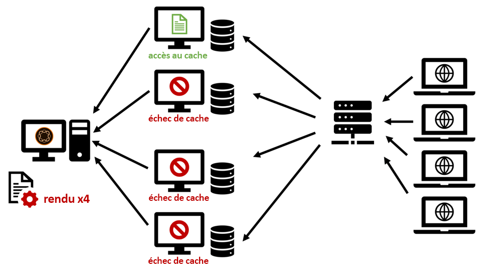
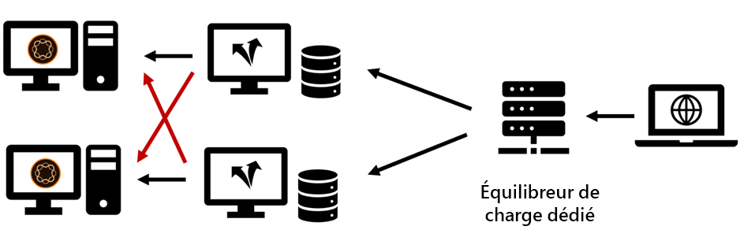

# Chapitre 2 - Infrastructure

## Configuration d&#39;une infrastructure de mise en cache

Nous avons introduit la topologie de base d’un système de publication et d’un répartiteur dans le chapitre 1 de cette série. Un ensemble de serveurs Publish et Dispatcher peut être configuré selon de nombreuses variantes, selon la charge attendue, la topologie de votre ou vos centres de données et les propriétés de basculement souhaitées.

Nous dessinerons les topologies les plus courantes et décrirons les avantages et les endroits où elles sont insuffisantes. La liste - bien sûr - ne peut jamais être complète. La seule limite est votre imagination.

### Configuration &quot;héritée&quot;

Dans les premiers temps, le nombre de visiteurs potentiels était faible, le matériel était cher et les serveurs web n&#39;étaient pas considérés comme aussi critiques qu&#39;ils le sont aujourd&#39;hui. Une configuration courante consistait à faire en sorte qu’un répartiteur serve d’équilibreur de charge et de cache devant deux systèmes de publication ou plus. Le serveur Apache au coeur du Répartiteur était très stable et - dans la plupart des cas - capable de répondre à un bon nombre de demandes.

*Configuration du répartiteur &quot;hérité&quot; - Pas très courante selon les normes actuelles*

  

C&#39;est à cet endroit que le répartiteur a reçu son nom : En gros, il envoyait des requêtes. Cette configuration n&#39;est plus très courante car elle ne répond plus aux exigences de performances et de stabilité les plus élevées requises aujourd&#39;hui.

### Configuration à plusieurs jambes

De nos jours, une topologie légèrement différente est plus courante. Une topologie à plusieurs pattes comporterait un répartiteur par serveur de publication. Un équilibreur de charge dédié (matériel) se trouve devant l&#39;infrastructure AEM qui répartit les requêtes sur ces deux (ou plusieurs) pattes :

*Configuration moderne du répartiteur &quot;standard&quot; - Facile à manipuler et à entretenir*

  

Voici les raisons de ce type de configuration :

1. En moyenne, les sites Web reçoivent beaucoup plus de trafic qu&#39;ils ne l&#39;ont fait dans le passé. Il est donc nécessaire de développer &quot;l&#39;infrastructure Apache&quot;.

2. La configuration &quot;héritée&quot; n’a pas fourni de redondance au niveau du répartiteur. Si le serveur Apache était inactif, tout le site Web était inatteignable.

3. Les serveurs Apache sont bon marché. Ils sont basés sur l&#39;open source et, étant donné que vous avez un centre de données virtuel, ils peuvent être configurés très rapidement.

4. Cette configuration permet d’effectuer facilement une mise à jour &quot;progressive&quot; ou &quot;échelonnée&quot;. Il vous suffit de fermer Dispatcher 1 lors de l’installation d’un nouveau pack de logiciels sur la publication 1. Lorsque l’installation est terminée et que vous avez suffisamment testé la publication 1 du réseau interne, vous nettoyez le cache sur Dispatcher 1 et le début de nouveau tout en supprimant Dispatcher 2 pour la maintenance de la publication 2.

5. L&#39;invalidation du cache devient très facile et déterministe dans cette configuration. Comme un seul système de publication est connecté à un répartiteur, il n’y a qu’un seul répartiteur à invalider. L&#39;ordre et le timing de l&#39;invalidation sont triviaux.

### Configuration de la mise à l’échelle

Les serveurs Apache sont bon marché et faciles à fournir, pourquoi ne pas pousser un peu plus à atteindre ce niveau. Pourquoi ne pas avoir plusieurs Répartiteurs devant chaque serveur de publication ?

*Configuration de la mise à l’échelle : comporte certaines zones d’application, mais aussi des restrictions et des avertissements.*

  

Tu peux absolument faire ça ! Et il y a beaucoup de scénarios d&#39;application valides pour cette configuration. Mais il y a aussi des limites et des complexités que vous devriez considérer.

#### Invalidation

Chaque système de publication est connecté à une multitude de Répartiteurs, chacun d’eux doit être invalidé lorsque le contenu a été modifié.

#### Maintenance

Il va sans dire que la configuration initiale des systèmes Répartiteur et Publication est un peu plus complexe. Mais gardez également à l&#39;esprit que l&#39;effort d&#39;une version &quot;mobile&quot; est aussi un peu plus important. aem systèmes peuvent et doivent être mis à jour pendant l’exécution. Mais il est sage de ne pas le faire pendant qu&#39;ils répondent activement aux demandes. En règle générale, vous ne souhaitez mettre à jour qu’une partie des systèmes de publication, tandis que les autres systèmes diffusent toujours activement le trafic, puis, après le test, basculez sur l’autre partie. Si vous avez de la chance et que vous pouvez accéder à l’équilibreur de charge dans votre processus de déploiement, vous pouvez désactiver le routage sur les serveurs en cours de maintenance ici. Si vous utilisez un équilibreur de charge partagé sans accès direct, vous préférez arrêter les répartiteurs de la publication que vous souhaitez mettre à jour. Plus il y en a, plus vous devrez fermer. S&#39;il y en a un grand nombre et que vous planifiez des mises à jour fréquentes, une automatisation est conseillée. Si vous n&#39;avez pas d&#39;outils d&#39;automatisation, la mise à l&#39;échelle est de toute façon une mauvaise idée.

Dans un projet précédent, nous avons utilisé une autre astuce pour supprimer un système de publication de l’équilibrage de charge sans avoir d’accès direct à l’équilibreur de charge lui-même.

L’équilibreur de charge &quot;pings&quot; (pings) est généralement une page spécifique pour déterminer si le serveur est en cours d’exécution. Un choix trivial consiste généralement à effectuer un ping sur la page d&#39;accueil. Mais si vous voulez utiliser le ping pour signaler à l&#39;équilibreur de charge de ne pas équilibrer le trafic, vous choisiriez autre chose. Vous créez un modèle ou une servlet dédié qui peut être configuré pour répondre avec `"up"` ou `"down"` (dans le corps ou en tant que code de réponse http). La réponse de cette page ne doit bien sûr pas être mise en cache dans le répartiteur. Elle est donc toujours récupérée de nouveau à partir du système de publication. Maintenant, si vous configurez l’équilibreur de charge pour vérifier ce modèle ou servlet, vous pouvez facilement laisser la publication &quot;prétendre&quot; qu’elle est hors service. Il ne ferait pas partie de l’équilibrage de charge et peut être mis à jour.

#### Distribution mondiale

&quot;Worldwide Distribution&quot; est une configuration &quot;Scale out&quot; où vous avez plusieurs Répartiteurs devant chaque système de publication - désormais répartis dans le monde entier pour être plus proches du client et offrir de meilleures performances. Bien sûr, dans ce scénario, vous n&#39;avez pas d&#39;équilibreur de charge central mais un schéma d&#39;équilibrage de charge basé sur DNS et géoIP.

>[!NOTE]
>
>En fait, vous construisez une sorte de réseau de distribution de contenu (CDN) avec cette approche - vous devriez donc envisager d&#39;acheter une solution CDN standard plutôt que de construire une solution vous-même. La création et la maintenance d&#39;un CDN personnalisé n&#39;est pas une tâche triviale.

#### Mise à l’échelle horizontale

Même dans un centre de données local, une topologie &quot;Scale Out&quot; avec plusieurs Répartiteurs devant chaque système de publication présente certains avantages. Si vous constatez des goulets d&#39;étranglement de performances sur les serveurs Apache en raison d&#39;un trafic élevé (et d&#39;un bon taux d&#39;accès au cache) et que vous ne pouvez plus augmenter la taille du matériel (en ajoutant des CPU, de la RAM et des disques plus rapides), vous pouvez augmenter les performances en ajoutant des répartiteurs. Il s’agit de la &quot;mise à l’échelle horizontale&quot;. Toutefois, cette opération comporte des limites, en particulier lorsque le trafic est souvent invalidé. Nous décrirons l&#39;effet dans la section suivante.

#### Limites de la topologie de mise à l’échelle

Ajouter des serveurs proxy devrait normalement augmenter les performances. Il existe toutefois des scénarios où l&#39;ajout de serveurs peut en fait réduire les performances. Comment ? Prenons l&#39;exemple d&#39;un portail d&#39;actualités, où vous présentez de nouveaux articles et pages chaque minute. Un Répartiteur invalide par &quot;auto-invalidation&quot; : Chaque fois qu’une page est publiée, toutes les pages du cache du même site sont invalidées. Il s&#39;agit d&#39;une fonctionnalité utile - nous l&#39;avons traitée dans [Chapitre 1](chapter-1.md) de cette série - mais cela signifie aussi que lorsque vous avez des modifications fréquentes sur votre site Web, vous invalidez le cache assez souvent. Si vous n’avez qu’un seul répartiteur par instance de publication, le premier visiteur demandant une page, déclenche une nouvelle mise en cache de cette page. Le deuxième visiteur obtient déjà la version mise en cache.

Si vous avez deux Répartiteurs, le deuxième visiteur a 50 % de chances que la page ne soit pas mise en cache, et il connaîtrait alors une latence plus importante lorsque la page est rendue à nouveau. Le fait d’avoir encore plus de répartiteurs par publication rend les choses encore plus difficiles. Ce qui se passe, c’est que le serveur de publication reçoit plus de charge car il doit rendre à nouveau la page pour chaque répartiteur séparément.

*Réduction des performances dans un scénario d’évolutivité avec des vidages fréquents du cache.*

  

#### Atténuation des problèmes de surdimensionnement

Vous pouvez utiliser un enregistrement partagé central pour tous les Répartiteurs ou synchroniser les systèmes de fichiers des serveurs Apache pour atténuer les problèmes. Nous ne pouvons fournir qu&#39;une expérience de première main limitée, mais nous devons nous préparer à ce que cela s&#39;ajoute à la complexité du système et peut introduire une toute nouvelle classe d&#39;erreurs.

Nous avons eu quelques expériences avec NFS - mais NFS introduit d&#39;énormes problèmes de performances à cause du verrouillage de contenu. Cela a en fait diminué les performances globales.

**Conclusion**  - Le partage d&#39;un système de fichiers commun entre plusieurs répartiteurs n&#39;est PAS une approche recommandée.

Si vous rencontrez des problèmes de performances, redimensionnez également les services Publier et Répartiteurs afin d’éviter une charge maximale sur les instances d’éditeur. Il n’existe pas de règle d’or concernant le ratio Publier/Répartiteur - il dépend fortement de la distribution des requêtes et de la fréquence des publications et des invalidations de cache.

Si vous êtes également préoccupé par la latence d’un visiteur, envisagez d’utiliser un réseau de diffusion de contenu, la récupération du cache, le réchauffement préemptif du cache, la définition d’un délai de grâce comme décrit dans le [Chapitre 1](chapter-1.md) de cette série ou faites référence à quelques idées avancées de [Partie 3](chapter-3.md).

### Configuration de la connexion croisée

Une autre configuration que nous avons vue de temps en temps est la configuration &quot;interconnectée&quot; : Les instances Publication ne disposent pas de répartiteurs dédiés, mais tous les répartiteurs sont connectés à tous les systèmes de publication.

  

*Topologie interconnectée : Augmentation de la redondance et de la complexité.*

À première vue, cela donne un peu plus de redondance pour un budget relativement faible. Lorsque l’un des serveurs Apache est hors service, deux systèmes de publication peuvent toujours effectuer le rendu. En outre, si l’un des systèmes de publication se bloque, deux Répartiteurs conservent la charge mise en cache.

Mais cela a un prix.

Tout d&#39;abord, enlever une jambe pour l&#39;entretien est assez lourd. En fait, c&#39;est à cela que ce programme a été conçu; d&#39;être plus résilient et de rester en activité par tous les moyens possibles. Nous avons vu des plans d&#39;entretien compliqués sur la façon de traiter ce problème. Reconfigurez d&#39;abord le répartiteur 2, en supprimant la connexion croisée. Redémarrage du répartiteur 2. Arrêt du répartiteur 1, mise à jour de la publication 1, etc. Il faut bien réfléchir si cela peut atteindre plus de deux pattes. Vous en arriverez à la conclusion, qu&#39;en fait elle augmente la complexité, les coûts et est une source formidable d&#39;erreur humaine. Il serait préférable d&#39;automatiser cela. Mieux vaut donc vérifier si vous avez les ressources humaines pour inclure cette tâche d&#39;automatisation dans votre calendrier de projet. Bien que vous puissiez économiser certains coûts matériels, vous pouvez consacrer du doublon au personnel informatique.

Ensuite, une application utilisateur peut s’exécuter sur l’AEM qui nécessite une connexion. Vous utilisez des sessions bascules pour vous assurer qu’un utilisateur est toujours servi à partir de la même instance AEM afin que vous puissiez conserver l’état de session sur cette instance. Avec cette configuration interconnectée, vous devez vous assurer que les sessions autocollantes fonctionnent correctement sur l&#39;équilibreur de charge et sur les Répartiteurs. Pas impossible - mais vous devez être conscient de cela et ajouter quelques heures de configuration et de test supplémentaires, ce qui - encore une fois - pourrait augmenter les économies que vous aviez prévues en économisant du matériel.

### Conclusion

Nous vous déconseillons d’utiliser ce schéma de connexion croisée comme option par défaut. Cependant, si vous décidez de l&#39;utiliser, vous voudrez soigneusement évaluer les risques et les coûts cachés et planifier d&#39;inclure l&#39;automatisation de la configuration dans votre projet.

## Étape suivante

* [3 - Rubriques de mise en cache avancée](chapter-3.md)
