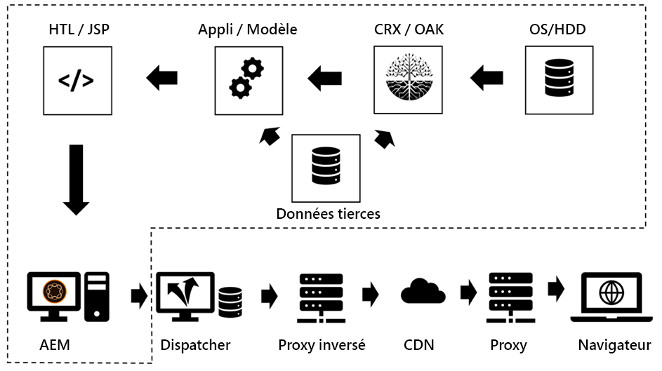
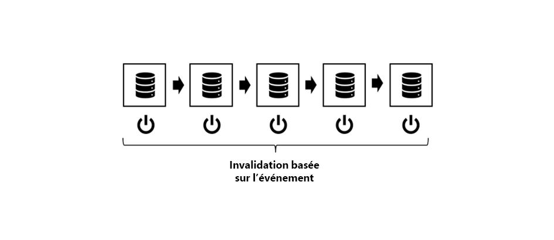
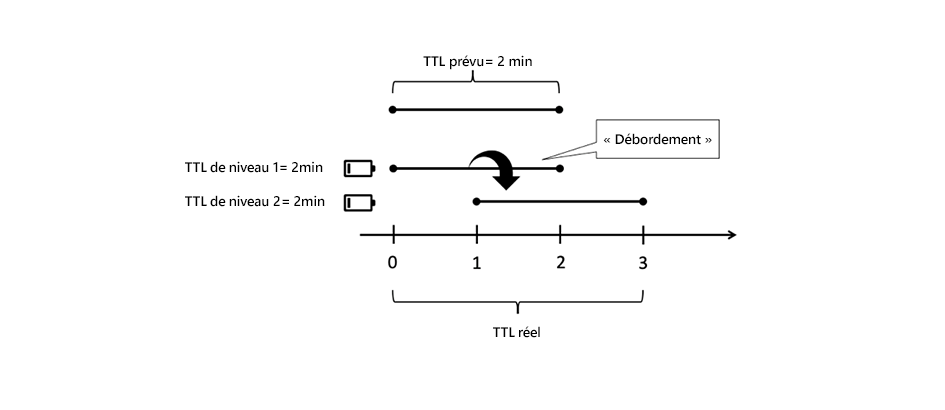
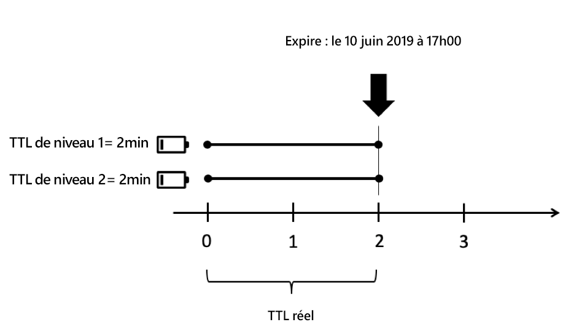
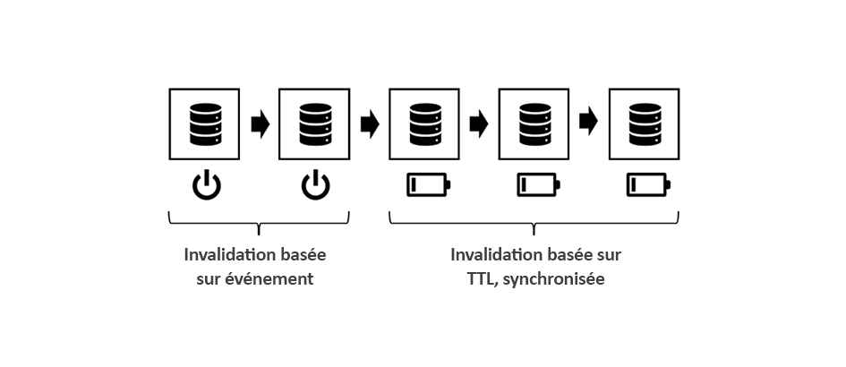
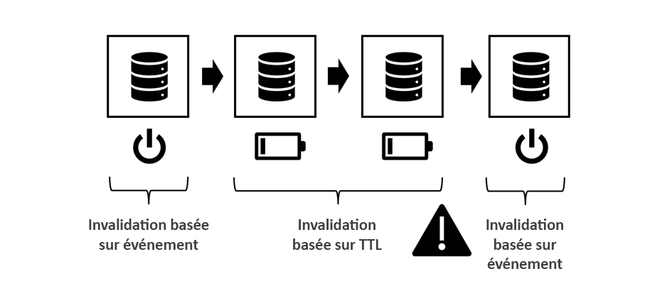
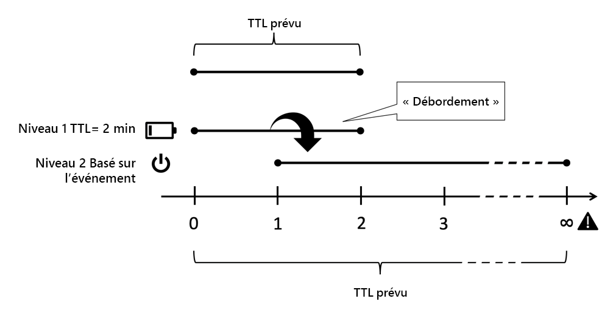
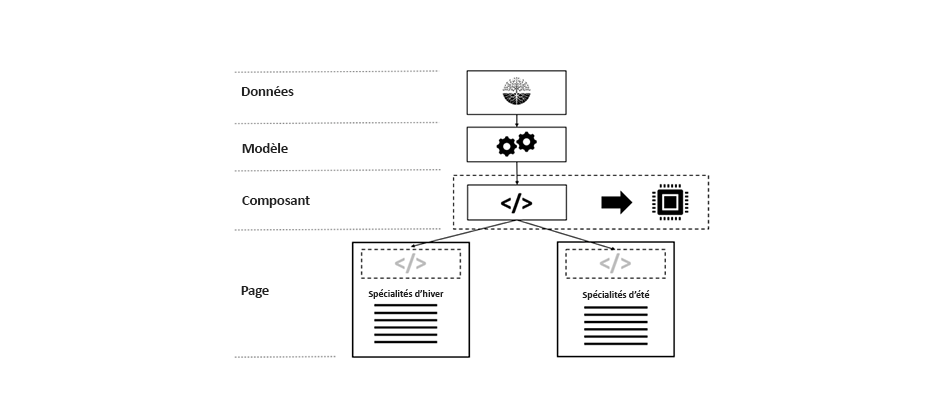
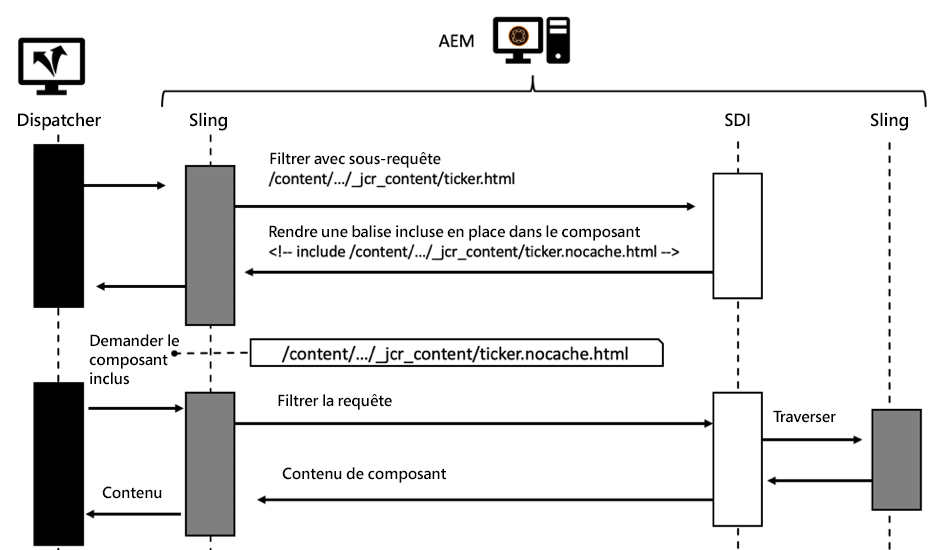
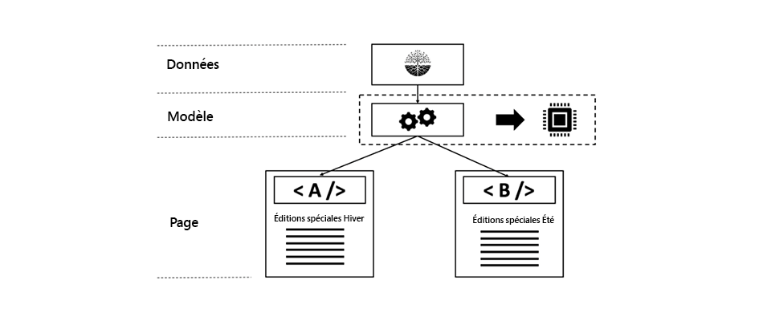

# Chapitre 3 - Rubriques de mise en cache avancée

*&quot;Il n&#39;y a que deux choses difficiles en informatique : invalidation du cache et nommage des objets.&quot;*

— PHIL KARLTON

## Présentation

Il s&#39;agit de la partie 3 d&#39;une série de trois parties à la mise en cache dans AEM. où les deux premières parties se concentraient sur la mise en cache HTTP standard dans le Répartiteur et sur les limites qui y existent. Cette partie présente quelques idées sur la façon de surmonter ces limitations.

## Mise en cache en général

[Les chapitres 1](chapter-1.md) et 2 [](chapter-2.md) de cette série se concentraient principalement sur le Répartiteur. Nous avons expliqué les bases, les limites et où vous devez faire certains compromis.

La complexité et les complexités de la mise en cache ne sont pas des problèmes propres au Répartiteur. La mise en cache est difficile en général.

Avoir le Répartiteur comme seul outil dans votre boîte à outils serait en fait une réelle limite.

Dans ce chapitre, nous voulons élargir notre vue sur la mise en cache et développer des idées sur la façon de surmonter certains des défauts du Répartiteur. Il n&#39;y a pas de solution miracle - vous devrez faire des compromis dans votre projet. Rappelez-vous qu&#39;avec la mise en cache et l&#39;invalidation précision vient toujours de la complexité, et avec la complexité il y a la possibilité d&#39;erreurs.

Il faut faire des compromis dans ces domaines.

* Performances et latence
* Consommation des ressources / Charge du processeur / Utilisation des disques
* Exactitude / Devise / Stabilité / Sécurité
* Simplicité / Complexité / Coût / Maintenabilité / Erreur de précision

Ces dimensions sont liées dans un système plutôt complexe. Il n&#39;y a pas de simple si-ceci-alors-cela. Rendre un système plus simple peut le rendre plus rapide ou plus lent. Il peut réduire vos coûts de développement, mais augmenter les coûts au service d’assistance, par exemple si les clients voient du contenu obsolète ou se plaignent d’un site Web lent. Tous ces facteurs doivent être pris en compte et équilibrés les uns par rapport aux autres. Mais à l&#39;heure actuelle, vous devriez déjà avoir une bonne idée, qu&#39;il n&#39;y a pas de solution miracle ou qu&#39;il n&#39;y ait qu&#39;une seule &quot;bonne pratique&quot; - seulement beaucoup de mauvaises pratiques et quelques bonnes.

## Mise en cache en chaîne

### Présentation

#### Flux de données

La diffusion d’une page d’un serveur au navigateur d’un client traverse une multitude de systèmes et de sous-systèmes. Si vous regardez attentivement, il y a un certain nombre de données sur le houblon à extraire de la source vers l&#39;égouttage, chacune d&#39;entre elles étant susceptible d&#39;être mise en cache.



*Flux de données d’une application CMS standard*

<br> 

Début notre voyage avec un morceau de données qui se trouve sur un disque dur et qui doit être affiché dans un navigateur.

#### Matériel et système d’exploitation

Tout d&#39;abord, le disque dur (HDD) lui-même possède un cache intégré dans le matériel. Deuxièmement, le système d&#39;exploitation qui monte le disque dur, utilise la mémoire libre pour mettre en cache les blocs fréquemment utilisés pour accélérer l&#39;accès.

#### Référentiel de contenu

Le niveau suivant est le CRX ou Oak - la base de données de document utilisée par AEM. CRX et Oak divisent les données en segments qui peuvent être mis en cache en mémoire, afin d’éviter un accès plus lent au disque dur.

#### Données tierces

La plupart des grandes installations Web comportent également des données tierces ; les données provenant d&#39;un système d&#39;information sur les produits, d&#39;un système de gestion de la relation client, d&#39;une base de données héritée ou de tout autre service Web arbitraire. Ces données n&#39;ont pas besoin d&#39;être extraites de la source chaque fois qu&#39;elles sont nécessaires, surtout pas lorsqu&#39;elles sont connues pour ne pas changer trop fréquemment. Il peut donc être mis en cache s’il n’est pas synchronisé dans la base de données CRX.

#### Couche métier - Application / Modèle

En règle générale, vos scripts de modèle ne restituent pas le contenu brut provenant de CRX via l’API JCR. Il est probable que vous ayez entre les deux une couche métier qui fusionne, calcule et/ou transforme des données dans un objet de domaine professionnel. Devinez quoi - si ces opérations sont coûteuses, pensez à les mettre en cache.

#### Fragments de balisage

Le modèle est désormais la base du rendu de l’annotation d’un composant. Pourquoi ne pas également mettre en cache le modèle rendu ?

#### Répartiteur, CDN et autres proxy

Désactivé envoie la page HTML rendue au répartiteur. Nous avons déjà discuté, que l&#39;objectif principal du Répartiteur est de mettre en cache des pages HTML et d&#39;autres ressources Web (malgré son nom). Avant que les ressources n’atteignent le navigateur, il peut transmettre un proxy inverse (qui peut mettre en cache et un CDN), également utilisé pour la mise en cache. Le client peut s&#39;asseoir dans un bureau, qui n&#39;accorde l&#39;accès au Web que par le biais d&#39;un proxy - et ce proxy peut décider de mettre en cache également pour sauver le trafic.

#### Cache du navigateur

Enfin, le navigateur met également en cache. Il s&#39;agit d&#39;un atout facile à négliger. Mais c&#39;est le cache le plus proche et le plus rapide que vous ayez dans la chaîne de mise en cache. Malheureusement, il n&#39;est pas partagé entre les utilisateurs, mais toujours entre des demandes différentes d&#39;un utilisateur.

### Où mettre en cache et pourquoi

C&#39;est une longue chaîne de caches potentielles. Et nous avons tous fait face à des problèmes où nous avons vu des contenus dépassés. Mais en prenant en compte le nombre d&#39;étapes qu&#39;il y a, c&#39;est un miracle que la plupart du temps ça fonctionne.

Mais où dans cette chaîne a-t-il du sens de mettre en cache ? Au début ? À la fin ? Partout ? Ça dépend.. et ça dépend d&#39;un grand nombre de facteurs. Même deux ressources d&#39;un même site Web pourraient vouloir une réponse différente à cette question.

Pour vous donner une idée générale des facteurs que vous pouvez prendre en considération,

**Temps de vie** - Si les objets ont un court temps de vie inhérent (les données de trafic peuvent avoir un temps de vie plus court que les données météorologiques), il peut ne pas être utile de les mettre en cache.

**Coût de production -** Le coût (en termes de cycles d&#39;UC et d&#39;E/S) est la reproduction et la diffusion d&#39;un objet. S&#39;il s&#39;agit d&#39;une mise en cache bon marché peut ne pas être nécessaire.

**Taille** : les objets volumineux nécessitent davantage de ressources pour être mis en cache. Cela pourrait être un facteur limitatif et doit être équilibré par rapport aux avantages.

**Fréquence** d&#39;accès : si l&#39;accès aux objets est rarement effectué, la mise en cache peut ne pas être efficace. Ils resteraient obsolètes ou invalidés avant d&#39;accéder à la deuxième fois à partir du cache. De tels éléments bloqueraient simplement les ressources de mémoire.

**Accès** partagé - Les données utilisées par plusieurs entités doivent être mises en cache plus loin dans la chaîne. En fait, la chaîne de mise en cache n&#39;est pas une chaîne, mais un arbre. Une partie des données du référentiel peut être utilisée par plusieurs modèles. Ces modèles peuvent à leur tour être utilisés par plusieurs scripts de rendu pour générer des fragments HTML. Ces fragments sont inclus dans plusieurs pages qui sont distribuées à plusieurs utilisateurs avec leurs caches privés dans le navigateur. Ainsi, &quot;partager&quot; ne signifie pas partager entre les gens seulement, mais plutôt entre des logiciels. Si vous souhaitez trouver un cache &quot;partagé&quot; potentiel, il vous suffit de retracer l&#39;arborescence jusqu&#39;à la racine et de trouver un ancêtre commun - c&#39;est là que vous devriez mettre en cache.

**Distribution** géographique - Si vos utilisateurs sont répartis dans le monde entier, l&#39;utilisation d&#39;un réseau distribué de caches peut contribuer à réduire la latence.

**Bande passante du réseau et latence** - En parlant de latence, qui sont vos clients et quel type de réseau utilisent-ils ? Peut-être que vos clients sont des clients mobiles dans un pays sous-développé qui utilisent la connexion 3G de smartphones de la génération précédente ? Envisagez de créer des objets plus petits et de les mettre en cache dans les caches du navigateur.

Cette liste n&#39;est pas exhaustive, mais nous pensons que vous en avez l&#39;idée maintenant.

### Règles de base pour la mise en cache chaînée

Encore une fois, la mise en cache est difficile. Partageons quelques règles de base, que nous avons extraites de projets précédents qui peuvent vous aider à éviter des problèmes dans votre projet.

#### Eviter la mise en cache des Doublons

Chacune des couches introduites dans le dernier chapitre apporte une certaine valeur dans la chaîne de mise en cache. Soit en économisant les cycles informatiques, soit en rapprochant les données du consommateur. Il n&#39;est pas erroné de mettre en cache une partie des données en plusieurs étapes de la chaîne - mais il faut toujours tenir compte des avantages et des coûts de la prochaine étape. La mise en cache d’une page complète dans le système de publication n’offre généralement aucun avantage, comme cela est déjà fait dans le répartiteur.

#### Mixage des stratégies d’invalidation

Il existe trois stratégies d&#39;invalidation de base :

* **TTL, Temps de vie :** Un objet arrive à expiration après une durée fixe (par exemple, &quot;dans 2 heures&quot;).
* **Date d&#39;expiration :** L’objet expire à une heure définie dans le futur (par exemple, &quot;17:00 PM le 10 juin 2019&quot;).
* **Basé sur le événement :** L’objet est invalidé explicitement par un événement qui s’est produit sur la plateforme (par exemple, lorsqu’une page est modifiée et activée).

Vous pouvez maintenant utiliser différentes stratégies sur différentes couches de cache, mais il y en a quelques &quot;toxiques&quot;.

#### Invalidation basée sur le événement



*Invalidation pure basée sur le Événement : Invalider du cache interne au calque externe*

<br> 

L&#39;invalidation pure basée sur le événement est la plus facile à comprendre, la plus facile à obtenir théoriquement juste et la plus précise.

En d&#39;autres termes, les caches sont invalidés une par une après modification de l&#39;objet.

Il suffit de garder une règle à l&#39;esprit :

Toujours invalider du cache intérieur au cache extérieur. Si vous avez d’abord invalidé un cache externe, il est possible qu’il remette en cache le contenu obsolète d’un cache interne. Ne faites aucune supposition au moment où un cache est à nouveau en cache - assurez-vous qu&#39;il est bien. Mieux encore, en déclenchant l&#39;invalidation du cache externe _après_ l&#39;invalidation du cache interne.

Voilà la théorie. Mais en pratique, il y a un certain nombre de pièges. Les événements doivent être distribués - potentiellement sur un réseau. Dans la pratique, cela fait de la procédure d&#39;invalidation la plus difficile à mettre en oeuvre.

#### Auto - Correctif

Avec l&#39;invalidation fondée sur le événement, vous devriez avoir un plan d&#39;urgence. Que se passe-t-il si un événement d’invalidation est manqué ? Une stratégie simple pourrait être d&#39;invalider ou de purger après un certain temps. Donc - vous avez peut-être manqué ce événement et maintenant servir du contenu obsolète. Mais vos objets ont aussi un TTL implicite de plusieurs heures (jours) seulement. Finalement, le système se guérit automatiquement.

#### Invalidation pure basée sur TTL


*Invalidation TTL non synchronisée*

<br> 

Il s&#39;agit également d&#39;un système assez courant. Vous empilez plusieurs couches de caches, chacune ayant le droit de servir un objet pendant un certain temps.

C&#39;est facile à mettre en oeuvre. Malheureusement, il est difficile de prédire la durée de vie effective d&#39;une donnée.



*Cache externe prolongeant la durée de vie d&#39;un objet interne*

<br> 

Examinez l&#39;illustration ci-dessus. Chaque couche de mise en cache introduit une TTL de 2 min. Maintenant - le TTL global doit 2 min aussi, non ? Pas tout à fait. Si le calque extérieur récupère l’objet juste avant qu’il ne devienne obsolète, la couche externe prolonge en fait la durée de vie effective de l’objet. Dans ce cas, la durée de vie effective peut être comprise entre 2 et 4 minutes. Pensez que vous êtes d&#39;accord avec votre département d&#39;affaires, un jour est tolérable - et vous avez quatre couches de caches. La TTL réelle sur chaque couche ne doit pas dépasser six heures... augmenter le taux de ratage du cache...

Nous ne disons pas que c&#39;est un mauvais plan. Tu devrais juste connaître ses limites. Et c&#39;est une bonne et facile stratégie à mettre en début. Ce n&#39;est que si le trafic de votre site augmente que vous pouvez envisager une stratégie plus précise.

*Synchronisation de l’heure d’invalidation en définissant une date spécifique*

#### Invalidation basée sur la date d&#39;expiration

Vous obtenez une durée de vie effective plus prévisible si vous définissez une date spécifique sur l’objet interne et que vous la propagez dans les caches externes.



*Synchronisation des dates d’expiration*

<br> 

Cependant, tous les caches ne sont pas en mesure de propager les dates. Et cela peut devenir difficile, quand le cache externe agrégat deux objets internes avec des dates d&#39;expiration différentes.

#### Invalidation basée sur un Événement mixte et basée sur TTL



*Mélange de stratégies basées sur les événements et sur le TTL*

<br> 

Un autre schéma courant dans le monde AEM est d&#39;utiliser l&#39;invalidation basée sur le événement dans les caches internes (par exemple, les caches en mémoire où les événements peuvent être traités en temps quasi réel) et les caches basées sur le TTL à l&#39;extérieur - où peut-être vous n&#39;avez pas accès à l&#39;invalidation explicite.

Dans l’AEM monde, vous disposeriez d’un cache en mémoire pour les objets métier et les fragments HTML dans les systèmes de publication, qui est invalidé, lorsque les ressources sous-jacentes changent et que vous propagez ce événement de modification au répartiteur qui fonctionne également sur événement. Devant cela, vous auriez par exemple un CDN basé sur TTL.

Le fait d’avoir une couche de mise en cache (courte) basée sur TTL devant un Répartiteur peut efficacement atténuer un pic qui survient généralement après une invalidation automatique.

#### Mélange de TTL - et d’une invalidation basée sur le Événement



*Toxique : Mélange de TTL - et d’une invalidation basée sur un événement*

<br> 

Cette combinaison est toxique. Ne placez jamais de cache et de cache à événement après une mise en cache basée sur TTL ou Expiry. Vous vous souvenez de l&#39;effet de débordement que nous avons eu dans la stratégie &quot;pur-TTL&quot; ? Le même effet peut être observé ici. Seul le événement d&#39;invalidation du cache externe est déjà arrivé peut ne plus se produire - toujours, Ceci peut étendre la durée de vie de l&#39;objet mis en cache à l&#39;infini.



*Combiné à base de TTL et à base de événement : Débordement à l&#39;infini*

<br> 

## Mise en cache partielle et mise en cache en mémoire

Vous pouvez vous connecter à l’étape du processus de rendu pour ajouter des calques de mise en cache. De l’obtention d’objets de transfert de données à distance à la création d’objets d’entreprise locaux en passant par la mise en cache du balisage rendu d’un composant unique. Nous laisserons les mises en oeuvre concrètes à un didacticiel ultérieur. Mais peut-être avez-vous déjà mis en place quelques-uns de ces calques de mise en cache vous-même. Le moins que nous puissions faire ici est d&#39;introduire les principes de base - et les pièges.

### Mots d&#39;avertissement

#### Respect Contrôle d&#39;accès

Les techniques décrites ici sont assez puissantes et _indispensables_ dans la boîte à outils de chaque développeur AEM. Mais ne soyez pas trop excités, utilisez-les sagement. En stockant un objet dans un cache et en le partageant avec d&#39;autres utilisateurs dans des demandes de suivi, cela signifie en fait contourner le contrôle d&#39;accès. En règle générale, ce n’est pas un problème sur les sites Web accessibles au public, mais cela peut se produire lorsqu’un utilisateur doit se connecter avant d’obtenir un accès.

Envisagez de stocker les balises HTML d&#39;un menu principal de sites dans un cache mémoire afin de les partager entre différentes pages. En fait, c&#39;est un exemple parfait pour stocker du code HTML partiellement rendu, car la création d&#39;une navigation est généralement coûteuse car elle nécessite de parcourir de nombreuses pages.

Vous ne partagez pas cette même structure de menus entre toutes les pages, mais également avec tous les utilisateurs, ce qui la rend encore plus efficace. Mais attendez ... mais il y a peut-être des éléments dans le menu qui sont réservés à un certain groupe d&#39;utilisateurs seulement. Dans ce cas, la mise en cache peut devenir un peu plus complexe.

#### Mettre uniquement en cache les objets métier personnalisés

S&#39;il y en a un - c&#39;est le conseil le plus important, nous pouvons vous donner :

>[!WARNING]
>
>Seuls les objets de cache qui sont les vôtres, qui sont immuables, que vous avez construit vous-même, qui sont peu profonds et n&#39;ont aucune référence sortante.

Qu&#39;est-ce que cela signifie ?

1. Vous ne connaissez pas le cycle de vie prévu des objets d&#39;autres personnes. Pensez à trouver ci-dessous une référence à un objet de requête et décidez de le mettre en cache. Désormais, la requête est terminée et le conteneur de servlet souhaite recycler cet objet pour la prochaine requête entrante. Dans ce cas, quelqu&#39;un d&#39;autre est en train de modifier le contenu sur lequel vous pensiez avoir le contrôle exclusif. Ne rejetez pas cela - Nous avons vu quelque chose comme ça se produire dans un projet. Les clients voyaient d&#39;autres données sur les clients au lieu des leurs.

2. Tant qu’un objet est référencé par une chaîne d’autres références, il ne peut pas être supprimé du tas. Si vous conservez un objet supposé petit dans votre cache qui fait référence, disons une représentation de 4 Mo d&#39;une image, vous aurez une bonne chance d&#39;avoir des problèmes avec la mémoire qui fuit. Les caches sont censées être basées sur des références faibles. Mais - les références faibles ne fonctionnent pas comme on pourrait s&#39;y attendre. C&#39;est le meilleur moyen de produire une fuite de mémoire et de se terminer par une erreur de mémoire. Et - vous ne savez pas quelle est la taille de la mémoire conservée des objets étrangers, n&#39;est-ce pas ?

3. En particulier dans Sling, vous pouvez adapter (presque) chaque objet les uns aux autres. Pensez à mettre une ressource dans le cache. La requête suivante (avec des droits d’accès différents), récupère cette ressource et l’adapte dans un ResourceResolver ou une session pour accéder à d’autres ressources auxquelles il n’aurait pas accès.

4. Même si vous créez un mince &quot;wrapper&quot; autour d&#39;une ressource d&#39;AEM, vous ne devez pas la mettre en cache - même si elle est la vôtre et immuable. L&#39;objet enveloppé serait une référence (que nous interdisons auparavant) et si nous avons l&#39;air pointu, cela crée essentiellement les mêmes problèmes que ceux décrits dans le dernier article.

5. Si vous souhaitez mettre en cache, créez vos propres objets en copiant des données primitives dans vos propres objets shallo. Vous pouvez lier vos propres objets par référence, par exemple vous pouvez mettre en cache une arborescence d’objets. C&#39;est très bien, mais seulement des objets de cache que vous venez de créer dans la même requête, et aucun objet demandé ailleurs (même s&#39;il s&#39;agit de l&#39;espace nom de votre objet). _Copier des objets_ est la clé. Et veillez à purger la totalité de la structure des objets liés en même temps et à éviter les références entrantes et sortantes à votre structure.

6. Oui - et garder vos objets immuables. Propriétés privées, uniquement et sans paramètre.

C&#39;est beaucoup de règles, mais ça vaut la peine de les suivre. Même si vous êtes expérimenté et super intelligent et avez tout sous contrôle. Le jeune collègue de votre projet vient d&#39;être diplômé de l&#39;université. Il ne connaît pas tous ces pièges. S&#39;il n&#39;y a pas d&#39;écueils, il n&#39;y a rien à éviter. Restez simple et compréhensible.

### Outils et bibliothèques

Cette série porte sur la compréhension des concepts et vous permet de construire une architecture qui correspond le mieux à votre cas d&#39;utilisation.

Nous ne promouvons aucun outil en particulier. Mais donnez-vous des indices pour les évaluer. Par exemple, AEM a un cache simple intégré avec un TTL fixe depuis la version 6.0. Voulez-vous l&#39;utiliser ? Probablement pas lors de la publication lorsqu’un cache basé sur un événement suit la chaîne (indice : Répartiteur). Mais cela pourrait être un choix décent pour un auteur. Il y a aussi un cache HTTP par Adobe ACS commons qui pourrait être utile à considérer.

Ou vous créez votre propre structure, basée sur une structure de mise en cache mature comme [Ehcache](https://www.ehcache.org). Vous pouvez l’utiliser pour mettre en cache des objets Java et des balises rendues (`String` objets).

Dans certains cas simples, vous pouvez également vous habituer à utiliser des cartes de hachage simultanées - vous verrez rapidement des limites ici - soit dans l&#39;outil, soit dans vos compétences. La simultanéité est aussi difficile à maîtriser que l’attribution de noms et la mise en cache.

#### Références

* [Cache HTTP ACS Commons ](https://adobe-consulting-services.github.io/acs-aem-commons/features/http-cache/index.html)
* [Structure de mise en cache Ehcache](https://www.ehcache.org)

### Termes de base

Nous n&#39;entrerons pas dans la théorie de la mise en cache trop profonde ici, mais nous nous sentons obligés de fournir quelques mots à la mode, pour que vous ayez un bon début de saut.

#### Expulsion du cache

Nous avons beaucoup parlé d&#39;invalidation et de purge. _L’expulsion_ du cache est liée aux termes suivants : Après une entrée, elle est expulsée, elle n&#39;est plus disponible. Mais l&#39;expulsion ne se produit pas lorsqu&#39;une entrée est obsolète, mais lorsque le cache est plein. Les éléments plus récents ou &quot;plus importants&quot; poussent les éléments plus anciens ou moins importants hors du cache. Quelles entrées vous devrez sacrifier est une décision au cas par cas. Vous pouvez expulser les plus anciens ou ceux qui ont été utilisés très rarement ou pour la dernière fois depuis longtemps.

#### Mise en cache préventive

La mise en cache préemptive consiste à recréer l’entrée avec du contenu frais au moment où elle est invalidée ou considérée comme obsolète. Bien sûr, vous ne feriez cela qu&#39;avec quelques ressources, que vous êtes sûr que l&#39;on y accède fréquemment et immédiatement. Sinon, vous gaspillez des ressources pour créer des entrées de cache qui ne seront peut-être jamais demandées. En créant des entrées de cache de manière préventive, vous pouvez réduire la latence de la première requête à une ressource après l&#39;invalidation du cache.

#### Réchauffement du cache

Le réchauffement du cache est étroitement lié à la mise en cache préventive. Bien que vous n&#39;utilisiez pas ce terme pour un système en direct. Et il est moins limité dans le temps que le premier. Vous ne remettez pas en cache immédiatement après l’invalidation, mais vous remplissez progressivement le cache lorsque le temps le permet.

Par exemple, vous retirez une jambe Publier / Répartiteur de l’équilibreur de charge pour la mettre à jour. Avant de la réintégrer, vous analysez automatiquement les pages les plus fréquemment consultées pour les placer à nouveau dans le cache. Lorsque la mémoire cache est &quot;chaude&quot; - remplie adéquatement, vous devez réintégrer la jambe dans l&#39;équilibreur de charge.

Ou peut-être que vous réintégrez la jambe immédiatement, mais vous ralentissez le trafic jusqu&#39;à cette jambe pour qu&#39;elle ait une chance de réchauffer ses caches par usage régulier.

Ou peut-être souhaitez-vous également mettre en cache des pages moins fréquemment consultées lorsque votre système est inactif pour diminuer la latence lorsqu&#39;elles sont effectivement consultées par des requêtes réelles.

#### Identité d’objet en cache, charge utile, dépendance d’invalidation et TTL

En règle générale, un objet mis en cache ou une &quot;entrée&quot; possède cinq propriétés principales,

#### Clé

Il s&#39;agit de la propriété par laquelle vous identifiez et objets. Pour récupérer sa charge utile ou pour la purger du cache. Le répartiteur, par exemple, utilise comme clé l’URL d’une page. Notez que le répartiteur n&#39;utilise pas les chemins des pages. Ceci n’est pas suffisant pour distinguer différents rendus. D’autres caches peuvent utiliser des clés différentes. Nous verrons quelques exemples plus tard.

#### Valeur / Charge utile

Il s&#39;agit du coffre de trésor de l&#39;objet, les données que vous voulez récupérer. Dans le cas du répartiteur, il s&#39;agit du contenu des fichiers. Mais il peut également s&#39;agir d&#39;une arborescence d&#39;objets Java.

#### TTL

Nous avons déjà couvert le TTL. Heure après laquelle une entrée est considérée comme obsolète et ne doit plus être livrée.

#### Dépendance

Il s&#39;agit de l&#39;invalidation fondée sur le événement. Quelles sont les données d&#39;origine de cet objet en fonction ? Dans la première partie, nous avons déjà dit qu&#39;un suivi vrai et précis des dépendances est trop complexe. Mais avec notre connaissance du système vous pouvez approcher les dépendances avec un modèle plus simple. Nous invalidons suffisamment d&#39;objets pour purger le contenu obsolète... et peut-être par inadvertance plus que ce qui serait nécessaire. Mais nous essayons pourtant de rester en dessous de &quot;tout purger&quot;.

Quels objets dépendent de l’authenticité des autres dans chaque application ? Nous vous donnerons quelques exemples de mise en oeuvre d&#39;une stratégie de dépendance ultérieurement.

### Mise en cache de fragments HTML



*Réutilisation d’un fragment rendu sur différentes pages*

<br> 

La mise en cache de fragments HTML est un outil puissant. L’idée est de mettre en cache le balisage HTML généré par un composant dans un cache mémoire. Vous pouvez demander, pourquoi devrais-je faire cela ? Je mets en cache toute la balise de la page dans le répartiteur de toute façon - y compris l&#39;annotation de ce composant. Nous sommes d&#39;accord. Vous le faites, mais une fois par page. Vous ne partagez pas cette annotation entre les pages.

Imaginez que vous génériez une navigation au-dessus de chaque page. L’annotation est identique sur chaque page. Mais vous le générez encore et encore pour chaque page, ce n&#39;est pas dans le Répartiteur. Et rappelez-vous : Après l’invalidation automatique, toutes les pages doivent être rendues à nouveau. En gros, vous exécutez le même code avec les mêmes résultats des centaines de fois.

D&#39;après notre expérience, le rendu d&#39;une navigation supérieure imbriquée est une tâche très coûteuse. En règle générale, vous traversez une bonne partie de l’arborescence du document pour générer les éléments de navigation. Même si vous n&#39;avez besoin que du titre de navigation et de l&#39;URL, les pages doivent être chargées en mémoire. Et là, ils bouchent des ressources précieuses. Encore et encore.

Mais le composant est partagé entre plusieurs pages. Et partager quelque chose est un signe d&#39;utilisation d&#39;un cache. Ainsi - ce que vous souhaitez faire est de vérifier si le composant de navigation a déjà été rendu et mis en cache, et au lieu de rendre à nouveau simplement émettre la valeur des caches.

Il y a deux merveilleuses subtilités que l&#39;on peut facilement ignorer :

1. Vous mettez en cache une chaîne Java. Une chaîne ne contient aucune référence sortante et est immuable. Donc, compte tenu des avertissements ci-dessus - c&#39;est super sûr.

2. L&#39;invalidation est aussi super facile. Chaque fois que quelque chose change votre site Web, vous souhaitez invalider cette entrée de cache. La reconstruction est relativement peu coûteuse, car elle ne doit être effectuée qu&#39;une seule fois puis est réutilisée par les centaines de pages.

Il s’agit d’un grand soulagement pour vos serveurs de publication.

### Mise en oeuvre des caches de fragments

#### Balises personnalisées

Auparavant, lorsque vous utilisiez JSP comme moteur de création de modèles, il était assez courant d’utiliser une balise JSP personnalisée enveloppant les composants du code de rendu.

```
<!-- Pseudo Code -->

<myapp:cache
  key=' ${info.homePagePath} + ${component.path}'
  cache='main-navigation'
  dependency='${info.homePagePath}'>

… original components code ..

</myapp:cache>
```

La balise personnalisée qui capturerait son corps et l&#39;écrirait dans le cache ou empêcherait l&#39;exécution de son corps et produirait plutôt la charge utile de l&#39;entrée de cache.

La &quot;clé&quot; est le chemin d&#39;accès aux composants qu&#39;elle aurait sur la page d&#39;accueil. Nous n&#39;utilisons pas le chemin d&#39;accès du composant sur la page active, car cela créerait une entrée de cache par page, ce qui contredirait notre intention de partager ce composant. Nous n&#39;utilisons pas non plus uniquement les composants relatifs path (`jcr:conten/mainnavigation`), car cela nous empêcherait d&#39;utiliser des composants de navigation différents sur différents sites.

&quot;Cache&quot; est un indicateur indiquant où stocker l’entrée. En règle générale, vous disposez de plus d’un cache dans lequel vous stockez des éléments. Chacun d&#39;eux peut se comporter un peu différemment. Il est donc bon de différencier ce qui est stocké - même si au final ce ne sont que des chaînes.

&quot;Dépendance&quot;, c&#39;est de cela que dépend l&#39;entrée de cache. Le cache de &quot;navigation principale&quot; peut comporter une règle, selon laquelle s’il y a une modification sous le noeud &quot;dépendance&quot;, l’entrée correspondante doit être purgée. Ainsi, votre mise en cache devra s&#39;enregistrer en tant qu&#39;écouteur de événement dans le référentiel pour être conscient des modifications et appliquer ensuite les règles spécifiques au cache pour découvrir ce qui doit être invalidé.

Ce qui précède n&#39;est qu&#39;un exemple. Vous pouvez également choisir d&#39;avoir un arbre de caches. Lorsque le premier niveau est utilisé pour séparer les sites (ou les locataires) et le second niveau se divise ensuite en types de contenu (par exemple &quot;navigation principale&quot;), ce qui peut vous empêcher d&#39;ajouter le chemin de page d&#39;accueil comme dans l&#39;exemple ci-dessus.

D&#39;ailleurs, vous pouvez également utiliser cette approche avec des composants HTML plus modernes. Vous obtiendrez alors un wrapper JSP autour de votre script HTL.

#### Filtres de composants

Mais dans une approche HTL pure, vous préféreriez créer le cache de fragments avec un filtre de composant Sling. Nous n&#39;avons pas encore vu cela à l&#39;état sauvage, mais c&#39;est l&#39;approche que nous adopterions sur cette question.

#### Inclure dynamique Sling

Le cache de fragments est utilisé si vous disposez d’une constante (la navigation) dans le contexte d’un environnement en évolution (différentes pages).

Mais vous avez peut-être aussi le contraire, un contexte relativement constant (une page qui change rarement) et certains fragments changeants sur cette page (par exemple, un télex en direct).

Dans ce cas, vous pouvez donner une chance à [Sling Dynamic Inclut](https://sling.apache.org/documentation/bundles/dynamic-includes.html) . Il s’agit essentiellement d’un filtre de composant qui entoure le composant dynamique et, au lieu de le rendre dans la page, il crée une référence. Cette référence peut être un appel Ajax, de sorte que le composant soit inclus par le navigateur et que la page environnante puisse donc être mise en cache de manière statique. Ou - alternativement - Sling Dynamic Include peut générer une directive SSI (Server Side Include). Cette directive serait exécutée sur le serveur Apache. Vous pouvez même utiliser les directives ESI - Edge Side Include si vous utilisez le vernis ou un CDN qui prend en charge les scripts ESI.



*Diagramme de séquence d’une requête utilisant l’inclusion dynamique Sling*

<br> 

La documentation SDI indique que vous devez désactiver la mise en cache pour les URL se terminant par &quot;*.nocache.html&quot;, ce qui est logique, puisque vous traitez de composants dynamiques.

Une autre option permet d’utiliser SDI : Si vous _ne désactivez pas_ le cache du répartiteur pour les inclusions, le répartiteur se comporte comme un cache-fragment semblable à celui que nous avons décrit dans le dernier chapitre : Les pages et les fragments de composants sont mis en cache de manière égale et indépendante dans le répartiteur et assemblés ensemble par le script SSI dans le serveur Apache lorsque la page est demandée. Ainsi, vous pouvez implémenter des composants partagés comme la navigation principale (étant donné que vous utilisez toujours la même URL de composant).

Cela devrait marcher, en théorie. Mais...

Nous vous conseillons de ne pas faire cela : Vous perdriez la possibilité de contourner le cache pour les composants dynamiques réels. SDI est configuré globalement et les modifications que vous apporteriez pour votre &quot;pauvre-mans-fragment-cache&quot; s&#39;appliqueraient également aux composants dynamiques.

Nous vous conseillons d&#39;étudier attentivement la documentation SDI. Il y a d&#39;autres limites, mais l&#39;IDD est un outil précieux dans certains cas.

#### Références

* [docs.oracle.com - Comment écrire des balises JSP personnalisées](https://docs.oracle.com/cd/E11035_01/wls100/taglib/quickstart.html)
* [Dominik Süß - Création et utilisation de filtres de composants](https://www.slideshare.net/connectwebex/prsentation-dominik-suess)
* [sling.apache.org - Sling Dynamic inclut](https://sling.apache.org/documentation/bundles/dynamic-includes.html)
* [helpx.adobe.com - Configuration des inclusions dynamiques Sling dans AEM](https://helpx.adobe.com/experience-manager/kt/platform-repository/using/sling-dynamic-include-technical-video-setup.html)


#### Mise en cache des modèles



*Mise en cache basée sur les modèles : Un objet métier avec deux rendus différents*

<br> 

Revoyons l&#39;affaire avec la navigation de nouveau. Nous supposions que chaque page nécessiterait la même annotation de la navigation.

Mais ce n&#39;est peut-être pas le cas. Vous pouvez afficher différentes annotations pour l’élément dans la navigation qui représente la page __ active.

```
Travel Destinations

<ul class="maninnav">
  <li class="currentPage">Travel Destinations
    <ul>
      <li>Finland
      <li>Canada
      <li>Norway
    </ul>
  <li>News
  <li>About us
<ul>
```

```
News

<ul class="maninnav">
  <li>Travel Destinations
  <li class="currentPage">News
    <ul>
      <li>Winter is coming>
      <li>Calm down in the wild
    </ul>
  <li>About us
<is
```

Il s&#39;agit de deux rendus complètement différents. Pourtant, l&#39;objet __ commercial - l&#39;arbre de navigation complet - est le même.  L&#39;objet __ métier ici serait un graphique d&#39;objets représentant les noeuds de l&#39;arborescence. Ce graphique peut être facilement stocké dans un cache mémoire. Rappelez-vous toutefois que ce graphique ne doit contenir aucun objet ni référencer aucun objet que vous n’avez créé vous-même, en particulier maintenant les noeuds JCR.

#### Mise en cache dans le navigateur

Nous avons déjà touché l&#39;importance de la mise en cache dans le navigateur, et il y a beaucoup de bons tutoriels là-bas. En fin de compte - pour le navigateur - le Répartiteur est juste un serveur Web qui suit le protocole HTTP.

Cependant, malgré la théorie, nous avons rassemblé quelques connaissances que nous n&#39;avons nulle part ailleurs et que nous voulons partager.

Essentiellement, la mise en cache du navigateur peut être exploitée de deux manières différentes,

1. Le navigateur a une ressource mise en cache dont il connaît la date d&#39;expiration exacte. Dans ce cas, il ne demande pas à nouveau la ressource.

2. Le navigateur dispose d&#39;une ressource, mais il n&#39;est pas certain qu&#39;elle soit toujours valide. Dans ce cas, il demanderait au serveur web (le Répartiteur dans notre cas). S&#39;il vous plaît, donnez-moi la ressource si elle a été modifiée depuis que vous l&#39;avez livrée pour la dernière fois. S&#39;il n&#39;a pas changé, le serveur répond par &quot;304 - pas changé&quot; et seules les métadonnées ont été transmises.

#### Débogage

Si vous optimisez les paramètres du répartiteur pour la mise en cache du navigateur, il est extrêmement utile d’utiliser un serveur proxy de bureau entre votre navigateur et le serveur Web. Nous préférons &quot;Charles Web Debugging Proxy&quot; de Karl von Randow.

Charles vous permet de lire les requêtes et les réponses, qui sont transmises au serveur et à partir de celui-ci. Et - vous pouvez en apprendre beaucoup sur le protocole HTTP. Les navigateurs modernes offre également certaines fonctionnalités de débogage, mais les fonctionnalités d&#39;un proxy de bureau sont sans précédent. Vous pouvez manipuler les données transférées, ralentir la transmission, relayer des requêtes individuelles et bien plus encore. Et l&#39;interface utilisateur est clairement organisée et assez complète.

Le test le plus élémentaire consiste à utiliser le site Web comme un utilisateur normal - avec le proxy entre les deux - et à vérifier si le nombre de requêtes statiques (à /etc/...) diminue avec le temps - car elles doivent être dans le cache et ne plus être demandées.

Nous avons trouvé qu&#39;un proxy peut donner un aperçu plus clair, car la requête mise en cache n&#39;apparaît pas dans le journal alors que certains débogueurs intégrés au navigateur affichent toujours ces requêtes avec &quot;0 ms&quot; ou &quot;from disk&quot;. Ce qui est correct et précis mais pourrait un peu nuancer votre vue.

Vous pouvez ensuite analyser et vérifier les en-têtes des fichiers transférés pour voir, par exemple, si les en-têtes http &quot;Expires&quot; sont corrects. Vous pouvez réexécuter des requêtes avec des en-têtes if-changed-puisque définis pour vérifier si le serveur répond correctement avec un code de réponse 304 ou 200. Vous pouvez observer le timing des appels asynchrones et tester vos hypothèses de sécurité dans une certaine mesure. Rappelez-vous que nous vous avons dit de ne pas accepter tous les sélecteurs qui ne sont pas explicitement attendus ? Ici, vous pouvez jouer avec l’URL et les paramètres et voir si votre application se comporte bien.

Il n’y a qu’une chose que nous vous demandons de ne pas faire, lorsque vous déboguez votre cache :

Ne rechargez pas les pages dans le navigateur !

Un &quot;rechargement du navigateur&quot;, un rechargement __ simple ainsi qu’un rechargement __ forcé (&quot;_shift-reload_&quot;) ne sont pas identiques à une requête de page normale. Une requête de rechargement simple définit un en-tête

```
Cache-Control: max-age=0
```

En outre, une fonction de rechargement en maintenant la touche Maj enfoncée tout en cliquant sur le bouton de rechargement permet généralement de définir un en-tête de requête.

```
Cache-Control: no-cache
```

Les deux en-têtes ont des effets similaires mais légèrement différents, mais surtout, ils diffèrent complètement d’une requête normale lorsque vous ouvrez une URL à partir de l’emplacement d’URL ou en utilisant des liens sur le site. La navigation normale ne définit pas les en-têtes de contrôle du cache, mais probablement un en-tête if-changed-puisque.

Ainsi, si vous souhaitez déboguer le comportement de navigation normal, vous devez procéder exactement comme suit : _Parcourir normalement_. Le bouton recharger de votre navigateur est le meilleur moyen de ne pas voir les erreurs de configuration du cache dans votre configuration.

Utilisez votre proxy Charles pour voir de quoi nous parlons. Oui - et pendant que vous l&#39;avez ouvert - vous pouvez rejouer les requêtes juste là. Il n’est pas nécessaire de recharger à partir du navigateur.

## Test de performance

En utilisant un proxy, vous obtenez une idée du comportement de minutage de vos pages. Bien sûr, ce n&#39;est pas de loin un test de performance.  Un test de performances requiert un certain nombre de clients demandant vos pages en parallèle.

Une erreur fréquente, nous l&#39;avons vu trop souvent, est que le test de performances inclut uniquement un très petit nombre de pages et que ces pages sont distribuées à partir du cache du répartiteur uniquement.

Si vous faites la promotion de votre application sur le système actif, la charge est complètement différente de celle que vous avez testée.

Sur le système en direct, le modèle d’accès n’est pas le petit nombre de pages uniformément distribuées que vous avez dans les tests (page d&#39;accueil et peu de pages de contenu). Le nombre de pages est beaucoup plus important et les requêtes sont très inégalement réparties. Et - bien sûr - les pages en direct ne peuvent pas être servies à 100 % depuis le cache : Certaines demandes d’invalidation provenant du système de publication invalident automatiquement une grande partie de vos précieuses ressources.

Ah oui - et lorsque vous reconstruisez votre cache Répartiteur, vous découvrirez que le système de publication se comporte aussi assez différemment, selon que vous demandez seulement une poignée de pages - ou un plus grand nombre. Même si toutes les pages sont aussi complexes, leur nombre joue un rôle. Vous vous souvenez de ce que nous avons dit sur la mise en cache chaînée ? Si vous demandez toujours le même petit nombre de pages, il y a de bonnes chances que les blocs correspondant aux données brutes se trouvent dans le cache du disque dur ou que les blocs soient mis en cache par le système d&#39;exploitation. Il est également possible que le référentiel ait mis en cache le segment correspondant dans sa mémoire principale. Ainsi, le rendu est beaucoup plus rapide que lorsque d’autres pages s’évicaient les unes des autres, de temps en temps, à partir de divers caches.

La mise en cache est difficile, tout comme le test d&#39;un système qui repose sur la mise en cache. Alors, que pouvez-vous faire pour avoir un scénario plus précis de la vie réelle ?

Nous pensons que vous devrez effectuer plusieurs tests et que vous devrez fournir plus d&#39;un indice de performance pour mesurer la qualité de votre solution.

Si vous disposez déjà d’un site Web, mesurez le nombre de requêtes et leur mode de distribution. Essayez de modéliser un test qui utilise une distribution similaire de requêtes. ajouter un peu de hasard ne pouvait pas faire mal. Vous n&#39;avez pas à simuler un navigateur qui chargerait des ressources statiques comme JS et CSS - celles-ci n&#39;ont pas vraiment d&#39;importance. Ils sont éventuellement mis en cache dans le navigateur ou dans le Répartiteur et n’atteignent pas la charge de manière significative. Mais les images référencées ont leur importance. Recherchez également leur distribution dans les anciens fichiers journaux et modélisez un modèle de requête similaire.

Exécutez maintenant un test avec votre Répartiteur sans aucune mise en cache. C&#39;est votre pire scénario. Déterminez à quel niveau de charge votre système devient instable dans les pires conditions. Vous pouvez également aggraver la situation en supprimant quelques pattes Répartiteur/Publier si vous le souhaitez.

Ensuite, exécutez le même test avec tous les paramètres de cache requis sur &quot;on&quot;. Augmentez lentement vos requêtes parallèles pour réchauffer le cache et voir combien votre système peut prendre dans ces meilleures conditions.

Un scénario de cas moyen consisterait à exécuter le test avec le répartiteur activé, mais aussi avec certaines invalidations. Vous pouvez simuler cela en touchant les fichiers d’état par un travail de retouche ou en envoyant les demandes d’invalidation à intervalles irréguliers au Répartiteur. N&#39;oubliez pas également de purger de temps à autre certaines des ressources non-auto invalidées.

Vous pouvez varier le dernier scénario en augmentant les demandes d’invalidation et en augmentant la charge.

C&#39;est un peu plus complexe qu&#39;un simple test de charge linéaire - mais donne beaucoup plus de confiance dans votre solution.

Vous pourriez vous écarter de l&#39;effort. Mais au minimum, effectuez un test du pire cas sur le système de publication avec un plus grand nombre de pages (également réparties) pour voir les limites du système. Assurez-vous d&#39;interpréter correctement le nombre de scénarios les plus optimisés et de configurer vos systèmes avec suffisamment de marge de manoeuvre.