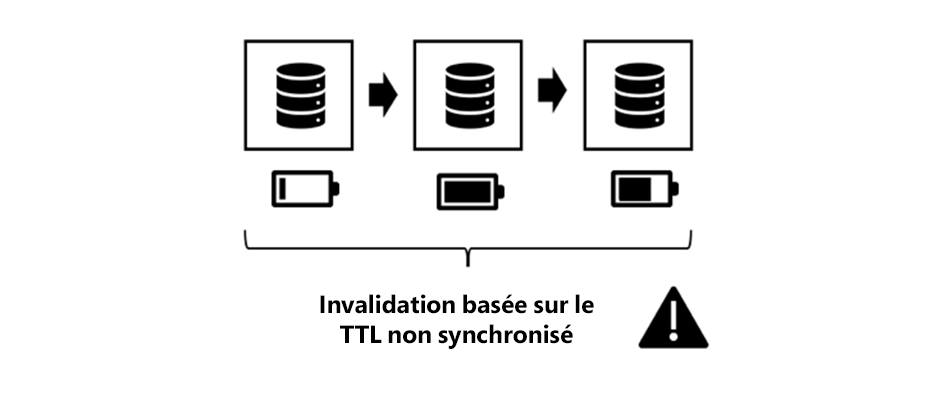

# Chapitre 3 - Rubriques de mise en cache avancées

*&quot;Il n&#39;y a que deux choses difficiles dans l&#39;informatique : invalidation du cache et attribution de noms aux éléments.&quot;*

— PHIL KARLTON

## Présentation

Il s’agit de la Partie 3 d’une série de trois parties - série à la mise en cache dans AEM. Où les deux premières parties se concentraient sur la mise en cache http de type brut dans Dispatcher et les limites qu’il y a. Cette partie présente quelques idées sur la manière de surmonter ces limites.

## Mise en cache en général

[Les chapitres 1](chapter-1.md) et 2 [ ](chapter-2.md)  de cette série portaient principalement sur Dispatcher. Nous avons expliqué les principes de base, les limites et où vous devez faire certains compromis.

La complexité et les complexités de la mise en cache ne sont pas des problèmes propres à Dispatcher. La mise en cache est difficile en général.

Dispatcher serait en fait votre seul outil dans votre boîte à outils.

Dans ce chapitre, nous voulons élargir notre vue sur la mise en cache et développer quelques idées sur la manière de surmonter certaines des lacunes de Dispatcher. Il n&#39;y a pas de solution miracle - vous devrez faire des compromis dans votre projet. Souvenez-vous qu’avec la mise en cache et l’invalidation, la précision devient toujours complexe, et qu’avec la complexité, il y a la possibilité d’erreurs.

Vous devrez faire des compromis dans ces domaines,

* Performances et latence
* Utilisation des ressources / Charge du processeur / Utilisation du disque
* Précision/Devise/Stabilité/Sécurité
* Simplicité/complexité/coût/maintenabilité/prononciation des erreurs

Ces dimensions sont interconnectées dans un système plutôt complexe. Il n&#39;y a pas de simple si-ceci-alors-cela. Rendre un système plus simple peut le rendre plus rapide ou plus lent. Cela peut réduire vos coûts de développement, mais augmenter les coûts au service d’assistance, par exemple si les clients voient du contenu obsolète ou se plaignent d’un site web lent. Tous ces facteurs doivent être pris en compte et équilibrés les uns par rapport aux autres. Mais à l&#39;heure actuelle, vous devriez déjà avoir une bonne idée, qu&#39;il n&#39;y a pas de solution miracle ou qu&#39;une seule &quot;bonne pratique&quot; - seulement un grand nombre de mauvaises pratiques et quelques bonnes.

## Mise en cache en chaîne

### Présentation

#### Flux de données

La diffusion d’une page d’un serveur vers le navigateur d’un client traverse une multitude de systèmes et de sous-systèmes. Si vous regardez attentivement, il existe un certain nombre de données de sauts à transférer de la source vers l’évacuation, chacune d’elles étant susceptible d’être mise en cache.


*Flux de données d’une application CMS standard*

<br> 

Commençons notre parcours avec une donnée qui se trouve sur un disque dur et qui doit être affichée dans un navigateur.

#### Matériel et système d’exploitation

Tout d’abord, le disque dur (HDD) lui-même dispose d’un cache intégré dans le matériel. Deuxièmement, le système d’exploitation qui monte le disque dur utilise la mémoire libre pour mettre en cache les blocs fréquemment utilisés afin d’accélérer l’accès.

#### Référentiel de contenu

Le niveau suivant est le CRX ou Oak, la base de données de documents utilisée par AEM. CRX et Oak divisent les données en segments pouvant être mis en cache en mémoire, afin d’éviter un accès plus lent au HDD.

#### Données tierces

La plupart des installations Web plus grandes disposent également de données tierces ; les données provenant d’un système d’informations sur les produits, d’un système de gestion des relations client, d’une base de données héritée ou de tout autre service Web arbitraire. Ces données n’ont pas besoin d’être extraites de la source à chaque fois qu’elles sont nécessaires, surtout pas lorsqu’elles sont connues pour ne pas changer trop souvent. Il peut donc être mis en cache s’il n’est pas synchronisé dans la base de données CRX.

#### Couche métier - Application/modèle

En règle générale, vos scripts de modèle ne rendent pas le contenu brut provenant de CRX via l’API JCR. Il est probable que vous ayez une couche métier entre les deux qui fusionne, calcule et/ou transforme les données dans un objet de domaine professionnel. Devinez quoi ? Si ces opérations sont coûteuses, envisagez de les mettre en cache.

#### Fragments de balisage

Le modèle est désormais la base du rendu du balisage d’un composant. Pourquoi ne pas également mettre en cache le modèle rendu ?

#### Dispatcher, CDN et autres proxys

La désactivation permet d’afficher la page HTML rendue dans Dispatcher. Nous avons déjà discuté du fait que le principal objectif de Dispatcher est de mettre en cache les pages HTML et d’autres ressources web (malgré son nom). Avant que les ressources n’atteignent le navigateur, il peut transmettre un proxy inverse (qui peut mettre en cache et un CDN), également utilisé pour la mise en cache. Le client peut se trouver dans un bureau, qui n&#39;accorde l&#39;accès au web qu&#39;au moyen d&#39;un proxy - et ce proxy peut décider de mettre en cache également pour enregistrer le trafic.

#### Cache du navigateur

Dernier point, mais non le moindre : le navigateur est également mis en cache. Il s’agit d’un actif facile à négliger. Mais il s’agit du cache le plus proche et le plus rapide de la chaîne de mise en cache. Malheureusement, il n’est pas partagé entre les utilisateurs, mais toujours entre différentes demandes d’un utilisateur.

### Où mettre en cache et pourquoi

C&#39;est une longue chaîne de caches potentielles. Et nous avons tous rencontré des problèmes où nous avons vu des contenus dépassés. Mais en prenant en compte le nombre d&#39;étapes qu&#39;il y a, c&#39;est un miracle que la plupart du temps ça fonctionne.

Mais où dans cette chaîne est-il logique de mettre en cache ? Au début ? À la fin ? Partout ? Ça dépend.. et ça dépend d&#39;un grand nombre de facteurs. Même deux ressources d&#39;un même site web peuvent vouloir une réponse différente à cette question.

Pour vous donner une idée approximative des facteurs que vous pouvez prendre en compte,

**Durée de vie**  : si le temps de vie des objets est court (les données de trafic peuvent être plus courtes que les données météorologiques), il peut ne pas être utile de les mettre en cache.

**Coût de production :** le coût de la reproduction et de la diffusion d’un objet (en termes de cycles de processeur et d’E/S) est élevé. S’il s’agit d’une mise en cache bon marché, cela peut ne pas être nécessaire.

**Taille**  : les objets volumineux nécessitent plus de ressources à mettre en cache. Cela pourrait être un facteur limitatif et doit être mis en balance avec les avantages.

**Fréquence d’accès**  : si les objets sont rarement consultés, la mise en cache peut ne pas être efficace. Ils deviennent obsolètes ou sont invalidés avant d’accéder à la deuxième fois à partir du cache. De tels éléments bloqueraient simplement les ressources de mémoire.

**Accès partagé**  : les données utilisées par plusieurs entités doivent être mises en cache plus haut dans la chaîne. En fait, la chaîne de mise en cache n&#39;est pas une chaîne, mais un arbre. Une donnée du référentiel peut être utilisée par plusieurs modèles. Ces modèles peuvent à leur tour être utilisés par plusieurs scripts de rendu pour générer des fragments HTML. Ces fragments sont inclus dans plusieurs pages qui sont distribuées à plusieurs utilisateurs avec leurs caches privés dans le navigateur. Donc &quot;partager&quot; ne signifie pas partager entre les gens seulement, mais entre des morceaux de logiciels. Si vous souhaitez trouver un cache &quot;partagé&quot; potentiel, effectuez simplement le suivi de l’arborescence vers la racine et recherchez un ancêtre commun, c’est là que vous devez mettre en cache.

**Distribution géographique**  : si vos utilisateurs sont répartis dans le monde entier, l’utilisation d’un réseau de caches distribué peut contribuer à réduire la latence.

**Bande passante réseau et latence**  : en parlant de latence, qui sont vos clients et quel type de réseau utilisent-ils ? Peut-être que vos clients sont des clients mobiles dans un pays sous-développé utilisant la connexion 3G de smartphones de génération plus ancienne ? Envisagez de créer des objets plus petits et de les mettre en cache dans les caches du navigateur.

Cette liste n&#39;est pas exhaustive, mais nous pensons que vous en avez l&#39;idée maintenant.

### Règles de base pour la mise en cache chaînée

Encore une fois : la mise en cache est difficile. Partageons quelques règles de base, que nous avons extraites de projets précédents qui peuvent vous aider à éviter des problèmes dans votre projet.

#### Éviter la double mise en cache

Chacune des couches introduites dans le dernier chapitre apporte une certaine valeur dans la chaîne de mise en cache. Soit en économisant les cycles de calcul, soit en rapprochant les données des consommateurs. Il n&#39;est pas faux de mettre en cache un élément de données à plusieurs étapes de la chaîne - mais vous devez toujours tenir compte des avantages et des coûts de la prochaine étape. La mise en cache d’une page entière dans le système de publication n’offre généralement aucun avantage, comme cela est déjà fait dans Dispatcher.

#### Mixage des stratégies d’invalidation

Il existe trois stratégies d’invalidation de base :

* **Durée de vie :** un objet expire après un délai fixe (par exemple, &quot;2 heures à partir de maintenant&quot;).
* **Date d’expiration :** l’objet expire à une heure définie à l’avenir (par exemple, &quot;17 h le 10 juin 2019&quot;).
* **Basé sur un événement :**  l’objet est invalidé explicitement par un événement qui s’est produit dans la plateforme (par exemple, lorsqu’une page est modifiée et activée).

Vous pouvez maintenant utiliser différentes stratégies sur différentes couches de cache, mais il y en a quelques &quot;toxiques&quot;.

#### Invalidation basée sur un événement


*Invalidation basée sur un événement pur : Invalider du cache intérieur vers la couche externe*

<br> 

L’invalidation pure basée sur un événement est la plus facile à comprendre, la plus facile à obtenir en théorie juste et la plus précise.

En d’autres termes, les caches sont invalidés un par un après la modification de l’objet.

Vous devez simplement garder une règle à l’esprit :

Invalidez toujours de l’intérieur vers le cache extérieur. Si vous avez d’abord invalidé un cache externe, il se peut qu’il remette en cache le contenu obsolète d’un cache interne. Ne faites aucune supposition à quel moment un cache est à nouveau actualisé - assurez-vous de le faire. Au mieux, en déclenchant l’invalidation du cache externe _après_ invalidation du cache interne.

Voilà la théorie. Mais en pratique il y a un certain nombre de pièges. Les événements doivent être distribués, potentiellement sur un réseau. En pratique, cela en fait le schéma d&#39;invalidation le plus difficile à mettre en oeuvre.

#### Auto - Healing

Avec l’invalidation basée sur un événement, vous devriez avoir un plan d’urgence. Que se passe-t-il si un événement d’invalidation est manquant ? Une stratégie simple peut être d’invalider ou de purger après un certain temps. Par conséquent, vous avez peut-être manqué cet événement et vous avez maintenant diffusé du contenu obsolète. Mais vos objets ont également une durée de vie implicite de plusieurs heures (jours) uniquement. Finalement le système se guérit automatiquement.

#### Invalidation Pure basée sur TTL



*Invalidation TTL non synchronisée*

<br> 

C&#39;est aussi un schéma assez courant. Vous empilez plusieurs couches de caches, chacune ayant le droit de servir un objet pendant un certain temps.

C&#39;est facile à mettre en oeuvre. Malheureusement, il est difficile de prédire la durée de vie effective d&#39;une donnée.


*Cache externe prolongeant la durée de vie d’un objet intérieur*

<br> 

Examinez l’illustration ci-dessus. Chaque couche de mise en cache ajoute un TTL de 2 min. Maintenant - la durée de vie globale doit 2 minutes aussi, n&#39;est-ce pas ? Pas tout à fait. Si la couche externe récupère l’objet juste avant qu’il ne soit obsolète, la couche externe prolonge effectivement la durée de vie effective de l’objet. Dans ce cas, la durée de vie effective peut être comprise entre 2 et 4 minutes. Supposons que vous soyez d’accord avec votre service aux entreprises, qu’un jour soit tolérable - et que vous ayez quatre couches de caches. La durée de vie réelle de chaque calque ne doit pas dépasser six heures... augmentant le débit de manques du cache...

Nous ne disons pas que c&#39;est un mauvais plan. Tu devrais juste connaître ses limites. C&#39;est une stratégie facile et agréable à commencer. Ce n’est que si le trafic de votre site augmente que vous pouvez considérer une stratégie plus précise.

*Synchronisation de l’heure d’invalidation en définissant une date spécifique*

#### Invalidation basée sur les dates d’expiration

Vous obtenez une durée de vie effective plus prévisible, si vous définissez une date spécifique sur l’objet intérieur et la propagez aux caches externes.


*Synchronisation des dates d’expiration*

<br> 

Cependant, tous les caches ne sont pas en mesure de propager les dates. Et ça peut devenir méchant, quand le cache externe agrège deux objets intérieurs avec des dates d&#39;expiration différentes.

#### Invalidation basée sur un événement et sur TTL


*Mixage de stratégies basées sur un événement et TTL*

<br> 

Un autre schéma courant dans le monde AEM consiste à utiliser l’invalidation basée sur les événements dans les caches internes (par exemple, les caches en mémoire où les événements peuvent être traités en temps quasi réel) et les caches TTL à l’extérieur, où vous n’avez peut-être pas accès à l’invalidation explicite.

Dans AEM monde, vous disposez d’un cache en mémoire pour les objets commerciaux et les fragments HTML dans les systèmes de publication, qui est invalidé lorsque les ressources sous-jacentes changent et que vous propagez cet événement de modification au Dispatcher, qui fonctionne également selon les événements. Avant cela, vous auriez par exemple un réseau de diffusion de contenu basé sur TTL.

Disposer d’une couche de mise en cache basée sur TTL (courte) devant un Dispatcher pourrait effectivement atténuer un pic qui se produirait généralement après une invalidation automatique.

#### Mixage de la durée de vie et de l’invalidation basée sur un événement


*Toxique : Mixage de TTL - et d’une invalidation basée sur un événement*

<br> 

Cette combinaison est toxique. Ne placez jamais de cache basé sur un événement après une mise en cache TTL ou basée sur l’expiration. Rappelez-vous cet effet de débordement que nous avons eu dans la stratégie &quot;pure-TTL&quot; ? Le même effet peut être observé ici. Seul le fait que l’événement d’invalidation du cache externe soit déjà arrivé peut ne pas se reproduire. Cela peut étendre la durée de vie de votre objet mis en cache à l’infini.


*Combinées basées sur TTL et sur des événements : Défilement à l’infini*

<br> 

## Mise en cache partielle et mise en cache en mémoire

Vous pouvez vous connecter à l’étape du processus de rendu pour ajouter des calques de mise en cache. De l’obtention d’objets de transfert de données distants à la création d’objets commerciaux locaux en passant par la mise en cache du balisage rendu d’un seul composant. Nous laisserons des mises en oeuvre concrètes à un tutoriel ultérieur. Mais peut-être avez-vous déjà mis en oeuvre vous-même quelques-unes de ces couches de mise en cache. Donc le moins que nous puissions faire ici est d&#39;introduire les principes de base - et les pièges.

### Mots d’avertissement

#### Respect du contrôle d’accès

Les techniques décrites ici sont assez puissantes et _doivent-avoir_ dans la boîte à outils de chaque AEM développeur. Mais ne soyez pas trop excités, utilisez-les sagement. En stockant un objet dans un cache et en le partageant avec d’autres utilisateurs dans des demandes de suivi, cela signifie en fait contourner le contrôle d’accès. En règle générale, ce n’est pas un problème sur les sites Web publics, mais c’est le cas lorsqu’un utilisateur doit se connecter avant d’y accéder.

Envisagez de stocker les balises HTML d’un menu principal de sites dans un cache en mémoire afin de les partager entre différentes pages. En fait, c’est un exemple parfait pour stocker du code HTML partiellement rendu, car la création d’une navigation est généralement onéreuse, car elle nécessite de parcourir de nombreuses pages.

Vous ne partagez pas cette même structure de menus entre toutes les pages, mais également avec tous les utilisateurs, ce qui la rend encore plus efficace. Mais attendez ... mais il y a peut-être des éléments dans le menu qui sont réservés à un certain groupe d&#39;utilisateurs uniquement. Dans ce cas, la mise en cache peut devenir un peu plus complexe.

#### Mettre uniquement en cache les objets commerciaux personnalisés

Le cas échéant - c&#39;est le conseil le plus important, nous pouvons vous donner :

>[!WARNING]
>
>Seuls les objets de cache qui sont les vôtres, qui sont immuables, que vous vous êtes construit vous-même, qui sont peu profonds et n’ont aucune référence sortante.

Qu&#39;est-ce que cela signifie ?

1. Vous ne connaissez pas le cycle de vie prévu des objets des autres. Pensez à obtenir le témoignage d’une référence à un objet de requête et décidez de le mettre en cache. Désormais, la requête est terminée et le conteneur de servlets souhaite recycler cet objet pour la prochaine requête entrante. Dans ce cas, quelqu&#39;un d&#39;autre modifie le contenu dont vous pensiez avoir le contrôle exclusif. Ne l&#39;ignorez pas - Nous avons vu quelque chose comme ça se produire dans un projet. Les clients voyaient d’autres données de clients au lieu des leurs.

2. Tant qu’un objet est référencé par une chaîne d’autres références, il ne peut pas être supprimé du tas. Si vous conservez dans votre cache un objet soi-disant petit qui fait référence, supposons qu’une représentation de 4 Mo d’une image vous aura une bonne chance de rencontrer des problèmes avec la mémoire qui fuit. Les caches sont censés être basés sur des références faibles. Mais - les références faibles ne fonctionnent pas comme prévu. C&#39;est le meilleur moyen de produire une fuite de mémoire et de se terminer par une erreur de mémoire insuffisante. Et - vous ne savez pas quelle est la taille de la mémoire conservée des objets étrangers, n&#39;est-ce pas ?

3. En particulier dans Sling, vous pouvez adapter (presque) chaque objet l’un à l’autre. Pensez à placer une ressource dans le cache. La requête suivante (avec des droits d’accès différents) récupère cette ressource et l’adapte à une ressourceResolver ou à une session pour accéder à d’autres ressources auxquelles il n’aurait pas accès.

4. Même si vous créez un mince &quot;wrapper&quot; autour d’une ressource d’AEM, vous ne devez pas la mettre en cache, même si elle est la vôtre et immuable. L’objet encapsulé serait une référence (que nous interdisons auparavant) et si nous regardons avec précision, cela crée fondamentalement les mêmes problèmes que ceux décrits dans le dernier élément.

5. Si vous souhaitez mettre en cache, créez vos propres objets en copiant des données primitives dans vos propres objets shallo. Vous pouvez lier vos propres objets en fonction des références ; par exemple, vous pouvez mettre en cache une arborescence d’objets. C’est très bien, mais uniquement mettre en cache les objets que vous venez de créer dans la même requête, et aucun objet qui a été demandé à un autre endroit (même s’il s’agit de l’espace-nom de votre objet ). _La copie d’_ objets constitue la clé. Veillez également à purger la structure entière des objets liés en même temps et à éviter les références entrantes et sortantes à votre structure.

6. Oui - et ne modifiez pas les objets. Propriétés privées, uniquement et sans paramètre.

C&#39;est beaucoup de règles, mais ça vaut la peine de les suivre. Même si vous êtes expérimenté et super intelligent et que vous avez tout sous contrôle. Le jeune collègue dans votre projet vient d&#39;être diplômé de l&#39;université. Il ne connaît pas tous ces écueils. S&#39;il n&#39;y a pas d&#39;écueils, il n&#39;y a rien à éviter. Restez simple et compréhensible.

### Outils et bibliothèques

Cette série porte sur la compréhension des concepts et vous permet de créer une architecture adaptée à votre cas d’utilisation.

Nous ne faisons la promotion d&#39;aucun outil en particulier. Mais donnez-vous des indices pour les évaluer. Par exemple, AEM a un cache simple intégré avec un TTL fixe depuis la version 6.0. L’utilisez-vous ? Probablement pas lors de la publication où un cache basé sur un événement suit dans la chaîne (indice : Dispatcher). Mais cela pourrait être un choix décent pour un auteur. Il existe également un cache HTTP par Adobe ACS commons qui peut être intéressant d’y réfléchir.

Vous pouvez également créer le vôtre, en fonction d’une structure de mise en cache mature telle que [Ehcache](https://www.ehcache.org). Vous pouvez l’utiliser pour mettre en cache des objets Java et des balises rendues (`String` objets).

Dans certains cas simples, vous pouvez également utiliser des cartes hachées simultanées - vous verrez rapidement des limites ici - soit dans l’outil, soit dans vos compétences. La simultanéité est aussi difficile à maîtriser que l’attribution de noms et la mise en cache.

#### Références

* [Cache http ACS Commons  ](https://adobe-consulting-services.github.io/acs-aem-commons/features/http-cache/index.html)
* [Structure de mise en cache Ehcache](https://www.ehcache.org)

### Termes de base

Nous n&#39;entrerons pas trop dans la théorie de la mise en cache ici, mais nous nous sentons obligés de fournir quelques mots de buzz, pour que vous ayez un bon départ.

#### Expulsion du cache

Nous avons beaucoup parlé d&#39;invalidation et de purge. _L’_ exclusion du cache est liée aux termes suivants : Une fois une entrée expulsée, elle n’est plus disponible. Mais l&#39;expulsion ne se produit pas lorsqu&#39;une entrée est obsolète, mais lorsque le cache est plein. Les éléments plus récents ou &quot;plus importants&quot; poussent les éléments plus anciens ou moins importants hors du cache. Les entrées que vous devrez sacrifier sont une décision au cas par cas. Vous pouvez vouloir expulser les plus anciens ou ceux qui ont été utilisés très rarement ou pour la dernière fois depuis longtemps.

#### Mise en cache préventive

La mise en cache préventive consiste à recréer l’entrée avec du contenu neuf au moment où elle est invalidée ou considérée comme obsolète. Bien sûr, vous ne le feriez qu&#39;avec quelques ressources, dont vous êtes sûr qu&#39;elles sont fréquemment consultées et immédiatement. Sinon, vous gaspillez des ressources pour créer des entrées de cache qui ne seront peut-être jamais demandées. En créant des entrées de cache de manière préventive, vous pouvez réduire la latence de la première requête à une ressource après l’invalidation du cache.

#### Réchauffement du cache

Le réchauffement du cache est étroitement lié à la mise en cache préemptive. Bien que vous n&#39;utilisiez pas ce terme pour désigner un système vivant. Et le temps est moins limité que le premier. Vous ne remettez pas le cache immédiatement après l’invalidation, mais vous le remplissez progressivement lorsque le temps le permet.

Par exemple, vous retirez un composant Publier/Dispatcher de l’équilibreur de charge pour le mettre à jour. Avant de le réintégrer, vous analysez automatiquement les pages les plus fréquemment consultées pour les placer à nouveau dans le cache. Lorsque la mémoire cache est &quot;chaude&quot;, remplissez-la de manière adéquate, vous réintégrez la jambe dans l’équilibreur de charge.

Ou peut-être que vous réintégrez la jambe à la fois, mais vous tournez le trafic jusqu&#39;à cette jambe pour qu&#39;elle ait une chance de réchauffer ses caches par usage régulier.

Ou peut-être souhaitez-vous également mettre en cache certaines pages moins fréquemment consultées lorsque votre système est inactif pour diminuer la latence lorsqu’elles sont effectivement consultées par des requêtes réelles.

#### Identité d’objet du cache, charge utile, dépendance d’invalidation et TTL

En règle générale, un objet mis en cache ou une &quot;entrée&quot; possède cinq propriétés principales,

#### Clé

Il s’agit de la propriété par laquelle vous identifiez et objet. Pour récupérer sa charge utile ou la purger du cache. Le dispatcher, par exemple, utilise l’URL d’une page comme clé. Notez que Dispatcher n’utilise pas les chemins d’accès aux pages. Cela ne suffit pas à distinguer les différents rendus. D’autres caches peuvent utiliser des clés différentes. Nous verrons quelques exemples plus tard.

#### Valeur / Charge utile

C&#39;est la poitrine de trésor de l&#39;objet, les données que vous voulez récupérer. Dans le cas du dispatcher, il s’agit du contenu des fichiers. Mais il peut également s’agir d’une arborescence d’objets Java.

#### TTL

Nous avons déjà couvert le TTL. Heure au-delà de laquelle une entrée est considérée comme obsolète et ne doit plus être diffusée.

#### Dépendance

Il s’agit d’une invalidation basée sur un événement. En fonction de quelles données originales cet objet ? Dans la première partie, nous avons déjà dit qu&#39;un suivi de dépendance vrai et précis est trop complexe. Mais avec notre connaissance du système, vous pouvez approcher les dépendances avec un modèle plus simple. Nous invalidons suffisamment d&#39;objets pour purger le contenu obsolète... et peut-être par inadvertance plus que nécessaire. Mais nous essayons pourtant de rester en dessous de &quot;tout purger&quot;.

Les objets qui dépendent de ce que les autres sont authentiques dans chaque application. Nous vous donnerons quelques exemples de mise en oeuvre ultérieure d’une stratégie de dépendance.

### Mise en cache de fragments HTML


*Réutilisation d’un fragment rendu sur différentes pages*

<br> 

La mise en cache de fragments HTML est un outil puissant. L’idée est de mettre en cache le balisage HTML généré par un composant dans un cache mémoire. Vous pouvez demander, pourquoi devrais-je faire ça ? De toute façon, je mets en cache le balisage de la page entière dans le Dispatcher, y compris le balisage de ce composant. Nous sommes d&#39;accord. Vous le faites, mais une fois par page. Vous ne partagez pas cette annotation entre les pages.

Imaginez que vous générez une navigation en haut de chaque page. Le balisage est identique sur chaque page. Mais vous le restituez encore et encore pour chaque page, ce qui n’est pas dans Dispatcher. Et souvenez-vous : Après l’invalidation automatique, toutes les pages doivent être rendues à nouveau. En gros, vous exécutez le même code avec les mêmes résultats des centaines de fois.

À partir de notre expérience, le rendu d’une navigation supérieure imbriquée est une tâche très coûteuse. En règle générale, vous parcourez une bonne partie de l’arborescence du document pour générer les éléments de navigation. Même si vous n’avez besoin que du titre de navigation et de l’URL, les pages doivent être chargées en mémoire. Et ici ils bouchent des ressources précieuses. Encore et encore.

Mais le composant est partagé entre plusieurs pages. Et partager quelque chose est une indication à l&#39;aide d&#39;un cache. Par conséquent, ce que vous souhaitez faire est de vérifier si le composant de navigation a déjà été rendu et mis en cache, et au lieu d’effectuer un nouveau rendu, il suffit d’émettre la valeur de cache.

Il y a deux magnifiques subtilités de ce projet qui ne manquent pas :

1. Vous mettez en cache une chaîne Java. Une chaîne ne comporte aucune référence sortante et elle est immuable. Donc, compte tenu des avertissements ci-dessus - c&#39;est super sûr.

2. L&#39;invalidation est aussi très facile. Chaque fois que quelque chose change votre site web, vous souhaitez invalider cette entrée de cache. La reconstruction est relativement peu coûteuse, car elle ne doit être effectuée qu’une seule fois puis est réutilisée par les centaines de pages.

C’est un grand soulagement pour vos serveurs de publication.

### Mise en oeuvre des caches de fragments

#### Balises personnalisées

Autrefois, lorsque vous utilisiez JSP comme moteur de modèle, il était assez courant d’utiliser une balise JSP personnalisée encapsulant le code de rendu des composants.

```
<!-- Pseudo Code -->

<myapp:cache
  key=' ${info.homePagePath} + ${component.path}'
  cache='main-navigation'
  dependency='${info.homePagePath}'>

… original components code ..

</myapp:cache>
```

La balise personnalisée qui capturerait son corps et l’écrirait dans le cache ou empêcherait l’exécution de son corps et générerait la charge utile de l’entrée de cache à la place.

La &quot;clé&quot; est le chemin d’accès aux composants qu’elle aurait sur la page d’accueil. Nous n’utilisons pas le chemin du composant sur la page active, car cela créerait une entrée de cache par page, ce qui irait à l’encontre de notre intention de partager ce composant. Nous n’utilisons pas seulement le chemin relatif des composants (`jcr:conten/mainnavigation`), car cela nous empêcherait d’utiliser différents composants de navigation sur différents sites.

&quot;Cache&quot; est un indicateur où stocker l’entrée. Vous disposez généralement de plusieurs caches dans lesquels vous stockez des éléments. Chacun d&#39;entre eux peut se comporter un peu différemment. Il est donc bon de différencier ce qui est stocké - même si au final ce ne sont que des chaînes.

&quot;Dépendance&quot; : c’est de cela que dépend l’entrée du cache. Le cache &quot;navigation principale&quot; peut comporter une règle : en cas de modification sous le noeud &quot;dépendance&quot;, l’entrée correspondante doit être purgée. Ainsi, votre mise en oeuvre du cache doit s’enregistrer en tant qu’écouteur d’événement dans le référentiel pour être conscient des modifications, puis appliquer les règles spécifiques au cache pour déterminer ce qui doit être invalidé.

Ce n&#39;était qu&#39;un exemple. Vous pouvez également choisir d’avoir une arborescence de caches. Lorsque le premier niveau est utilisé pour séparer les sites (ou les clients) et le second niveau est ensuite déployé dans des types de contenu (par exemple &quot;navigation principale&quot;), ce qui peut vous empêcher d’ajouter le chemin des pages d’accueil comme dans l’exemple ci-dessus.

D’ailleurs, vous pouvez également utiliser cette approche avec des composants HTL plus modernes. Vous obtenez ensuite un wrapper JSP autour de votre script HTL.

#### Filtres de composant

Mais dans une approche HTL pure, vous préférez créer le cache de fragments avec un filtre de composant Sling. Nous n&#39;avons pas encore vu ça en liberté, mais c&#39;est l&#39;approche que nous adopterions sur ce problème.

#### Service Sling Dynamic Include

Le cache de fragments est utilisé si vous avez quelque chose de constant (la navigation) dans le contexte d’un environnement en évolution (différentes pages).

Mais vous pouvez également avoir le contraire, un contexte relativement constant (une page qui change rarement) et certains fragments qui changent constamment sur cette page (par exemple, un autocollant en direct).

Dans ce cas, vous pouvez donner une chance à [Sling Dynamic Includes](https://sling.apache.org/documentation/bundles/dynamic-includes.html). Il s’agit essentiellement d’un filtre de composant qui entoure le composant dynamique et, au lieu de générer le rendu du composant dans la page, il crée une référence. Cette référence peut être un appel Ajax, de sorte que le composant soit inclus par le navigateur et que la page environnante puisse donc être mise en cache de manière statique. Ou, de manière alternative, Sling Dynamic Include peut générer une directive d’identification unique (Server Side Include). Cette directive serait exécutée dans le serveur Apache. Vous pouvez même utiliser les directives ESI - Edge Side Include si vous utilisez du vernis ou un CDN qui prend en charge les scripts ESI.


*Diagramme de séquence d’une requête à l’aide de l’inclusion dynamique Sling*

<br> 

La documentation SDI indique que vous devez désactiver la mise en cache des URL se terminant par &quot;*.nocache.html&quot;, ce qui est logique, car vous traitez des composants dynamiques.

Vous pouvez voir une autre option pour utiliser SDI : Si vous _ne désactivez pas_ le cache du Dispatcher pour les inclusions, celui-ci se comporte comme un fragment-cache similaire à celui que nous avons décrit dans le dernier chapitre : Les pages et les fragments de composant sont mis en cache de manière égale et indépendante dans le Dispatcher et assemblés par le script SSI dans le serveur Apache lorsque la page est demandée. Cela vous permet de mettre en oeuvre des composants partagés comme la navigation principale (à condition que vous utilisiez toujours la même URL de composant).

Cela devrait marcher, en théorie. Mais...

Nous vous conseillons de ne pas faire cela : Vous perdriez la possibilité de contourner le cache pour les composants dynamiques réels. SDI est configuré globalement et les modifications que vous apporteriez pour votre &quot;pauvre-mans-fragment-cache&quot; s’appliqueraient également aux composants dynamiques.

Nous vous conseillons d’étudier attentivement la documentation SDI. Il existe d’autres restrictions, mais l’IDD est un outil précieux dans certains cas.

#### Références

* [docs.oracle.com - Comment écrire des balises JSP personnalisées](https://docs.oracle.com/cd/E11035_01/wls100/taglib/quickstart.html)
* [Dominik Süß - Création et utilisation des filtres de composants](https://www.slideshare.net/connectwebex/prsentation-dominik-suess)
* [sling.apache.org - Inclusions dynamiques Sling](https://sling.apache.org/documentation/bundles/dynamic-includes.html)
* [helpx.adobe.com - Configuration de Sling Dynamic Includes dans AEM](https://helpx.adobe.com/experience-manager/kt/platform-repository/using/sling-dynamic-include-technical-video-setup.html)


#### Mise en cache des modèles


*Mise en cache basée sur un modèle : Un objet professionnel avec deux rendus différents*

<br> 

Revoyons le cas avec la navigation à nouveau. Nous supposions que chaque page nécessiterait le même balisage de navigation.

Mais ce n&#39;est peut-être pas le cas. Vous pouvez souhaiter effectuer le rendu de différentes balises pour l’élément dans la navigation qui représente la _page active_.

```
Travel Destinations

<ul class="maninnav">
  <li class="currentPage">Travel Destinations
    <ul>
      <li>Finland
      <li>Canada
      <li>Norway
    </ul>
  <li>News
  <li>About us
<ul>
```

```
News

<ul class="maninnav">
  <li>Travel Destinations
  <li class="currentPage">News
    <ul>
      <li>Winter is coming>
      <li>Calm down in the wild
    </ul>
  <li>About us
<is
```

Il s’agit de deux rendus complètement différents. Pourtant, l’ _objet commercial_ - l’arborescence de navigation complète - est identique.  L’ _objet commercial_ ici serait un graphique d’objets représentant les noeuds de l’arborescence. Ce graphique peut facilement être stocké dans un cache en mémoire. N’oubliez pas, cependant, que ce graphique ne doit pas contenir d’objet ni référencer un objet que vous n’avez pas créé vous-même, en particulier maintenant les noeuds JCR.

#### Mise en cache dans le navigateur

Nous avons déjà abordé l’importance de la mise en cache dans le navigateur, et il y a de nombreux bons tutoriels là-bas. En fin de compte, pour le navigateur, Dispatcher est simplement un serveur web qui suit le protocole HTTP.

Cependant, malgré la théorie, nous avons rassemblé des connaissances que nous n&#39;avons trouvées nulle part ailleurs et que nous voulons partager.

Essentiellement, la mise en cache du navigateur peut être utilisée de deux manières différentes,

1. Le navigateur comporte une ressource mise en cache dont il connaît la date d’expiration exacte. Dans ce cas, il ne demande pas à nouveau la ressource.

2. Le navigateur dispose d’une ressource, mais il ne sait pas si elle est toujours valide. Dans ce cas, il demande au serveur web (Dispatcher dans notre cas). S&#39;il vous plaît, donnez-moi la ressource si elle a été modifiée depuis que vous l&#39;avez livrée pour la dernière fois. S’il n’a pas changé, le serveur répond par &quot;304 - pas changé&quot; et seules les métadonnées ont été transmises.

#### Débogage

Si vous optimisez les paramètres de Dispatcher pour la mise en cache du navigateur, il est extrêmement utile d’utiliser un serveur proxy de bureau entre votre navigateur et le serveur web. Nous préférons &quot;Charles Web Debugging Proxy&quot; de Karl von Randow.

Avec Charles, vous pouvez lire les requêtes et réponses, qui sont transmises au serveur et en provenance. Et - vous pouvez en apprendre beaucoup sur le protocole HTTP. Les navigateurs modernes offrent également des fonctionnalités de débogage, mais les fonctionnalités d’un proxy de bureau sont sans précédent. Vous pouvez manipuler les données transférées, ralentir la transmission, relayer les demandes uniques et bien plus encore. Et l&#39;interface utilisateur est clairement organisée et assez complète.

Le test le plus élémentaire consiste à utiliser le site web comme un utilisateur normal - avec le proxy entre les deux - et à vérifier si le nombre de requêtes statiques (vers /etc/...) diminue au fil du temps, car elles doivent se trouver dans le cache et ne plus être demandées.

Nous avons trouvé qu’un proxy peut donner un aperçu plus clair, car la requête mise en cache n’apparaît pas dans le journal, alors que certains débogueurs intégrés au navigateur affichent toujours ces requêtes avec &quot;0 ms&quot; ou &quot;à partir du disque&quot;. Ce qui est correct et exact, mais pourrait obscurcir un peu votre vue.

Vous pouvez ensuite descendre dans la hiérarchie et vérifier les en-têtes des fichiers transférés pour voir, par exemple, si les en-têtes http &quot;Expire&quot; sont corrects. Vous pouvez lire à nouveau les requêtes avec des en-têtes if-modified-since définis pour voir si le serveur répond correctement avec un code de réponse 304 ou 200. Vous pouvez observer le timing des appels asynchrones et tester vos hypothèses de sécurité dans une certaine mesure. Souvenez-vous que nous vous avons dit de ne pas accepter tous les sélecteurs qui ne sont pas explicitement attendus ? Ici, vous pouvez jouer avec l’URL et les paramètres et voir si votre application se comporte correctement.

Il y a une seule chose que nous vous demandons de ne pas faire, lorsque vous déboguez votre cache :

Ne rechargez pas les pages dans le navigateur !

Un &quot;rechargement de navigateur&quot;, un _simple-reload_ ainsi qu’un _forced-reload_ (&quot;_shift-reload_&quot;) ne sont pas identiques à une requête de page normale. Une requête de rechargement simple définit un en-tête

```
Cache-Control: max-age=0
```

En outre, une fonction Maj-Recharger (en maintenant la touche Maj enfoncée tout en cliquant sur le bouton de rechargement) définit généralement un en-tête de requête.

```
Cache-Control: no-cache
```

Les deux en-têtes ont des effets similaires mais légèrement différents, mais surtout, ils diffèrent complètement d’une requête normale lorsque vous ouvrez une URL à partir de l’emplacement d’URL ou en utilisant des liens sur le site. La navigation normale ne définit pas les en-têtes Cache-Control, mais probablement un en-tête if-modified-since.

Ainsi, si vous souhaitez déboguer le comportement de navigation normal, vous devez procéder exactement comme suit : _Parcourir normalement_. L’utilisation du bouton recharger de votre navigateur est le meilleur moyen de ne pas afficher les erreurs de configuration du cache dans votre configuration.

Utilisez votre proxy Charles pour voir de quoi nous parlons. Oui - et pendant que vous l’avez ouvert - vous pouvez lire les requêtes juste ici. Il n’est pas nécessaire de recharger à partir du navigateur.

## Test de performance

L’utilisation d’un proxy vous permet d’avoir une idée du comportement du minutage de vos pages. Bien sûr, ce n&#39;est pas un test de performance.  Un test de performance nécessite un certain nombre de clients demandant vos pages en parallèle.

Une erreur courante, comme nous l’avons vu trop souvent, est que le test de performance inclut uniquement un très petit nombre de pages et que ces pages sont diffusées uniquement à partir du cache de Dispatcher.

Si vous faites la promotion de votre application sur le système en ligne, la charge est complètement différente de celle que vous avez testée.

Sur le système en ligne, le modèle d’accès n’est pas le petit nombre de pages uniformément distribuées dont vous disposez dans les tests (page d’accueil et quelques pages de contenu). Le nombre de pages est beaucoup plus important et les demandes sont très inégalement réparties. Et, bien sûr, les pages en direct ne peuvent pas être diffusées à 100 % à partir du cache : Certaines demandes d’invalidation provenant du système de publication invalident automatiquement une grande partie de vos ressources précieuses.

Ah oui - et lorsque vous recréez votre cache de Dispatcher, vous découvrirez que le système de publication se comporte également très différemment, selon que vous demandez seulement une poignée de pages ou un nombre plus élevé. Même si toutes les pages sont aussi complexes, leur nombre joue un rôle. Vous vous rappelez ce que nous avons dit sur la mise en cache enchaînée ? Si vous demandez toujours le même petit nombre de pages, il y a de bonnes chances que les blocs correspondants avec les données brutes se trouvent dans le cache du disque dur ou que les blocs soient mis en cache par le système d’exploitation. Il est également possible que le référentiel ait mis en cache le segment correspondant dans sa mémoire principale. Le rendu est donc beaucoup plus rapide que lorsque d’autres pages s’évicaient, de temps à autre, de divers caches.

La mise en cache est difficile, tout comme le test d’un système qui repose sur la mise en cache. Alors, que pouvez-vous faire pour avoir un scénario plus précis de la vie réelle ?

Nous pensons que vous devrez effectuer plusieurs tests et que vous devrez fournir plusieurs index de performance pour mesurer la qualité de votre solution.

Si vous disposez déjà d’un site web, mesurez le nombre de demandes et leur mode de distribution. Essayez de modéliser un test qui utilise une distribution similaire de requêtes. Ajouter un peu de hasard ne pouvait pas faire mal. Il n’est pas nécessaire de simuler un navigateur qui chargerait des ressources statiques telles que JS et CSS - celles-ci n’ont pas vraiment d’importance. Elles sont mises en cache dans le navigateur ou dans Dispatcher ultérieurement et ne s’ajoutent pas de manière significative à la charge. Mais les images référencées ont leur importance. Recherchez également leur distribution dans d’anciens fichiers journaux et modélisez un modèle de requête similaire.

Effectuez maintenant un test avec votre Dispatcher sans aucune mise en cache. C&#39;est votre pire scénario. Découvrez à quel niveau de charge votre système devient instable dans ces pires conditions. Vous pouvez également empirer les choses en supprimant quelques patcher/patcher de publication si vous le souhaitez.

Exécutez ensuite le même test avec tous les paramètres de cache requis sur &quot;activé&quot;. Augmentez lentement vos requêtes parallèles pour réchauffer le cache et voir combien votre système peut prendre dans ces meilleures conditions.

Un scénario de cas moyen consiste à exécuter le test avec Dispatcher activé, mais également avec certaines invalidations. Vous pouvez simuler cela en touchant les fichiers de statut par tâche de conversion ou en envoyant les demandes d’invalidation à intervalles irréguliers au Dispatcher. N’oubliez pas également de purger de temps à autre certaines des ressources non automatiquement invalidées.

Vous pouvez varier le dernier scénario en augmentant les demandes d’invalidation et en augmentant la charge.

C’est un peu plus complexe qu’un simple test de charge linéaire, mais cela donne beaucoup plus de confiance dans votre solution.

Vous pourriez vous éloigner de l&#39;effort. Mais au minimum, effectuez un test du pire cas sur le système de publication avec un plus grand nombre de pages (réparti de manière égale) pour voir les limites du système. Assurez-vous que vous interprétez correctement le nombre de cas de figure les plus probants et que vous configurez vos systèmes avec suffisamment d’espace-tête.