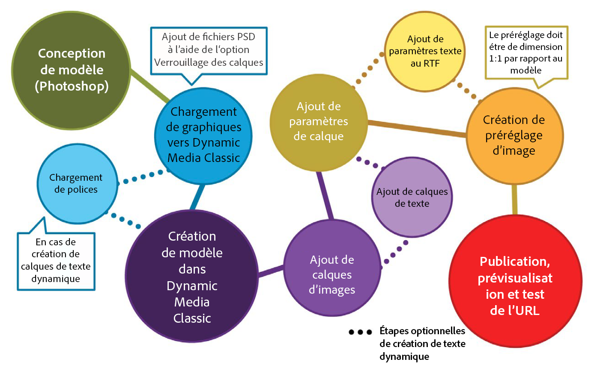
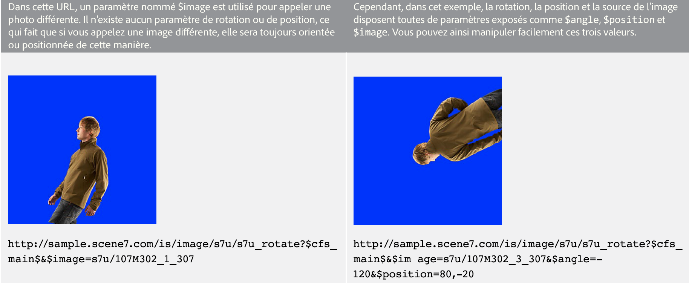
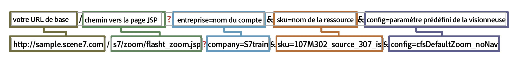
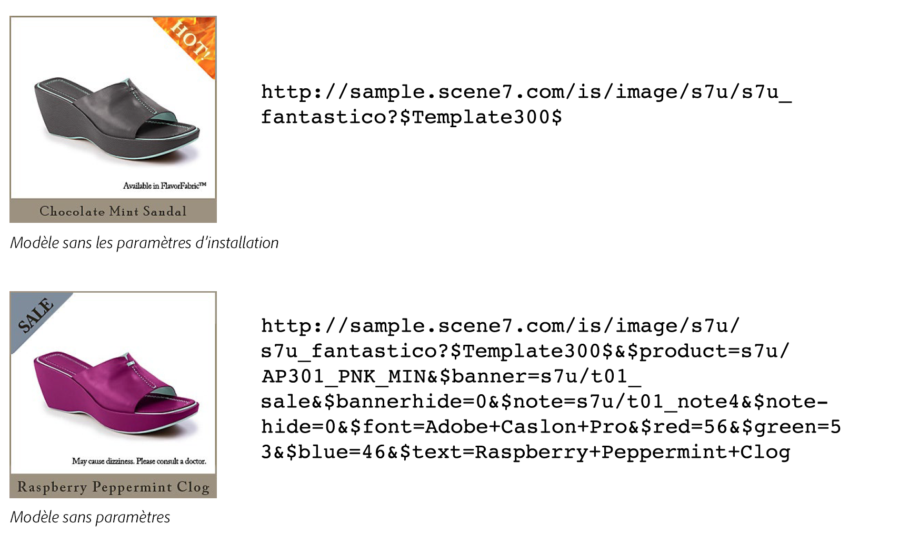

# Présentation des modèles de base {#basic-templates}

En termes de contenu multimédia dynamique classique, un modèle est un document qui peut être modifié dynamiquement via l’URL une fois le modèle publié. Dynamic Media Classic offres des modèles de base, des modèles basés sur des images appelés à partir du serveur d’images et composés d’images et de texte rendu.

L&#39;un des aspects les plus puissants des modèles est qu&#39;ils comportent des points d&#39;intégration directs qui vous permettent de les lier à votre base de données. Ainsi, non seulement vous pouvez servir une image et la redimensionner, mais vous pouvez aussi requête votre base de données pour trouver des articles nouveaux ou vendus et les faire apparaître comme une incrustation sur l&#39;image. Vous pouvez demander une description de l’élément et la faire apparaître sous la forme d’une étiquette dans une police que vous avez choisie et mise en page. Les possibilités sont illimitées.

Les modèles de base peuvent être implémentés de plusieurs manières différentes, de simple à complexe. Par exemple :

- Marchandisage de base. Utilise des étiquettes telles que &quot;livraison gratuite&quot; si le produit est livré gratuitement. Ces étiquettes sont configurées par l’équipe de marchandisage de Photoshop et le Web utilise la logique pour savoir quand les appliquer à l’image.
- Marchandisage avancé. Chaque modèle comporte plusieurs variables et peut afficher plusieurs options en même temps. Utilise une base de données, des règles de stock et des règles de fonctionnement pour déterminer quand afficher un produit sous la forme &quot;Juste à l’entrée&quot;, &quot;Autorisation&quot; ou &quot;Vendu&quot;. Vous pouvez également utiliser la transparence derrière le produit pour l’afficher sur différents arrière-plans, par exemple dans des salles différentes. Les mêmes modèles et/ou ressources peuvent être réutilisés dans la page des détails du produit pour afficher une version agrandie ou agrandie du même produit sur différents arrière-plans.

Il est important de comprendre que Dynamic Media Classic ne fournit que la partie visuelle de ces applications basées sur des modèles. Les sociétés Dynamic Media Classic ou leurs partenaires d’intégration doivent fournir les règles de fonctionnement, la base de données et les compétences de développement nécessaires à la création des applications. Il n’existe pas d’application de modèle intégrée ; les concepteurs configurent le modèle dans Dynamic Media Classic et les développeurs utilisent des appels d’URL pour modifier les variables du modèle.

À la fin de cette section du didacticiel, vous saurez comment :

- Téléchargez un fichier Photoshop PSD vers Dynamic Media Classic pour l’utiliser comme base d’un modèle.
- Créez un modèle de base de marchandisage simple composé de calques d’image.
- ajoutez les calques de texte et rendez-les variables à l’aide de paramètres.
- Créez une URL de modèle et manipulez l’image de manière dynamique dans le navigateur Web.

>[!NOTE]
>
>Toutes les URL de ce chapitre sont fournies à titre indicatif uniquement ; ce ne sont pas des liens en direct.

## Présentation des modèles de base

La définition d’un modèle de base (ou simplement d’un &quot;modèle&quot;, pour faire court) est une image superposée à l’URL. Le résultat final est une image, mais elle peut être modifiée par l’URL. Il peut être composé de photos, de texte ou de graphiques, toute combinaison de ressources P-TIFF dans Dynamic Media Classic.

Les modèles sont très similaires aux fichiers Photoshop PSD, car ils disposent d’un flux de travail similaire et de fonctionnalités similaires.

- Les deux se composent de couches qui sont semblables à des feuilles d&#39;acétate empilé. Vous pouvez composer des images partiellement transparentes et voir à travers les zones transparentes d’un calque les calques situés en dessous.
- Il est possible de déplacer et de faire pivoter les calques pour repositionner le contenu et de modifier l’opacité et les modes de fusion pour rendre le contenu partiellement transparent.
- Vous pouvez créer des calques de texte. La qualité peut être très élevée, car le serveur d’images utilise le même moteur de texte que Photoshop et Illustrator.
- Des styles de calque simples peuvent être appliqués à chaque calque pour créer des effets spéciaux tels que des ombres portées ou des lueurs.

Cependant, contrairement aux fichiers PSD Photoshop, les calques peuvent être entièrement dynamiques et contrôlés par le biais d’une URL sur le serveur d’images.

- Vous pouvez ajouter des variables à toutes les propriétés de modèle, ce qui facilite la modification de sa composition à la volée.
- Les variables appelées paramètres vous permettent d’exposer uniquement la partie du modèle que vous souhaitez modifier.

Il vous suffit d’ajouter une balise d’emplacement pour chaque calque qui varie au lieu de placer tous les calques dans un seul fichier, comme vous le faites dans Photoshop, et de les afficher et de les masquer (mais vous pouvez également le faire, si vous préférez).

A l’aide d’un espace réservé, vous pouvez remplacer dynamiquement le contenu d’un calque par un autre élément publié et il prend automatiquement les mêmes propriétés (telles que la taille et la rotation) du calque qu’il a remplacé.

Comme les modèles de base sont généralement conçus à Photoshop mais déployés via une URL, un projet de modèle nécessite un mélange de compétences techniques et de conception. Nous supposons généralement que la personne qui fait le travail du modèle créatif est un concepteur Photoshop, et que la personne qui le met en oeuvre est un développeur Web. Les équipes de création et de développement doivent travailler en étroite collaboration pour que le modèle soit un succès.

Les projets de modèles peuvent être relativement simples ou extrêmement complexes en fonction des règles de fonctionnement et des besoins de l’application. Les modèles de base sont appelés à partir du serveur d’images. Cependant, en raison de la flexibilité de l’environnement Contenu multimédia dynamique, vous pouvez même imbriquer des modèles dans d’autres modèles, ce qui vous permet de créer des images assez complexes qui peuvent être liées par des variables couramment nommées.

- En savoir plus sur les concepts de base [des](https://docs.adobe.com/content/help/en/dynamic-media-classic/using/template-basics/quick-start-template-basics.html)modèles.
- Découvrez comment créer un modèle [de](https://docs.adobe.com/content/help/en/dynamic-media-classic/using/template-basics/creating-template.html#creating_a_template)base.

## Création d’un modèle de base

Lorsque vous travaillez avec un modèle de base, vous suivez généralement les étapes du processus décrites dans le diagramme ci-dessous. Les étapes marquées de lignes en pointillé sont facultatives si vous utilisez des calques de texte dynamiques et sont indiquées dans les instructions ci-dessous comme &quot;Processus de texte&quot;. Si vous n’utilisez pas de texte, suivez le chemin principal uniquement.

_Flux de travaux Modèle de base._

1. Créez et créez vos fichiers. La plupart des utilisateurs le font en Adobe Photoshop. Créez des fichiers à la taille exacte dont vous avez besoin : s’il s’agit d’une image de 200 pixels pour une page miniature, concevez-la à 200 pixels. Si vous devez effectuer un zoom dessus, concevez-le à une taille d’environ 2 000 pixels. Utilisez Photoshop (et/ou Illustrator enregistré en tant que bitmap) pour créer les fichiers et utilisez Dynamic Media Classic pour assembler les pièces, gérer les calques et ajouter des variables.
2. Après avoir conçu des fichiers graphiques, téléchargez-les dans Dynamic Media Classic. Plutôt que de télécharger des fichiers individuels à partir du fichier PSD, nous vous recommandons de télécharger l’intégralité de votre fichier PSD superposé et de faire en sorte que Dynamic Media Classic crée un fichier par calque à l’aide de l’option **Conserver les calques** lors du téléchargement (voir ci-dessous pour plus de détails). _Processus de texte : Si vous créez du texte dynamique, téléchargez également vos polices. Le texte dynamique est variable et contrôlé par l’intermédiaire de l’URL. Si votre texte est statique ou s’il ne comporte que quelques phrases courtes qui ne changent pas (par exemple, les balises qui disent &quot;Nouveau&quot; ou &quot;Vente&quot; plutôt que &quot;X % de réduction&quot;, le X étant un nombre variable), nous vous recommandons de prérendre le texte dans Photoshop et de le télécharger sous forme d’images sous forme de calques pixellisés. Il sera plus facile et vous pourrez mettre le texte en forme exactement comme vous le souhaitez._
3. Créez le modèle dans Dynamic Media Classic à l’aide de l’éditeur Concepts de base des modèles du menu Créer et ajoutez des calques d’image. Processus de texte : Créez des calques de texte dans le même éditeur. Cette étape est requise lors de la création manuelle d’un modèle dans Dynamic Media Classic. Choisissez une taille de canevas correspondant à votre conception, faites glisser et déposez les images sur la trame et définissez les propriétés de calque (taille, rotation, opacité, etc.). Vous ne placez pas tous les calques possibles sur votre modèle, juste un espace réservé par calque d’image. _Processus de texte : Vous créez des calques de texte à l’aide de l’outil Texte, comme pour la création de calques de texte dans Photoshop. Vous pouvez choisir une police et la mettre en forme en utilisant les mêmes options que celles disponibles avec l’outil Type de Photoshop._ Un autre flux de travail consiste à télécharger un fichier PSD et à faire en sorte que Dynamic Media Classic génère un modèle &quot;gratuit&quot; et puisse même recréer des calques de texte. Cet aspect est décrit en détail plus loin.
4. Une fois les calques créés, ajoutez des paramètres (variables) à toute propriété de calque que vous souhaitez contrôler par l’intermédiaire de l’URL, y compris la source du calque (l’image elle-même). _Processus de texte : Vous pouvez également ajouter des paramètres aux calques de texte, à la fois pour contrôler le contenu du texte et la taille et la position du calque lui-même, ainsi que toutes les options de formatage telles que la couleur de police, la taille de police, le suivi horizontal, etc._
5. Créez un paramètre d’image prédéfini correspondant à la taille de votre modèle. Nous vous recommandons de procéder de la sorte que le modèle soit toujours appelé à la taille 1:1 et d’ajouter également l’accentuation à tous les calques d’image volumineux qui sont redimensionnés pour s’adapter au modèle. Si vous créez un modèle à zoomer, cette étape n’est pas nécessaire.
6. Publiez, copiez l’URL à partir de la prévisualisation Dynamic Media Classic et testez-la dans un navigateur.

## Préparation et téléchargement de vos ressources de modèle dans Dynamic Media Classic

Avant de télécharger vos fichiers de modèle vers Dynamic Media Classic, vous devez effectuer quelques étapes préparatoires.

### Préparation du fichier PSD pour le téléchargement

Avant de télécharger votre fichier Photoshop dans Dynamic Media Classic, simplifiez les calques de Photoshop afin de faciliter leur utilisation et d’assurer une compatibilité optimale avec le serveur d’images. Votre fichier PSD comprend souvent de nombreux éléments que Dynamic Media Classic ne reconnaît pas et vous pouvez également obtenir de nombreuses petites pièces difficiles à gérer. Veillez à enregistrer une sauvegarde de votre fichier PSD maître si vous devez modifier l’original ultérieurement. Vous téléchargerez la copie simplifiée, et non le fichier original.

1. Simplifiez la structure des calques en fusionnant/aplatissant les calques associés qui doivent être activés/désactivés ensemble en un seul calque. Par exemple, l’étiquette &quot;NOUVEAU&quot; et la bannière bleue sont fusionnées en un seul calque afin que vous puissiez les afficher ou les masquer d’un simple clic.
   
2. Certains types de calques et effets de calque ne sont pas pris en charge par Dynamic Media Classic ou le serveur d’images et doivent être pixellisés avant le téléchargement. Sinon, les effets peuvent être ignorés ou les calques ignorés. La pixellisation d’un calque signifie la conversion si vous passez d’un élément modifiable à un élément non modifiable. Pour pixelliser des effets de calque ou des calques de texte, créez un calque vide, sélectionnez les deux et fusionnez à l’aide de **Calques > Fusionner les calques** ou de Ctrl + E/CMD + E.

   - Dynamic Media Classic ne peut pas grouper ni lier de calques. Tous les calques d’un groupe ou d’un ensemble lié sont convertis en calques distincts qui ne sont plus regroupés ou liés.
   - Les masques de calque seront convertis en transparence lors du transfert.
   - Les calques de réglage ne sont pas pris en charge et seront ignorés.
   - Les calques de remplissage, tels que les calques de couleur unie, seront pixellisés.
   - Les calques d’objet dynamique et les calques vectoriels sont pixellisés en images normales au moment du téléchargement et les Filtres dynamiques sont appliqués et pixellisés.
   - Les calques de texte seront également pixellisés, sauf si vous utilisez l’option Extraire le texte (voir ci-dessous pour plus d’informations).
   - La plupart des effets de calque seront ignorés et seuls quelques modes de fusion sont pris en charge. En cas de doute, ajoutez des effets simples dans Contenu multimédia dynamique classique (ombres intérieures ou extérieures, lueurs intérieures ou extérieures, par exemple) ou utilisez un calque vide pour fusionner et pixelliser l’effet dans Photoshop.

### Utilisation de polices

Vous téléchargerez et publierez également vos polices si vous devez générer du texte dynamique. La seule police incluse avec Dynamic Media Classic est Arial.

Il est de la responsabilité de chaque société d&#39;obtenir une licence d&#39;utilisation d&#39;une police sur le Web — le simple fait d&#39;avoir installé une police sur votre ordinateur ne vous donne pas le droit de l&#39;utiliser commercialement sur le Web, et votre société pourrait faire face à une action en justice de l&#39;éditeur de polices si elle est utilisée sans autorisation. En outre, les termes des licences varient : vous pouvez avoir besoin de licences distinctes pour l’affichage à l’écran et pour l’impression, par exemple.

Dynamic Media Classic prend en charge les polices OpenType (OTF), TrueType (TTF) et Type 1 Postscript. Les polices de valise uniquement pour Mac, les fichiers de collection de type, les polices système Windows et les polices de machine propriétaires (comme les polices utilisées par les machines de gravure ou de broderie) ne sont pas prises en charge. Vous devrez les convertir dans l’un des formats de police standard ou en remplacer une semblable pour les utiliser dans Dynamic Media Classic et sur Image Server.

Une fois les polices téléchargées dans Dynamic Media Classic, comme toute autre ressource, elles doivent également être publiées sur le serveur d’images. Une erreur de modèle très courante consiste à oublier de publier vos polices, ce qui entraîne une erreur d’image — le serveur d’images ne remplace pas une autre police à sa place. En outre, si vous souhaitez utiliser l’option **Extraction de texte** lors du téléchargement, vous devez télécharger vos fichiers de polices avant de télécharger le fichier PSD qui utilise ces polices. La fonction **Extraction de texte** tente de recréer votre texte en tant que calque de texte modifiable et de le placer dans un modèle Contenu multimédia dynamique classique. Cette question est abordée dans la rubrique suivante, Options PSD.

Gardez à l’esprit que les polices ont plusieurs noms internes qui sont souvent différents de leur nom de fichier externe. Vous pouvez voir tous leurs noms différents sur la page Détails de cette ressource dans Dynamic Media Classic. Voici les noms de la police Adobe Caslon Pro Semibold, répertoriée sous l’onglet Métadonnées de Dynamic Media Classic :

_Onglet Métadonnées de la page Détails d’une police dans Dynamic Media Classic._

Dynamic Media Classic utilise le nom de fichier de cette police (ACaslonPro-Semibold) comme ID de fichier, mais il ne s’agit pas du nom utilisé par le modèle. Le modèle utilise le nom RTF (Rich Text Format), répertorié dans la partie inférieure. RTF est la &quot;langue&quot; native du moteur de texte Image Server.

Si vous devez modifier les polices au moyen de l’URL, vous devez appeler le nom RTF de la police (et non l’ID de fichier), sinon vous obtiendrez une erreur. Dans ce cas, le nom correct de cette police est &quot;Adobe Caslon Pro&quot;. Vous trouverez ci-dessous des informations supplémentaires sur les polices et les RTF dans la rubrique Paramètres RTF et de texte.

Les formats de fichier de polices les plus courants disponibles sur les systèmes Windows et Mac sont OpenType et TrueType. OpenType a une extension .OTF, alors que TrueType est .TTF. Les deux formats fonctionnent également dans Dynamic Media Classic.

### Sélection des options lors du téléchargement de votre fichier PSD

Vous n’avez pas besoin de télécharger un fichier Photoshop (PSD) pour créer un modèle ; un modèle peut être créé à partir de n’importe quel fichier d’image dans Dynamic Media Classic. Cependant, le téléchargement d’un fichier PSD peut faciliter la création, car ces fichiers se trouvent déjà dans un fichier PSD superposé. En outre, Dynamic Media Classic génère automatiquement un modèle lorsque vous téléchargez un fichier PSD superposé.

- **Conserver les calques.** C&#39;est l&#39;option la plus importante. Ceci indique à Dynamic Media Classic de créer un fichier d’image par calque Photoshop. Si elle n’est pas cochée, toutes les autres options sont désactivées et le fichier PSD est aplati en une seule image.
- **Créer** un **modèle.** Cette option prend les différents calques générés et crée automatiquement un modèle en les combinant à nouveau. L’inconvénient d’utiliser le modèle généré automatiquement est que Dynamic Media Classic place tous les calques dans un seul fichier, alors que nous n’avons besoin que d’une seule balise d’emplacement par calque. Il est facile de supprimer les calques supplémentaires, mais si vous en avez plusieurs, il est plus rapide de les recréer. Veillez à renommer le nouveau modèle ; si vous ne le faites pas, il sera écrasé lors du prochain rechargement du même fichier PSD.
- **Extraire du texte.** Cette opération recrée les calques de texte du fichier PSD sous forme de calques de texte dans le modèle à l’aide de la police que vous avez téléchargée. Cette étape est requise si votre texte se trouve sur un chemin d’accès dans Photoshop et que vous souhaitez conserver ce chemin d’accès dans le modèle. Cette fonction nécessite l’option **Créer un modèle** , car le texte extrait ne peut être créé que par un modèle généré au moment du téléchargement.
- **Etendre les calques à la taille d’arrière-plan.** Ce paramètre donne à chaque calque la même taille que la trame PSD globale. Cela s’avère très utile pour les calques qui resteront toujours en position fixe : sinon, lorsque vous permutez des images dans le même calque, vous devrez peut-être les repositionner.
- **Affectation de nom de calque.** Cela indique à Dynamic Media Classic comment nommer chaque fichier généré par calque. Nous vous recommandons **Photoshop** **et le** nom de couche **** ou Photoshop et **Layer Number.****** Les deux options utilisent le nom PSD comme première partie du nom et ajoutent le nom du calque ou le numéro à la fin. Si, par exemple, vous disposez d’un fichier PSD nommé &quot;shirt.psd&quot; et qu’il comporte des calques nommés &quot;front&quot;, &quot;manches&quot; et &quot;collier&quot;, si vous téléchargez à l’aide de l’option **Photoshop and Layer** Name **** , Dynamic Media Classic génère les identifiants de fichier &quot;shirt_front&quot;, &quot;chemises_manches&quot; et &quot;chemise_collar&quot;. L’utilisation de l’une de ces options permet de s’assurer que le nom est unique dans Dynamic Media Classic.

## Création d’un modèle avec des calques d’image

Même si Dynamic Media Classic peut créer automatiquement un modèle à partir d’un fichier PSD superposé, vous devez savoir comment créer le modèle manuellement. Comme expliqué ci-dessus, il peut arriver que vous ne souhaitiez pas utiliser le modèle créé par Dynamic Media Classic.

### IU Concepts de base des modèles

Commençons par nous familiariser avec l&#39;interface d&#39;édition.

Dans le centre gauche se trouve votre zone de travail qui affiche la prévisualisation de votre modèle final. Sur le côté droit se trouvent les panneaux Calques et Propriétés de calque. C&#39;est dans ces domaines que vous ferez le plus de travail.

_Page Concepts de base des modèles de création._

- **Prévisualisation/Zone de travail.** Voici la fenêtre principale. Ici, vous pouvez déplacer, redimensionner et faire pivoter des calques à l’aide de la souris. Les contours des calques s’affichent sous la forme de lignes en pointillé.
- **Calques.** Cette opération est similaire au panneau Calques Photoshop. Lorsque vous ajoutez des calques à votre modèle, ils s’affichent ici. Les calques sont empilés de haut en bas : le calque supérieur du panneau Calques est visible au-dessus des autres calques situés au-dessous dans la liste.
- **Propriétés du calque.** Vous pouvez ici ajuster toutes les propriétés d’un calque à l’aide de commandes numériques. Sélectionnez d’abord un calque, puis ajustez ses propriétés.
- **** URL composite **.** Au bas de l’interface utilisateur se trouve la zone URL composite. Cette section ne sera pas abordée dans le didacticiel. Cependant, ici, votre modèle est déconstruit sous la forme d’une série de modificateurs d’URL de diffusion d’images. Cette zone est modifiable : si vous connaissez bien les commandes du serveur Image Server, vous pouvez modifier manuellement le modèle ici. Cependant, vous pouvez aussi le briser. Comme Photoshop, la numérotation des calques est début à 0. La zone de travail est le calque 0 et le premier calque que vous ajoutez vous-même est le calque 1. Les modes de fusion déterminent la manière dont les pixels d’un calque se fondent avec les pixels situés en dessous. Vous pouvez créer divers effets spéciaux à l’aide de modes de fusion.

#### Utilisation de l’éditeur de base des modèles

Vous trouverez ci-dessous les étapes du processus de début de votre modèle de base :

1. Dans Contenu multimédia dynamique classique, sélectionnez **Créer > Concepts de base des** modèles. Vous pouvez soit n’avoir rien sélectionné, soit sélectionner une image pour le début, qui deviendra le premier calque de votre modèle.
2. Choisissez une taille et appuyez sur **OK**. Cette taille doit correspondre à la taille que vous avez conçue dans Photoshop. L’éditeur de modèles se charge.
3. Si aucune image n’a été sélectionnée à l’étape 1, recherchez ou recherchez une image dans le panneau de ressources sur la gauche et faites-la glisser sur la zone de travail.

   - L’image sera automatiquement redimensionnée pour s’adapter à la taille de la zone de travail. Si vous prévoyez de permuter vos images haute résolution, vous devez généralement importer l’une de vos images P-TIFF volumineuses (2 000 px) et l’utiliser comme espace réservé.
   - Il doit s’agir du calque le plus en bas du modèle, mais vous pourrez réorganiser les calques ultérieurement.

4. Redimensionnez ou repositionnez le calque directement dans la zone de travail, ou en réglant les paramètres dans le panneau Propriétés calque.
5. Faites glisser d’autres calques d’image si nécessaire. ajoutez des effets de calques si vous le souhaitez. Voir la rubrique _Ajoutant les effets_ de couche, ci-dessous.
6. Cliquez sur **Enregistrer**, choisissez un emplacement et attribuez un nom au modèle. Vous pouvez la prévisualisation, mais à ce stade votre modèle ressemblera exactement à une image Photoshop aplatie — il n&#39;est pas encore modifiable.

### ajouter les effets de calque

Le serveur d’images prend en charge quelques effets de calque programmatiques — des effets spéciaux qui modifient l’aspect du contenu d’un calque. Ils fonctionnent de la même façon que les effets de calque à Photoshop. Ils sont attachés à un calque mais contrôlés indépendamment du calque. Vous pouvez les ajuster ou les supprimer sans apporter de modification permanente au calque lui-même.

- **Ombre** portée. Applique une ombre à l’extérieur des limites du calque, positionnée par un décalage de x et y pixels.
- **Ombre** interne. Applique une ombre à l’intérieur des limites du calque, positionnée par un décalage de x et y pixels.
- **Lueur** extérieure. Applique un effet d’éclat uniforme autour de tous les bords du calque.
- **Lueur** interne. Applique un effet d’éclat uniforme à l’intérieur de tous les bords du calque.

_Un calque avec et sans ombre portée_

Pour ajouter un effet, cliquez sur **Ajouter l’effet**, puis choisissez un effet dans le menu. Comme pour les calques ordinaires, vous pouvez sélectionner un effet dans le panneau Calques et utiliser le panneau Propriétés calque pour modifier ses paramètres.

Les effets d’ombre sont décalés horizontalement ou verticalement par rapport au calque, tandis que les effets d’ombre sont appliqués uniformément dans toutes les directions. Les effets internes agissent sur les parties opaques du calque, tandis que les effets externes n&#39;affectent que les zones transparentes.

En savoir plus[sur l&#39;ajout d&#39;effets](https://docs.adobe.com/content/help/en/dynamic-media-classic/using/template-basics/creating-template.html#using-shadow-and-glow-effects-on-layers)de calque.

### ajouter des paramètres

Si vous combinez des calques et les enregistrez, le résultat net n’est pas différent d’une image Photoshop aplatie. Ce qui rend les modèles spéciaux, c&#39;est la possibilité d&#39;ajouter des paramètres aux propriétés de chaque calque, de sorte qu&#39;ils puissent être modifiés dynamiquement par l&#39;intermédiaire de l&#39;URL.

Dans les termes de Contenu multimédia dynamique classique, un paramètre est une variable qui peut être liée à une propriété de modèle afin de pouvoir être manipulée via une URL. Lorsque vous ajoutez un paramètre à un calque, Dynamic Media Classic expose cette propriété dans l’URL en préfixant le nom de votre paramètre au moyen d’un signe dollar ($). Par exemple, si vous créez un paramètre appelé &quot;size&quot; pour modifier la taille d’un calque, Dynamic Media Classic renommera votre paramètre $size.

Si vous n’ajoutez pas de paramètre pour une propriété, celle-ci reste masquée dans la base de données Dynamic Media Classic et ne s’affiche pas dans l’URL.

En l’absence de paramètres, les URL sont généralement beaucoup plus longues, en particulier si vous utilisez également du texte dynamique. Le texte ajoute plusieurs dizaines de caractères supplémentaires à chaque URL.

Enfin, votre jeu initial de paramètres deviendra la valeur par défaut des propriétés dans le modèle. Si vous créez votre modèle, ajoutez des paramètres, puis appelez l’URL sans ses paramètres, le serveur d’images crée l’image avec toutes les valeurs par défaut enregistrées dans le modèle. Les paramètres ne sont nécessaires que si vous souhaitez modifier une propriété. Si une propriété n’a pas besoin de changer, vous n’avez pas besoin de définir un paramètre.

#### Création de paramètres

Il s’agit du processus de création de paramètres :

1. Cliquez sur le bouton **Paramètres** en regard du nom du calque pour lequel vous souhaitez créer des paramètres. L&#39;écran Paramètres s&#39;affiche. Il liste chaque propriété sur le calque et sa valeur.
1. Sélectionnez l’option **Activé** en regard du nom de chaque propriété à transformer en paramètre. Un nom de paramètre par défaut s’affiche. Vous pouvez uniquement ajouter des paramètres aux propriétés qui ont changé d’état par défaut.

   - Par exemple, si vous ajoutez un calque et que vous le conservez à sa position xy par défaut de 0,0, Dynamic Media Classic n’expose pas de propriété **Position** . Pour corriger ce problème, déplacez le calque d’au moins un pixel. Désormais, Dynamic Media Classic affiche **Position** en tant que propriété que vous pouvez paramétrer.
   - Pour ajouter un paramètre à la propriété d’affichage/masquage (qui active et désactive le calque), cliquez sur l’icône **Afficher** ou **Masquer le calque** pour activer ou désactiver le calque (si vous le souhaitez, vous pouvez le réactiver). Dynamic Media Classic expose désormais une propriété **Hide** qui peut être paramétrée.

1. Renommez les noms de paramètre par défaut en un nom plus facile à identifier dans l’URL. Par exemple, si vous souhaitez ajouter un paramètre pour modifier le calque de bannière au-dessus d’une image, remplacez le nom par défaut &quot;layer_2_src&quot; par &quot;banner&quot;.
1. Appuyez sur **Fermer** pour quitter l’écran Paramètres.
1. Répétez cette procédure pour les autres calques en cliquant sur le bouton **Paramètres** et en ajoutant et renommant des paramètres.
1. Enregistrez vos modifications lorsque vous avez terminé.

>[!TIP]
>
>Renommez vos paramètres en un nom significatif et développez une convention d’affectation de nom pour normaliser ces noms. Assurez-vous que la convention d&#39;attribution des noms est approuvée à l&#39;avance par les équipes de conception et de développement.
>
>Impossible d&#39;ajouter un paramètre car la propriété n&#39;est pas visible ? Il vous suffit de modifier la propriété du calque par défaut (en déplaçant, redimensionnant, masquant, etc.). Vous devriez maintenant voir cette propriété exposée.

En savoir plus sur les paramètres de modèle.

## Création d’un modèle avec des calques de texte

Vous allez maintenant apprendre à créer un modèle de base qui inclut des calques de texte.

### Compréhension du texte dynamique

Vous savez maintenant comment créer un modèle de base à l’aide de calques d’image. Pour de nombreuses applications, c&#39;est tout ce dont vous avez besoin. Comme vous l’avez vu dans l’exercice précédent, les calques dont le texte est simple (comme &quot;Vente&quot; et &quot;Nouveau&quot;) peuvent être pixellisés et traités comme des images, car leur texte n’a pas besoin d’être modifié.

Cependant, si vous aviez besoin de :

- ajoutez une étiquette pour indiquer &quot;25 % de réduction&quot;, la valeur de 25 % étant variable.
- ajouter une étiquette de texte avec le nom du produit au-dessus de l’image
- Localisez vos calques dans différentes langues en fonction du pays dans lequel votre modèle est affiché.

Dans ce cas, vous souhaitez ajouter des calques de texte dynamiques avec des paramètres pour contrôler le texte et/ou la mise en forme.

Pour créer du texte, vous devez télécharger certaines polices. Sinon, Dynamic Media Classic prend la valeur Arial par défaut. Les polices doivent également être publiées sur le serveur d’images, sinon une erreur s’affichera au moment où il tentera de rendre tout texte qui utilise cette police.

### Paramètres RTF et de texte

Pour ajouter des variables au texte à l’aide de l’outil Concepts de base des modèles, vous devez comprendre comment le texte est rendu. Le serveur d’images génère du texte à l’aide de l’Adobe Text Engine, le même moteur utilisé par Photoshop et Illustrator, et le compose comme un calque dans l’image finale. Pour communiquer avec le moteur, le serveur d’images utilise le format RTF (Rich Text Format).

RTF est une spécification de format de fichier développée par Microsoft pour la spécification de la mise en forme des documents. Il s’agit d’un langage de balisage standard utilisé par la plupart des logiciels de traitement de texte et de messagerie électronique. Si vous écrivez dans une URL &amp;text=\b1 Hello, le serveur d’images générera une image avec le mot &quot;Hello&quot; en caractères gras, car \b1 est la commande RTF pour mettre le texte en gras.

La bonne nouvelle est que Dynamic Media Classic génère le RTF pour vous. Chaque fois que vous saisissez du texte dans un modèle et ajoutez une mise en forme, Dynamic Media Classic écrit automatiquement le code RTF dans le modèle. La raison pour laquelle nous le mentionnons est que vous ajouterez directement des paramètres au RTF lui-même, il est donc important que vous en soyez un peu familier.

#### Création de calques de texte

Vous pouvez créer des calques de texte dans un modèle dans Dynamic Media Classic de deux manières :

1. Outil Texte dans Dynamic Media Classic. Nous discuterons de cette méthode ci-dessous. L’éditeur Concepts de base des modèles dispose d’un outil qui vous permet de créer une zone de texte, de saisir du texte et de le mettre en forme. Dynamic Media Classic génère le fichier RTF selon les besoins et le place dans un calque distinct.
2. Extraire le texte (au moment du téléchargement). L’autre méthode consiste à créer le calque de texte dans Photoshop et à l’enregistrer dans le fichier PSD en tant que calque de texte normal (au lieu de le pixelliser en tant que calque d’image). Vous téléchargez ensuite le fichier dans Dynamic Media Classic et utilisez l’option **Extraction de texte** . Dynamic Media Classic convertit chaque calque de texte Photoshop en calque de texte de diffusion d’images à l’aide des commandes RTF. Si vous utilisez cette méthode, veillez à télécharger d’abord vos polices dans Dynamic Media Classic. Sinon, Dynamic Media Classic remplacera une police par défaut lors du téléchargement et il n’y aura aucun moyen facile de remplacer la police correcte.

### Editeur de texte

Vous pouvez saisir du texte à l’aide de l’éditeur de texte. L&#39;Editeur de texte est une interface WYSIWYG qui vous permet de saisir et de formater votre texte à l&#39;aide de contrôles de formatage similaires à ceux de Photoshop ou Illustrator.

_Éditeur de texte Concepts de base des modèles._

Vous effectuerez la majeure partie de votre travail dans l’onglet **Prévisualisation** , qui vous permet de saisir du texte et de le voir affiché tel qu’il apparaîtra dans le modèle. Il existe également un onglet **Source** , qui est utilisé pour modifier manuellement le RTF, si nécessaire.

Le processus général consiste à utiliser l’onglet **Prévisualisation** pour saisir du texte.

Ensuite, vous sélectionnez le texte et choisissez une mise en forme telle que la couleur de la police, la taille de la police ou la justification à l’aide des commandes situées en haut. Une fois le texte mis en forme comme vous le souhaitez, cliquez sur **Appliquer** pour le voir mettre à jour dans la prévisualisation de la zone de travail. Vous fermez ensuite l’éditeur de texte pour revenir à la fenêtre principale Concepts de base des modèles.

#### Utilisation de l’éditeur de texte

Voici les étapes du processus d’ajout de texte dans la page de création Concepts de base des modèles :

1. Cliquez sur le bouton de l’outil **Texte** en haut de la page de création.
2. Faites glisser une zone de texte à l’endroit où le texte doit apparaître. La fenêtre Editeur de texte s’ouvre dans une fenêtre modale. En arrière-plan, votre modèle s’affiche, mais il n’est pas modifiable tant que vous n’avez pas terminé de modifier le texte.
3. Saisissez l’exemple de texte à afficher lors du premier chargement du modèle. Par exemple, si vous créez une zone de texte pour une image de courriel personnalisée, votre texte peut indiquer &quot;Bonjour nom. Il est maintenant temps d&#39;épargner !&quot; Par la suite, vous ajouteriez un paramètre de texte pour remplacer Nom par une valeur que vous envoyerez sur l’URL. Votre texte n’apparaîtra pas dans le modèle sous la fenêtre tant que vous n’aurez pas cliqué sur **Appliquer**.
4. Pour mettre en forme votre texte, sélectionnez-le en le faisant glisser avec la souris et choisissez un contrôle de formatage dans l’interface utilisateur.

   - Il existe de nombreuses options de formatage. Certaines des polices les plus courantes sont la police (face), la taille et la couleur de la police, ainsi que la justification gauche/centre/droite.
   - N&#39;oubliez pas de sélectionner d&#39;abord le texte. Sinon, vous ne pourrez appliquer aucune mise en forme.
   - Pour choisir une autre police, assurez-vous de sélectionner le texte et ouvrez le menu Police. L’éditeur affiche une liste de toutes les polices téléchargées dans Dynamic Media Classic. Si une police est également installée sur votre ordinateur, elle s’affiche en noir. S&#39;il n&#39;est pas installé sur votre ordinateur, il s&#39;affiche en rouge. Cependant, il sera toujours rendu dans la fenêtre de prévisualisation lorsque vous cliquerez sur **Appliquer**. Il vous suffit de télécharger des polices dans Dynamic Media Classic pour les rendre accessibles à toute personne utilisant Dynamic Media Classic. Une fois que vous publiez, le serveur d’images utilise ces polices pour générer le texte : les utilisateurs n’ont pas besoin d’installer de polices pour voir le texte que vous créez, car il fait partie d’une image.
   - Contrairement à Photoshop et Illustrator, le serveur d’images peut aligner le texte verticalement dans la zone de texte. La valeur par défaut est l’alignement supérieur. Pour modifier ce paramètre, sélectionnez votre texte, puis choisissez **Milieu** ou **Bas** dans le menu Alignement **** vertical.
   - Si vous agrandissez le texte de la zone (ou si la zone de texte est trop petite), tout ou partie de ce texte sera coupé et disparaîtra. Réduisez la taille de la police ou agrandissez la zone.

5. Cliquez sur **Appliquer** pour que vos modifications prennent effet dans la fenêtre de la zone de travail. Vous devez cliquer sur **Appliquer**, sinon vous perdrez vos modifications.
6. Lorsque vous avez terminé, cliquez sur **Fermer**. Si vous souhaitez revenir au mode de modification, cliquez en doublon sur le calque de texte pour rouvrir l’éditeur de texte.

L’éditeur de texte prévisualisation exactement la taille de la police si celle-ci est installée localement sur votre système.

### A propos de l’Ajoute de paramètres aux calques de texte

Nous suivons à présent un processus similaire pour l’ajout de paramètres de texte, comme nous l’avons fait pour les paramètres de calque. Les calques de texte peuvent également utiliser des paramètres de calque pour la taille, la position, etc. cependant, ils peuvent prendre des paramètres supplémentaires qui vous permettent de contrôler n&#39;importe quel aspect du RTF.

Contrairement aux paramètres de calque, vous ne sélectionnez que la valeur à modifier et ajoutez un paramètre à cette valeur plutôt que d’ajouter un paramètre à la propriété entière.

Exemple de RTF :

Lorsque vous examinez le RTF, vous devez déterminer où se trouve chaque paramètre à modifier. Dans le RTF ci-dessus, certaines peuvent avoir un certain sens et vous pouvez voir d&#39;où vient le formatage.

Vous pouvez voir l&#39;expression Sandal à la Monnaie de Chocolat — c&#39;est le texte lui-même.

- Il y a une référence à la police Pauvre Richard — c&#39;est là que les polices sont sélectionnées.
- Vous pouvez voir une valeur RVB : \red56\green53\blue4 — il s&#39;agit de la couleur du texte.
- Bien que la taille de police soit de 20, le nombre 20 n’est pas visible. Cependant, vous voyez une commande \fs40 — pour une raison étrange, RTF mesure les polices en demi-points. \fs40 est donc la taille de police !

Vous disposez de suffisamment d’informations pour créer vos paramètres, mais il existe une référence complète à toutes les commandes RTF dans la documentation sur la diffusion d’images. Consultez la documentation [sur la diffusion](https://docs.adobe.com/content/help/en/dynamic-media-developer-resources/image-serving-api/image-serving-api/http-protocol-reference/text-formatting/c-text-formatting.html#concept-0d3136db7f6f49668274541cd4b6364c)d’images.

#### ajouter des paramètres aux calques de texte

Voici les étapes à suivre pour ajouter des paramètres aux calques de texte.

1. Cliquez sur le bouton **Paramètres** (un &quot;P&quot;) en regard du nom du calque de texte pour lequel vous souhaitez créer des paramètres. L&#39;écran Paramètres s&#39;affiche. L’onglet **Commun** liste chaque propriété du calque et sa valeur. Vous pouvez y ajouter des paramètres de calque standard.
1. Cliquez sur l&#39;onglet **Texte** . Ici, vous pouvez voir le RTF en haut ; les paramètres que vous ajoutez seront inférieurs à cela.
1. Pour ajouter un paramètre, mettez d’abord en surbrillance la valeur à modifier, puis cliquez sur le bouton **Ajouter le paramètre** . Veillez à ne sélectionner que les valeurs des commandes et non la commande entière. Par exemple, pour définir un paramètre pour le nom de la police dans l’exemple RTF ci-dessus, j’aimerais uniquement mettre en surbrillance &quot;Richard pauvre&quot; et ajouter un paramètre à cela, mais pas aussi &quot;\f0&quot;. Lorsque vous cliquez sur Paramètre **** d’Ajoute, il apparaît dans la liste ci-dessous et la valeur du paramètre apparaît en rouge dans le RTF tant qu’il est sélectionné. Si vous devez supprimer un paramètre, cochez la case **Activé** pour le désactiver et il disparaîtra.
1. Cliquez sur pour renommer votre paramètre en un nom plus significatif.
1. Une fois que vous avez terminé, votre RTF est mis en surbrillance en vert là où se trouvent les paramètres, et vos noms et valeurs de paramètre sont répertoriés ci-dessous.
1. Cliquez sur **Fermer** pour quitter l’écran Paramètres. Appuyez ensuite sur **Enregistrer** pour enregistrer le modèle. Si vous avez terminé de modifier le modèle, appuyez sur **Fermer** pour quitter la page Concepts de base des modèles.
1. Cliquez sur **Prévisualisation** pour tester votre modèle dans Dynamic Media Classic. Pour tester les paramètres de texte, entrez le nouveau texte ou les nouvelles valeurs dans la fenêtre de prévisualisation. Pour modifier la police, vous devez saisir le nom RTF exact de la police.

>[!TIP]
>
>Pour ajouter des paramètres à la couleur du texte, ajoutez séparément des paramètres pour rouge, vert et bleu. Par exemple, si le RTF est défini `\red56\green53\blue46`, vous ajoutez des paramètres rouge, vert et bleu distincts pour les valeurs 56, 53 et 46. Dans l’URL, vous modifiez la couleur en appelant les trois éléments suivants : `&$red=56&$green=53&$blue=46`.

Découvrez comment [créer des paramètres](https://docs.adobe.com/content/help/en/dynamic-media-classic/using/template-basics/creating-template-parameters.html#creating-dynamic-text-parameters)de texte dynamique.

## Publication et création d’URL de modèles

### Création d’un paramètre d’image prédéfini

La création d’un paramètre prédéfini pour votre modèle n’est pas une étape obligatoire. Il est recommandé de l’utiliser comme meilleure pratique afin que le modèle soit toujours appelé à une taille 1:1 et également pour ajouter l’accentuation à tous les calques d’image volumineux qui sont redimensionnés pour s’adapter au modèle. Si vous appelez une image sans paramètre prédéfini, le serveur d’images peut redimensionner arbitrairement l’image à la taille par défaut (environ 400 pixels) et n’applique pas l’accentuation par défaut.

Un paramètre d’image prédéfini pour un modèle n’a rien de spécial. Si vous disposez déjà d’un paramètre prédéfini pour une image statique de la même taille, vous pouvez l’utiliser à la place.

### Publication 

Vous devez exécuter une publication pour voir vos modifications publiées sur le serveur d’images. Gardez à l’esprit ce qui doit être publié : les différents calques de fichier d’image, les polices du texte dynamique et le modèle lui-même. Comme pour d’autres fichiers de médias enrichis Dynamic Media Classic tels que les visionneuses d’images et les visionneuses à 360°, un modèle de base est une construction artificielle. Il s’agit d’une ligne de la base de données qui référence les images et les polices à l’aide d’une série de commandes de diffusion d’images. Ainsi, lorsque vous publiez le modèle, tout ce que vous faites est de mettre à jour les données sur le serveur Image Server.

En savoir plus sur [la publication de votre modèle](https://docs.adobe.com/content/help/en/dynamic-media-classic/using/template-basics/publishing-templates.html).

### Construction de l’URL du modèle

Un modèle de base a la même syntaxe d’URL essentielle qu’un appel d’image normal, comme expliqué précédemment. Un modèle comporte généralement plus de modificateurs — commandes séparées par une esperluette (&amp;) — tels que des paramètres avec des valeurs. Cependant, la principale différence réside dans le fait que vous appelez le modèle comme image principale, au lieu d’appeler une image statique.

Contrairement aux paramètres d’image prédéfinis, qui comportent un signe dollar ($) de chaque côté du nom du paramètre prédéfini, les paramètres ont un signe dollar au début. L&#39;emplacement de ces panneaux en dollars est important.

**Correct :**

`$text=46-inch LCD HDTV`

**Incorrect :**

`$text$=46-inch LCD HDTV`

`$text=46-inch LCD HDTV$`

`text=46-inch LCD HDTV`

Comme nous l’avons mentionné plus haut, les paramètres sont utilisés pour modifier le modèle. Si vous appelez le modèle sans paramètres, il rétablira ses paramètres par défaut, tels que définis dans l’outil de création Concepts de base des modèles. Si une propriété n’a pas besoin de changer, vous n’avez pas besoin de définir un paramètre.

_Exemples d’un modèle sans définir de paramètres (ci-dessus) et avec des paramètres (ci-dessous)._
