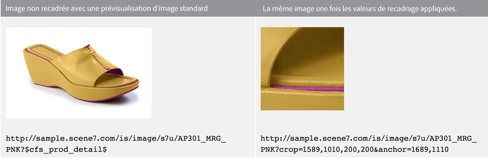
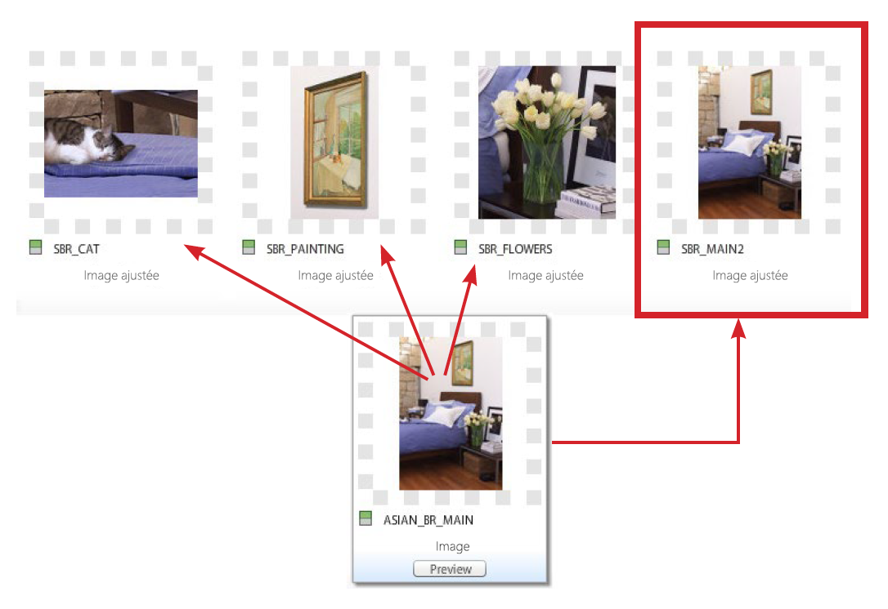
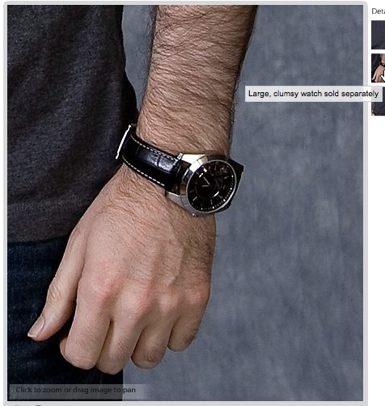

# Recadrage, images modifiées et Cibles de zoom {#crop-adjusted-zoom-targets}

L’un des points forts du concept d’image originale de Dynamic Media Classic est que vous pouvez réutiliser le fichier d’image pour de nombreuses utilisations. Traditionnellement, vous devez créer des versions rognées et distinctes de chaque image pour afficher des détails ou des échantillons. Lors de l’utilisation de Dynamic Media Classic, vous pouvez effectuer les mêmes tâches sur votre maître unique et enregistrer ces versions recadrées sous forme de nouveaux fichiers physiques ou sous forme de dérivés virtuels qui ne prennent aucun espace d’enregistrement.

À la fin de cette section du didacticiel, vous saurez comment :

- Recadrez les images dans Dynamic Media Classic et enregistrez-les sous forme de nouveaux fichiers originaux ou d’images virtuelles. [En savoir plus](https://docs.adobe.com/help/en/dynamic-media-classic/using/master-files/cropping-image.html).
- Enregistrez des images modifiées virtuelles et utilisez-les à la place de fichiers originaux. [En savoir plus](https://docs.adobe.com/content/help/en/dynamic-media-classic/using/master-files/adjusting-image.html).
- Créez des Cibles de zoom sur vos images pour en afficher les reflets. [En savoir plus](https://docs.adobe.com/content/help/en/dynamic-media-classic/using/zoom/creating-zoom-targets-guided-zoom.html).

## Recadrage

Dynamic Media Classic propose quelques outils de retouche d’images, dont l’outil Recadrer, qui sont facilement disponibles dans l’interface utilisateur. Vous pouvez recadrer votre image originale dans Dynamic Media Classic pour plusieurs raisons. Par exemple :

- Vous n&#39;avez pas accès au fichier d&#39;origine. Vous souhaitez afficher l’image avec un recadrage ou des proportions différents, mais vous n’avez pas le fichier d’origine sur votre ordinateur ou vous travaillez à domicile. Dans ce cas, vous pouvez aller dans Dynamic Media Classic, trouver l’image, la recadrer et l’enregistrer, ou l’enregistrer sous une nouvelle version.
- Pour supprimer les espaces blancs superflus. L&#39;image a été photographiée avec trop d&#39;espace blanc, ce qui fait que le produit a l&#39;air petit. Vous souhaitez que vos images miniatures remplissent la zone de travail autant que possible.
- Pour créer des images ajustées, des copies virtuelles d’images qui ne prennent pas d’espace disque. Certaines sociétés ont des règles de fonctionnement qui les obligent à conserver des copies distinctes de la même image, mais avec un nom différent. Ou peut-être voulez-vous une version recadrée et non recadrée de la même image.
- Pour créer de nouvelles images à partir d’une image source. Par exemple, vous pouvez créer des nuances de couleur ou un détail de l’image principale. Vous pouvez effectuer cette opération en Adobe Photoshop et télécharger séparément ou utiliser l’outil Recadrer dans Dynamic Media Classic.

>[!NOTE]
>
>Toutes les URL des discussions suivantes sur le recadrage sont fournies à titre indicatif uniquement ; ce ne sont pas des liens en direct.

### Utilisation de l’outil Recadrage

Vous pouvez accéder à l’outil Recadrer dans Dynamic Media Classic à partir de la page Détails d’un fichier ou en cliquant sur le bouton **Modifier**. Vous pouvez utiliser l’outil pour recadrer de deux manières :

- Mode de recadrage par défaut dans lequel vous faites glisser les poignées de la fenêtre de recadrage ou tapez les valeurs dans la zone Taille. Découvrez comment [Recadrer manuellement](https://docs.adobe.com/content/help/en/dynamic-media-classic/using/master-files/cropping-image.html#select-an-area-to-crop).
- Rogner. Utilisez cette option pour supprimer des espaces blancs supplémentaires autour de votre image en calculant le nombre de pixels qui ne correspondent pas à votre image. Découvrez comment [Recadrer par rognage](https://docs.adobe.com/content/help/en/dynamic-media-classic/using/master-files/cropping-image.html#crop-to-remove-white-space-around-an-image).

### _Recadrage manuel_

Lorsque vous enregistrez une version recadrée manuellement, il s’avère que l’image est recadrée de manière permanente ; Dynamic Media Classic masque en fait les pixels en ajoutant un modificateur d’URL interne pour recadrer l’image. Lorsque vous publiez, tout le monde s’aperçoit que l’image est recadrée. Vous pouvez toutefois revenir à l’éditeur de recadrage et supprimer le recadrage ultérieurement.

Vous pouvez ensuite choisir d’enregistrer en tant que nouvelle image de Principal ou en tant que Vue supplémentaire du masque. Un nouveau gabarit est un nouveau fichier physique (tel qu’un TIFF ou un JPEG) qui occupe l’espace d’enregistrement. Une vue supplémentaire est une image virtuelle qui ne prend pas d&#39;espace serveur. Nous ne vous recommandons pas de choisir Remplacer l’original, car cela remplacera votre original et rendra le recadrage permanent. Si vous enregistrez en tant que nouveau maître ou vue supplémentaire, vous devez choisir un nouvel ID de fichier. Comme les autres ID de fichier, il doit s’agir d’un nom unique dans Dynamic Media Classic.

### _Rognage_

Si vous téléchargez une image avec trop d’espace blanc (trame supplémentaire) autour du sujet principal de l’image, elle sera beaucoup plus petite sur le Web une fois redimensionnée. Ceci est particulièrement vrai pour les images miniatures de 150 pixels ou moins — le sujet de la photo peut se perdre dans tout l&#39;espace supplémentaire qui l&#39;entoure.

Comparez ces deux versions de la même image.

L&#39;image à droite est beaucoup plus visible en supprimant l&#39;espace supplémentaire autour du produit. Le rognage peut se faire une image à la fois, à l’aide de l’outil Recadrer ou s’exécuter en tant que traitement par lot lors du téléchargement. Il est recommandé de l’exécuter en tant que traitement par lot si vous souhaitez que toutes vos images soient recadrées de manière cohérente aux limites du sujet principal. Rogner les cultures sur le cadre de sélection — le rectangle entourant l&#39;image.

>[!NOTE]
>
>Le rognage ne crée pas de transparence autour de l’image. Pour cela, vous devez incorporer un chemin d’écrêtage sur l’image et utiliser l’option de téléchargement **Créer un masque à partir du chemin d’accès à l’élément**.
>
>En outre, pour restaurer l’état d’origine d’une image après l’avoir recadrée lorsque vous avez utilisé l’option **Enregistrer**, affichez l’image dans l’écran Editeur de recadrage et sélectionnez le bouton **Réinitialiser**.

### _Recadrage au téléchargement_

Comme mentionné précédemment, vous pouvez également choisir de recadrer les images au moment du téléchargement. Pour utiliser le rognage au moment du téléchargement, cliquez sur le bouton **Options tâche** et sous Options de rognage, choisissez **Rogner**.

Dynamic Media Classic se souviendra de cette option pour le prochain transfert. Bien que vous souhaitiez peut-être recadrer des images pour ce téléchargement, vous ne souhaitez peut-être pas qu’elles soient recadrées pour chaque téléchargement. Une autre option consisterait à définir une tâche de téléchargement FTP planifiée spéciale et à y placer les options de recadrage. De cette façon, vous n’exécuteriez la tâche que lorsque vous aviez besoin de recadrer vos images.

>[!IMPORTANT]
>
>Si vous définissez un recadrage pour votre téléchargement, Dynamic Media Classic mettra un cookie pour mémoriser ce paramètre la prochaine fois. En règle générale, il est recommandé de cliquer sur le bouton **Réinitialiser sur les valeurs par défaut des Sociétés** avant votre prochain transfert pour effacer toutes les options de recadrage laissées par le dernier transfert ; sinon, vous pouvez recadrer accidentellement le lot d’images suivant.

### Recadrage par URL

Bien que cela ne soit pas évident dans Dynamic Media Classic, vous pouvez également recadrer uniquement l’URL (ou même ajouter un recadrage à un paramètre d’image prédéfini).

Chaque fois que vous utilisez l’outil Recadrer, les valeurs d’URL s’affichent dans le champ en bas. Vous pouvez prendre ces valeurs et les appliquer directement à une image en tant que modificateurs d’URL.

_imageCrop au bas de l’éditeur de recadrage_

Comme la taille doit être calculée par image lorsque vous utilisez le rognage par rognage, elle ne peut pas être automatisée via l’URL. Le rognage ne peut être exécuté qu’au moment du téléchargement ou en l’appliquant image par image.

### _Recadrage dans le paramètre d’image prédéfini_

Les paramètres d’image prédéfinis comportent un champ dans lequel vous pouvez ajouter des commandes de diffusion d’images supplémentaires. Pour ajouter le même recadrage que ci-dessus à votre paramètre d’image prédéfini, modifiez votre paramètre prédéfini et collez ou tapez les valeurs dans le champ Modificateurs d’URL, puis enregistrez et publiez.

_imageAjoutez des commandes de recadrage (ou toute commande) aux modificateurs d’URL du paramètre d’image prédéfini._

Le recadrage fera désormais partie de ce paramètre d’image prédéfini et sera appliqué automatiquement chaque fois qu’il sera utilisé. Bien sûr, cette méthode dépend de toutes les images nécessitant la même quantité de recadrage. Si vos images ne sont pas toutes tournées de la même manière, cette méthode ne fonctionnerait pas pour vous.

## Images ajustées

Lorsque vous utilisez l’outil Recadrer, vous avez la possibilité de **Enregistrer en tant que Vue supplémentaire de Principal**. Une fois enregistrée, cette option crée un nouveau type de fichier Dynamic Media Classic : une image ajustée. Une image ajustée, également appelée dérivée, est une image virtuelle. Ce n&#39;est pas du tout une image ; il s’agit d’une référence de base de données (comme un alias ou un raccourci) à l’image originale physique.

### L&#39;image réelle sera-t-elle debout`?` ?

Pouvez-vous dire lequel est le gabarit et lequel est l’image ajustée ?

Vous ne devriez pas être en mesure de le savoir sans consulter Dynamic Media Classic et le type de fichier &quot;Image ajustée&quot; pour SBR_MAIN2.

Une image ajustée n’utilise pas d’espace disque, puisqu’elle n’existe qu’en tant qu’élément de ligne dans la base de données. Il est également lié de façon permanente à l&#39;actif d&#39;origine ; si l’original est supprimé, l’image ajustée sera également supprimée. Il peut s’agir d’une image entière non recadrée ou d’une partie d’une image (recadrage).

En règle générale, vous créez des images ajustées à l’aide de l’outil Recadrer ; toutefois, ils peuvent également être créés avec d’autres éditeurs d’images — les outils Ajuster et Accentuer.

Les images modifiées nécessitent un ID de fichier unique. Une fois publiés (vous devez publier comme tout autre fichier), ils agissent comme toute autre image et sont appelés sur une URL par leur ID de fichier. Sur la page Détails, vous pouvez vue des images modifiées associées à une image originale sous l’onglet **Produits et dérivés**.

_imageVues ajustées pour l’image originale ASIAN_BR_MAIN_

## Cibles de zoom

Les Cibles de zoom figurent également dans le menu **Modifier** et dans la page **Détails** d’une image. Ils vous permettent de définir des &quot;zones chaudes&quot; pour mettre en évidence des fonctions de marchandisage spécifiques d’une image de zoom. Au lieu de créer des images distinctes en recadrant une image originale volumineuse, la visionneuse de zoom peut afficher les détails au-dessus de l’image, ainsi qu’un libellé court que vous créez.

Les Cibles de zoom étant essentiellement une fonction de marchandisage et nécessitant une connaissance des points de vente d’un produit, elles sont généralement créées par une personne de l’équipe Marchandisage ou Produit à une société.

Le processus est très simple : cliquez sur la fonction, donnez-lui un nom descriptif, et enregistrez-la. Les cibles peuvent être copiées d’une image à une autre si elles sont similaires, mais le processus est manuel. Dans Dynamic Media Classic, il n’est pas possible d’automatiser la création de Cibles de zoom, car chaque image est différente et possède des fonctionnalités différentes.

Le choix de la visionneuse est un autre facteur permettant de décider si vous souhaitez utiliser les Cibles de zoom. Tous les types de visionneuses ne peuvent pas afficher les Cibles de zoom (par exemple, la visionneuse de zoom arrière ne les prend pas en charge).

Découvrez comment [créer des Cibles de zoom](https://docs.adobe.com/content/help/en/dynamic-media-classic/using/zoom/creating-zoom-targets-guided-zoom.html#creating-and-editing-zoom-targets).

### Utilisation de l’outil de Cible de zoom

Voici le processus de création de cibles dans Dynamic Media Classic.

1. Recherchez votre image, cliquez sur le bouton **Modifier**, puis choisissez **Cibles de zoom**.
2. L’éditeur de Cible de zoom se charge. Vous verrez votre image au milieu, quelques boutons en haut et un panneau de cible vide à droite. Un paramètre prédéfini de visionneuse est sélectionné dans l’angle inférieur gauche. La valeur par défaut est &quot;Zoom1-Guided&quot;.
3. Déplacez la zone rouge à l’aide de la souris, puis cliquez pour créer une nouvelle cible.

   - La zone rouge est la zone de cible. Lorsqu’un utilisateur clique sur cette cible, il effectue un zoom avant sur la zone à l’intérieur de la zone.
   - La taille de la cible est déterminée par la taille de la vue dans le paramètre prédéfini de la visionneuse. Cela détermine la taille de l’image de zoom principale. Voir _Définition de la taille de la Vue_, ci-dessous.

4. Vous verrez la cible que vous venez de créer devenir bleue, et à droite vous verrez une version miniature de cette cible, ainsi que le nom par défaut &quot;cible-0&quot;.
5. Pour renommer votre cible, cliquez sur sa miniature, tapez un nouveau **nom**, puis cliquez sur **Saisissez** ou **onglet** — si vous cliquez tout simplement sur le bouton de la souris, votre nom ne sera pas enregistré.
6. Lorsque la cible est sélectionnée, la zone est entourée de lignes en pointillés verts et vous pouvez la redimensionner et la déplacer. Faites glisser les coins pour les redimensionner ou faites glisser la zone de cible pour les déplacer.

   - L’image sera alors chargée dans la visionneuse de zoom personnalisée par défaut. Assurez-vous que le paramètre prédéfini de visionneuse prend en charge les Cibles de zoom. En général, tous les paramètres prédéfinis standard dotés du mot &quot;-Guided&quot; ont été conçus pour être utilisés avec les Cibles de zoom. Pour utiliser les cibles, placez le pointeur de la souris sur la miniature de la cible (ou icône de zone réactive) pour afficher l’étiquette, puis cliquez dessus pour afficher le zoom de la visionneuse sur cette fonction.
   - Comme toutes les autres activités que vous réalisez dans Dynamic Media Classic, vous devez publier pour que vos Cibles de zoom soient actives sur le Web. Si vous utilisez déjà une visionneuse qui prend en charge les cibles, celles-ci s’affichent immédiatement (une fois le cache effacé). Cependant, si vous n’utilisez pas de visionneuse compatible avec la Cible de zoom, elles restent masquées.

      

7. En outre, si vous devez supprimer une cible, sélectionnez-la en cliquant sur sa miniature, puis appuyez sur le bouton **Supprimer la Cible** ou appuyez sur la touche DELETE de votre clavier.
8. Continuez à cliquer pour ajouter de nouvelles cibles, renommer et/ou redimensionner après l’ajout.
9. Lorsque vous avez terminé, cliquez sur le bouton **Enregistrer**, puis sur **Prévisualisation**.

### Définition de la taille de la Vue dans le paramètre prédéfini de la visionneuse de zoom

Parlons un instant d&#39;où vient la taille des Cibles de zoom. Dans le paramètre prédéfini de la visionneuse de zoom de la visionneuse, il existe un paramètre appelé taille de vue. La taille de la vue correspond à la taille de l’image de zoom dans la visionneuse. Il diffère de la taille d’affichage, qui correspond à la taille totale de votre visionneuse, y compris les composants de l’interface utilisateur et l’illustration.

Lorsque vous créez une cible, elle dérive sa taille et son format de la taille de la vue. Par exemple, si la taille de votre vue est de 200 x 200, vous ne pourrez faire que des cibles carrées, avec une zone de zoom maximale de 200 pixels. Vos cibles peuvent faire plus de 200 pixels, mais toujours carrées. Mais cela signifie également que l’image à l’intérieur de votre visionneuse de zoom n’est que de 200 pixels — la taille de la cible de zoom a une relation directe avec la taille de votre visionneuse. Vous devez donc d’abord décider de la conception de votre lecteur avant de définir des cibles.

Cependant, par défaut, la taille de la vue est vide (définie sur 0 x 0), car la taille de l’image de la vue principale est dynamique et est automatiquement dérivée en fonction de la taille de la scène. Le problème est que si vous ne définissez pas explicitement de taille de vue dans votre paramètre prédéfini, l’outil de Cible de zoom ne sait pas quelle taille créer les cibles.

Lorsque vous chargez l’outil de Cible de zoom, la taille de la vue s’affiche en regard du nom du paramètre prédéfini. Comparez la taille de vue entre le paramètre prédéfini Zoom1 guidé intégré et le paramètre prédéfini ZT_AUTHORING personnalisé.

Vous pouvez voir que le paramètre prédéfini intégré a une taille de 900 x 550, ce qui signifie que la cible ne peut jamais devenir plus petite que cette taille plutôt importante. C&#39;est probablement trop grand — si vous avez une image de 2 000 pixels, vous ne pouvez afficher qu&#39;une fonction d&#39;au moins 900 pixels. L’utilisateur peut zoomer manuellement davantage, mais vous ne pouvez pas les orienter plus près. La définition d’une taille de vue de 350 x 350 permet aux cibles d’effectuer un zoom avant ou un redimensionnement plus important. Mais si vous souhaitez agrandir une image de zoom dans votre visionneuse, vous devez créer un nouveau paramètre prédéfini car le vôtre est verrouillé à 350 pixels.

### Création ou modification d’un paramètre prédéfini de visionneuse prenant en charge les Cibles de zoom

Pour définir la taille de la vue, créez ou modifiez un paramètre prédéfini de visionneuse qui prend en charge les Cibles de zoom.

1. Dans le paramètre prédéfini de la visionneuse, sélectionnez l’option **Paramètres de zoom**.
2. Définissez une largeur et une hauteur.
3. Enregistrez le paramètre prédéfini, puis fermez-le. Si vous souhaitez utiliser ce paramètre prédéfini sur votre site actif, vous devrez également le publier ultérieurement.
4. Accédez à l’outil Cible de zoom et choisissez le paramètre prédéfini que vous avez modifié dans le coin inférieur gauche. Vous verrez immédiatement la nouvelle taille de vue reflétée dans vos cibles.
