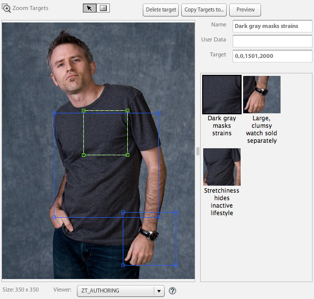

# Recadrage, images ajustées et cibles de zoom {#crop-adjusted-zoom-targets}

L’une des principales forces du concept d’image principale de Dynamic Media Classic est que vous pouvez réutiliser la ressource d’image à de nombreuses fins. Habituellement, vous devez créer des versions recadrées distinctes de chaque image pour afficher les détails ou les nuanciers. Lors de l’utilisation de Dynamic Media Classic, vous pouvez effectuer les mêmes tâches sur votre seul original et enregistrer ces versions recadrées en tant que nouveaux fichiers physiques ou en tant que dérivés virtuels qui ne prennent pas d’espace de stockage.

D’ici la fin de cette section du tutoriel, vous saurez comment :

- Recadrer les images dans Dynamic Media Classic et les enregistrer sous forme de nouveaux fichiers maîtres ou de nouvelles images virtuelles. [En savoir plus](https://experienceleague.adobe.com/docs/dynamic-media-classic/using/master-files/cropping-image.html?lang=fr).
- Enregistrer les images modifiées virtuelles et les utiliser à la place des ressources marketing. [En savoir plus](https://experienceleague.adobe.com/docs/dynamic-media-classic/using/master-files/adjusting-image.html?lang=fr).
- Créer des cibles de zoom sur vos images pour afficher leurs mises en surbrillance. [En savoir plus](https://experienceleague.adobe.com/docs/dynamic-media-classic/using/zoom/creating-zoom-targets-guided-zoom.html?lang=fr).

## Recadrage

Dynamic Media Classic dispose de quelques outils de modification d’images, notamment l’outil Recadrage, disponibles de façon pratique dans l’interface utilisateur. Pour plusieurs raisons, vous pouvez souhaiter recadrer votre image principale dans Dynamic Media Classic. Par exemple :

- Vous n’avez pas accès au fichier original. Vous souhaitez afficher l’image avec un recadrage ou un format différents, mais vous ne disposez pas du fichier original sur votre ordinateur ou vous travaillez depuis votre domicile. Dans ce cas, vous pouvez accéder à Dynamic Media Classic, rechercher l’image, la recadrer et l’enregistrer, ou l’enregistrer en tant que nouvelle version.
- Pour supprimer l’espace blanc excessif. L’image a été photographiée avec trop d’espace blanc, ce qui donne l’impression que le produit est petit. Vos images miniatures doivent remplir le canevas autant que possible.
- Pour créer des images ajustées, des copies virtuelles des images qui ne prennent pas d’espace disque. Certaines entreprises ont des règles de fonctionnement qui les obligent à conserver des copies distinctes de la même image, mais avec un nom différent. Ou peut-être que vous voulez une version recadrée et non recadrée de la même image.
- Pour créer de nouvelles images à partir d’une image source. Par exemple, vous pouvez créer des nuanciers de couleurs ou un détail de l’image principale. Vous pouvez effectuer cette opération dans Adobe Photoshop et charger séparément ou utiliser l’outil Recadrage dans Dynamic Media Classic.

>[!NOTE]
>
>Toutes les URL des discussions suivantes sur le recadrage sont proposées à titre d’illustration uniquement ; il ne s’agit pas de liens actifs.

### Utiliser l’outil Recadrage

Vous pouvez accéder à l’outil Recadrage dans Dynamic Media Classic à partir de la page Détails d’une ressource ou en cliquant sur le bouton **Modifier**. Vous pouvez utiliser l’outil pour recadrer de deux manières :

- Le mode de recadrage par défaut dans lequel vous faites glisser les poignées de la fenêtre de recadrage ou saisissez des valeurs dans la zone Taille. Découvrez comment [recadrer manuellement](https://experienceleague.adobe.com/docs/dynamic-media-classic/using/master-files/cropping-image.html?lang=fr#select-an-area-to-crop).
- Rogner. Utilisez cette option pour supprimer les espaces blancs en trop autour de votre image en calculant le nombre de pixels qui ne correspondent pas à votre image. Découvrez comment [recadrer par rognage](https://experienceleague.adobe.com/docs/dynamic-media-classic/using/master-files/cropping-image.html?lang=fr#crop-to-remove-white-space-around-an-image).

### _Recadrage manuel_

Lorsque vous enregistrez une version recadrée manuellement, l’image semble être recadrée de manière permanente ; Dynamic Media Classic masque en fait les pixels en ajoutant un modificateur d’URL interne pour recadrer l’image. Lorsque vous publiez, il est évident que l’image est recadrée. Vous pouvez toutefois revenir à l’éditeur de recadrage et supprimer le recadrage ultérieurement.

Vous pouvez ensuite choisir d’enregistrer en tant que nouvelle image principale ou en tant que vue supplémentaire du gabarit. Un nouveau gabarit est un nouveau fichier physique (comme un TIFF ou un JPEG) qui occupe de l’espace de stockage. Une vue supplémentaire est une image virtuelle qui ne prend pas d’espace serveur. Nous vous déconseillons de choisir Remplacer l’original, car cela remplace le gabarit et rend le recadrage permanent. Si vous enregistrez en tant que nouveau gabrit ou nouvelle vue supplémentaire, vous devez choisir un nouvel ID de ressource. Comme les autres ID de ressource, il doit s’agir d’un nom unique dans Dynamic Media Classic.

### _Rognage_

Si vous téléchargez une image avec trop d’espace blanc (canevas supplémentaire) autour de l’objet principal de l’image, elle sera beaucoup plus petite sur le web lors du redimensionnement. C’est particulièrement vrai pour les miniatures de 150 pixels ou moins, l’objet de la photo peut se perdre dans tout l’espace supplémentaire qui l’entoure.

Comparez ces deux versions de la même image.

L’image à droite devient beaucoup plus visible en supprimant l’espace supplémentaire autour du produit. Le rognage peut être effectué image par image, à l’aide de l’outil Recadrage ou exécuté en tant que traitement par lot lors du chargement. Il est recommandé de l’exécuter en tant que traitement par lot si vous souhaitez que toutes vos images soient recadrées de manière cohérente autour de l’objet principal. Recadrage sur le cadre de sélection : le rectangle qui entoure l’image.

>[!NOTE]
>
>Rogner ne crée pas de transparence autour de l’image. Pour ce faire, vous devez incorporer un masque dans l’image et utiliser l’option de chargement **Création d’un masque à partir de clip-path**.
>
>En outre, pour restaurer une image à son état d’origine après l’avoir recadrée lorsque vous avez utilisé l’option **Enregistrer**, affichez l’image dans l’écran de l’éditeur de recadrage et sélectionnez le bouton **Réinitialiser**.

### _Recadrage lors du chargement_

Comme mentionné précédemment, vous pouvez également choisir de recadrer les images lors du chargement. Pour utiliser le recadrage au moment du chargement, cliquez sur le bouton **Options de traitement** et sous Options de recadrage, choisissez **Rogner**.

Dynamic Media Classic se souviendra de cette option pour le prochain chargement. Vous souhaitez recadrer les images pour ce chargement, mais vous ne souhaitez peut-être pas qu’elles soient recadrées à chaque chargement. Une autre option consiste à définir un traitement de chargement FTP planifié spécial et à y placer les options de recadrage. Ainsi, vous n’exécuteriez le traitement que lorsque vous avez besoin de recadrer vos images.

>[!IMPORTANT]
>
>Si vous définissez un recadrage pour votre chargement, Dynamic Media Classic place un cookie pour mémoriser ce paramètre la prochaine fois. Pour respecter les bonnes pratiques, cliquez sur le bouton **Réinitialisation des valeurs par défaut** avant votre prochain chargement afin d’effacer toutes les options de recadrage qui restent à la fin du dernier chargement ; dans le cas contraire, vous pourriez accidentellement recadrer le lot d’images suivant.

### Recadrage par URL

Bien que cela ne soit pas évident dans Dynamic Media Classic, vous pouvez également recadrer uniquement par l’URL (ou même ajouter un recadrage à un paramètre d’image prédéfini).

Chaque fois que vous utilisez l’outil Recadrage, les valeurs de l’URL s’affichent dans le champ en bas. Vous pouvez prendre ces valeurs et les appliquer directement à une image en tant que modificateurs d’URL.

_Modificateurs de commande de recadrage au bas de l’éditeur de recadrage_

La taille devant être calculée par image lorsque vous utilisez le recadrage par rognage, ce dernier ne peut pas être automatisé via l’URL. Le recadrage ne peut être exécuté que lors du chargement ou en l’appliquant une seule image à la fois.

### _Recadrage dans le paramètre d’image prédéfini_

Les paramètres d’image prédéfinis comportent un champ dans lequel vous pouvez ajouter des commandes de diffusion d’images supplémentaires. Pour ajouter le même recadrage que ci-dessus à votre paramètre d’image prédéfini, modifiez-le, collez ou saisissez les valeurs dans le champ Modificateurs d’URL, puis enregistrez et publiez.

_Ajoutez des commandes de recadrage (ou toute commande) aux modificateurs d’URL du paramètre d’image prédéfini._

Le recadrage fait désormais partie de ce paramètre d’image prédéfini et sera appliqué automatiquement à chaque utilisation. Bien sûr, cette méthode dépend de toutes les images nécessitant la même quantité de recadrage. Si toutes vos images ne sont pas tournées de la même manière, cette méthode ne fonctionnera pas.

## Images ajustées

Lorsque vous utilisez l’outil Recadrage, vous avez la possibilité d’**Enregistrer comme vue supplémentaire de l’image principale**. Une fois enregistrée, elle crée un nouveau type de ressource Dynamic Media Classic : une image ajustée. Une image ajustée, aussi appelée dérivée, est une image virtuelle. Il ne s’agit pas du tout d’une image ; il s’agit d’une référence à la base de données (comme un alias ou un raccourci) vers l’image principale physique.

### Quelle est la vraie image ?`?`

Pouvez-vous dire quelle image est la principale, et laquelle est l’image ajustée ?

Vous ne devriez pas être en mesure de le savoir sans avoir consulté Dynamic Media Classic et vu le type de ressource « Image ajustée » pour SBR_MAIN2.

Une image ajustée n’utilise pas d’espace disque, car elle n’existe que sous forme d’élément de ligne dans la base de données. Elle est également liée de manière permanente à la ressource d’origine ; si l’originale est supprimée, l’image ajustée est également supprimée. Elle peut se composer d’une image entière non recadrée ou d’une partie seulement d’une image (recadrage).

En règle générale, vous créez des images ajustées à l’aide de l’outil Recadrage. Toutefois, elles peuvent également être créées avec d’autres éditeurs d’image : les outils Ajuster et Accentuer.

Les images ajustées nécessitent un ID de ressource unique. Une fois publiées (vous devez les publier comme n’importe quelle autre ressource), elles agissent comme toute autre image et sont appelées sur une URL par leur ID de ressource. Sur la page Détails, vous pouvez afficher les images ajustées associées à une image originale sous l’onglet **Créées et dérivées**.

_Vues ajustées pour l’image principale ASIAN_BR_MAIN_

## Cibles de zoom

Les cibles de zoom se trouvent également dans le menu **Modifier** et la page **Détails** d’une image. Ils vous permettent de définir des &quot;zones réactives&quot; pour mettre en évidence des fonctionnalités de marchandisage spécifiques d’une image de zoom. Au lieu de créer des images distinctes en recadrant une grande image principale, la visionneuse de zoom peut afficher les détails au-dessus de l’image, ainsi qu’un libellé court que vous créez.

Les cibles de zoom étant essentiellement une fonction de merchandising qui nécessite une connaissance des points de vente d’un produit, elles sont généralement créées par une personne de l’équipe merchandising ou produit d’une entreprise.

Le processus est très simple : cliquez sur la fonctionnalité, donnez-lui un nom explicite, puis enregistrez. Les cibles peuvent être copiées d’une image à une autre si elles sont similaires, mais le processus est manuel. Dynamic Media Classic ne permet pas d’automatiser la création de cibles de zoom, car chaque image est différente et possède des fonctionnalités différentes.

Le choix de la visionneuse est un autre facteur permettant de décider si vous souhaitez utiliser les cibles de zoom. Tous les types de visionneuses ne peuvent pas afficher de cibles de zoom (par exemple, la visionneuse déroulante ne les prend pas en charge).

Découvrez comment [Créer des cibles de zoom](https://experienceleague.adobe.com/docs/dynamic-media-classic/using/zoom/creating-zoom-targets-guided-zoom.html?lang=fr#creating-and-editing-zoom-targets).

### Utilisation de l’outil Cible de zoom

Voici le workflow de création de cibles dans Dynamic Media Classic.

1. Naviguez jusqu’à votre image, puis cliquez sur le bouton **Modifier** et choisissez **Cibles de zoom**.
2. L’éditeur de cible de zoom charge. Vous verrez votre image au milieu, certains boutons en haut et un panneau cible vide à droite. En bas à gauche, un paramètre prédéfini de visionneuse est sélectionné. La valeur par défaut est « Zoom1-Guided ».
3. Déplacez la zone rouge avec la souris et cliquez pour créer une nouvelle cible.

   - La zone rouge est la zone cible. Lorsqu’un utilisateur ou une utilisatrice clique sur cette cible, il ou elle effectue un zoom avant sur la zone à l’intérieur de la zone.
   - La taille cible est déterminée par la taille d’affichage dans le paramètre prédéfini de la visionneuse. Cela détermine la taille de l’image de zoom principale. Voir _Définition de la taille d’affichage_, ci-dessous.

4. Vous verrez la cible que vous venez de créer devenir bleue, et sur la droite vous verrez une version miniature de cette cible, ainsi que le nom par défaut « target-0 ».
5. Pour renommer votre cible, cliquez sur sa miniature, saisissez un nouveau **Nom**, puis cliquez sur **Entrée** ou **Onglet**. Si vous cliquez ailleurs, votre nom ne sera pas enregistré.
6. Lorsque la cible est sélectionnée, la zone est entourée de lignes de tirets verts que vous pouvez la redimensionner et la déplacer. Faites glisser les coins à redimensionner ou faites glisser la zone cible pour la déplacer.

   - L’image sera alors chargée dans la visionneuse de zoom personnalisée par défaut. Assurez-vous que le paramètre prédéfini de la visionneuse prend en charge les cibles de zoom. En règle générale, tous les paramètres prédéfinis standard qui comportent « -guided » ont été conçus pour être utilisés avec les cibles de zoom. Pour utiliser les cibles, passez la souris sur la miniature de la cible (ou icône de zone réactive) pour afficher le libellé, puis cliquez dessus pour afficher le zoom de la visionneuse sur cette fonctionnalité.
   - Comme toutes les autres tâches que vous effectuez dans Dynamic Media Classic, vous devez publier pour que vos cibles de zoom soient actives sur le web. Si vous utilisez déjà une visionneuse qui prend en charge les cibles, elles s’affichent immédiatement (une fois le cache effacé). Cependant, si vous n’utilisez pas de visionneuse avec la fonctionnalité Cible de zoom, elles restent masquées.

     

7. En outre, si vous devez supprimer une cible, sélectionnez-la en cliquant sur sa miniature, puis appuyez sur le bouton **Supprimer la cible** ou appuyez sur la touche SUPPR de votre clavier.
8. Continuez à cliquer pour ajouter de nouvelles cibles, renommer et/ou redimensionner après l’ajout.
9. Une fois que vous avez terminé, cliquez sur le bouton **Enregistrer** puis sur **Aperçu**.

### Définition de la taille d’affichage dans le paramètre prédéfini de la visionneuse de zoom

Parlons de l’origine de la taille des cibles de zoom. Dans les paramètres prédéfinis de votre visionneuse de zoom, il existe un paramètre appelé Taille d’affichage. La taille d’affichage correspond à la taille de votre image de zoom dans la visionneuse. Elle diffère de la taille de l’étape, qui correspond à la taille totale de la visionneuse, y compris l’illustration et les composants de l’interface utilisateur.

Lorsque vous créez une cible, elle dérive sa taille et son format de la taille de l’affichage. Si, par exemple, la taille d’affichage est de 200 x 200, vous ne pourrez créer que des cibles carrées, avec une zone de zoom maximale de 200 pixels. Vos cibles peuvent dépasser 200 pixels, mais toujours carrées. Mais cela signifie aussi que l’image à l’intérieur de votre visionneuse de zoom ne fait que 200 pixels ; la taille de la cible de zoom a une relation directe avec la taille de votre visionneuse. Vous devez donc d’abord décider de la conception de votre visionneuse avant de définir des cibles.

Cependant, par défaut, la taille d’affichage est vide (définie sur 0 x 0), car la taille de l’image d’affichage principale est dynamique et est automatiquement dérivée de la taille de l’étape. Le problème est que si vous ne définissez pas explicitement une taille d’affichage dans votre paramètre prédéfini, l’outil Cible de zoom ne saura pas quelle taille donner aux cibles.

Lorsque vous chargez l’outil Cible de zoom, la taille d’affichage s’affiche à côté du nom du paramètre prédéfini. Comparez la taille d’affichage entre le paramètre prédéfini assisté Zoom1-Guided intégré et le paramètre prédéfini ZT_AUTHORING personnalisé.

Vous pouvez voir que le paramètre prédéfini intégré a une taille de 900 x 550, ce qui signifie que la cible ne peut jamais être plus petite que cette taille plutôt grande. C&#39;est probablement trop grand — si vous avez une image de 2 000 pixels, vous ne pouvez qu&#39;afficher une fonction d&#39;au moins 900 pixels. L’utilisateur peut effectuer un zoom supplémentaire manuellement, mais vous ne pouvez pas le rapprocher. La définition d’une taille d’affichage de 350x350 permet aux cibles d’effectuer un zoom assez rapproché ou d’être redimensionnées plus grand. Mais si vous souhaitez une image de zoom plus grande dans votre visionneuse, vous devez créer un nouveau paramètre prédéfini, car le vôtre est verrouillé à 350 pixels.

### Créer ou modifier un paramètre prédéfini de visionneuse prenant en charge les cibles de zoom

Pour définir la taille d’affichage, créez ou modifiez un paramètre prédéfini de visionneuse qui prend en charge les cibles de zoom.

1. Dans le paramètre prédéfini de la visionneuse, accédez à l’option **Paramètres de zoom**.
2. Définissez une largeur et une hauteur.
3. Enregistrez le paramètre prédéfini, puis fermez. Si vous souhaitez utiliser ce paramètre prédéfini sur votre site actif, vous devrez également le publier.
4. Accédez à l’outil Cible de zoom et sélectionnez le paramètre prédéfini que vous avez modifié en bas à gauche. La nouvelle taille d’affichage apparaît immédiatement dans vos cibles.
