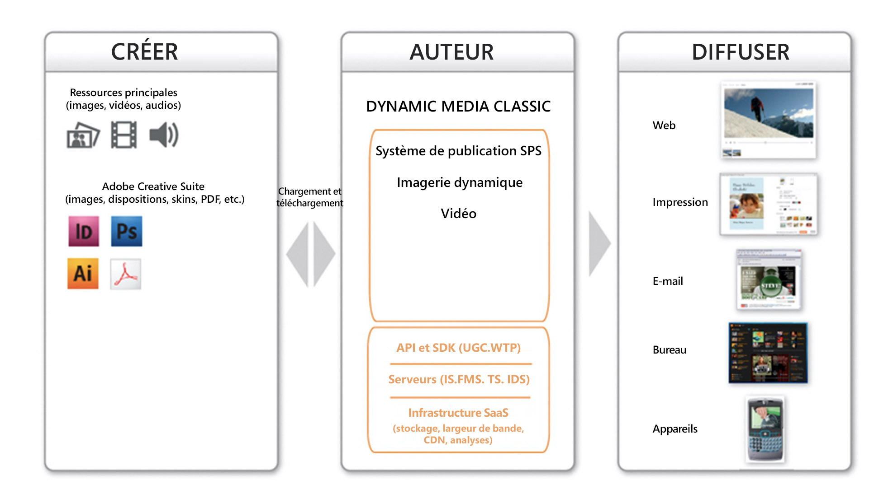
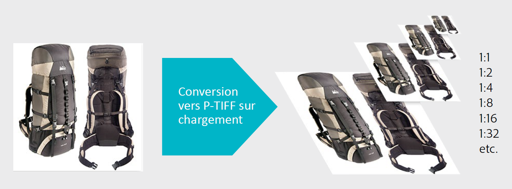

# Flux de travail principal et aperçu des ressources de Dynamic Media Classic {#main-workflow}

Dynamic Media prend en charge un processus de création (et de téléchargement), d’auteur (et de publication) et de diffusion. Vous pouvez début en téléchargeant des fichiers, puis en utilisant ces fichiers, par exemple en créant une visionneuse d’images et en finissant par les publier pour les rendre opérationnels. L’étape de création est facultative pour certains workflows. Par exemple, si vous souhaitez effectuer uniquement un zoom et un dimensionnement dynamiques sur les images ou convertir et publier de la vidéo en flux continu, il n’y a pas d’étapes de création nécessaires.

Le flux de travaux des solutions Dynamic Media Classic se compose de trois étapes principales :

1. Créer (et télécharger) SourceContent
2. Ressources de l’auteur (et de la publication)
3. Fournir des ressources

## Étape 1 : Créer (et télécharger)

Il s’agit du début du processus. Au cours de cette étape, vous rassemblez ou créez le contenu source qui correspond au flux de travaux que vous utilisez et vous le téléchargez dans Contenu multimédia dynamique classique. Le système prend en charge plusieurs types de fichiers pour les images, les vidéos et les polices, mais aussi pour PDF, Adobe Illustrator et Adobe InDesign.

Consultez la liste complète de [Types de fichiers pris en charge](https://docs.adobe.com/content/help/en/dynamic-media-classic/using/upload-publish/uploading-files.html#supported-asset-file-formats).

Vous pouvez télécharger du contenu source de différentes manières :

- Directement depuis votre bureau ou votre réseau local. [Apprenez comment](https://docs.adobe.com/content/help/en/dynamic-media-classic/using/upload-publish/uploading-files.html#upload-files-using-sps-desktop-application).
- Depuis un serveur FTP Dynamic Media Classic. [Apprenez comment](https://docs.adobe.com/content/help/en/dynamic-media-classic/using/upload-publish/uploading-files.html#upload-files-using-via-ftp).

Le mode par défaut est De bureau, où vous recherchez des fichiers sur votre réseau local et début le téléchargement.

>[!TIP]
>
>N’ajoutez pas manuellement vos dossiers. Exécutez plutôt un téléchargement depuis FTP et utilisez l’option **Inclure les sous-dossiers** pour recréer votre structure de dossiers dans Dynamic Media Classic.

Les deux options de téléchargement les plus importantes sont activées par défaut : **Marquer pour publication**, dont nous avons parlé plus tôt, et **Remplacer**. Ecraser signifie que si le fichier en cours de téléchargement porte le même nom qu’un fichier déjà dans le système, le nouveau fichier remplacera la version existante. Si vous désactivez cette option, le fichier risque de ne pas être téléchargé.

### Options de remplacement lors du téléchargement d’images

Quatre variantes de l’option Ecraser l’image peuvent être définies pour l’ensemble de votre société et elles sont souvent mal comprises. En bref, vous définissez les règles de sorte que les fichiers portant le même nom soient remplacés plus fréquemment ou que les remplacements se produisent moins fréquemment (auquel cas la nouvelle image sera renommée avec une extension &quot;-1&quot; ou &quot;-2&quot;).

- **Ecraser dans le dossier actif, même nom/extension** d’image de base. Cette option est la règle de remplacement la plus stricte. Elle implique que vous chargiez l’image de remplacement dans le même dossier que l’original, et qu’elle ait la même extension que le fichier d’origine. Si ces conditions ne sont pas remplies, un doublon est créé.

- **Ecraser dans le dossier actif, même nom de fichier de base, quelle que soit l’extension**.
Requiert que vous téléchargiez l’image de remplacement dans le même dossier que l’image d’origine, mais l’extension de nom de fichier peut être différente de celle d’origine. Par exemple, chaise.tif remplace chaise.jpg.

- **Ecraser dans n’importe quel dossier, même nom/extension** de fichier de base. Nécessite que l’image de remplacement ait la même extension de nom de fichier que l’image d’origine (par exemple, chaise.jpg doit remplacer chaise.jpg et non chaise.tif ). Vous pouvez néanmoins télécharger l’image de remplacement dans un dossier différent de celui de l’image d’origine. L’image mise à jour se trouve dans le nouveau dossier ; le fichier d’origine n’est plus disponible à l’emplacement d’origine..

- **Ecraser dans n’importe quel dossier, même nom de fichier de base, quelle que soit l’extension**. Cette option est la règle de remplacement la plus inclusive. Elle vous permet de charger une image de remplacement dans un dossier autre que celui de l’image d’origine, de charger un fichier dont l’extension est différente de celle du fichier d’origine et de remplacer le fichier d’origine. Si le fichier d’origine se trouve dans un dossier différent, l’image de remplacement est enregistrée dans le nouveau dossier où elle a été chargée.

En savoir plus sur l&#39;option [Remplacer les images](https://docs.adobe.com/content/help/en/dynamic-media-classic/using/setup/application-setup.html#using-the-overwrite-images-option).

Bien qu’il ne soit pas nécessaire de procéder à un transfert en utilisant l’une des deux méthodes ci-dessus, vous pouvez spécifier les options de tâche pour ce transfert particulier. Par exemple, pour planifier un transfert périodique, définir les options de recadrage au moment du transfert, et bien d’autres. Cela peut être utile pour certains workflows, donc il est utile de se demander s&#39;ils peuvent l&#39;être pour le vôtre.

En savoir plus sur [Options tâche](https://docs.adobe.com/content/help/en/dynamic-media-classic/using/upload-publish/uploading-files.html#upload-options).

Le téléchargement est la première étape nécessaire d’un flux de travaux, car Contenu multimédia dynamique Classic ne peut pas fonctionner avec un contenu qui ne se trouve pas déjà dans son système. En arrière-plan lors du transfert, le système enregistre chaque fichier téléchargé dans la base de données dynamique classique centralisée, affecte un identifiant et le copie à l’enregistrement. En outre, le système convertit les fichiers d’image dans un format qui permet le redimensionnement et le zoom dynamiques et convertit les fichiers vidéo au format Web MP4.

### Concept : Voici ce qui arrive aux images lorsque vous les téléchargez vers Dynamic Media Classic.

Lorsque vous téléchargez une image de n’importe quel type vers Dynamic Media Classic, elle est convertie en un format d’image original appelé Pyramid TIFF ou P-TIFF. Un P-TIFF est similaire au format d’une image bitmap TIFF superposée, sauf que, au lieu de calques différents, le fichier contient plusieurs tailles (résolutions) de la même image.

Lors de la conversion de l’image, Dynamic Media Classic prend un &quot;instantané&quot; de la taille complète de l’image, la redimensionne de moitié et l’enregistre, la redimensionne de moitié et l’enregistre, etc. jusqu’à ce qu’elle soit remplie de multiples pairs de la taille d’origine. Par exemple, un P-TIFF de 2 000 pixels aura des tailles de 1 000, 500, 250 et 125 pixels (et plus petites) dans le même fichier. Le fichier P-TIFF est le format de ce qu’on appelle une &quot;image originale&quot; dans Dynamic Media Classic.

Lorsque vous demandez une image d’une certaine taille, la création du fichier P-TIFF permet au serveur d’images pour Dynamic Media Classic de trouver rapidement la taille supérieure suivante et de la réduire. Par exemple, si vous téléchargez une image de 2 000 pixels et demandez une image de 100 pixels, la version de 125 pixels de Dynamic Media Classic sera trouvée et redimensionnée à 100 pixels au lieu de passer de 2 000 à 100 pixels. Cela rend l&#39;opération très rapide. En outre, lorsque vous effectuez un zoom sur une image, la visionneuse de zoom ne peut demander qu’une mosaïque de l’image en cours de zoom, plutôt que l’image en pleine résolution. C’est ainsi que le format d’image originale, le fichier P-TIFF, prend en charge le dimensionnement dynamique et le zoom.

De même, vous pouvez télécharger votre vidéo source originale dans Dynamic Media Classic. Lors du téléchargement, Dynamic Media Classic peut automatiquement la redimensionner et la convertir au format Web MP4.

### Règles d’utilisation pour déterminer la taille optimale des images téléchargées

**Téléchargez des images de la taille la plus grande dont vous avez besoin.**

- Si vous devez effectuer un zoom, téléchargez une image haute résolution de 1 500 à 2 500 pixels dans la dimension la plus longue. Tenez compte de la quantité de détails que vous souhaitez fournir, de la qualité de vos images source et de la taille du produit affiché. Par exemple, téléchargez une image de 1 000 pixels pour un tout petit anneau, mais une image de 3 000 pixels pour un centre de chambres entier.
- Si vous n’avez pas besoin de zoomer, téléchargez-le à la taille exacte qui s’affichera. Par exemple, si vous avez des logos ou des images de démarrage/bannière à placer sur vos pages, téléchargez-les exactement à leur taille 1:1 et appelez-les exactement à cette taille.

**Ne jamais suréchantillonner ou faire sauter vos images avant de les télécharger vers Dynamic Media Classic.** Par exemple, ne pas suréchantillonner une image plus petite pour en faire une image de 2 000 pixels. Ça n&#39;aura pas l&#39;air bien. Rendre vos images aussi proches que possible de la perfection avant de les télécharger.

**Il n’existe pas de taille minimale pour le zoom, mais par défaut, les visionneuses n’effectuent pas un zoom supérieur à 100 %.** Si votre image est trop petite, elle n’effectue pas de zoom du tout ou n’effectue qu’un zoom minime pour éviter qu’elle ne s’affiche mal.

**Bien qu’il n’y ait pas de minimum pour la taille de l’image, il est déconseillé de télécharger des images géantes.** Une image géante peut être considérée comme plus de 4 000 pixels. Le téléchargement d’images de cette taille peut présenter des défauts potentiels tels que des grains de poussière ou des poils dans l’image. De telles images occuperont également plus d’espace sur le serveur Dynamic Media Classic, ce qui peut vous faire dépasser les limites d’enregistrement que vous avez définies.

En savoir plus sur [Téléchargement de fichiers](https://docs.adobe.com/content/help/en/dynamic-media-classic/using/upload-publish/uploading-files.html#uploading-your-files).

## Étape 2 : Auteur (et Publier)

Après avoir créé et téléchargé votre contenu, vous créerez de nouveaux fichiers de média enrichi à partir de vos fichiers téléchargés en exécutant un ou plusieurs sous-workflows. Cela inclut tous les différents types de collections d’ensembles (visionneuses d’images, d’échantillons, à 360° et de supports variés), ainsi que les modèles. Il inclut également la vidéo. Nous approfondirons plus loin les détails sur chaque type de visionneuse de collections d’images et de média vidéo enrichi. Cependant, dans la plupart des cas, vous pouvez début en sélectionnant une ou plusieurs ressources (ou en n’en sélectionnant aucune) et en choisissant le type de ressource à créer. Par exemple, vous pouvez sélectionner une image principale et quelques vues de cette image et choisir de créer une visionneuse d’images, une collection de vues alternatives du même produit.

>[!IMPORTANT]
>
>Assurez-vous que tous vos fichiers sont marqués pour publication. Bien que, par défaut, tous les fichiers soient automatiquement marqués pour publication au moment du téléchargement, tous les fichiers nouvellement créés à partir de votre contenu téléchargé devront également être marqués pour publication.

Après avoir créé votre nouvelle ressource, vous exécuterez une tâche de publication. Vous pouvez le faire manuellement ou planifier une tâche de publication qui s’exécute automatiquement. La publication copie tout le contenu de la sphère privée, Dynamic Media Classic, vers la sphère publique du serveur de publication de l’équation. Le produit d’une tâche de publication de contenu multimédia dynamique est une URL unique pour chaque fichier publié.

Le serveur sur lequel vous publiez dépend du type de contenu et du processus. Par exemple, toutes les images sont envoyées au serveur Image Server et la vidéo en flux continu au serveur FMS. Pour plus de commodité, nous parlerons d&#39;une &quot;publication&quot; comme un événement unique à un seul serveur.

La publication publie tout le contenu marqué pour publication, et pas seulement votre contenu. En règle générale, un administrateur unique publie pour le compte de tous plutôt que pour des utilisateurs individuels exécutant une publication. L’administrateur peut publier ou configurer une tâche quotidienne, hebdomadaire ou même toutes les 10 minutes qui sera publiée automatiquement. Publiez selon un calendrier adapté à votre activité.

>[!TIP]
>
>Automatisez vos tâches de publication et planifiez l’exécution d’une publication complète tous les jours à 00h00 ou en fin de soirée.

### Concept : Présentation de l’URL de Dynamic Media Classic

Le produit final d’un flux de travaux Contenu multimédia dynamique classique est une URL qui pointe vers la ressource (visionneuse d’images ou visionneuse de vidéos adaptative). Ces URL sont très prévisibles et suivent le même modèle. Dans le cas des images, chaque image est générée à partir de l’image originale P-TIFF.

Voici la syntaxe de l’URL d’une image, avec quelques exemples :

Dans l’URL, tout à gauche du point d’interrogation est le chemin virtuel vers une image spécifique. Tout à droite du point d’interrogation est un modificateur Image Server, une instruction de traitement de l’image. Lorsque vous avez plusieurs modificateurs, ils sont séparés par des esperluettes.

Dans le premier exemple, le chemin d’accès virtuel à l’image &quot;Backpack_A&quot; est `http://sample.scene7.com/is/image/s7train/BackpackA`. Les modificateurs Image Server redimensionnent l’image pour une largeur de 250 pixels (à partir de wid=250) et rééchantillonnent l’image à l’aide de l’algorithme d’interpolation Lanczos, qui l’accentue au fur et à mesure de son redimensionnement (à partir de resMode=sharp2).

Le deuxième exemple applique ce que l’on appelle un &quot;paramètre d’image prédéfini&quot; à la même image Backpack_A, comme indiqué par $!_template300$. Les symboles $ de chaque côté de l’expression indiquent qu’un paramètre d’image prédéfini, un ensemble compressé de modificateurs d’image, est appliqué à l’image.

Une fois que vous avez compris comment assembler les URL de Dynamic Media Classic, vous comprenez comment les modifier par programmation et comment les intégrer plus profondément dans votre site et votre système principal.

### Concept : Comprendre le délai de mise en cache

Les nouveaux fichiers téléchargés et publiés sont immédiatement visibles, tandis que les fichiers mis à jour peuvent être mis à jour en raison du délai de mise en cache de 10 heures. Par défaut, tous les fichiers publiés comportent un minimum de 10 heures avant leur expiration. Nous disons minimum, parce que chaque fois que l&#39;image est vue, il début une horloge qui n&#39;expirera pas jusqu&#39;à ce que 10 heures se soient écoulées au cours desquelles personne n&#39;a vu cette image. Cette période de 10 heures correspond à la durée de vie d’une ressource. Une fois que le cache expire pour cette ressource, la version mise à jour peut être remise.

En règle générale, il ne s’agit pas d’un problème, sauf si une erreur s’est produite et que l’image/le fichier porte le même nom que la version précédemment publiée, mais qu’il existe un problème avec l’image. Par exemple, vous avez accidentellement téléchargé une version basse résolution ou votre directeur artistique n’a pas approuvé l’image. Dans ce cas, vous souhaitez rappeler l’image d’origine et la remplacer par une nouvelle version utilisant le même ID de fichier.

Découvrez comment [effacer manuellement le cache des URL qui doivent être mises à jour](https://docs.adobe.com/content/help/en/experience-manager-65/assets/dynamic/invalidate-cdn-cached-content.html).

>[!TIP]
>
>Pour éviter les problèmes de mise en cache, travaillez toujours à l’avance : une soirée, un jour, deux semaines, etc. Créez à temps pour l&#39;assurance qualité/l&#39;acceptation par les parties internes de votre travail de BAT avant de le publier au public. Même travailler une soirée avant vous permet d&#39;apporter des changements et de republier ce soir-là. Le matin, les 10 heures se sont écoulées et le cache se met à jour avec la bonne image.

- En savoir plus sur [la création d’une tâche de publication](https://docs.adobe.com/content/help/en/dynamic-media-classic/using/upload-publish/publishing-files.html#creating-a-publish-job).
- En savoir plus sur [Publication](https://docs.adobe.com/content/help/en/dynamic-media-classic/using/upload-publish/publishing-files.html).

## Étape 3 : Livraison

N’oubliez pas que le produit final d’un flux de travaux Contenu multimédia dynamique est une URL pointant vers la ressource. L’URL peut pointer vers une image individuelle, une visionneuse d’images, une visionneuse à 360° ou une autre collection ou vidéo de visionneuse d’images. Vous devez prendre cette URL et en faire quelque chose, par exemple modifier votre code HTML afin que les balises `` pointent vers l’image Dynamic Media Classic au lieu de pointer vers une image provenant de votre site actuel.

À l’étape Livraison, vous devez intégrer ces URL dans votre site Web, application mobile, campagne par courriel ou tout autre point de contact numérique sur lequel vous souhaitez afficher la ressource.

Exemple d’intégration de l’URL Dynamic Media Classic d’une image dans un site Web :

L’URL en rouge est le seul élément spécifique à Dynamic Media Classic.

Votre équipe informatique ou votre partenaire d’intégration peut prendre la tête de la rédaction et de la modification du code pour intégrer des URL Dynamic Media Classic à votre site. Adobe dispose d&#39;une équipe de consultants qui peut aider à cet effort, soit en fournissant des conseils techniques, créatifs ou généraux.

Pour les solutions plus complexes telles que les visionneuses de zoom ou les visionneuses qui combinent le zoom à d’autres vues, en règle générale, l’URL pointe vers une visionneuse hébergée par Contenu multimédia dynamique classique, et cette URL contient également une référence à un ID de fichier.

Exemple d’un lien (en rouge) qui ouvrira une visionneuse d’images dans une visionneuse dans une nouvelle fenêtre contextuelle :

>[!IMPORTANT]
>
>Vous devez intégrer les URL de Dynamic Media Classic à votre site Web, application mobile, courriel et autres points de contact numériques — Dynamic Media Classic ne peut pas le faire pour vous !

## Aperçu des ressources

Vous souhaiterez probablement prévisualisation les ressources que vous avez téléchargées ou que vous créez ou modifiez afin de vous assurer qu’elles apparaissent comme vous le souhaitez lorsque vos clients les vues. Vous pouvez accéder à la fenêtre de Prévisualisation en cliquant sur un bouton **Prévisualisation**, soit sur la miniature du fichier, en haut du **panneau de navigation/de création**, soit en accédant à **Fichier > Prévisualisation**. Dans une fenêtre de navigateur, il prévisualisation le fichier qui se trouve actuellement dans le panneau, qu’il s’agisse d’une image, d’une vidéo ou d’un fichier généré comme une visionneuse d’images.

### Prévisualisation Taille dynamique (paramètres d’image prédéfinis)

Vous pouvez prévisualisation vos images en plusieurs tailles à l’aide de la prévisualisation **Tailles**. Cette opération charge une liste de vos paramètres d’image prédéfinis disponibles. Nous parlerons plus tard des paramètres d’image prédéfinis, mais pensez-y comme à des &quot;recettes&quot; pour charger votre image à une taille nommée avec des quantités spécifiques d’accentuation et de qualité d’image.

### Prévisualisation de zoom

Vous pouvez également utiliser l’option **Zoom** pour prévisualisation votre image dans l’un des nombreux paramètres prédéfinis de zoom prédéfinis, qui reposent sur différentes visionneuses de zoom incluses.

En savoir plus sur [la prévisualisation des ressources](https://docs.adobe.com/content/help/en/dynamic-media-classic/using/managing-assets/previewing-asset.html).
