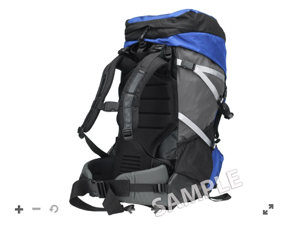

# Visionneuses d’images, d’échantillons, de panoramiques et de supports variés {#media-sets}

Au-delà des images uniques pour le dimensionnement et le zoom dynamiques, les collections de visionneuses Dynamic Media Classic offrent une expérience en ligne plus riche. Cette section du didacticiel explique comment créer les visionneuses de supports enrichis suivantes dans Dynamic Media Classic :

- Visionneuse d’images
- Série d’échantillons
- Visionneuse à 360°
- Visionneuse de médias mixtes

Il explique également comment utiliser les paramètres prédéfinis d’ensemble par lot pour automatiser la création d’ensemble par le biais d’un téléchargement.

## Tout Ce Que Vous Souhaitez Toujours Savoir Sur Les Jeux

En plus du zoom et du dimensionnement dynamique de base, les visionneuses sont probablement le sous-produit Dynamic Media Classic le plus utilisé. Les visionneuses sont essentiellement des ressources &quot;virtuelles&quot; qui ne contiennent aucune image réelle, mais se composent d’un ensemble de relations avec d’autres images et/ou vidéos. L&#39;attrait principal des ensembles est qu&#39;il s&#39;agit de mini-applications prêtes &quot;à l&#39;emploi&quot;. Cela signifie que chaque visionneuse contient sa propre logique et son interface de sorte que tout ce que vous avez à faire est de lui appeler sur le site. En outre, ils ne nécessitent que le suivi d’un seul ID d’actif par jeu, plutôt que d’avoir à gérer vous-même l’ensemble des actifs et relations membres.

Lorsque vous créez une visionneuse, elle est gérée en tant que ressource distincte qui doit être marquée pour publication et publiée avant d’être diffusée à partir d’une URL. Tous les actifs de ses membres doivent également être publiés.

### Types de visionneuses

Découvrez les quatre types d’ensembles que vous pouvez créer dans Dynamic Media Classic : Visionneuses d’images, d’échantillons, à 360° et de supports variés.

## Visionneuse d’images

Il s’agit du type d’ensemble le plus courant. Vous l&#39;utiliserez généralement pour d&#39;autres vues du même article. Il se compose de plusieurs images que vous chargez dans la visionneuse en cliquant sur la miniature associée à cette image.

_Exemple d’une visionneuse d’images_

L’URL de la visionneuse d’images ci-dessus peut apparaître comme suit :

- Pour en savoir plus sur les visionneuses d’images, consultez la section [Début rapide aux visionneuses d’images](https://docs.adobe.com/content/help/en/dynamic-media-classic/using/image-sets/quick-start-image-sets.html).
- Découvrez comment [créer une visionneuse d’images](https://docs.adobe.com/content/help/en/dynamic-media-classic/using/image-sets/creating-image-set.html#creating-an-image-set).

### Série d’échantillons

Ce type de jeu est généralement utilisé pour afficher les vues colorées du même article. Il se compose de paires d’images et de nuances.

La principale différence entre une série d’échantillons et une visionneuse d’images réside dans le fait que les séries d’échantillons utilisent une autre image comme échantillon cliquable, tandis que les visionneuses d’images utilisent une version miniature de l’image d’origine, accessible en cliquant dessus.

Les séries d’échantillons ne colorent pas les images (une idée fausse répandue). Les images sont simplement permutées, exactement comme dans une visionneuse d’images. Les mini images d&#39;échantillon auraient pu être créées à l&#39;aide de Photoshop, chaque couleur aurait pu être photographiée séparément, ou l&#39;outil Recadrer de Dynamic Media Classic aurait pu être utilisé pour faire une nuance à partir d&#39;une des images colorées.

_Exemple d’une série d’échantillons_

L’URL de la série d’échantillons ci-dessus peut apparaître comme suit :

- Pour en savoir plus sur les séries d’échantillons, consultez la section [Début rapide aux séries d’échantillons](https://docs.adobe.com/content/help/en/dynamic-media-classic/using/swatch-sets/quick-start-swatch-sets.html).
- Découvrez comment [créer une série d’échantillons](https://docs.adobe.com/content/help/en/dynamic-media-classic/using/swatch-sets/creating-swatch-set.html#creating-a-swatch-set).

### Visionneuse à 360°

Ce jeu est généralement utilisé pour afficher une vue de 360 degrés d’un article. Comme les séries d’échantillons, les visionneuses à 360° n’utilisent aucune magie 3D — le vrai travail consiste à créer de nombreuses photos d’une image de tous les côtés. La visionneuse vous permet simplement de basculer entre les images comme une animation à mouvement stop.

Les visionneuses à 360° peuvent tourner dans une direction le long d’un axe unique, ou si elles sont créées alternativement sous la forme d’une visionneuse à 360° 2D (rotation sur plusieurs axes). Par exemple, une voiture peut être pivotée pendant que toutes les roues sont au sol, puis peut être &quot;retournée&quot; et pivotée sur ses roues arrière également. Pour une visionneuse à 360° 2D correctement configurée, le nombre d’images par ligne pour chaque axe doit être le même. En d’autres termes, si vous tournez sur deux axes, vous avez besoin de deux fois plus d’images qu’une rotation en angle unique.

_Exemple d’une visionneuse à 360°_

L’URL de la visionneuse à 360° ci-dessus peut apparaître comme suit :

- Pour en savoir plus sur les visionneuses à 360° avec le [Début rapide aux visionneuses à 360°](https://docs.adobe.com/content/help/en/dynamic-media-classic/using/spin-sets/quick-start-spin-sets.html).
- Découvrez comment [créer une visionneuse à 360°](https://docs.adobe.com/content/help/en/dynamic-media-classic/using/spin-sets/creating-spin-set.html#creating-a-spin-set).

## Visionneuse de médias mixtes

Il s&#39;agit d&#39;un ensemble combiné. Il vous permet de combiner n’importe lequel des jeux précédents, ainsi que d’ajouter de la vidéo, dans une seule visionneuse. Dans ce processus, vous créez d’abord n’importe lequel des jeux de composants, puis vous les assemblez dans une visionneuse de supports variés.

_Exemple d’une visionneuse de supports variés_

L’URL de la visionneuse de supports variés ci-dessus peut s’afficher comme suit :

- Pour en savoir plus sur les visionneuses de supports variés avec le [Début rapide aux visionneuses de supports variés](https://docs.adobe.com/content/help/en/dynamic-media-classic/using/mixed-media-sets/quick-start-mixed-media-sets.html).

- Découvrez comment [créer une visionneuse de supports variés](https://docs.adobe.com/content/help/en/dynamic-media-classic/using/mixed-media-sets/creating-mixed-media-set.html#creating-a-mixed-media-set).

Pour afficher une image pour un zoom, une visionneuse ou une vidéo sur votre site Web, vous devez l’appeler dans une &quot;visionneuse&quot; Dynamic Media Classic. Dynamic Media Classic comprend des visionneuses de fichiers multimédias enrichis, tels que des séries d’échantillons, des visionneuses à 360°, des vidéos, etc.

En savoir plus sur [Visionneuses pour AEM Assets et Dynamic Media Classic](https://docs.adobe.com/content/help/fr-FR/dynamic-media-developer-resources/library/viewers-aem-assets-dmc/c-html5-s7-aem-asset-viewers.html).

## Paramètres prédéfinis d’ensemble par lot

Jusqu&#39;à présent, nous avons discuté de la façon de créer manuellement des visionneuses à l&#39;aide de la fonction de création de Dynamic Media Classic. Cependant, il est possible d’automatiser la création de visionneuses d’images et de visionneuses à 360° à l’aide d’un paramètre prédéfini d’ensemble par lot tant que vous disposez d’une convention d’affectation de nom normalisée.

Chaque paramètre prédéfini est un ensemble d’instructions indépendant à nom unique qui définit comment créer la visionneuse à l’aide d’images qui correspondent aux conventions d’affectation de nom définies. Dans le paramètre prédéfini, vous définissez d’abord des conventions d’affectation de nom pour les fichiers que vous souhaitez regrouper dans une visionneuse. Un paramètre prédéfini d’ensemble par lot peut alors être créé pour référencer ces images.

Bien qu’il soit possible de créer le paramètre prédéfini vous-même (il se trouve sous **Configuration > Configuration de l’application > Paramètres prédéfinis d’ensemble par lot** ), il est recommandé de configurer votre équipe de conseil ou votre support technique pour qu’il soit configuré. Voici pourquoi :

- Les paramètres prédéfinis d’ensemble par lot peuvent être complexes à configurer. Ils sont alimentés par des expressions régulières et, à moins que vous ne soyez un développeur, cette syntaxe peut être inhabituelle ou déroutante.
- Une fois créés, ils sont activés par défaut. Il n’existe pas de fonction &quot;Annuler&quot;. Si vous début de télécharger des milliers d’images et que votre paramètre prédéfini est mal configuré, vous risquez de rencontrer des centaines ou des milliers d’ensembles rompus que vous devez rechercher et supprimer manuellement.

Une convention d’affectation de nom simple a été suggérée plus tôt, qui serait très facile à intégrer dans un paramètre prédéfini d’ensemble par lot. Cependant, comme les paramètres prédéfinis sont très flexibles, ils peuvent gérer des stratégies d’attribution de noms complexes. En bref, les images qui font partie d’une visionneuse doivent être liées par un nom commun — souvent, il s’agit du numéro SKU ou de l’ID du produit. Dans Dynamic Media Classic, vous pouvez soit lui indiquer une convention d’affectation de nom par défaut pour toutes vos images à utiliser pour un paramètre prédéfini, soit créer plusieurs paramètres prédéfinis, chacun avec des règles d’affectation de nom différentes.

Les paramètres prédéfinis d’ensemble par lot ne sont appliqués qu’au téléchargement ; elles ne peuvent pas être exécutées une fois les images téléchargées. Il est donc important de planifier votre convention d’affectation de nom et de créer un paramètre prédéfini avant de début le chargement de toutes vos images.

Une fois les paramètres prédéfinis créés, l’administrateur des Sociétés peut choisir s’ils sont principaux ou inactifs. Principal signifie qu’ils apparaîtront sur la page de téléchargement sous **Options tâche**, tandis que les paramètres prédéfinis inactifs resteront masqués.

Découvrez comment [créer un paramètre prédéfini d’ensemble par lot](https://docs.adobe.com/content/help/en/dynamic-media-classic/using/setup/application-setup.html#creating-a-batch-set-preset).

### Utilisation de paramètres prédéfinis d’ensemble par lot au téléchargement

Voici comment vous utilisez les paramètres prédéfinis d’ensemble par lot lors du téléchargement après leur création :

1. Cliquez sur **Télécharger** et sélectionnez **De bureau** ou **Via FTP**.
2. Cliquez sur **Options tâche**.
3. Ouvrez l’option **Paramètres prédéfinis d’ensemble par lot**, puis cochez ou décochez le paramètre prédéfini pour l’utiliser avec le téléchargement.
4. Une fois le téléchargement terminé, recherchez dans votre dossier les jeux terminés.

En savoir plus sur [Paramètres prédéfinis d’ensemble par lot](https://docs.adobe.com/content/help/en/dynamic-media-classic/using/setup/application-setup.html#batch-set-presets).
