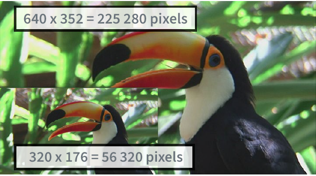
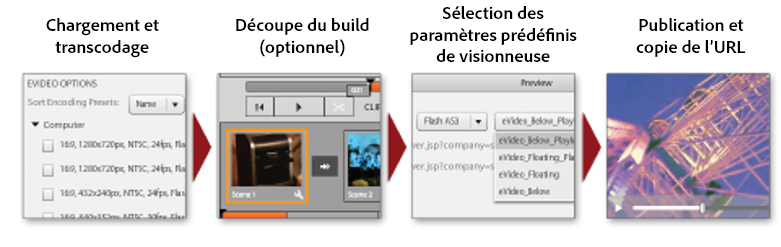
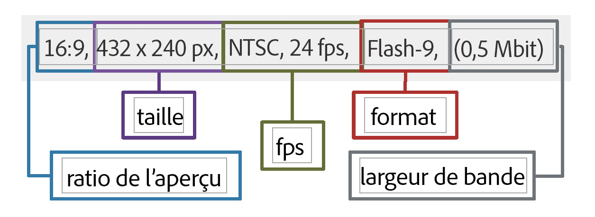
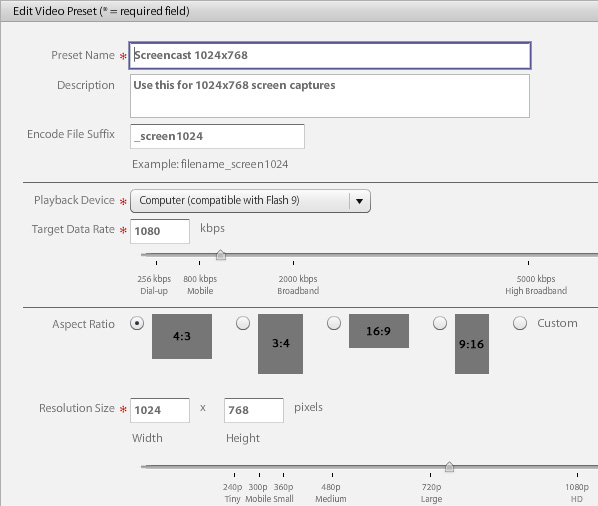

# Présentation vidéo {#video-overview}

Dynamic Media Classic est fourni avec la conversion automatique de la vidéo au téléchargement, la diffusion de la vidéo en flux continu sur les ordinateurs de bureau et les périphériques mobiles, ainsi que des visionneuses de vidéos adaptatives optimisées pour la lecture en fonction du périphérique et de la bande passante. L&#39;une des choses les plus importantes à propos de la vidéo est que le flux de travail est simple — il est conçu pour que tout le monde puisse l&#39;utiliser, même s&#39;ils ne sont pas très familiers avec la technologie vidéo.

À la fin de cette section du didacticiel, vous saurez comment :

- Téléchargement et codage vidéo (transcodage) dans des tailles et des formats différents
- Choisir parmi les paramètres vidéo prédéfinis disponibles pour le téléchargement
- Ajouter ou modifier un paramètre prédéfini de codage vidéo
- Prévisualisation de vidéos dans une visionneuse de vidéos
- Déploiement de vidéos sur des sites Web et mobiles
- Ajouter des légendes et des marques de chapitre à la vidéo
- Personnalisation et publication de visionneuses de vidéos pour les utilisateurs de bureau et de mobile

>[!NOTE]
>
>Toutes les URL de ce chapitre sont fournies à titre indicatif uniquement ; ce ne sont pas des liens en direct.

## Présentation de la vidéo Dynamic Media Classic

Commençons par mieux comprendre les possibilités de vidéo avec Dynamic Media Classic.

### Fonctionnalités et fonctionnalités

La plate-forme vidéo Dynamic Media Classic offre toutes les parties de la solution vidéo : téléchargement, conversion et gestion des vidéos ; la possibilité d’ajouter des légendes et des marques de chapitre à une vidéo ; et la possibilité d’utiliser des paramètres prédéfinis pour une lecture facile.

Il facilite la publication de vidéos adaptatives de haute qualité pour la diffusion en continu sur plusieurs écrans, notamment sur les périphériques mobiles de bureau, iOS, Android, Blackberry et Windows. Une visionneuse de vidéos adaptative regroupe les versions d’une même vidéo codées dans des débits et des formats différents, par exemple 400 kbit/s, 800 kbit/s et 1 000 kbit/s. Le poste de travail ou l’appareil mobile détecte la bande passante disponible.

En outre, la qualité vidéo est automatiquement modifiée de manière dynamique si les conditions réseau changent sur le bureau ou sur le périphérique mobile. En outre, si un client passe en mode plein écran sur un ordinateur de bureau, la visionneuse de vidéos adaptative répond en utilisant une meilleure résolution, améliorant ainsi l’expérience d’affichage du client. Les visionneuses de vidéos adaptatives offrent une lecture optimale aux clients lisant des vidéos Dynamic Media Classic sur plusieurs écrans et périphériques.

### Gestion des vidéos

L’utilisation de la vidéo peut s’avérer plus complexe que l’utilisation d’images numériques fixes. Avec la vidéo, vous traitez de nombreux formats et standards et de l&#39;incertitude quant à la capacité de votre audience à lire vos clips. Dynamic Media Classic facilite l&#39;utilisation de la vidéo, fournissant de nombreux outils puissants &quot;sous le capot&quot;, mais éliminant la complexité de travailler avec eux.

Dynamic Media Classic reconnaît et peut fonctionner avec de nombreux formats source disponibles. Cependant, la lecture de la vidéo n&#39;est qu&#39;une partie de l&#39;effort — vous devez également convertir la vidéo en un format compatible avec le Web. Dynamic Media Classic s’en charge en vous permettant de convertir une vidéo en vidéo H.264.

La conversion de la vidéo vous-même peut s&#39;avérer très compliquée à l&#39;aide des nombreux outils professionnels et passionnés disponibles. Dynamic Media Classic le garde simple en offrant des paramètres prédéfinis faciles optimisés pour différents paramètres de qualité. Cependant, si vous souhaitez personnaliser quelque chose, vous pouvez également créer vos propres paramètres prédéfinis.

Si vous avez beaucoup de vidéos, vous apprécierez la possibilité de gérer tous vos fichiers avec vos images et autres médias dans Dynamic Media Classic. Vous pouvez organiser, cataloguer et rechercher vos fichiers, y compris les fichiers vidéo, grâce à la prise en charge robuste des métadonnées XMP.

### Lecture vidéo

Tout comme le problème de la conversion vidéo pour la rendre accessible et conviviale pour le Web, il s’agit de la mise en oeuvre et du déploiement de la vidéo sur votre site. Si vous choisissez d&#39;acheter un lecteur ou de construire le vôtre, en le rendant compatible avec divers périphériques et écrans, puis de maintenir vos lecteurs peut être une occupation à temps plein.

Encore une fois, l’approche de Dynamic Media Classic consiste à vous permettre de choisir le paramètre prédéfini et la visionneuse qui correspondent à vos besoins. Vous disposez de nombreux choix de visionneuses et d’une bibliothèque de nombreux paramètres prédéfinis.

Vous pouvez facilement diffuser de la vidéo sur le Web et les périphériques mobiles, car Dynamic Media Classic prend en charge la vidéo HTML5, ce qui signifie que vous pouvez cible les utilisateurs exécutant divers navigateurs, ainsi que les utilisateurs de plateformes Android et iOS. La diffusion en flux continu de la vidéo permet une lecture en douceur d’un contenu plus long ou haute définition, tandis que la vidéo HTML5 progressive comporte des paramètres prédéfinis optimisés pour le petit écran.

Les paramètres prédéfinis de la visionneuse pour la vidéo peuvent être partiellement configurés en fonction du type de visionneuse.

Comme toutes les visionneuses, l’intégration s’effectue via une seule URL Dynamic Media Classic par visionneuse ou vidéo.

>[!NOTE]
>
>Il est recommandé d’utiliser les visionneuses de vidéos HTML5 Dynamic Media Classic. Les paramètres prédéfinis utilisés dans les visionneuses de vidéos HTML5 sont des lecteurs vidéo robustes. En combinant dans un lecteur unique la possibilité de concevoir les composants de lecture à l’aide de code HTML5 et CSS, d’incorporer la lecture et d’utiliser la diffusion en flux continu adaptatif et progressive selon les capacités du navigateur, vous étendez la portée de votre contenu multimédia enrichi aux utilisateurs de bureau, de tablette et de mobile, et vous garantissez une expérience vidéo rationalisée.

Une dernière remarque sur la vidéo Dynamic Media Classic qui peut s’appliquer à certains clients : la conversion, la diffusion en flux continu ou les paramètres vidéo prédéfinis de toutes les sociétés peuvent ne pas être activés automatiquement pour leur compte. Si, pour une raison quelconque, vous ne pouvez pas accéder aux URL pour la diffusion vidéo en flux continu, c’est peut-être la raison. Vous pourrez toujours télécharger et publier des vidéos téléchargées progressivement et accéder à toutes les visionneuses de vidéos. Toutefois, pour tirer parti de toutes les fonctionnalités vidéo de Dynamic Media Classic, vous devez contacter votre gestionnaire de compte ou votre directeur commercial pour activer ces fonctionnalités.

En savoir plus sur [Vidéo dans Dynamic Media Classic](https://docs.adobe.com/content/help/en/dynamic-media-classic/using/video/quick-start-video.html).

## Vidéo 101

### Concepts et terminologie des vidéos de base

Avant de commencer, discutons de certains termes que vous devez connaître pour pouvoir utiliser la vidéo. Ces concepts ne sont pas spécifiques à Dynamic Media Classic, et si vous gérez la vidéo pour un site web professionnel, vous feriez bien d&#39;obtenir une formation plus approfondie sur le sujet. Nous vous recommandons quelques ressources à la fin de cette section.

- **Encodage/transcodage.** Le codage est le processus d’application de la compression vidéo pour convertir des données vidéo brutes non compressées dans un format qui facilite leur utilisation. Le transcodage, bien que similaire, fait référence à la conversion d’une méthode de codage à une autre.

   - Les fichiers vidéo de Principal créés à l&#39;aide d&#39;un logiciel d&#39;édition vidéo sont souvent trop volumineux et ne sont pas dans le format approprié pour la diffusion vers des destinations en ligne. Ils sont généralement codés pour une lecture rapide sur le bureau et pour modification, mais pas pour la diffusion sur le Web.
   - Pour convertir la vidéo numérique au format et aux spécifications appropriés pour la lecture sur différents écrans, les fichiers vidéo sont transcodés dans un fichier plus petit et plus efficace, d’une taille optimale pour la diffusion sur le Web et sur les périphériques mobiles.

- **Compression vidéo.** La réduction de la quantité de données utilisées pour représenter les images vidéo numériques est une combinaison de compression d&#39;image spatiale et de compensation de mouvement temporel.

   - La plupart des techniques de compression sont perdues, ce qui signifie qu’elles éliminent les données pour obtenir une taille plus petite.
   - Par exemple, la vidéo DV est compressée relativement peu et permet de modifier facilement le métrage source, mais elle est beaucoup trop volumineuse pour être utilisée sur le Web ou même sur un DVD.

- **Formats de fichier.** Le format est un conteneur, semblable à un fichier ZIP, qui détermine comment les fichiers sont organisés dans le fichier vidéo, mais généralement pas comment ils sont codés.

   - Les formats de fichiers courants pour la vidéo source incluent Windows Media (WMV), QuickTime (MOV), Microsoft AVI et MPEG, entre autres. Les formats publiés par Dynamic Media Classic sont MP4.
   - Un fichier vidéo contient généralement plusieurs pistes — une piste vidéo (sans audio) et une ou plusieurs pistes audio (sans vidéo) — qui sont interconnectées et synchronisées.
   - Le format de fichier vidéo détermine l’organisation de ces différentes pistes de données et métadonnées.

- **Codec.** Un codec vidéo décrit l’algorithme par lequel une vidéo est codée à l’aide de la compression. L’audio est également codé au moyen d’un codec audio.

   - Les codecs limitent la quantité d’informations nécessaires pour lire la vidéo. Au lieu d&#39;informations sur chaque cadre individuel, seules les informations sur les différences entre un cadre et le suivant sont stockées.
   - Comme la plupart des vidéos changent peu d’une image à l’autre, les codecs permettent des taux de compression élevés, ce qui se traduit par des fichiers de taille plus petite.
   - Un lecteur vidéo décode la vidéo en fonction de son codec, puis affiche une série d’images, ou cadres, à l’écran.
   - Les codecs vidéo courants incluent H.264, On2 VP6 et H.263.

- **Résolution.** Hauteur et largeur de la vidéo en pixels.

   - La taille de la vidéo source est déterminée par votre appareil photo et la sortie de votre logiciel de montage. Un appareil photo HD crée généralement une vidéo haute résolution de 1920 x 1080, mais pour une lecture fluide sur le Web, vous pouvez la sous-échantillonner (redimensionner) à une résolution plus petite, par exemple 1280 x 720, 640 x 480 ou plus petite.
   - La résolution a un impact direct sur la taille du fichier ainsi que sur la bande passante nécessaire pour lire cette vidéo.

- **Afficher les proportions.** Rapport largeur/hauteur d’une vidéo. Lorsque le rapport L/H de la vidéo ne correspond pas au rapport du lecteur, vous pouvez voir &quot;barres noires&quot; ou espace vide. Deux proportions courantes sont utilisées pour afficher la vidéo :

   - 4:3 (1.33:1). Utilisé pour presque tous les contenus télévisés de définition standard.
   - 16:9 (1.78:1). Utilisé pour la quasi-totalité du contenu télévisé haute définition grand écran (HDTV) et des films.

- **Débit/débit/débit de données.** Quantité de données codées pour produire une seule seconde de lecture vidéo (en kilobits par seconde).

   - En règle générale, plus le débit binaire est faible, plus il est souhaitable pour le Web car il peut être téléchargé plus rapidement. Cependant, cela peut aussi signifier que la qualité est faible en raison de la perte de compression.
   - Un bon codec doit équilibrer débit faible et qualité.

- **Vitesse d’image (images par seconde ou images par seconde).** Nombre d’images, ou d’images fixes, pour chaque seconde de vidéo. Habituellement, la télévision nord-américaine (NTSC) est diffusée en 29,97 i/s; La télévision européenne et asiatique (PAL) est diffusée en 25 FPS ; et les films (analogiques et numériques) sont généralement en 24 (23,976) i/s.

   - Pour rendre les choses plus déroutantes, il y a aussi des cadres progressifs et entrelacés. Chaque cadre progressif contient un cadre d’image entier, tandis que les cadres entrelacés contiennent toutes les deux rangées de pixels d’un cadre d’image. Les images sont ensuite lues très rapidement et semblent se fondre ensemble. Le film utilise une méthode de balayage progressif, tandis que la vidéo numérique est généralement entrelacée.
   - En général, peu importe que votre métrage source soit entrelacé ou non — Dynamic Media Classic conserve la méthode d’analyse dans la vidéo convertie.
   - Diffusion de diffusion en continu/progressive. La diffusion vidéo en flux continu est l’envoi de médias dans un flux continu qui peut être lu à mesure qu’il arrive, tandis que la vidéo progressivement téléchargée est téléchargée comme tout autre fichier d’un serveur et mise en cache localement dans votre navigateur.

Avec un peu de chance, ce livret vous aide à comprendre les différentes options impliquées dans l&#39;utilisation de la vidéo Dynamic Media Classic.

## Processus vidéo

Lorsque vous travaillez avec des vidéos dans Dynamic Media Classic, vous suivez un processus de base similaire à celui des images.

1. Début en téléchargeant des fichiers vidéo vers Dynamic Media Classic. Pour ce faire, ouvrez le **menu Outils** au bas du panneau d’extension Dynamic Media Classic, puis choisissez **Télécharger vers Dynamic Media Classic > Fichiers sous le nom de dossier** ou **Télécharger vers Dynamic Media Classic > Dossiers sous le nom de dossier**. &quot;Nom du dossier&quot; correspond au dossier sur lequel vous naviguez actuellement avec l’extension. Les fichiers vidéo peuvent être volumineux. Nous vous recommandons donc d’utiliser le protocole FTP pour télécharger des fichiers volumineux. Dans le cadre du téléchargement, choisissez un ou plusieurs paramètres vidéo prédéfinis pour le codage de vos vidéos. La vidéo peut être transcodée en vidéo MP4 au moment du téléchargement. Pour plus d’informations sur l’utilisation et la création de paramètres prédéfinis de codage, voir la rubrique Paramètres vidéo prédéfinis ci-dessous. Découvrez [Téléchargement et codage de vidéos](https://docs.adobe.com/content/help/en/dynamic-media-classic/using/video/uploading-encoding-videos.html).
2. Sélectionnez ou sélectionnez et modifiez un paramètre prédéfini de visionneuse de vidéos et prévisualisation votre vidéo. Vous pouvez choisir un paramètre prédéfini de visionneuse prédéfini prédéfini ou personnaliser le vôtre. Si vous ciblez les utilisateurs de mobiles, vous n’avez rien à faire ici car les plateformes mobiles ne nécessitent pas de visionneuse ou de paramètre prédéfini. En savoir plus sur [la prévisualisation de vidéos dans une visionneuse de vidéos](https://docs.adobe.com/content/help/en/dynamic-media-classic/using/video/previewing-videos-video-viewer.html) et [l’Ajoute ou la modification d’un paramètre prédéfini de visionneuse de vidéos](https://docs.adobe.com/content/help/en/dynamic-media-classic/using/video/previewing-videos-video-viewer.html#adding-or-editing-a-video-viewer-preset).
3. Exécutez une publication de vidéo, obtenez l’URL et intégrez-la. La principale différence entre cette étape du processus vidéo et celle de l’image réside dans le fait que vous exécuterez une publication vidéo spéciale au lieu (ou peut-être aussi) de la publication Image Serving standard. L’intégration de la visionneuse de vidéos sur le bureau fonctionne exactement comme l’intégration de la visionneuse d’images. Cependant, pour les périphériques mobiles, elle est encore plus simple — tout ce dont vous avez besoin est l’URL de la vidéo elle-même.

### A propos du transcodage

Le transcodage a été défini plus tôt comme le processus de conversion d’une méthode de codage à une autre. Dans le cas de Dynamic Media Classic, il s’agit du processus de conversion de la vidéo source de son format actuel au format MP4. Cette opération est nécessaire avant que la vidéo ne s’affiche dans le navigateur de bureau ou sur un périphérique mobile.

Dynamic Media Classic peut gérer tout le transcodage pour vous, un énorme avantage. Vous pouvez transcoder la vidéo vous-même et télécharger les fichiers déjà convertis au format MP4, mais il peut s’agir d’un processus complexe qui nécessite un logiciel sophistiqué. A moins de savoir ce que vous faites, vous n&#39;obtiendrez généralement pas de bons résultats lors de votre première tentative.

Dynamic Media Classic ne convertit pas seulement les fichiers pour vous, il facilite également la tâche en fournissant des paramètres prédéfinis faciles à utiliser. Vous n&#39;avez vraiment pas besoin de connaître le côté technique de ce processus — tout ce que vous devez savoir est à peu près la ou les taille(s) finale(s) que vous voulez obtenir du système et une idée de la bande passante que vos utilisateurs finaux ont.

Bien que les paramètres prédéfinis prédéfinis soient pratiques et couvrent la plupart des besoins, il arrive que vous souhaitiez quelque chose de plus personnalisé. Dans ce cas, vous pouvez créer votre propre paramètre prédéfini de codage. Dans Dynamic Media Classic, un paramètre prédéfini de codage est appelé paramètre vidéo prédéfini. Ce point sera expliqué plus loin dans ce chapitre.

### A propos de la diffusion en continu

Une autre caractéristique importante à noter est la diffusion vidéo en flux continu, une fonctionnalité standard de la plate-forme vidéo Dynamic Media Classic. Les médias en flux continu sont constamment reçus et présentés à un utilisateur final lors de leur diffusion. C&#39;est là un élément important et souhaitable pour plusieurs raisons.

La diffusion en flux continu nécessite généralement moins de bande passante que le téléchargement progressif, car seule la partie de la vidéo visionnée est effectivement diffusée. Le serveur et les visionneuses de vidéo en flux continu Dynamic Media Classic utilisent la détection automatique de la bande passante pour fournir le meilleur flux possible pour la connexion Internet d’un utilisateur.

Avec la diffusion en flux continu, la lecture des débuts vidéo est plus rapide qu’avec d’autres méthodes. Il permet également une utilisation plus efficace des ressources réseau, car seules les parties de la vidéo visionnées sont envoyées au client.

L’autre méthode de diffusion est le téléchargement progressif. Comparé à la diffusion vidéo en flux continu, il n’y a qu’un seul avantage cohérent à un téléchargement progressif : vous n’avez pas besoin d’un serveur de diffusion pour diffuser la vidéo. Et c&#39;est bien sûr là que Dynamic Media Classic entre en scène — Dynamic Media Classic a un serveur de streaming intégré à la plate-forme, donc vous n&#39;avez pas besoin des tracas ou des coûts supplémentaires de maintenance de ce matériel dédié.

La vidéo de téléchargement progressif peut être diffusée à partir de n’importe quel serveur Web normal. Bien que cela puisse être pratique et potentiellement rentable, gardez à l’esprit que les téléchargements progressifs ont des capacités de recherche et de navigation limitées et que les utilisateurs peuvent accéder à votre contenu et le réutiliser. Dans certains cas, comme la lecture derrière des pare-feu réseau très stricts, la diffusion en flux continu peut être bloquée ; dans ces cas, il peut être souhaitable de revenir à la diffusion progressive.

Le téléchargement progressif est un bon choix pour les amateurs ou les sites Web à faible trafic ; s’ils n’ont pas d’objection à ce que leur contenu soit mis en cache sur l’ordinateur d’un utilisateur ; s&#39;ils n&#39;ont besoin de fournir que des vidéos de plus courte durée (moins de 10 minutes); ou si leurs visiteurs ne peuvent pas recevoir de vidéo en flux continu pour une raison quelconque.

Vous devrez diffuser votre vidéo en continu si vous avez besoin de fonctions avancées et de contrôle sur la diffusion vidéo, et/ou si vous devez afficher la vidéo à de plus grandes audiences (par exemple, plusieurs centaines de visionneuses simultanées), suivre et rapporter l’utilisation ou consulter des statistiques, ou si vous souhaitez offre à vos visionneuses la meilleure expérience de lecture interactive.

Enfin, si vous souhaitez protéger vos médias pour des questions de propriété intellectuelle ou de gestion des droits, la diffusion en flux continu offre une diffusion plus sécurisée de la vidéo, car le média n’est pas enregistré dans le cache du client lors de la diffusion en continu.

## Paramètres vidéo prédéfinis

Lorsque vous téléchargez la vidéo, vous choisissez un ou plusieurs paramètres prédéfinis qui contiennent les paramètres de conversion de la vidéo originale en un format compatible avec le Web via le codage. Les paramètres vidéo prédéfinis sont disponibles en deux versions : les paramètres prédéfinis de vidéo adaptative et les paramètres prédéfinis de codage uniques.

Voir [Paramètres vidéo prédéfinis disponibles](https://docs.adobe.com/content/help/en/dynamic-media-classic/using/setup/application-setup.html#video-presets-for-encoding-video-files).

Les paramètres prédéfinis de vidéo adaptative sont activés par défaut, ce qui signifie qu’ils sont disponibles pour le codage. Si vous souhaitez utiliser un paramètre prédéfini de codage unique, l’administrateur doit l’activer pour qu’il apparaisse dans la liste des paramètres vidéo prédéfinis.

Découvrez comment [activer ou désactiver les paramètres vidéo prédéfinis](https://docs.adobe.com/content/help/en/dynamic-media-classic/using/video/uploading-encoding-videos.html#activating-or-deactivating-video-encoding-presets).

Vous pouvez choisir l’un des nombreux paramètres prédéfinis fournis avec Dynamic Media Classic ou créer les vôtres ; toutefois, aucun paramètre prédéfini n’est sélectionné par défaut pour le téléchargement. En d’autres termes, **si vous ne sélectionnez pas de paramètre vidéo prédéfini au moment du téléchargement, votre vidéo ne sera pas convertie et peut être impubliable**. Cependant, vous pouvez convertir la vidéo vous-même hors ligne et la télécharger et la publier correctement. Les paramètres vidéo prédéfinis ne sont requis que si vous souhaitez que Dynamic Media Classic effectue la conversion pour vous.

Au moment du téléchargement, vous sélectionnez un paramètre vidéo prédéfini en choisissant **Options vidéo** dans le panneau Options tâche. Vous pouvez ensuite choisir de coder pour Ordinateur, Mobile ou Tablette.

- L&#39;ordinateur est destiné à un usage de bureau. Vous y trouverez généralement des paramètres prédéfinis plus volumineux (tels que HD) qui consomment davantage de bande passante.
- Mobile et Tablette créent des vidéos MP4 pour des périphériques tels que les iPhones et les smartphones Android. La seule différence entre Mobile et Tablette est que les paramètres prédéfinis Tablette ont généralement une bande passante plus élevée, car ils sont basés sur l’utilisation du Wi-Fi. Les paramètres prédéfinis mobiles sont optimisés pour une utilisation 3G plus lente.

### Questions à vous poser avant de choisir un paramètre prédéfini

Lorsque vous choisissez un paramètre prédéfini, vous devez connaître votre audience ainsi que votre métrage source. Que savez-vous de votre client ? Comment regardent-ils la vidéo — avec un écran d&#39;ordinateur ou un appareil mobile ?

Quelle est la résolution de votre vidéo ? Si vous choisissez un paramètre prédéfini plus grand que l’original, vous pouvez obtenir une vidéo floue/pixellisée. Il n’est pas recommandé de choisir un paramètre prédéfini plus grand que la vidéo source si la taille de la vidéo est supérieure à celle de la vidéo source.

Quel est son format ? Si vous voyez des barres noires autour de la vidéo convertie, vous choisissez les proportions incorrectes. Dynamic Media Classic ne peut pas détecter automatiquement ces paramètres, car il doit d’abord examiner le fichier avant de le télécharger.

### Ventilation des options vidéo

Les paramètres vidéo prédéfinis déterminent le mode de codage de la vidéo en spécifiant ces paramètres. Si vous ne connaissez pas ces termes, consultez la rubrique Concepts de base des vidéos et terminologie ci-dessus.

- **Format.** Généralement 4:3 standard ou 16:9 grand écran.
- **Taille.** Il s’agit de la même résolution que la résolution d’affichage, mesurée en pixels. Ceci est lié au format. A un rapport de 16:9, une vidéo sera de 432 x 240 pixels, tandis qu’à 4:3, elle sera de 320 x 240 pixels.
- **FPS.** Les cadences standard sont de 30, 25 ou 24 images par seconde (i/s), selon la norme vidéo : NTSC, PAL ou Film. Ce paramètre n’a pas d’importance, car Dynamic Media Classic utilise toujours la même fréquence d’images que la vidéo source.
- **Format.** Il s’agira du format MP4.
- **Bande passante.** Il s’agit de la vitesse de connexion désirée de votre utilisateur ciblé. Ont-ils une connexion internet rapide ou lente ? Utilisent-ils généralement des ordinateurs de bureau ou des appareils mobiles ? Ceci est également lié à la résolution (taille), car plus la vidéo est grande, plus la bande passante nécessaire est importante.

### Détermination du débit de données ou du débit de la vidéo

Le calcul du débit binaire de votre vidéo est l’un des facteurs les moins compris pour la diffusion de vidéo sur le Web, mais potentiellement le plus important, car il a un impact direct sur l’expérience utilisateur. Si vous définissez un débit binaire trop élevé, la qualité vidéo sera élevée, mais les performances seront médiocres. Les utilisateurs ayant une connexion Internet plus lente seront contraints d&#39;attendre que la vidéo s&#39;interrompe constamment au fur et à mesure de sa lecture. Cependant, si vous le définissez trop bas, la qualité en pâtira. Dans le paramètre vidéo prédéfini, Dynamic Media Classic propose une gamme de données en fonction de la bande passante de votre cible. C&#39;est un bon endroit pour début.

Cependant, si vous voulez le comprendre vous-même, vous aurez besoin d&#39;une calculatrice de débit binaire. Il s&#39;agit d&#39;un outil couramment utilisé par les professionnels de la vidéo et les passionnés pour estimer la quantité de données à inclure dans un flux ou un morceau de média donné (tel qu&#39;un DVD).

## Création d’un paramètre vidéo prédéfini personnalisé

Il peut arriver que vous ayez besoin d’un paramètre vidéo prédéfini spécial qui ne correspond pas aux paramètres des paramètres prédéfinis de codage vidéo intégrés. Cela peut se produire si vous avez une vidéo personnalisée d&#39;une taille spécifique, telle qu&#39;une vidéo créée à partir d&#39;un logiciel d&#39;animation 3D ou une vidéo recadrée à partir de sa taille d&#39;origine. Vous souhaitez peut-être tester différents paramètres de bande passante pour proposer des vidéos de qualité supérieure ou inférieure. Dans tous les cas, vous devrez créer un paramètre vidéo prédéfini de codage unique personnalisé.

### Flux de travaux vidéo prédéfinis

1. Les paramètres vidéo prédéfinis se trouvent sous **Configuration > Configuration de l’application > Paramètres vidéo prédéfinis**. Vous trouverez ici une liste de tous les paramètres prédéfinis de codage disponibles pour votre société.

   - Chaque compte de vidéo en flux continu comporte des dizaines de paramètres prédéfinis prêts à l’emploi. Si vous créez vos propres paramètres prédéfinis personnalisés, vous les verrez également ici.
   - Vous pouvez filtrer par type à l’aide du menu déroulant. Les paramètres prédéfinis sont divisés en Ordinateur, Mobile et Tablette.
      

2. La colonne Principal vous permet de choisir si vous souhaitez afficher tous les paramètres prédéfinis au téléchargement ou uniquement ceux que vous choisissez. Si vous vous trouvez aux États-Unis, vous pouvez désélectionner les paramètres prédéfinis PAL européens et, si vous vous trouvez au Royaume-Uni ou dans la région EMEA, désélectionner les paramètres NTSC prédéfinis.
3. Cliquez sur le bouton **Ajouter** pour créer un paramètre prédéfini personnalisé. Le panneau Ajouter les paramètres vidéo prédéfinis s’ouvre. Le processus ici est similaire à la création d’un paramètre d’image prédéfini.
4. Tout d’abord, attribuez-lui un **nom du paramètre prédéfini** qui apparaîtra dans la liste des paramètres prédéfinis. Dans l’exemple ci-dessus, ce paramètre prédéfini est destiné à la capture d’écran de vidéos didacticielles.
5. La **Description** est facultative, mais elle fournit à vos utilisateurs une info-bulle décrivant l’objectif de ce paramètre prédéfini.
6. Le suffixe de fichier **Encode** sera ajouté à la fin du nom de la vidéo que vous créez ici. N’oubliez pas que vous disposez d’une vidéo Principal ainsi que de cette vidéo codée, dérivée du fichier original, et qu’aucun des deux fichiers de Dynamic Media Classic ne peut avoir le même ID de fichier.
7. **Les** périphériques de lecture vous permettent de choisir le format de fichier vidéo de votre choix (Ordinateur, Mobile ou Tablette). Rappelez-vous que Mobile et Tablette produisent le même format MP4. Dynamic Media Classic a juste besoin de savoir dans quelle catégorie placer le paramètre prédéfini ; cependant, la différence théorique est que les paramètres prédéfinis Tablet sont généralement pour une connexion Internet plus rapide parce que tous prennent en charge le Wi-Fi.
8. **Le** taux de données de cible est quelque chose que vous devez comprendre par vous-même, mais vous pouvez voir une plage suggérée sur l&#39;image ci-dessous. Vous pouvez également faire glisser le curseur vers la bande passante de la cible approximative. Pour une figure plus précise, utilisez une calculatrice de débit binaire. Il y a un peu d&#39;essais et d&#39;erreurs en jeu.

   

9. Définissez les proportions **de votre fichier source**. Ce paramètre est directement lié à la taille ci-dessous. Si vous choisissez _Personnalisé_, vous devrez saisir manuellement la largeur et la hauteur.
10. Si vous choisissez un format, définissez une valeur pour **Taille de résolution** et Dynamic Media Classic remplira automatiquement l’autre valeur. Toutefois, pour un format personnalisé, renseignez les deux valeurs. Votre taille doit être conforme à votre débit de données. Si vous définissez un débit de données très faible et une grande taille, vous vous attendriez à ce que la qualité soit médiocre.
11. Cliquez sur **Enregistrer** pour enregistrer votre paramètre prédéfini. Contrairement à tous les autres paramètres prédéfinis, vous n’avez pas besoin de publier pour l’instant, car les paramètres prédéfinis sont uniquement destinés au téléchargement de fichiers. Par la suite, vous devrez publier les vidéos codées, mais les paramètres prédéfinis sont uniquement destinés à une utilisation interne de Dynamic Media Classic.
12. Pour vérifier que votre paramètre vidéo prédéfini figure sur la liste de téléchargement, accédez à **Télécharger**.Choisissez **Options tâche** et développez **Options vidéo**. Votre paramètre prédéfini est répertorié dans la catégorie du périphérique de lecture que vous avez choisi (Ordinateur, Mobile ou Tablette).

En savoir plus sur [l’Ajoute ou la modification d’un paramètre vidéo prédéfini](https://docs.adobe.com/content/help/en/dynamic-media-classic/using/video/uploading-encoding-videos.html#adding-or-editing-a-video-encoding-preset).

## Ajouter des légendes à votre vidéo

Dans certains cas, il peut s’avérer utile d’ajouter des légendes à votre vidéo, par exemple lorsque vous devez fournir la vidéo à des visionneuses dans plusieurs langues, mais que vous ne souhaitez pas dupliquer l’audio dans une autre langue ou enregistrer à nouveau la vidéo dans des langues différentes. En outre, l’ajout de sous-titrages offre une plus grande accessibilité pour les malentendants et les utilisateurs de sous-titrage. Dynamic Media Classic facilite l’ajout de légendes à vos vidéos.

Découvrez comment [Ajouter des légendes à la vidéo](https://docs.adobe.com/content/help/en/dynamic-media-classic/using/video/adding-captions-video.html).

## Ajouter des marqueurs de chapitre à votre vidéo

Pour les vidéos longues, les utilisateurs apprécieront probablement la facilité et la facilité de navigation dans la vidéo à l’aide de marques de chapitre. Dynamic Media Classic permet d’ajouter facilement des marques de chapitre à votre vidéo.

Découvrez comment [Ajouter les marqueurs de chapitre à la vidéo](https://docs.adobe.com/content/help/en/dynamic-media-classic/using/video/adding-chapter-markers-video.html).

## Rubriques de mise en oeuvre vidéo

### Publier et copier l’URL

La dernière étape du processus Dynamic Media Classic consiste à publier votre contenu vidéo. Cependant, la vidéo a sa propre tâche de publication, appelée Publication sur le serveur vidéo, qui se trouve sous Advanced.

Découvrez comment [publier votre vidéo](https://docs.adobe.com/content/help/en/dynamic-media-classic/using/video/deploying-video-websites-mobile-sites.html#publishing-video).

Une fois que vous lancez une publication de vidéo, vous pouvez obtenir une URL pour accéder à vos vidéos et à tous les paramètres prédéfinis de visionneuse Dynamic Media Classic standard dans un navigateur Web. Cependant, si vous personnalisez ou créez votre propre paramètre prédéfini de visionneuse de vidéos, vous devrez tout de même exécuter une publication Image Server distincte.

- Découvrez comment [lier une URL à un site mobile ou à un site Web](https://docs.adobe.com/content/help/en/dynamic-media-classic/using/video/deploying-video-websites-mobile-sites.html#linking-a-video-url-to-a-mobile-site-or-a-website).
- Découvrez comment [incorporer la visionneuse de vidéos sur une page Web](https://docs.adobe.com/content/help/en/dynamic-media-classic/using/video/deploying-video-websites-mobile-sites.html#embedding-the-video-viewer-on-a-web-page).

Vous pouvez également déployer votre vidéo à l’aide d’un lecteur vidéo intégré tiers ou personnalisé.

Découvrez comment [déployer une vidéo à l’aide d’un lecteur vidéo tiers](https://docs.adobe.com/content/help/en/dynamic-media-classic/using/video/deploying-video-websites-mobile-sites.html#deploying-video-using-a-third-party-video-player).

De plus, si vous souhaitez également utiliser les miniatures vidéo — l’image extraite de la vidéo — vous devrez également exécuter une publication Image Server. En effet, l’image miniature de la vidéo réside sur le serveur d’images, tandis que la vidéo elle-même se trouve sur le serveur de vidéo. Les miniatures vidéo peuvent être utilisées dans les résultats de la recherche vidéo, les listes de lecture vidéo et comme &quot;cadre d’affiche&quot; initial qui s’affiche dans la visionneuse avant la lecture de la vidéo.

En savoir plus sur [Utilisation de miniatures vidéo](https://docs.adobe.com/content/help/en/dynamic-media-classic/using/video/deploying-video-websites-mobile-sites.html#working-with-video-thumbnails).

### Sélection et personnalisation d’un paramètre prédéfini de visionneuse

Le processus de sélection et de personnalisation d’un paramètre prédéfini de visionneuse est identique à celui des images. Vous pouvez soit créer un paramètre prédéfini, soit modifier un paramètre prédéfini existant et l’enregistrer sous un nouveau nom, apporter des modifications et exécuter une publication de diffusion d’images. Tous les paramètres prédéfinis de la visionneuse sont publiés sur le serveur d’images, pas seulement les paramètres prédéfinis pour les images. Par conséquent, vous devez exécuter une publication d’image pour afficher vos paramètres prédéfinis nouveaux ou modifiés.

>[!TIP]
>
>Exécutez une publication Image Serving après la publication sur votre serveur vidéo pour publier toutes les images miniatures associées à vos vidéos.

## Optimisation du moteur de recherche vidéo

L&#39;optimisation du référencement (optimisation pour les moteurs de recherche) consiste à améliorer la visibilité d&#39;un site Web ou d&#39;une page Web dans les moteurs de recherche. Bien que les moteurs de recherche réussissent parfaitement à collecter des informations sur le contenu texte, ils ne peuvent pas obtenir d&#39;informations suffisantes sur la vidéo, à moins que ces informations ne leur soient fournies. L’optimisation du référencement des vidéos Dynamic Media Classic vous permet d’utiliser des métadonnées pour fournir aux moteurs de recherche des descriptions de vos vidéos. La fonction d’optimisation du référencement de la vidéo vous permet de créer des plans de site vidéo et des flux Media RSS (mRSS).

- **Plan de site** vidéo. Informe Google exactement où et quel est le contenu vidéo sur un site. Par conséquent, les vidéos peuvent faire l’objet de recherches sur Google. Par exemple, un plan de site vidéo peut indiquer la durée d’exécution et la catégorie des vidéos.
- **flux** mRSS. Utilisé par les éditeurs de contenu pour alimenter des fichiers multimédia dans Yahoo! Recherche vidéo. Google prend en charge à la fois le plan de site vidéo et le protocole de flux Media RSS (mRSS) pour envoyer des informations aux moteurs de recherche.

Lorsque vous créez des plans de site vidéo et des flux mRSS, vous choisissez les champs de métadonnées des fichiers vidéo à inclure. Ainsi, vous décrivez vos vidéos aux moteurs de recherche afin que les moteurs de recherche puissent diriger plus précisément le trafic vers les vidéos de votre site Web.

Une fois le plan de site ou le flux créé, Dynamic Media Classic peut le publier automatiquement, le publier manuellement ou simplement générer un fichier que vous pourrez modifier ultérieurement. De plus, Dynamic Media Classic peut générer et publier automatiquement ce fichier chaque jour.

A la fin du processus, vous envoyez le fichier ou l&#39;URL à votre moteur de recherche. Cette tâche se fait en dehors de Dynamic Media Classic ; cependant, nous en discuterons brièvement ci-dessous.

### Conditions requises pour les fichiers Sitemap/mRSS

Pour que Google et d&#39;autres moteurs de recherche ne rejettent pas vos fichiers, ils doivent être au format approprié et inclure certaines informations. Dynamic Media Classic génère un fichier correctement formaté ; toutefois, si les informations ne sont pas disponibles pour certaines de vos vidéos, elles ne seront pas incluses dans le fichier.

Les champs obligatoires sont Landing page (l’URL de la page qui diffuse la vidéo, et non l’URL de la vidéo elle-même), Titre et Description. Chaque vidéo doit comporter une entrée pour ces éléments, sinon elle ne sera pas incluse dans le fichier généré. Les champs facultatifs sont Balises et Catégorie.

Il existe deux autres champs obligatoires : URL de contenu, URL de la ressource vidéo proprement dite et Miniature, URL d’une image miniature de la vidéo. Cependant, Dynamic Media Classic remplira automatiquement ces valeurs.

Il est recommandé d’incorporer ces données dans vos vidéos avant de les télécharger à l’aide de XMP métadonnées et Dynamic Media Classic les extraira au moment du téléchargement. Vous utiliseriez une application telle que Adobe Bridge — incluse avec toutes les applications Adobe Creative Cloud — pour renseigner les données dans les champs de métadonnées standard.

En suivant cette méthode, vous n’aurez pas à saisir manuellement ces données à l’aide de Dynamic Media Classic. Cependant, vous pouvez également utiliser les paramètres prédéfinis de métadonnées dans Dynamic Media Classic pour saisir rapidement les mêmes données à chaque fois.

Pour plus d’informations sur cette rubrique, voir [Affichage, Ajoute et exportation des métadonnées](https://docs.adobe.com/content/help/en/dynamic-media-classic/using/managing-assets/viewing-adding-exporting-metadata.html).

Une fois les métadonnées renseignées, vous pourrez les voir dans la Vue de détails de ce fichier vidéo. Les mots-clés peuvent également être présents, mais ils se trouvent sous l&#39;onglet Mots-clés.

- En savoir plus sur [l&#39;Ajoute de mots-clés](https://docs.adobe.com/content/help/en/dynamic-media-classic/using/managing-assets/viewing-adding-exporting-metadata.html#add-or-edit-keywords).
- En savoir plus sur [Optimisation du référencement des vidéos](https://docs.adobe.com/content/help/en/dynamic-media-classic/using/setup/video-seo-search-engine-optimization.html).
- Découvrez les [Paramètres d’optimisation du référencement des vidéos](https://docs.adobe.com/content/help/en/dynamic-media-classic/using/setup/video-seo-search-engine-optimization.html#choosing-video-seo-settings).

#### Configuration de l’optimisation du référencement des vidéos

Configuration de débuts d’optimisation du référencement des vidéos en choisissant le type de format souhaité, la méthode de génération et les champs de métadonnées à insérer dans le fichier.

1. Accédez à **Configuration > Configuration de l’application > Optimisation du référencement de la vidéo > Paramètres**.
2. Dans le menu **Mode de génération**, choisissez un format de fichier. La valeur par défaut est Désactivé. Pour l’activer, sélectionnez Plan de site vidéo, mRSS ou Les deux.
3. Choisissez si la génération doit être automatique ou manuelle. Pour simplifier, nous vous recommandons de le définir sur **Mode automatique**. Si vous choisissez Automatique, définissez également l’option **Marquer pour publication**, sinon le ou les fichiers ne seront pas activés. Le plan de site et les fichiers RSS sont des types de document XML et doivent être publiés comme tout autre actif. Utilisez l&#39;un des modes manuels si vous n&#39;avez pas toutes les informations à portée de main maintenant ou si vous ne voulez faire qu&#39;une seule génération.
4. Renseignez les balises de métadonnées qui seront utilisées dans les fichiers. Cette étape n’est pas facultative. Au minimum, vous devez inclure les trois champs signalés par un astérisque (\*) : **Landing page**, **Titre** et **Description**. Pour utiliser vos métadonnées pour ces tâches, faites glisser et déposez les champs du panneau Métadonnées à droite dans un champ correspondant du formulaire. Dynamic Media Classic renseigne automatiquement le champ d’espace réservé avec les données réelles de chaque vidéo. Il n’est pas nécessaire d’utiliser des champs de métadonnées. Vous pouvez saisir du texte statique ici, mais ce même texte apparaîtra pour chaque vidéo.
5. Une fois que vous avez saisi les informations dans les trois champs obligatoires, Dynamic Media Classic activera les boutons **Enregistrer** et **Enregistrer et générer**. Cliquez sur un pour enregistrer vos paramètres. Utilisez **Enregistrer** si vous êtes en mode automatique et souhaitez que Dynamic Media Classic génère les fichiers ultérieurement. Utilisez **Enregistrer et générer** pour créer le fichier immédiatement.

### Test et publication de votre plan de site vidéo, de votre flux mRSS ou des deux fichiers

Les fichiers générés apparaîtront dans le répertoire racine (de base) de votre compte.

Ces fichiers doivent être publiés, car l’outil d’optimisation du référencement des vidéos ne peut pas exécuter une publication seule. Tant qu’elles sont marquées pour publication, elles seront envoyées aux serveurs de publication lors de la prochaine exécution d’une publication.

Après la publication, vos fichiers seront disponibles au moyen de ce format d’URL.

Exemple :

### Envoi vers des moteurs de recherche

La dernière étape du processus consiste à envoyer vos fichiers et/ou URL aux moteurs de recherche. Dynamic Media Classic ne peut pas effectuer cette étape pour vous ; toutefois, en supposant que vous envoyiez l’URL et non le fichier XML lui-même, votre flux doit être mis à jour lors de la prochaine génération du fichier et d’une publication.

La méthode d&#39;envoi à votre moteur de recherche variera, mais pour Google, vous utilisez les outils Google Webmaster. Une fois sur place, accédez à **Configuration du site > Plans de site**, puis cliquez sur le bouton **Envoyer un plan de site**. Ici, vous pouvez placer l’URL Dynamic Media Classic dans vos fichiers d’optimisation du référencement.

### Rapport d’optimisation du référencement de la vidéo

Dynamic Media Classic fournit un rapport qui montre le nombre de vidéos qui ont été incluses avec succès dans les fichiers, et plus important, qui n’ont pas été incluses en raison d’erreurs. Pour accéder au rapport, sélectionnez **Configuration > Configuration de l’application > Optimisation du référencement de la vidéo > Rapport**.

## Vidéo sur l’implémentation mobile pour MP4

Dynamic Media Classic n’inclut pas les paramètres prédéfinis de la visionneuse pour les périphériques mobiles, car les visionneuses ne sont pas nécessaires pour lire de la vidéo sur les périphériques mobiles pris en charge. Tant que vous encodez au format MP4 H.264 (conversion au téléchargement ou pré-codage sur votre bureau), les tablettes et smartphones pris en charge pourront lire vos vidéos sans avoir besoin d’une visionneuse. Cette fonctionnalité est prise en charge sur les périphériques Android et iOS (iPhone et iPad).

La raison pour laquelle aucun lecteur n’est requis est que les deux plates-formes prennent en charge la version H.264 native. Vous pouvez soit incorporer la vidéo dans une page Web HTML5, soit incorporer la vidéo dans l’application elle-même, et les systèmes d’exploitation Android et iOS fourniront un contrôleur pour lire la vidéo.

Par conséquent, Dynamic Media Classic ne vous donne pas d’URL à une visionneuse pour périphériques mobiles, mais vous donne plutôt une URL directement à la vidéo. Dans la fenêtre de Prévisualisation d’une vidéo MP4, il y aura des liens pour Bureau et Mobile. L’URL mobile pointe vers la vidéo publiée.

Une chose importante à noter à propos de la vidéo publiée est que l’URL liste le chemin d’accès complet à la vidéo, pas seulement l’ID du fichier. Lorsque vous traitez d’images, vous appelez l’image par son ID de fichier, quelle que soit la structure de dossiers. Toutefois, pour la vidéo, vous devez également spécifier la structure de dossiers. Dans les URL ci-dessus, la vidéo est stockée dans le chemin d’accès :

Vous pouvez également l’exprimer sous la forme du nom de la société, du chemin d’accès au dossier ou du nom de la vidéo.

### Méthode n° 1 : Lecture du navigateur — Code HTML5

Pour incorporer votre vidéo MP4 dans une page Web, utilisez la balise vidéo HTML5.

Cette méthode fonctionnera également pour le web pour ordinateur, mais vous risquez de rencontrer des problèmes avec la prise en charge du navigateur — tous les navigateurs web pour ordinateur ne prennent pas en charge la vidéo H.264 de façon native, y compris Firefox.

### Méthode n° 2 : Lecture de l’application sur iOS — Media Player Framework

Vous pouvez également incorporer la vidéo MP4 Dynamic Media Classic dans votre code d’application mobile. Voici un exemple générique pour iOS utilisant la structure du lecteur multimédia, qui est fourni à titre indicatif uniquement :

## Ressources supplémentaires

Regardez le [Dynamic Media Skill Builder : Vidéo dans Dynamic Media Classic](https://seminars.adobeconnect.com/p2ueiaswkuze) webinar à la demande pour découvrir comment utiliser les fonctionnalités vidéo dans Dynamic Media Classic.
