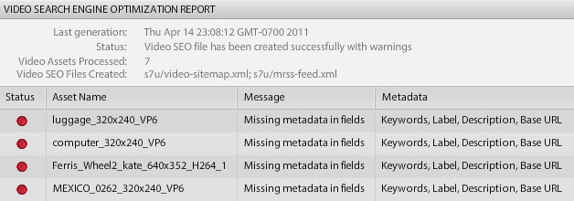

# Vue d’ensemble vidéo {#video-overview}

Dynamic Media Classic s’accompagne d’une conversion automatique de la vidéo au moment du chargement, du streaming vidéo sur les ordinateurs de bureau et les appareils mobiles, ainsi que de visionneuses adaptatives optimisées pour la lecture en fonction de l’appareil et de la bande passante. Une des choses les plus importantes dans la vidéo est la simplicité du workflow. Il est conçu pour que n’importe quelle personne puisse l’utiliser, même sans connaissance sur la technologie vidéo.

D’ici la fin de cette section du tutoriel, vous saurez comment :

- Charger et coder (transcoder) des vidéos dans différents formats et tailles
- Choisir parmi les paramètres vidéos prédéfinis de chargement disponibles
- Ajouter ou modifier un paramètre prédéfini de codage vidéo
- Prévisualiser les vidéos dans une visionneuse de vidéos
- Déployer les vidéos sur des sites web et mobiles
- Ajouter des sous-titres et des marqueurs de chapitre aux vidéos
- Personnaliser et publier des visionneuses de vidéos pour les utilisateurs et les utilisatrices sur ordinateur ou appareil mobile

>[!NOTE]
>
>Toutes les URL de ce chapitre sont proposées à titre d’illustration uniquement ; il ne s’agit pas de liens directs.

## Vue d’ensemble des fonctionnalités vidéos de Dynamic Media Classic

Commençons par découvrir les outils vidéos avec Dynamic Media Classic.

### Fonctionnalités et capacités

La plateforme vidéo de Dynamic Media Classic offre toutes les fonctionnalités de solution vidéo : le chargement, la conversion et la gestion des vidéos, la possibilité d’ajouter des sous-titres et des marqueurs de chapitre à une vidéo et la possibilité d’utiliser des paramètres prédéfinis pour une lecture facile.

Elle facilite la publication de vidéos adaptatives de haute qualité pour le streaming sur plusieurs écrans, notamment sur les ordinateurs de bureau, mais aussi sur les appareils mobiles iOS, Android™, BlackBerry® et Windows. Une visionneuse de vidéos adaptative regroupe les versions d’une même vidéo codées dans des débits et des formats différents, par exemple 400 kbit/s, 800 kbit/s et 1 000 kbit/s. Le poste de travail ou l’appareil mobile détecte la bande passante disponible.

En outre, la qualité de la vidéo s’adapte de manière automatique et dynamique aux fluctuations des conditions du réseau sur le poste de travail ou sur l’appareil mobile. De même, si un client ou une cliente passe en mode plein écran sur un ordinateur, la visionneuse de vidéos adaptatives réagit en utilisant une meilleure résolution, améliorant l’expérience de visionnage du client ou de la cliente. L’utilisation des visionneuses de vidéos adaptatives offre la meilleure lecture possible aux clientes et clients qui lisent des vidéos Dynamic Media Classic sur plusieurs écrans et appareils.

### Gestion des vidéos

Travailler sur des vidéos peut s’avérer plus complexe que travailler sur des images numériques. En utilisant des vidéos, vous devez traiter de nombreux formats et normes et vous devez gérer la capacité de votre audience à lire vos clips. Dynamic Media Classic facilite l’utilisation de vidéos, fournissant de nombreux outils « structurels » puissants, tout en éliminant la complexité de leur utilisation.

Dynamic Media Classic prend en charge de nombreux formats sources disponibles. Cependant, réussir à lire la vidéo n’est qu’une partie du travail ; vous devez également convertir la vidéo en un format adapté au web. Dynamic Media Classic s’en charge en vous permettant de convertir une vidéo en H.264.

Convertir une vidéo par vous-même peut s’avérer compliqué et nécessite souvent de nombreux outils professionnels et complexes. Dynamic Media Classic reste simple et offre des paramètres prédéfinis optimisés pour différentes qualités. Cependant, si vous souhaitez quelque chose de plus personnalisé, vous pouvez également créer vos propres paramètres prédéfinis.

Si vous disposez de nombreuses vidéos, vous apprécierez la possibilité de gérer toutes vos ressources, ainsi que vos images et autres médias dans Dynamic Media Classic. Vous pouvez organiser, cataloguer et rechercher vos ressources, y compris les ressources vidéo, avec une prise en charge performante des métadonnées XMP.

### Lecture vidéo

Tout comme le problème lié à la conversion d’une vidéo pour la rendre conviviale et accessible sur le web, il s’agit du problème lié à l’implémentation et au déploiement d’une vidéo sur votre site. Vous devez choisir entre acheter un lecteur ou créer le vôtre et le rendre compatible avec divers appareils et écrans. La maintenance de vos lecteurs peut être une occupation à temps plein.

Encore une fois, l’approche de Dynamic Media Classic vous permet de choisir le paramètre prédéfini et la visionneuse qui correspondent à vos besoins. Vous disposez de nombreux choix de visionneuses et d’une bibliothèque de nombreux paramètres prédéfinis disponibles.

Vous pouvez diffuser facilement des vidéos sur le web et les appareils mobiles, car Dynamic Media Classic prend en charge la vidéo HTML5, ce qui signifie que vous pouvez cibler les personnes exécutant différents navigateurs, ainsi que celles utilisant les plateformes Android™ et iOS. La vidéo en streaming permet une lecture fluide d’un contenu plus long ou haute définition, tandis que la vidéo HTML5 progressive comporte des paramètres prédéfinis optimisés pour le petit écran.

Les paramètres prédéfinis de visionneuse pour la vidéo sont partiellement configurables en fonction du type de visionneuse.

Comme toutes les visionneuses, l’intégration s’effectue via une seule URL Dynamic Media Classic par visionneuse ou vidéo.

>[!NOTE]
>
>Pour respecter les bonnes pratiques, utilisez les visionneuses de vidéos HTML5 Dynamic Media Classic. Les paramètres prédéfinis utilisés dans les visionneuses de vidéo HTML5 sont des lecteurs vidéo fiables. En combinant dans un seul lecteur la possibilité de concevoir les composants de lecture à l’aide de HTML5 et CSS, d’avoir une lecture incorporée et d’utiliser la diffusion en streaming adaptative et progressive selon les fonctionnalités du navigateur, vous étendez la portée de votre contenu multimédia aux ordinateurs, aux tablettes et aux utilisateurs et utilisatrices mobiles, et garantissez une expérience vidéo rationalisée.

Dernière remarque concernant la vidéo Dynamic Media Classic qui peut s’appliquer à certaines personnes de votre clientèle : toutes les entreprises n’ont peut être pas activé la conversion automatique, la diffusion en streaming ou les paramètres vidéo prédéfinis pour leur compte. Si, pour une raison quelconque, vous ne pouvez pas accéder aux URL pour la vidéo en streaming, il se peut que cela en soit la cause. Vous pouvez charger et publier des vidéos téléchargées progressivement et avoir accès à toutes les visionneuses de vidéos. Toutefois, pour profiter de toutes les fonctionnalités vidéo de Dynamic Media Classic, contactez la personne chargée de la gestion de votre compte ou des ventes pour activer ces fonctionnalités.

En savoir plus sur [Vidéo dans Dynamic Media Classic](https://experienceleague.adobe.com/docs/dynamic-media-classic/using/video/quick-start-video.html?lang=fr).

## Vidéo 101

### Concepts vidéo de base et terminologie

Avant de commencer, discutons de quelques termes que vous devriez connaître pour pouvoir utiliser la vidéo. Ces concepts ne sont pas spécifiques à Dynamic Media Classic, et si vous gérez la vidéo pour un site web professionnel, il serait dans votre intérêt de vous former davantage sur le sujet. Vous trouverez des ressources que nous recommandons à la fin de cette section.

- **Codage/transcodage.** Le codage est le processus d’application de la compression vidéo pour convertir des données vidéo brutes et non compressées dans un format qui facilite leur utilisation. Le transcodage, bien que similaire, fait référence à la conversion d’une méthode de codage à une autre.

   - Les fichiers vidéo originaux créés avec un logiciel d’édition vidéo sont souvent trop volumineux et ne sont pas au format approprié pour une diffusion vers des destinations en ligne. Les vidéos sont généralement codées pour une lecture rapide sur l’ordinateur de bureau et pour être modifiées, mais pas pour une diffusion sur le web.
   - Pour convertir une vidéo numérique au format et aux spécifications appropriés pour la lecture sur différents écrans, les fichiers vidéo sont transcodés dans une taille de fichier plus petite et efficace, optimale pour la diffusion sur le web et sur les appareils mobiles.

- **Compression vidéo.** Réduire la quantité de données utilisées pour représenter les images vidéo numériques est une combinaison de compression de l’image spatiale et de compensation du mouvement temporel.

   - La plupart des techniques de compression impliquent une perte, ce qui signifie qu’elles rejettent des données afin d’obtenir une taille plus petite.
   - Par exemple, la vidéo DV est assez peu compressée et permet de modifier facilement le contenu source, mais elle est beaucoup trop volumineuse pour être utilisée sur le web ou même sur un DVD.

- **Formats de fichier.** Le format est un conteneur, similaire à un fichier ZIP, qui détermine la manière dont les fichiers sont organisés dans le fichier vidéo, mais généralement pas la manière dont ils sont codés.

   - Les formats de fichiers courants pour la vidéo source incluent Windows Media (WMV), QuickTime (MOV), Microsoft® AVI et MPEG, entre autres. Le format publié par Dynamic Media Classic est MP4.
   - Un fichier vidéo contient généralement plusieurs pistes : une piste vidéo (sans audio) et une ou plusieurs pistes audio (sans vidéo) interconnectées et synchronisées.
   - Le format du fichier vidéo détermine la manière dont ces différentes pistes de données et métadonnées sont organisées.

- **Codec.** Un codec vidéo décrit l’algorithme par lequel une vidéo est codée à l’aide de la compression. L’audio est également codé au moyen d’un codec audio.

   - Les codecs minimisent la quantité d’informations requises pour lire une vidéo. Au lieu d’informations sur chaque image, seules les informations sur les différences entre une image et la suivante sont stockées.
   - Comme la plupart des vidéos changent peu d’une image à l’autre, les codecs permettent des taux de compression élevés, ce qui se traduit par des tailles de fichiers plus petites.
   - Un lecteur vidéo décode la vidéo en fonction de son codec, puis affiche une série d’images, ou frames, à l’écran.
   - Les codecs vidéo courants comprennent H.264, On2 VP6 et H.263.

- **Résolution.** Hauteur et largeur de la vidéo, en pixels.

   - La taille de la vidéo source est déterminée par la caméra et la sortie de votre logiciel de retouche. Une caméra HD crée une vidéo haute résolution 1920x1080. Toutefois, pour une lecture fluide sur le web, vous pouvez la sous-échantillonner (la redimensionner) à une résolution plus petite, telle que 1280x720, 640x480 ou inférieure.
   - La résolution a un impact direct sur la taille du fichier et la bande passante nécessaires pour lire cette vidéo.

- **Format d’affichage.** Rapport largeur/hauteur d’une vidéo. Lorsque les proportions de la vidéo ne correspondent pas aux proportions du lecteur, des « barres noires » ou un espace vide peuvent s’afficher. Deux formats courants sont utilisés pour afficher la vidéo :

   - 4:3 (1.33:1). Utilisé pour presque tous les contenus télévisés à définition standard.
   - 16:9 (1.78:1). Utilisé pour presque tous les contenus télévisés haute définition (HDTV) et les films.

- **Débit/Débit de données.** La quantité de données codées pour constituer une seconde de lecture vidéo (en kilobits par seconde).

   - En règle générale, plus le débit est faible, plus il est adapté au web, car il peut être téléchargé plus rapidement. Cependant, cela peut également signifier une qualité faible en raison de la perte de compression.
   - Un bon codec doit équilibrer un débit faible et une bonne qualité.

- **Cadence (images par seconde, FPS).** Nombre d’images fixes pour chaque seconde de vidéo. En règle générale, la télévision nord-américaine (NTSC) est diffusée à 29,97 i/s ; la télévision européenne et asiatique (PAL) est diffusée à 25 i/s ; les films (analogiques et numériques) sont généralement diffusés à 24 (23,976) i/s.

   - Pour compliquer encore un peu la chose, il existe également des images progressives et entrelacées. Chaque image progressive contient une image entière, tandis que les images entrelacées contiennent une rangée de pixels sur deux dans l’image. Les images sont ensuite lues rapidement et semblent fusionner. Le film utilise une méthode de numérisation progressive, tandis que la vidéo numérique est généralement entrelacée.
   - En règle générale, peu importe que l’enregistrement source soit entrelacé ou non : Dynamic Media Classic conserve la méthode de numérisation dans la vidéo convertie.
   - Diffusion en streaming/progressive. La diffusion vidéo en streaming envoie des médias en continu, lus à mesure qu’ils arrivent. La vidéo téléchargée progressivement est téléchargée comme tout autre fichier à partir d’un serveur, puis mise en cache localement dans votre navigateur.

Avec un peu de chance, cette introduction vous aidera à comprendre les différentes options impliquées dans l’utilisation de la vidéo Dynamic Media Classic.

## Workflow vidéo

Lorsque vous travaillez sur une vidéo dans Dynamic Media Classic, vous suivez un workflow de base similaire à celui de l’utilisation d’images.

1. Commencez par charger des fichiers vidéo dans Dynamic Media Classic. Pour ce faire, ouvrez le **Menu Outils** au bas du panneau de l’extension Dynamic Media Classic, puis sélectionnez **Charger vers Dynamic Media Classic > Fichiers dans Nom du dossier**, ou **Charger vers Dynamic Media Classic > Dossiers dans Nom du dossier**. « Nom du dossier » est le dossier que vous parcourez actuellement avec l’extension. Les fichiers vidéo peuvent être volumineux. Nous vous recommandons donc d’utiliser le protocole FTP pour leur téléchargement. Dans le cadre du téléchargement, sélectionnez un ou plusieurs paramètres vidéo prédéfinis pour le codage de vos vidéos. La vidéo peut être transcodée au format MP4 lors du chargement. Pour plus d’informations sur l’utilisation et la création de paramètres prédéfinis de codage, voir la rubrique Paramètres vidéo prédéfinis ci-dessous. Découvrez le [chargement et le codage de vidéos](https://experienceleague.adobe.com/docs/dynamic-media-classic/using/video/uploading-encoding-videos.html?lang=fr).
2. Sélectionnez ou modifiez un paramètre prédéfini de visionneuse vidéo et prévisualisez votre vidéo. Vous pouvez choisir un paramètre prédéfini de visionneuse préconfigurée ou personnaliser le vôtre. Si vous ciblez des utilisateurs et utilisatrices mobiles, vous n’avez aucune action à entreprendre ici, car les plateformes mobiles ne nécessitent pas de visionneuse ni de paramètre prédéfini. En savoir plus sur la [prévisualisation de vidéos dans une visionneuse vidéo](https://experienceleague.adobe.com/docs/dynamic-media-classic/using/video/previewing-videos-video-viewer.html?lang=fr) et sur l’[ajout ou la modification d’un paramètre prédéfini de visionneuse vidéo](https://experienceleague.adobe.com/docs/dynamic-media-classic/using/video/previewing-videos-video-viewer.html?lang=fr#adding-or-editing-a-video-viewer-preset).
3. Exécutez une publication de vidéo, obtenez l’URL et procédez à l’intégration. La principale différence entre cette étape du workflow de vidéo et celle du workflow d’image réside dans le fait que vous exécutez une publication vidéo spéciale au lieu de la publication de diffusion d’images standard. L’intégration de la visionneuse de vidéos sur le bureau fonctionne exactement comme celle de la visionneuse d’images. Pour les appareils mobiles, c’est encore plus simple : tout ce dont vous avez besoin, c’est de l’URL de la vidéo elle-même.

### À propos du transcodage

Le transcodage a été défini précédemment comme le processus de conversion d’une méthode de codage à une autre. Dans le cas de Dynamic Media Classic, il s’agit du processus de conversion de la vidéo source au format MP4 à partir de son format actuel. Cette opération est nécessaire avant que votre vidéo n’apparaisse dans le navigateur de bureau ou sur un appareil mobile.

Dynamic Media Classic peut gérer tout le transcodage pour vous, ce qui est très bénéfique. Vous pouvez transcoder la vidéo vous-même et télécharger les fichiers déjà convertis au format MP4, mais il peut s’agir d’un processus complexe qui nécessite des logiciels sophistiqués. À moins de savoir ce que vous faites, vous n’obtiendrez généralement pas de bons résultats lors de votre première tentative.

Non seulement Dynamic Media Classic convertit les fichiers pour vous, mais il facilite également la tâche en fournissant des paramètres prédéfinis faciles à utiliser. Vous n’avez vraiment pas besoin d’en connaître plus sur le côté technique de ce processus. Tout ce que vous devez savoir, c’est à peu près la ou les tailles finales que vous souhaitez obtenir du système et une idée de la bande passante de vos utilisateurs et utilisatrices finaux.

Bien que les paramètres préconfigurés soient pratiques et répondent à la plupart des besoins, il arrive parfois que vous souhaitiez quelque chose de plus personnalisé. Dans ce cas, vous pouvez créer votre propre paramètre prédéfini de codage. Dans Dynamic Media Classic, un paramètre prédéfini de codage est appelé un paramètre vidéo prédéfini. Ce point est expliqué plus loin dans ce chapitre.

### À propos du streaming

Une autre fonction majeure à noter est le streaming vidéo, une fonctionnalité standard de la plateforme vidéo Dynamic Media Classic. Les médias diffusés en streaming sont constamment reçus par et présentés aux utilisateurs et utilisatrices finaux lors de leur diffusion. C’est important et souhaitable pour plusieurs raisons.

Le streaming nécessite généralement moins de bande passante que le téléchargement progressif, car seule la partie de la vidéo visionnée est diffusée. Le serveur de streaming de vidéos et les visionneuses de Dynamic Media Classic utilisent la détection automatique de la bande passante pour diffuser le meilleur flux possible à la connexion Internet d’un utilisateur ou d’une utilisatrice.

Avec le streaming, la lecture de la vidéo commence plus tôt qu’avec d’autres méthodes. Il optimise également l’utilisation des ressources réseau, car seules les parties visionnées de la vidéo sont envoyées à la personne.

L’autre méthode de diffusion est le téléchargement progressif. Par rapport au streaming de vidéos, le téléchargement progressif n’offre qu’un seul avantage : vous n’avez pas besoin d’un serveur de streaming pour diffuser la vidéo. Et c’est bien sûr là que Dynamic Media Classic entre en jeu : le service dispose d’un serveur de streaming intégré à la plateforme. Ainsi, vous n’avez pas les soucis ou les coûts supplémentaires de maintenance liés à ce matériel dédié.

La vidéo à téléchargement progressif peut être diffusée à partir de n’importe quel serveur web normal. Bien que cela puisse être pratique et potentiellement rentable, gardez à l’esprit que les téléchargements progressifs ont des capacités de recherche et de navigation limitées et que les utilisateurs et utilisatrices peuvent accéder à votre contenu et le réutiliser. Dans certaines situations, comme la lecture derrière des pare-feu réseau stricts, la diffusion en streaming peut être bloquée. Dans ce cas, la restauration de la diffusion progressive peut être souhaitable.

Le téléchargement progressif s’avère être un bon choix pour les amateurs et amatrices ou les sites web à faible trafic ; s’ils ne se soucient pas de savoir si leur contenu est mis en cache sur l’ordinateur d’un utilisateur ou d’une utilisatrice ; s’ils ne doivent diffuser que des vidéos de plus courte durée (moins de 10 minutes) ; ou si leurs visiteurs et visiteuses ne peuvent pas recevoir de vidéo en streaming pour une raison quelconque.

Vous devez diffuser votre vidéo en streaming si vous avez besoin de fonctionnalités avancées et de contrôle sur la diffusion vidéo, et/ou si vous devez afficher la vidéo à un plus grand public (par exemple, plusieurs centaines de personnes), suivre et générer des rapports sur l’utilisation ou l’affichage des statistiques, ou si vous souhaitez offrir la meilleure expérience de lecture interactive.

Enfin, si vous vous souciez de la protection de vos médias pour des questions de propriété intellectuelle ou de gestion des droits, le streaming offre une diffusion vidéo plus sécurisée, car les médias ne sont pas enregistrés dans le cache de la personne lors de la diffusion.

## Paramètres vidéo prédéfinis

Lorsque vous chargez une vidéo, vous pouvez choisir parmi un ou plusieurs paramètres prédéfinis qui contiennent les paramètres de conversion de la vidéo originale en un format adapté au web par le biais du codage. Les paramètres vidéo prédéfinis sont disponibles en deux versions : les paramètres vidéo prédéfinis adaptatifs et les paramètres prédéfinis de codage unique.

Consultez les [paramètres vidéo prédéfinis disponibles](https://experienceleague.adobe.com/docs/dynamic-media-classic/using/setup/application-setup.html?lang=fr#video-presets-for-encoding-video-files).

Les paramètres vidéo prédéfinis adaptatifs sont activés par défaut, ce qui signifie qu’ils sont disponibles pour le codage. Si vous souhaitez utiliser un paramètre prédéfini de codage unique, votre administrateur ou administratrice doit l’activer pour qu’il apparaisse dans la liste des paramètres vidéo prédéfinis.

Découvrez comment [activer ou désactiver les paramètres vidéo prédéfinis](https://experienceleague.adobe.com/docs/dynamic-media-classic/using/video/uploading-encoding-videos.html?lang=fr#activating-or-deactivating-video-encoding-presets).

Vous pouvez choisir l’un des nombreux paramètres prédéfinis fournis avec Dynamic Media Classic ou créer les vôtres. Toutefois, aucun paramètre prédéfini n’est sélectionné par défaut pour le chargement. En d’autres termes, **si vous ne sélectionnez pas de paramètre vidéo prédéfini au moment du chargement, la vidéo ne sera pas convertie et risque d’être impossible à publier**. Cependant, vous pouvez tout à fait convertir la vidéo vous-même hors ligne, la charger et la publier. Les paramètres vidéo prédéfinis ne sont requis que si vous souhaitez que Dynamic Media Classic effectue la conversion à votre place.

Au moment du chargement, vous sélectionnez un paramètre vidéo prédéfini en choisissant **Options vidéo** dans le panneau Options de tâche. Vous pouvez ensuite choisir de coder pour un ordinateur, un mobile ou une tablette.

- L’ordinateur est destiné à une utilisation de bureau. Vous y trouverez généralement des paramètres prédéfinis plus volumineux, tels que HD, qui consomment plus de bande passante.
- Le mobile et la tablette créent une vidéo MP4 pour les appareils tels que les iPhones et les smartphones Android™. La seule différence entre le mobile et la tablette est que les paramètres prédéfinis de la tablette ont généralement une bande passante plus élevée, car ils sont basés sur l’utilisation du Wi-Fi. Les paramètres prédéfinis du mobile sont optimisés pour une utilisation plus lente en 3G.

### Questions à vous poser avant de choisir un paramètre prédéfini

Lorsque vous choisissez un paramètre prédéfini, vous devez connaître votre audience et votre contenu source. Que savez-vous de vos clientes et clients ? Comment regardent-ils la vidéo ? Sur un écran d’ordinateur ou sur un appareil mobile ?

Quelle est la résolution de votre vidéo ? Si vous choisissez un paramètre prédéfini plus grand que l’original, la vidéo peut devenir floue ou pixelisée. Votre vidéo peut être plus grande que le paramètre prédéfini, mais ne choisissez pas un paramètre prédéfini plus grand que votre vidéo source.

Quel est son format ? Si des barres noires s’affichent autour de la vidéo convertie, les proportions sont incorrectes. Dynamic Media Classic ne peut pas détecter automatiquement ces paramètres, car il doit d’abord examiner le fichier avant de le charger.

### Répartition des options vidéo

Les paramètres vidéo prédéfinis déterminent le mode de codage de votre vidéo en spécifiant ces paramètres. Si vous ne connaissez pas ces termes, consultez la rubrique Concepts vidéo de base et terminologie, ci-dessus.

- **Format.** 4:3 standard ou écran large 16:9.
- **Taille.** Il s’agit de la même résolution que celle de l’affichage, exprimée en pixels. Elle est liée au format. Avec un rapport de 16:9, une vidéo fait 432x240 pixels, tandis qu’avec un rapport de 4:3, elle fait 320x240 pixels.
- **FPS.** Les débits d’images standard sont de 30 images par seconde, de 25 images par seconde ou de 24 images par seconde (i/s ou FPS), selon la norme vidéo (NTSC, PAL ou Film). Ce paramètre n’a pas d’importance, car Dynamic Media Classic utilise toujours la même cadence que la vidéo source.
- **Format.** Il s’agit du format MP4.
- **Bande passante.** Il s’agit de la vitesse de connexion souhaitée par la personne ciblée. Sa connexion internet est-elle rapide ou lente ? Utilise-t-elle généralement un ordinateur ou des appareils mobiles ? Cela est également lié à la résolution (taille), car plus la vidéo est grande, plus la bande passante requise est importante.

### Déterminer le débit de données pour votre vidéo

Le calcul du débit de votre vidéo est l’un des facteurs les moins bien compris pour diffuser de la vidéo sur le web, mais potentiellement le plus important, car il impacte directement l’expérience client. Si vous définissez un débit trop élevé, la qualité de la vidéo sera élevée, mais les performances seront médiocres. Les personnes qui ont des connexions Internet plus lentes sont obligées d’attendre, car la vidéo s’interrompt constamment pendant qu’elle est lue. Cependant, si vous la définissez sur une valeur trop basse, la qualité en pâtit. Dans le paramètre vidéo prédéfini, Dynamic Media Classic propose une plage de données en fonction de la bande passante de votre cible. C’est un bon point de départ.

Cependant, si vous voulez le deviner vous-même, vous aurez besoin d’une calculatrice de débit. Il s’agit d’un outil couramment utilisé par les personnes professionnelles de la vidéo et passionnées pour estimer la quantité de données dans un flux ou un élément multimédia donné (un DVD, par exemple).

## Créer un paramètre vidéo prédéfini personnalisé

Il peut arriver que vous ayez besoin d’un paramètre vidéo prédéfini spécifique qui ne correspond pas aux paramètres prédéfinis de codage vidéo intégrés. Cela peut se produire si vous disposez d’une vidéo personnalisée d’une taille spécifique, telle qu’une vidéo créée à partir d’un logiciel d’animation 3D ou dont la taille d’origine a été recadrée. Vous pouvez tester différents paramètres de bande passante pour diffuser des vidéos de qualité supérieure ou inférieure. Dans tous les cas, créez un paramètre vidéo prédéfini de codage unique personnalisé.

### Workflow de paramètre vidéo prédéfini

1. Les paramètres vidéo prédéfinis se trouvent sous **Configuration > Configuration de l’application > Paramètres vidéo prédéfinis**. Vous trouverez ici la liste de tous les paramètres prédéfinis de codage disponibles pour votre entreprise.

   - Chaque compte de streaming comporte des dizaines de paramètres prédéfinis prêts à l’emploi. Si vous créez vos propres paramètres prédéfinis personnalisés, vous pouvez également les voir ici.
   - Vous pouvez filtrer par type à l’aide du menu déroulant. Les paramètres prédéfinis sont classés en trois catégories : Ordinateur, Mobile et Tablette.
     

2. La colonne active vous permet de choisir d’afficher tous les paramètres prédéfinis lors du chargement ou uniquement ceux de votre choix. Si vous vous trouvez aux États-Unis, vous pouvez décocher les paramètres prédéfinis relatifs au format PAL européen. De même, si vous vous trouvez au Royaume-Uni ou dans la région EMEA, décochez les paramètres prédéfinis du format NTSC.
3. Cliquez sur le bouton **Ajouter** pour créer un paramètre prédéfini personnalisé. Le panneau Ajouter un paramètre vidéo prédéfini s’affiche alors. Le processus ici est similaire à la création d’un paramètre d’image prédéfini.
4. Commencez par **Nommer le paramètre prédéfini** afin qu’il s’affiche dans la liste des paramètres prédéfinis. Dans l’exemple ci-dessus, ce paramètre prédéfini est destiné aux copies d’écran de tutoriels vidéo.
5. La **Description** est facultative et vous permet d’afficher une info-bulle pour vos utilisateurs et utilisatrices, décrivant l’objectif du paramètre prédéfini.
6. Le **Suffixe du fichier codé** est ajouté à la fin du nom de la vidéo que vous créez ici. Rappelez-vous que vous aurez une vidéo originale en plus de cette vidéo codée, qui est une dérivée de l’originale, et qu’aucune ressource Dynamic Media Classic ne peut avoir le même identifiant.
7. Le **Périphérique de lecture** vous permet de choisir le format de fichier vidéo que vous souhaitez (ordinateur, mobile ou tablette). Le format MP4 est commun aux mobiles et tablettes. Dynamic Media Classic doit simplement savoir dans quelle catégorie placer le paramètre prédéfini. Toutefois, la différence théorique est que les paramètres prédéfinis de la tablette sont généralement adaptés à une connexion Internet plus rapide, car toutes prennent en charge le Wi-Fi.
8. Le **Débit de données cible** est une donnée à définir vous-même. Découvrez une suggestion de plage dans l’image ci-dessous. Vous pouvez également faire glisser le curseur jusqu’à obtenir la bande passante cible estimée. Pour obtenir une valeur précise, utilisez un calculateur de débit. Vous devrez sans doute faire quelques essais avant d’arriver au bon résultat.

   

9. Définissez le **Format** du fichier source. Ce paramètre est directement lié à la taille, indiquée en dessous. Si vous choisissez _Personnalisé_, vous devez saisir manuellement la largeur et la hauteur.
10. Si vous choisissez un format, définissez une valeur pour la **Taille de résolution** et Dynamic Media Classic renseignera automatiquement l’autre valeur. Toutefois, pour créer un format personnalisé, renseignez les deux valeurs. La taille doit correspondre au débit de données. Si vous définissez un faible débit de données et une grande taille, la qualité sera médiocre.
11. Cliquez sur **Enregistrer** pour enregistrer le paramètre prédéfini. Contrairement aux autres paramètres prédéfinis, vous n’avez pas besoin d’effectuer une publication à ce stade, car les paramètres prédéfinis sont réservés au chargement de fichiers. Vous devrez ultérieurement publier les vidéos codées, mais les paramètres prédéfinis sont réservés à un usage interne de Dynamic Media Classic.
12. Pour vérifier que votre paramètre vidéo prédéfini figure dans la liste de chargement, accédez à **Chargement**. Choisissez les **Options de traitement** et développez le menu **Options vidéo**. Votre paramètre prédéfini est répertorié dans la catégorie du périphérique de lecture que vous avez choisi (ordinateur, mobile ou tablette).

En savoir plus sur l’[Ajout ou modification d’un paramètre vidéo prédéfini](https://experienceleague.adobe.com/docs/dynamic-media-classic/using/video/uploading-encoding-videos.html?lang=fr#adding-or-editing-a-video-encoding-preset).

## Ajouter des sous-titres aux vidéos

L’ajout de sous-titres aux vidéos se prête à de nombreux cas d’utilisation. Par exemple, lorsque l’audience de la vidéo est multilingue, mais vous ne souhaitez pas dupliquer l’audio dans une autre langue ou enregistrer à nouveau la vidéo dans d’autres langues. De plus, l’ajout de sous-titres améliore l’accessibilité pour les personnes malentendantes. Grâce à Dynamic Media Classic, ajoutez en toute facilité des sous-titres à vos vidéos.

Découvrez comment [Ajouter des sous-titres à une vidéo](https://experienceleague.adobe.com/docs/dynamic-media-classic/using/video/adding-captions-video.html?lang=fr).

## Ajouter des marqueurs de chapitre aux vidéos

Pour les vidéos de longue durée, votre audience vous sera reconnaissante si vous proposez des marqueurs de chapitre. Dynamic Media Classic vous permet d’ajouter facilement des marqueurs de chapitre à votre vidéo.

Découvrez comment [Ajouter des marqueurs de chapitre à la vidéo](https://experienceleague.adobe.com/docs/dynamic-media-classic/using/video/adding-chapter-markers-video.html?lang=fr).

## Rubriques de mise en œuvre de la vidéo

### Publier et copier l’URL

La dernière étape du workflow Dynamic Media Classic consiste à publier votre contenu vidéo. Toutefois, la vidéo possède son propre traitement de publication, appelé publication de serveur vidéo (disponible dans le manu Avancé).

Découvrez comment [Publier votre vidéo](https://experienceleague.adobe.com/docs/dynamic-media-classic/using/video/deploying-video-websites-mobile-sites.html?lang=fr#publishing-video).

Une fois que vous avez publié une vidéo, vous pouvez obtenir une URL pour accéder à vos vidéos et aux paramètres prédéfinis de visionneuse Dynamic Media Classic dans un navigateur web. Cependant, si vous personnalisez ou créez votre propre paramètre prédéfini de visionneuse vidéo, vous devez exécuter une publication de serveur d’images distincte.

- Apprenez à [Lier une URL à un site mobile ou à un site web](https://experienceleague.adobe.com/docs/dynamic-media-classic/using/video/deploying-video-websites-mobile-sites.html?lang=fr#linking-a-video-url-to-a-mobile-site-or-a-website).
- Découvrez comment [incorporer la visionneuse vidéo dans une page web](https://experienceleague.adobe.com/docs/dynamic-media-classic/using/video/deploying-video-websites-mobile-sites.html?lang=fr#embedding-the-video-viewer-on-a-web-page).

Vous pouvez également déployer votre vidéo à l’aide d’un lecteur vidéo tiers ou personnalisé.

Découvrez comment [déployer des vidéos à l’aide d’un lecteur vidéo tiers](https://experienceleague.adobe.com/docs/dynamic-media-classic/using/video/deploying-video-websites-mobile-sites.html?lang=fr#deploying-video-using-a-third-party-video-player).

De plus, si vous souhaitez également utiliser les miniatures vidéo (l’image extraite de la vidéo), vous devez exécuter une publication sur le serveur d’images. Cela est dû au fait que la miniature de la vidéo réside sur le serveur d’images, alors que la vidéo elle-même se trouve sur le serveur vidéo. Les miniatures vidéo peuvent être utilisées dans les résultats de recherche vidéo, dans les listes de lecture vidéo et comme « image d’affichage » initiale dans la visionneuse s’affichant avant la lecture de la vidéo.

En savoir plus sur l’[Utilisation des miniatures vidéo](https://experienceleague.adobe.com/docs/dynamic-media-classic/using/video/deploying-video-websites-mobile-sites.html?lang=fr#working-with-video-thumbnails).

### Sélectionner et personnaliser un paramètre prédéfini de visionneuse

Le processus de sélection et de personnalisation d’un paramètre prédéfini de visionneuse est identique à celui des images. Vous pouvez soit créer un paramètre prédéfini, soit modifier un paramètre prédéfini existant et l’enregistrer sous un nouveau nom, apporter des modifications et exécuter une publication de diffusion d’images. Tous les paramètres prédéfinis de la visionneuse sont publiés sur le serveur d’images, et pas seulement les paramètres prédéfinis des images. Vous devez donc exécuter une publication d’image pour afficher vos paramètres prédéfinis nouveaux ou modifiés.

>[!TIP]
>
>Exécutez une publication de diffusion d’images après la publication sur votre serveur vidéo pour publier toutes les images miniatures associées à vos vidéos.

## Optimisation du moteur de recherche vidéo

L’optimisation du moteur de recherche (SEO) est le processus d’amélioration de la visibilité d’un site web ou d’une page web dans les moteurs de recherche. Bien que les moteurs de recherche réussissent à rassembler des informations sur du contenu textuel, ils ne peuvent pas acquérir d’informations appropriées sur la vidéo sans que ces informations leur soient fournies. L’utilisation de l’optimisation du moteur de recherche vidéo Dynamic Media Classic vous permet d’utiliser des métadonnées pour fournir aux moteurs de recherche des descriptions de vos vidéos. La fonction d’optimisation du moteur de recherche vidéo vous permet de créer des plans de site vidéo et des flux Media RSS (mRSS).

- **Plan de site vidéo**. Informe Google exactement de l’emplacement et de la nature du contenu vidéo sur un site. Par conséquent, les vidéos peuvent faire l’objet de recherches complètes dans Google. Par exemple, un plan de site vidéo peut spécifier la durée d’exécution et les catégories des vidéos.
- **Flux mRSS**. Utilisé par les personnes chargées de publier du contenu pour alimenter les fichiers de médias dans Yahoo!. Recherche vidéo. Google prend en charge le protocole de flux de plan de site vidéo et de média RSS (mRSS) pour envoyer des informations aux moteurs de recherche.

Lorsque vous créez des plans de site vidéo et des flux mRSS, vous décidez des champs de métadonnées des fichiers vidéo à inclure. Ainsi, vous décrivez vos vidéos aux moteurs de recherche afin qu’ils puissent rediriger plus précisément le trafic vers les vidéos de votre site web.

Une fois le plan du site ou le flux créé, Dynamic Media Classic peut le publier automatiquement, le publier manuellement ou simplement générer un fichier que vous pourrez modifier ultérieurement. En outre, Dynamic Media Classic peut générer et publier automatiquement ce fichier chaque jour.

À la fin du processus, vous envoyez le fichier ou l’URL à votre moteur de recherche. Cette tâche est effectuée en dehors de Dynamic Media Classic. Toutefois, nous en discuterons brièvement ci-après.

### Conditions requises pour les fichiers de plan de site/mRSS

Pour que Google et d’autres moteurs de recherche ne rejettent pas vos fichiers, ils doivent être au format approprié et inclure certaines informations. Dynamic Media Classic génère un fichier correctement formaté. Toutefois, si les informations ne sont pas disponibles pour certaines de vos vidéos, elles ne sont pas incluses dans le fichier.

Les champs requis sont Page de destination (URL de la page qui diffuse la vidéo, et pas URL de la vidéo elle-même), Titre et Description. Chaque vidéo doit comporter une entrée pour ces éléments, sinon elle ne sera pas incluse dans le fichier généré. Les champs facultatifs sont Balises et Catégorie.

Il existe deux autres champs obligatoires : URL du contenu (l’URL de la ressource vidéo elle-même) et Miniature (l’URL de la miniature de la vidéo). Dynamic Media Classic remplit automatiquement ces valeurs pour vous.

Il est recommandé d’incorporer ces données dans vos vidéos avant de les charger à l’aide de métadonnées XMP. Dynamic Media Classic les extrait en effet lors du transfert. Vous pouvez utiliser une application telle qu’Adobe Bridge, qui est incluse avec toutes les applications Adobe Creative Cloud, pour renseigner les données dans des champs de métadonnées standard.

En suivant cette méthode, vous n’aurez pas à saisir ces données manuellement à l’aide de Dynamic Media Classic. Cependant, vous pouvez également utiliser des paramètres prédéfinis de métadonnées dans Dynamic Media Classic, afin de saisir rapidement les mêmes données à chaque fois.

Pour plus d’informations sur cette rubrique, voir [Affichage, ajout et export de métadonnées](https://experienceleague.adobe.com/docs/dynamic-media-classic/using/managing-assets/viewing-adding-exporting-metadata.html?lang=fr).

Une fois les métadonnées renseignées, vous pouvez les voir dans la vue Détails de cette ressource vidéo. Les mots-clés sont également présents, mais ils se trouvent sous l’onglet Mots-clés.

- En savoir plus sur l’[Ajout de mots-clés](https://experienceleague.adobe.com/docs/dynamic-media-classic/using/managing-assets/viewing-adding-exporting-metadata.html?lang=fr#add-or-edit-keywords).
- En savoir plus sur l’[Optimisation du moteur de recherche vidéo](https://experienceleague.adobe.com/docs/dynamic-media-classic/using/setup/video-seo-search-engine-optimization.html?lang=fr).
- En savoir plus sur les [Paramètres d’optimisation du moteur de recherche vidéo](https://experienceleague.adobe.com/docs/dynamic-media-classic/using/setup/video-seo-search-engine-optimization.html?lang=fr#choosing-video-seo-settings).

#### Configuration de l’optimisation du moteur de recherche vidéo

La configuration de l’optimisation du moteur de recherche vidéo commence par le choix du type de format souhaité, de la méthode de génération et des champs de métadonnées à inclure dans le fichier.

1. Accédez à **Configuration > Configuration de l’application > SEO vidéo > Paramètres**.
2. Dans le menu **Mode de génération**, choisissez un format de fichier. La valeur par défaut est Désactivé. Pour l’activer, sélectionnez Plan de site vidéo, mRSS ou Les deux.
3. Choisissez le mode de génération, automatique ou manuel. Pour plus de simplicité, nous vous recommandons de le définir sur **Mode automatique**. Si vous choisissez Automatique, définissez également l’option **Marquer pour publication**, sinon le ou les fichiers ne seront pas mis en ligne. Les fichiers Sitemap et RSS sont des types de document XML et doivent être publiés comme toute autre ressource. Utilisez l’un des modes manuels si vous n’avez pas toutes les informations à disposition, ou si vous ne souhaitez procéder à une génération qu’une seule fois.
4. Renseignez les balises de métadonnées utilisées dans les fichiers. Cette étape n’est pas facultative. Vous devez au minimum inclure les trois champs marqués d’un astérisque (\*) : **Page de destination** , **Titre**, et **Description**. Pour utiliser vos métadonnées pour ces tâches, faites glisser les champs du panneau Métadonnées à droite dans le champ correspondant du formulaire. Dynamic Media Classic renseigne automatiquement le champ d’espace réservé avec les données réelles de chaque vidéo. Vous n’avez pas à utiliser de champs de métadonnées. Vous pouvez saisir du texte statique ici, mais ce même texte apparaîtra pour chaque vidéo.
5. Une fois que vous avez renseigné les informations dans les trois champs obligatoires, Dynamic Media Classic active les boutons **Enregistrer** et **Enregistrer et générer**. Cliquez sur l’un d’eux pour enregistrer vos paramètres. Utilisez **Enregistrer** si vous êtes en mode automatique et si vous souhaitez que Dynamic Media Classic génère les fichiers ultérieurement. Utilisez **Enregistrer et générer** pour créer le fichier immédiatement.

### Tester et publier le plan de site vidéo, le flux mRSS ou Deux fichiers

Les fichiers générés s’affichent dans le répertoire racine (base) de votre compte.

Ces fichiers doivent être publiés, car l’outil d’optimisation du moteur de recherche vidéo ne peut pas exécuter une publication seule. Tant qu’ils sont marqués pour publication, ils sont envoyés aux serveurs de publication lors de la prochaine exécution d’une publication.

Après la publication, vos fichiers sont disponibles en utilisant ce format d’URL.

Exemple :

### Envoyer à des moteurs de recherche

La dernière étape du processus consiste à envoyer vos fichiers et/ou URL aux moteurs de recherche. Dynamic Media Classic ne peut pas effectuer cette étape à votre place. Toutefois, en supposant que vous envoyiez l’URL et non le fichier XML, votre flux doit être mis à jour lors de la prochaine génération du fichier et lors de la publication.

La méthode d’envoi à votre moteur de recherche varie, mais pour Google, il faut utiliser les outils de Webmaster Google. Ici, accédez à **Configuration du site > Plans de site**, puis cliquez sur le bouton **Envoyer un plan de site**. Ici, vous pouvez placer l’URL Dynamic Media Classic dans votre ou vos fichiers de SEO.

### Rapport du SEO vidéo

Dynamic Media Classic fournit un rapport qui indique le nombre de vidéos qui ont été incluses avec succès dans les fichiers, et surtout, qui n’ont pas été incluses en raison d’erreurs. Pour consulter ce rapport, accédez à **Configuration > Configuration de l’application > SEO vidéo > Rapport**.

## Mise en œuvre mobile pour la vidéo MP4

Dynamic Media Classic n’inclut pas les paramètres prédéfinis de visionneuse pour les appareils mobiles, car les visionneuses ne sont pas nécessaires pour lire la vidéo sur les appareils mobiles pris en charge. Tant que vous codez au format MP4 H.264 (soit en effectuant une conversion lors du chargement, soit en pré-codant sur votre ordinateur), les tablettes et smartphones pris en charge peuvent lire vos vidéos sans visionneuse. Cette fonctionnalité est prise en charge sur les appareils Android et iOS (iPhone et iPad).

La raison pour laquelle aucune visionneuse n’est requise est que les deux plateformes prennent en charge la version H.264 native. Vous pouvez soit incorporer la vidéo dans une page web HTML5, soit l’incorporer dans l’application elle-même ; les systèmes d’exploitation Android et iOS fourniront un contrôleur pour lire la vidéo.

Pour cette raison, Dynamic Media Classic ne vous donne pas d’URL d’accès à une visionneuse pour les appareils mobiles, mais vous donne plutôt une URL directe vers la vidéo. Dans la fenêtre Aperçu d’une vidéo MP4, il y a des liens pour ordinateur et mobile. L’URL mobile pointe vers la vidéo publiée.

Il est important de noter que l’URL répertorie le chemin d’accès complet à la vidéo, et pas seulement l’ID de la ressource. Lorsque vous traitez des images, vous appelez l’image à l’aide de son ID de ressource, quelle que soit la structure de dossiers. Toutefois, pour la vidéo, vous devez également spécifier la structure de dossiers. Dans les URL ci-dessus, la vidéo est stockée dans le chemin d’accès :

Cela peut également être exprimé sous la forme du nom de l’entreprise, du chemin du dossier ou du nom de la vidéo.

### Méthode #1 : lecture du navigateur — Code HTML5

Pour incorporer votre vidéo MP4 dans une page web, utilisez la balise vidéo HTML5.

Cette méthode fonctionne également pour le web de bureau, mais vous risquez de rencontrer des problèmes avec la prise en charge du navigateur ; tous les navigateurs web de bureau ne prennent pas en charge la vidéo H.264 en mode natif, dont Firefox.

### Méthode #2 : lecture de l’application sur iOS — Framework du lecteur multimédia

Vous pouvez également incorporer la vidéo MP4 Dynamic Media Classic dans le code de votre application mobile. Voici un exemple générique pour iOS qui utilise le framework du lecteur multimédia fourni à titre d’illustration uniquement :

## Ressources supplémentaires

Regardez le webinaire à la demande [Dynamic Media Skill Builder : vidéo dans Dynamic Media Classic](https://seminars.adobeconnect.com/p2ueiaswkuze) pour découvrir comment utiliser les fonctionnalités vidéo dans Dynamic Media Classic.
