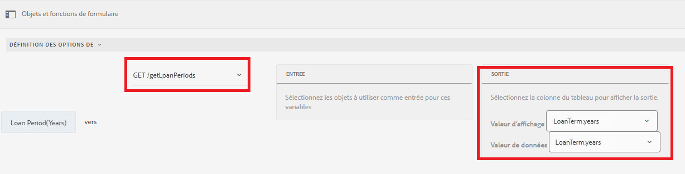

# Ajouter dynamiquement des éléments au composant de groupe de choix

AEM Forms 6.5 permet d’ajouter dynamiquement des éléments à un composant de groupe de choix Adaptive Forms tel que CheckBox, Radio Button et Image Liste.

[Cette fonctionnalité est disponible en direct sur Samples Server](https://forms.enablementadobe.com/content/samples/samples.html?query=0). Recherchez la carte d&#39;éléments de case à cocher dynamique et cliquez sur &quot;Essayer&quot;.


Vous pouvez ajouter des éléments à l’aide de l’éditeur visuel ainsi que de l’éditeur de code en fonction de votre cas d’utilisation.

**Utilisation de l’éditeur visuel :** vous pouvez renseigner les éléments du groupe de choix à partir des résultats d’un appel de fonction ou de service. Par exemple, vous pouvez définir les éléments du groupe de choix en utilisant la réponse d’un appel à l’API REST.

Dans la capture d&#39;écran ci-dessous, nous définissons les options de la Période de prêt(années) aux résultats d&#39;un appel de service appelé getLoanPeriods.



**Utilisation de l’éditeur** de code : Lorsque vous souhaitez définir dynamiquement les éléments du groupe de choix en fonction des valeurs saisies dans le formulaire. Par exemple, le fragment de code suivant définit les éléments de la case à cocher sur les valeurs saisies dans les champs du nom du demandeur et du conjoint du formulaire adaptatif.

Dans le fragment de code, nous définissons les éléments de WorkingMembers qui est un composant de case à cocher. La baie pour les éléments est créée dynamiquement en récupérant les valeurs des champs de texte NomRequérant et Mariage des formulaires adaptatifs.

```javascript
 
 if(MaritalStatus.value=="Married")
  {
WorkingMembers.items =["spouse="+spouse.value,"applicant="+applicantName.value];
  }
else
  {
    WorkingMembers.items =["applicant="+applicantName.value];
  }
```

Les données envoyées sont les suivantes :

```xml
<afUnboundData>

<data>

<applicantName>John Jacobs</applicantName>

<MaritalStatus>Married</MaritalStatus>

<spouse>Gloria Rios</spouse>

<WorkingMembers>spouse,applicant</WorkingMembers>

</data>

</afUnboundData>
```

**Ajouter des éléments à l’aide de l’éditeur de règles**

>[!VIDEO](https://video.tv.adobe.com/v/26847?quality=12&learn=on)

**Ajouter des éléments à l’aide de l’éditeur de code**

>[!VIDEO](https://video.tv.adobe.com/v/26848?quality=12&learn=on)

Pour essayer ceci sur votre système :

**Utilisation de l’éditeur de code pour ajouter des éléments**

* [Téléchargement des ressources](assets/usingthecodeeditor.zip)
* [Ouvrir Forms et Documents](http://localhost:4502/aem/forms.html/content/dam/formsanddocuments)
* Cliquez sur &quot;Créer | Télécharger le fichier&quot; et télécharger le fichier que vous avez téléchargé à l’étape précédente
* [Prévisualisation des formulaires](http://localhost:4502/content/dam/formsanddocuments/simpleform/jcr:content?wcmmode=disabled)
* Saisissez le nom du demandeur et sélectionnez État civil au mariage.
* Entrez le nom du conjoint
* Cliquez sur Suivant
* Vous devriez voir la case à cocher renseignée avec le nom du demandeur et le nom du conjoint si l&#39;état civil est marié.

**Utilisation de l’éditeur visuel pour ajouter des éléments**

* [Téléchargement des ressources](assets/usingthevisualeditor.zip)
* Installez Tomcat si vous ne l&#39;avez pas déjà. [Les instructions d&#39;installation de tomcat sont disponibles ici](https://docs.adobe.com/content/help/en/experience-manager-learn/forms/ic-print-channel-tutorial/introduction.html)
* [Déploiement du fichier SampleRest.war dans Tomcat](https://forms.enablementadobe.com/content/DemoServerBundles/SampleRest.war)
* [Ouvrir Forms et Documents](http://localhost:4502/aem/forms.html/content/dam/formsanddocuments)
* Cliquez sur &quot;Créer | Télécharger le fichier&quot; et télécharger le fichier que vous avez téléchargé à l’étape précédente
* [Prévisualisation des formulaires](http://localhost:4502/content/dam/formsanddocuments/amortizationschedule/jcr:content?wcmmode=disabled)
* Saisissez le montant du prêt et déposez le champ. Cela déclenchera la règle qui affiche le champ de la période de prêt.
* Sélectionnez la période de prêt appropriée (les éléments de la période de prêt sont renseignés à partir de l&#39;appel de repos).
* Sélectionnez le taux d&#39;intérêt et cliquez sur &quot;Obtenir le calendrier d&#39;amortissement&quot;.
* La table d&#39;amortissement devrait être renseignée. Le calendrier d&#39;amortissement est extrait à l&#39;aide d&#39;un appel REST.

>[!NOTE]
> On suppose que tomcat fonctionne sur le port 8080 et AEM sur le port 4502.
