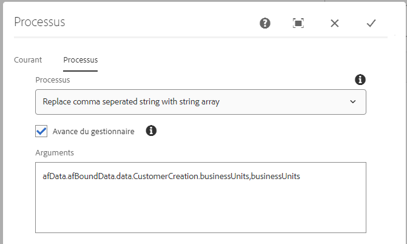

# Convertir une chaîne séparée par des virgules en séquence de chaînes de caractères {#setting-value-of-json-data-element-in-aem-forms-workflow}

Lorsque votre formulaire est basé sur un modèle de données de formulaire qui comporte une séquence de chaînes de caractères comme paramètre d’entrée, vous devez manipuler les données du formulaire adaptatif envoyées pour insérer une séquence de chaînes de caractères. Par exemple, si vous avez lié un champ de case à cocher à un élément de modèle de données de formulaire de type séquence de chaînes de caractères, les données du champ de case à cocher sont dans un format de chaîne séparé par des virgules. L’exemple de code répertorié ci-dessous vous montre comment remplacer la chaîne séparée par des virgules par une séquence de chaînes de caractères.

## Créer une étape de processus

Une étape de processus est utilisée dans un workflow AEM lorsque nous voulons que notre workflow exécute une certaine logique. L’étape de processus peut être associée à un script ECMA ou à un service OSGi. Notre étape de processus personnalisée exécute le service OSGi.

Les données envoyées sont au format suivant. La valeur de l’élément businessUnits est une chaîne séparée par des virgules qui doit être convertie en séquence de chaînes de caractères.


Les données d’entrée pour le point d’entrée REST associé au modèle de données de formulaire attendent une séquence de chaînes de caractères comme illustré dans cette capture d’écran. Le code personnalisé de l’étape du processus convertit les données envoyées dans le format correct.


Nous transmettons le chemin d’accès à l’objet JSON et le nom de l’élément à l’étape de processus. Le code de l’étape de processus remplace les valeurs séparées par des virgules de l’élément par une séquence de chaînes de caractère.


>[!NOTE]
>
>Assurez-vous que le chemin d’accès au fichier de données dans les options d’envoi du formulaire adaptatif est défini sur « Data.xml ». En effet, le code de l’étape de processus recherche un fichier appelé Data.xml sous le dossier de payload.

## Code d’étape du processus

```java
import java.io.BufferedReader;
import java.io.ByteArrayInputStream;
import java.io.InputStream;
import java.io.InputStreamReader;

import javax.jcr.Binary;
import javax.jcr.Node;
import javax.jcr.Session;

import org.osgi.framework.Constants;
import org.osgi.service.component.annotations.Component;
import org.slf4j.Logger;
import org.slf4j.LoggerFactory;

import com.adobe.granite.workflow.WorkflowException;
import com.adobe.granite.workflow.WorkflowSession;
import com.adobe.granite.workflow.exec.WorkItem;
import com.adobe.granite.workflow.exec.WorkflowProcess;
import com.adobe.granite.workflow.metadata.MetaDataMap;
import com.google.gson.JsonArray;
import com.google.gson.JsonObject;
import com.google.gson.JsonParser;

@Component(property = {
    Constants.SERVICE_DESCRIPTION + "=Create String Array",
    Constants.SERVICE_VENDOR + "=Adobe Systems",
    "process.label" + "=Replace comma seperated string with string array"
})

public class CreateStringArray implements WorkflowProcess {
    private static final Logger log = LoggerFactory.getLogger(CreateStringArray.class);
    @Override
    public void execute(WorkItem workItem, WorkflowSession workflowSession, MetaDataMap arg2) throws WorkflowException {
        log.debug("The string I got was ..." + arg2.get("PROCESS_ARGS", "string").toString());
        String[] arguments = arg2.get("PROCESS_ARGS", "string").toString().split(",");
        String objectName = arguments[0];
        String propertyName = arguments[1];

        String objects[] = objectName.split("\\.");
        System.out.println("The params is " + propertyName);
        log.debug("The params string is " + objectName);
        String payloadPath = workItem.getWorkflowData().getPayload().toString();
        log.debug("The payload  in set Elmement Value in Json is  " + workItem.getWorkflowData().getPayload().toString());
        String dataFilePath = payloadPath + "/Data.xml/jcr:content";
        Session session = workflowSession.adaptTo(Session.class);
        Node submittedDataNode = null;
        try {
            submittedDataNode = session.getNode(dataFilePath);

            InputStream submittedDataStream = submittedDataNode.getProperty("jcr:data").getBinary().getStream();
            BufferedReader streamReader = new BufferedReader(new InputStreamReader(submittedDataStream, "UTF-8"));
            StringBuilder stringBuilder = new StringBuilder();

            String inputStr;
            while ((inputStr = streamReader.readLine()) != null)
                stringBuilder.append(inputStr);
            JsonParser jsonParser = new JsonParser();
            JsonObject jsonObject = jsonParser.parse(stringBuilder.toString()).getAsJsonObject();
            System.out.println("The json object that I got was " + jsonObject);
            JsonObject targetObject = null;

            for (int i = 0; i < objects.length - 1; i++) {
                System.out.println("The object name is " + objects[i]);
                if (i == 0) {
                    targetObject = jsonObject.get(objects[i]).getAsJsonObject();
                } else {
                    targetObject = targetObject.get(objects[i]).getAsJsonObject();

                }

            }

            System.out.println("The final object is " + targetObject.toString());
            String businessUnits = targetObject.get(propertyName).getAsString();
            System.out.println("The values of " + propertyName + " are " + businessUnits);

            JsonArray jsonArray = new JsonArray();

            String[] businessUnitsArray = businessUnits.split(",");
            for (String name: businessUnitsArray) {
                jsonArray.add(name);
            }

            targetObject.add(propertyName, jsonArray);
            System.out.println(" After updating the property " + targetObject.toString());
            InputStream is = new ByteArrayInputStream(jsonObject.toString().getBytes());
            System.out.println("The changed json data  is " + jsonObject.toString());
            Binary binary = session.getValueFactory().createBinary(is);
            submittedDataNode.setProperty("jcr:data", binary);
            session.save();

        } catch (Exception e) {
            System.out.println(e.getMessage());
        }

    }
}
```

L’exemple de lot peut être [téléchargé ici](assets/CreateStringArray.CreateStringArray.core-1.0-SNAPSHOT.jar).
