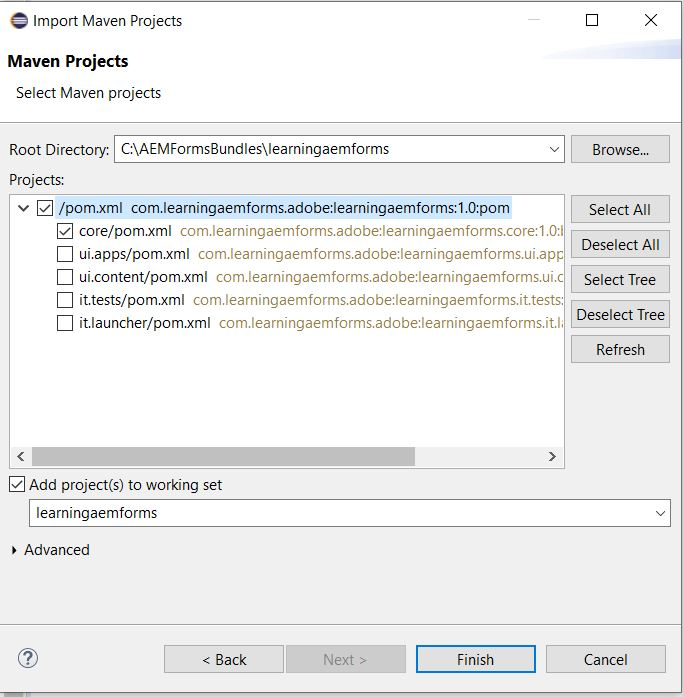

# Créer votre premier lot OSGi

Un lot OSGi est un fichier d’archive Java™ qui contient du code Java, des ressources et un manifeste qui décrit le lot et ses dépendances. Le lot est l’unité de déploiement d’une application. Cet article est destiné aux développeurs souhaitant créer un service OSGi ou une servlet utilisant AEM Forms 6.4 ou 6.5. Pour créer votre premier lot OSGi, suivez les étapes ci-après :


## Installation du JDK

Installez la version prise en charge du JDK. J’ai utilisé JDK1.8. Assurez-vous d’avoir ajouté **JAVA_HOME** dans vos variables d’environnement et de pointer vers le dossier racine de votre installation JDK.
Ajouter le chemin d’accès à %JAVA_HOME%/bin


>[!NOTE]
> N’utilisez pas JDK 15. Il n&#39;est pas pris en charge par AEM.

### Test de votre version JDK

Ouvrez une nouvelle fenêtre d&#39;invite de commande et tapez : `java -version`. Vous devez récupérer la version du JDK identifiée par la variable `JAVA_HOME`


## Installation de Maven

Maven est un outil d&#39;automatisation de génération utilisé principalement pour les projets Java. Suivez les étapes ci-dessous pour installer maven sur votre système local.

* Créez un dossier appelé `maven` dans votre lecteur C.
* Téléchargez l&#39;[archive binaire zip](http://maven.apache.org/download.cgi)
* Extraire le contenu de l’archive zip dans `c:\maven`
* Créez une variable d’environnement appelée `M2_HOME` avec la valeur `C:\maven\apache-maven-3.6.0`. Dans mon cas, la version **mvn** est 3.6.0. Au moment de la rédaction de cet article, la dernière version de maven est 3.6.3.
* Ajouter `%M2_HOME%\bin` à votre chemin
* Enregistrez vos modifications
* Ouvrez une nouvelle invite de commande et tapez `mvn -version`. Vous devriez voir la version **mvn** répertoriée comme illustré dans la capture d’écran ci-dessous.


## Settings.xml

Un fichier Maven `settings.xml` définit des valeurs qui configurent l’exécution de Maven de différentes manières. Il est généralement utilisé pour définir un emplacement de référentiel local, d&#39;autres serveurs de référentiel distants et des informations d&#39;authentification pour les référentiels privés.

Accédez à `C:\Users\<username>\.m2 folder`
Extrayez le contenu du fichier [settings.zip](assets/settings.zip) et placez-le dans le dossier `.m2`.

## Installation d’Eclipse

Installer la dernière version de [eclipse](https://www.eclipse.org/downloads/)

## Créer votre premier projet

L&#39;archétype est un ensemble d&#39;outils de modélisation de projet Maven. Un archétype est défini comme un modèle ou un modèle original à partir duquel toutes les autres choses du même type sont faites. Le nom correspond à celui que nous essayons de fournir un système qui fournit un moyen cohérent de générer des projets Maven. Archétype aide les auteurs à créer des modèles de projet Maven pour les utilisateurs et fournit aux utilisateurs les moyens de générer des versions paramétrées de ces modèles de projet.
Pour créer votre premier projet expert, procédez comme suit :

* Créez un dossier intitulé `aemformsbundles` dans votre lecteur C.
* Ouvrez une invite de commande et accédez à `c:\aemformsbundles`
* Exécutez la commande suivante dans votre invite de commande
* `mvn archetype:generate  -DarchetypeGroupId=com.adobe.granite.archetypes  -DarchetypeArtifactId=aem-project-archetype -DarchetypeVersion=19`

Le projet expert sera généré de manière interactive et vous serez invité à fournir des valeurs à un certain nombre de propriétés, telles que

| Nom de la propriété | Signification | Valeur |
------------------------|---------------------------------------|---------------------
| groupId | groupId identifie de manière unique votre projet dans tous les projets. | com.learningaemforms.adobe |
| appsFolderName | Nom du dossier qui contiendra la structure de votre projet | apprentissage des formulaires |
| artifactId | artifactId est le nom du fichier jar sans version. Si vous l&#39;avez créé, vous pouvez choisir le nom de votre choix avec des lettres minuscules et pas de symboles étranges. | apprentissage des formulaires |
| version | Si vous le distribuez, vous pouvez choisir n’importe quelle version type avec des nombres et des points (1.0, 1.1, 1.0.1, ...). | 1.0 |

Acceptez les valeurs par défaut des autres propriétés en appuyant sur la touche Entrée.
Si tout se passe bien, vous devriez voir un message de réussite de création dans votre fenêtre de commande.

## Créer un projet éclipse à partir de votre projet expert

Remplacez votre répertoire de travail par `learningaemforms`.
Exécution de `mvn eclipse:eclipse` à partir de la ligne de commande
La commande ci-dessus lit votre fichier pom et crée des projets Eclipse avec des métadonnées correctes pour qu&#39;Eclipse comprenne les types de projet, les relations, les chemins de classe, etc.

## Importer le projet en éclipse

Lancement de **Eclipse**

Accédez à **Fichier -> Importer** et sélectionnez **Projets maven existants** comme illustré ici.


Cliquez sur Suivant

Sélectionnez les `c:\aemformsbundles\learningaemform`s en cliquant sur le bouton **Parcourir**.



>[!NOTE]
>Vous pouvez choisir d&#39;importer les modules appropriés en fonction de vos besoins. Sélectionnez et importez le module principal uniquement si vous souhaitez créer du code Java dans votre projet.

Cliquez sur **Terminer** pour début le processus d’importation.

Le projet est importé dans Eclipse et vous verrez un certain nombre de dossiers `learningaemforms.xxxx`

Développez `src/main/java` sous le dossier `learningaemforms.core`. Il s&#39;agit du dossier dans lequel vous allez écrire la majeure partie de votre code.


## Créer votre projet

Une fois que vous avez écrit votre service OSGi, ou servlet, vous devrez construire votre projet pour générer le lot OSGi qui peut être déployé à l&#39;aide de la console Web Felix. Consultez [AEMFD Client SDK](https://repo.adobe.com/nexus/content/repositories/public/com/adobe/aemfd/aemfd-client-sdk/) pour inclure le SDK client approprié dans votre projet Maven. Vous devrez inclure l’AEM SDK client FD dans la section des dépendances de `pom.xml` du projet principal, comme illustré ci-dessous.

```xml
<dependency>
    <groupId>com.adobe.aemfd</groupId>
    <artifactId>aemfd-client-sdk</artifactId>
    <version>6.0.122</version>
</dependency>
```

Pour créer votre projet, procédez comme suit :

* Ouvrir la fenêtre d&#39;invite de commande ****
* Accédez à `c:\aemformsbundles\learningaemforms\core`.
* Exécutez la commande `mvn clean install`
Si tout se passe bien, vous devriez voir le lot à l’emplacement suivant `C:\AEMFormsBundles\learningaemforms\core\target`. Ce lot est maintenant prêt à être déployé dans AEM à l’aide de la console Web Felix.
