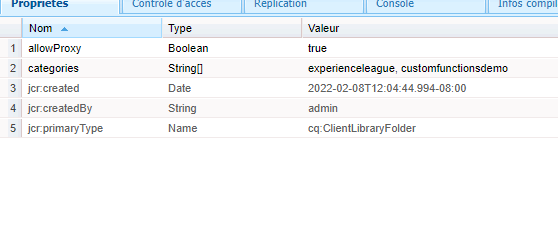

# Fonctions personnalisées

AEM Forms 6.5 offre la possibilité de définir des fonctions JavaScript pouvant être utilisées pour définir des règles métier complexes à l’aide de l’éditeur de règles.
AEM Forms fournit un certain nombre de fonctions personnalisées prêtes à l’emploi, mais vous devrez définir vos propres fonctions personnalisées et les utiliser dans plusieurs formulaires.

Pour définir votre première fonction personnalisée, procédez comme suit :
* [Connectez-vous à CRX](http://localhost:4502/crx/de/index.jsp#/apps/experience-league/clientlibs).
* Créez un dossier sous les applications appelé experience-league (ce nom de dossier peut être un nom de votre choix).
* Enregistrez vos modifications.
* Sous le dossier experience-league, créez un nœud de type cq:ClientLibraryFolder appelé clientlibs.
* Sélectionnez le dossier clientlibs nouvellement créé et ajoutez les propriétés allowProxy et categories comme illustré sur la copie d’écran, et enregistrez vos modifications.


* Créez un dossier appelé **js** sous le dossier **clientlibs**.
* Créez un fichier appelé **functions.js** sous le dossier **js**.
* Créez un fichier appelé **js.txt** sous le dossier **clientlibs**. Enregistrez vos modifications.
* Votre structure de dossiers doit ressembler à la copie d’écran ci-dessous.


* Double-cliquez sur functions.js pour ouvrir l’éditeur.
Copiez le code suivant dans functions.js et enregistrez vos modifications.

```javascript
/**
* Get List of County names
* @name getCountyNamesList Get list of county names
* @return {OPTIONS} drop down options 
 */
function getCountyNamesList()
{
    var countyNames= [];
    countyNames[0] = "Santa Clara";
    countyNames[1] = "Alameda";
    countyNames[2] = "Buxor";
    countyNames[3] = "Contra Costa";
    countyNames[4] = "Merced";

    return countyNames;

}
/**
* Covert UTC to Local Time
* @name convertUTC Convert UTC Time to Local Time
* @param {string} strUTCString in Stringformat
* @return {string}
*/
function convertUTC(strUTCString)
{
    var dt = new Date(strUTCString);
    console.log(dt.toLocaleString());
    return dt.toLocaleString();
}
```

Veuillez [consulter la documentation js](https://jsdoc.app/index.html)pour plus d’informations sur l’annotation des fonctions JavaScript.
Le code ci-dessus a deux fonctions :
**getCountyNamesList** renvoie un tableau de chaîne.
**convertUTC** convertit l’horodatage UTC en fuseau horaire local.

Ouvrez le fichier js.txt, collez le code suivant et enregistrez vos modifications.

```javascript
#base=js
functions.js
```

La ligne #base=js indique dans quel répertoire se trouvent les fichiers JavaScript.
Les lignes ci-dessous indiquent l’emplacement du fichier JavaScript par rapport à l’emplacement de base.

Si vous rencontrez des difficultés pour créer des fonctions personnalisées, n’hésitez pas à [télécharger et installer ce package](assets/custom-functions.zip) sur votre instance AEM.

## Utiliser des fonctions personnalisées

La vidéo suivante vous guide tout au long des étapes à suivre pour utiliser une fonction personnalisée dans l’éditeur de règles d’un formulaire adaptatif.
>[!VIDEO](https://video.tv.adobe.com/v/340305?quality=12&learn=on)
