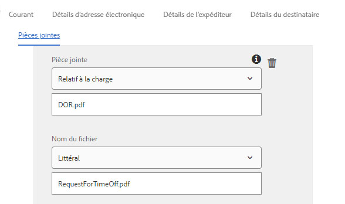

# Utilisation de l’étape Envoyer un courrier électronique du Forms Workflow {#using-send-email-step-of-forms-workflow}

L&#39;étape Envoyer un courriel a été introduite dans AEM Forms 6.4. Cette étape permet de créer des processus d&#39;entreprise ou de flux de travail qui vous permettront d&#39;envoyer des courriers électroniques avec ou sans pièces jointes. La vidéo suivante décrit les étapes de configuration du composant d’envoi de courrier électronique.

>[!VIDEO](https://video.tv.adobe.com/v/21499/?quality=9&learn=on)

Dans le cadre de cet article, nous vous montrerons les cas d&#39;utilisation suivants :

1. Un utilisateur remplit le formulaire de demande de désactivation du délai
1. Lors de l’envoi du formulaire, AEM processus est déclenché.
1. Le processus AEM utilise le composant Envoyer un courrier électronique pour envoyer un courrier électronique avec le DE en tant que pièce jointe.

Avant d’utiliser l’étape Envoyer un courrier électronique, assurez-vous de configurer le service Day CQ Mail Service à partir de [configMgr](http://localhost:4502/system/console/configMgr). Indiquez les valeurs propres à votre environnement.

Dans le cadre des actifs associés à cet article, vous obtiendrez les éléments suivants :

1. Formulaire adaptatif qui déclenche le processus lors de l’envoi
1. Exemple de flux de travail qui envoie un courrier électronique avec DOR comme pièce jointe
1. Groupe OSGi qui crée les propriétés de métadonnées

Pour que l&#39;exemple s&#39;exécute sur votre système, procédez comme suit :

1. [Déploiement du lot Developing withserviceuser](/help/forms/assets/common-osgi-bundles/DevelopingWithServiceUser.jar)

1. [Télécharger et installer le ](/help/forms/assets/common-osgi-bundles/SetValueApp.core-1.0-SNAPSHOT.jar)lot setvalueCe lot contient le code permettant de créer les propriétés de métadonnées dans le cadre de l&#39;étape de processus du flux de travail.
1. [Configuration du service de messagerie Day CQ](https://helpx.adobe.com/experience-manager/6-5/sites/administering/using/notification.html)
1. [Importer et installer les actifs associés à cet article à l’aide du gestionnaire de packages dans CRX](assets/emaildoraemformskt.zip)
1. Lancez le [formulaire adaptatif](http://localhost:4502/content/dam/formsanddocuments/helpx/timeoffrequestform/jcr:content?wcmmode=disabled). Renseignez les champs obligatoires et envoyez-les.
1. Vous devez recevoir un e-mail avec DocumentOfRecord en tant que pièce jointe.

Explorez le [modèle de flux de travaux](http://localhost:4502/editor.html/conf/global/settings/workflow/models/emaildor.html)

Examinez l’étape de processus du processus. Le code personnalisé associé à l&#39;étape du processus crée des noms de propriété de métadonnées et définit ses valeurs à partir des données envoyées. Ces valeurs sont ensuite utilisées par le composant d&#39;envoi de courrier électronique.

>[!NOTE]
>
>Dans AEM Forms 6.5 et versions ultérieures, vous n’avez pas besoin de ce code personnalisé pour créer des propriétés de métadonnées. Utilisez la fonctionnalité de variables dans AEM Workflow.

Assurez-vous que l’onglet Pièces jointes du composant Envoyer un courrier électronique est configuré conformément à la capture d’écran ci-dessous.
La valeur &quot;DOR.pdf&quot; doit correspondre à la valeur spécifiée dans le chemin du Document d’enregistrement spécifié dans les options d’envoi de votre formulaire adaptatif.

