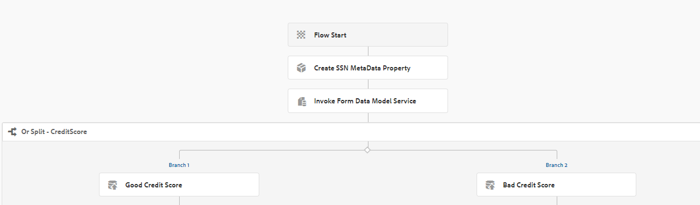

# Utilisation du service de modèle de données de formulaire comme étape du processus {#using-form-data-model-service-as-step-in-workflow}

A compter de AEM Forms 6.4, nous avons désormais la possibilité d’utiliser le modèle de données de formulaire dans le cadre de AEM Workflow. La vidéo suivante décrit les étapes nécessaires à la configuration de l’étape Modèle de données de formulaire dans le flux de travail AEM.

>[!VIDEO](https://video.tv.adobe.com/v/21719/?quality=9&learn=on)

Pour tester cette fonctionnalité sur votre serveur, suivez les instructions ci-dessous.
* [Téléchargez et déployez le lot](/help/forms/assets/common-osgi-bundles/SetValueApp.core-1.0-SNAPSHOT.jar) setvalue. Il s’agit du lot OSGI personnalisé qui définit les propriétés de métadonnées.
>!![NOTE]En AEM Forms 6.5 et versions ultérieures, cette fonctionnalité est disponible en standard comme  [décrit ici](form-data-model-service-as-step-in-aem65-workflow-video-use.md)

* Configurez tomcat avec le fichier SampleRest.war comme décrit [ici](https://docs.adobe.com/content/help/en/experience-manager-learn/forms/ic-print-channel-tutorial/introduction.html).Le fichier de guerre déployé dans Tomcat contient le code pour renvoyer le score de crédit du demandeur. Le score de crédit est un nombre aléatoire compris entre 200 et 800

* [Importez les actifs dans AEM à l&#39;aide du gestionnaire](assets/invoke-fdm-as-service-step.zip) de packages. Le package contient les éléments suivants :

   * Modèle de flux de travail qui utilise l’étape FDM.
   * Modèle de données de formulaire utilisé à l’étape FDM.
   * Formulaire adaptatif pour déclencher le processus lors de l’envoi.
* Ouvrez [MortgageApplicationForm](http://localhost:4502/content/dam/formsanddocuments/loanapplication/jcr:content?wcmmode=disabled). Renseignez les détails et envoyez. Lors de l’envoi du formulaire, le [processus de demande de prêt](http://http://localhost:4502/editor.html/conf/global/settings/workflow/models/LoanApplication2.html) est déclenché.

.
Le processus utilise le composant Ou fractionner pour acheminer la demande vers l’administrateur si le score de crédit est supérieur à 500. Si le score de crédit est inférieur à 500, la demande est acheminée vers la mémoire de courage.
