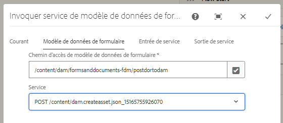
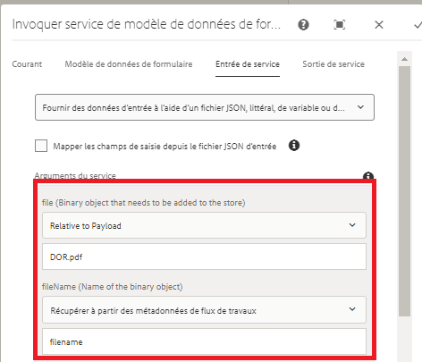

# Utiliser un modèle de données de formulaire pour publier des données binaires{#using-form-data-model-to-post-binary-data}

À compter d’AEM Forms 6.4, nous pouvons désormais appeler le service de modèle de données de formulaire comme étape dans AEM Workflow. Cet article vous guide tout au long d’un exemple de cas d’utilisation pour la publication d’un document d’enregistrement à l’aide du service de modèle de données de formulaire.

Consultez le cas d’utilisation suivant :

1. Une personne remplit et envoie le formulaire adaptatif.
1. Le formulaire adaptatif est configuré pour générer un document d’enregistrement.
1. Lors de l’envoi de ces formulaires adaptatifs, AEM Workflow est déclenché, ce qui utilise le service de modèle de données de formulaire pour POSTER le document d’enregistrement à la gestion des ressources numériques AEM.

Onglet Modèle de données de formulaire - Propriétés

Dans l’onglet Entrée de service, nous mettons en correspondance les éléments suivants :

* Fichier (objet binaire devant être stocké) avec la propriété DOR.pdf relative à la charge. Cela signifie que lorsque le formulaire adaptatif est envoyé, le document d’enregistrement généré est stocké dans un fichier appelé DOR.pdf en lien avec la payload du workflow.**Assurez-vous que ce fichier DOR.pdf est identique à celui fourni lors de la configuration de la propriété d’envoi du formulaire adaptatif.**

* Nom de fichier : il s’agit du nom avec lequel l’objet binaire est stocké dans la gestion des ressources numériques. Vous souhaitez donc que cette propriété soit générée dynamiquement, de sorte que chaque nom de fichier soit unique à chaque envoi. À cette fin, nous avons utilisé l’étape de processus dans le workflow pour créer une propriété de métadonnées appelée filename et défini sa valeur sur la combinaison du nom de la personne membre et du numéro de compte de la personne qui envoie le formulaire. Par exemple, si le nom de la personne membre est John Jacobs et que son numéro de compte est le 9846, le nom de fichier sera John Jacobs_9846.pdf.

Entrée de service

>[!NOTE]
>
>Conseils de dépannage : si, pour une raison quelconque, le fichier DOR.pdf n’est pas créé dans la gestion des ressources numériques, réinitialisez les paramètres d’authentification de la source de données en cliquant [ici](http://localhost:4502/mnt/overlay/fd/fdm/gui/components/admin/fdmcloudservice/properties.html?item=%2Fconf%2Fglobal%2Fsettings%2Fcloudconfigs%2Ffdm%2Fpostdortodam). Il s’agit des paramètres d’authentification AEM, qui sont par défaut admin/admin.

Pour tester cette fonctionnalité sur votre serveur, procédez comme suit :

1. [Déployez le lot Developingwithserviceuser](/help/forms/assets/common-osgi-bundles/DevelopingWithServiceUser.jar).

1. [Téléchargez et déployez le lot setvalue](/help/forms/assets/common-osgi-bundles/SetValueApp.core-1.0-SNAPSHOT.jar). Ce lot OSGI personnalisé est utilisé pour créer une propriété de métadonnées et définir sa valeur à partir des données de formulaire envoyées.

1. [Importez les ressources](assets/postdortodam.zip) associées à cet article dans AEM à l’aide du gestionnaire de packages. Vous obtiendrez les éléments suivants :

   1. Modèle de workflow
   1. Formulaire adaptatif configuré pour être envoyé au workflow AEM.
   1. Source de données configurée pour utiliser le fichier PostToDam.JSON.
   1. Modèle de données de formulaire qui utilise la source de données.

1. Pointez votre [navigateur pour ouvrir le formulaire adaptatif](http://localhost:4502/content/dam/formsanddocuments/helpx/timeoffrequestform/jcr:content?wcmmode=disabled).
1. Remplissez le formulaire et envoyez-le.
1. Vérifiez l’application Assets pour voir si le document d’enregistrement est créé et stocké.

[Fichier Swagger](http://localhost:4502/conf/global/settings/cloudconfigs/fdm/postdortodam/jcr:content/swaggerFile) utilisé pour créer la source de données et disponible à titre de référence.
