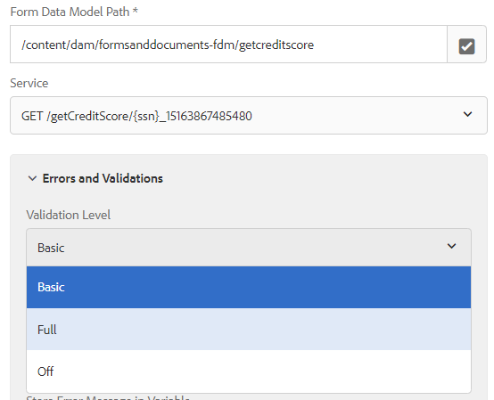

# Capture des messages d’erreur dans l’étape Invoquer le service de modèle de données de formulaire

À compter d’AEM Forms 6.5.1, nous avons désormais la possibilité de capturer les messages d’erreur et de spécifier les options de validation. L’étape Invoquer le service de modèle de données de formulaire a été améliorée afin de fournir les fonctionnalités suivantes.

* Ajout d’une option pour la validation à 3 niveaux (&quot;OFF&quot;, &quot;BASIC&quot; et &quot;FULL&quot;) afin de gérer les exceptions rencontrées lors de l’appel du service de modèle de données de formulaire. Les 3 options indiquent successivement une version plus stricte de la vérification des exigences spécifiques à la base de données.
   

* Ajout d’une case à cocher pour personnaliser l’exécution du workflow. Par conséquent, l’utilisateur aura désormais la possibilité de poursuivre l’exécution du workflow, même si l’étape Appeler le modèle de données de formulaire renvoie des exceptions.

* Stockage d’informations importantes sur le message Erreur résultant d’exceptions de validation. Trois sélecteurs de variable de type Autocomplete ont été ajoutés pour sélectionner les variables appropriées afin de stocker les variables ErrorCode(String), ErrorMessage(String) et ErrorDetails(JSON). ErrorDetails est toutefois défini sur null si l’exception n’est pas une exception DermisValidationException.
   

Grâce à ces modifications, l’étape Invoquer le service de modèle de données de formulaire s’assure que les valeurs d’entrée respectent les contraintes de données fournies dans le fichier de sélecteur. Par exemple, le message d’erreur suivant sera généré lorsque les valeurs accountId et balance ne seront pas conformes aux contraintes de données spécifiées dans le fichier swagger.

```json
{

"errorCode": "AEM-FDM-001-049"

"errorMessage": "Input validations failed during operation execution"

"violations": {

"/accountId": ["numeric instance is greater than the required maximum (maximum: 20, found: 97)"],

"/newAccount/balance": ["instance type (string) does not match any allowed primitive type (allowed: [\"integer\",\"number\"])"]

}

}
```
