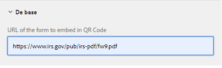

# Exemple de composant QR Code

L’incorporation d’un code QR dans un formulaire adaptatif peut améliorer considérablement la commodité et l’efficacité de l’accès des utilisateurs aux informations supplémentaires relatives au formulaire.

L’exemple de composant utilise [QRCode.js](https://davidshimjs.github.io/qrcodejs/).

Le fichier QRCode.js est une bibliothèque JavaScript pour créer du code QRC. Il prend en charge le mode Cross-browser avec HTML5 Canvas et la balise de tableau dans DOM.

Le composant génère le code QR en fonction de la valeur spécifiée dans la propriété de configuration du composant.


Le code suivant a été utilisé dans le fichier body.jsp du composant qr-code-generator .

&quot;url&quot; est l’URL qui doit être incorporée dans le code qr. Cette URL est spécifiée dans les propriétés de configuration du composant de code QR.

```java
<%@include file="/libs/foundation/global.jsp"%>
<body>
    <h2>Scan the QR Code for more information related to this form</h2>
    <div data-url="<%=properties.get("url")%>">
    </div>
    <div id="qrcode">
    </div>
</body>
```


Le code suivant utilise la méthode makeCode de la bibliothèque QRCode.js dans la bibliothèque cliente du composant qr-code-generator . Le code QR généré est ajouté à la balise div identifiée par l’identifiant **&quot;qrcode&quot;**.

```javascript
$(document).ready(function()
  {
      var qrcode = new QRCode("qrcode");
      qrcode.makeCode(document.querySelector("[data-url]").getAttribute("data-url"));
      
 });
```

## Déployer les ressources sur votre serveur local

* [Téléchargez et installez le composant de code QR à l’aide de Package Manager.](assets/qrcode.zip)
* [Téléchargez et installez l’exemple de formulaire adaptatif à l’aide de Package Manager.](assets/form-with-qr-code.zip)
* [Prévisualisation du formulaire](http://localhost:4502/content/dam/formsanddocuments/qrcode/w9form/jcr:content?wcmmode=disabled). La section d’aide du formulaire comporte le code QR.
