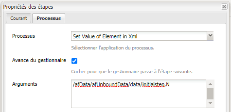

# Utilisation de setvalue dans le processus AEM Forms

Définissez la valeur d’un élément XML dans les données envoyées par Forms adaptatif dans le flux de travaux AEM Forms OSGI.

LiveCycle utilisé pour avoir un composant de valeur définie qui vous permet de définir la valeur d’un élément XML.

En fonction de cette valeur, lorsque le formulaire est renseigné avec le code XML, vous pouvez masquer/désactiver certains champs ou panneaux du formulaire.

En AEM Forms OSGI - nous devrons écrire un lot OSGi personnalisé pour définir la valeur dans le XML. Le lot est fourni dans le cadre de ce didacticiel.
Nous utilisons l’étape du processus dans AEM processus. Nous associons le lot OSGi &quot;Set Value of Element in XML&quot; à cette étape de processus.
Nous devons transmettre deux arguments au groupe de valeurs définies. Le premier argument est le XPath de l’élément XML dont la valeur doit être définie. Le deuxième argument est la valeur qui doit être définie.
Par exemple, dans la capture d’écran ci-dessus, la valeur de l’élément d’étape initiale est définie sur &quot;N&quot;.
En fonction de cette valeur, certains panneaux de la Forms adaptative sont masqués ou affichés.
Dans notre exemple, nous avons un simple formulaire de demande de désactivation du temps. L&#39;initiateur de ce formulaire remplit son nom et les dates de congé. Lors de l’envoi, ce formulaire est envoyé à l’administrateur pour révision. Lorsque l’administrateur ouvre le formulaire, les champs du premier panneau sont désactivés. Ceci parce que nous avons défini la valeur de l’élément d’étape initiale dans le XML sur &quot;N&quot;.

En fonction de la valeur des champs de l’étape initiale, nous affichons le deuxième panneau où l’administrateur peut approuver ou rejeter la demande.

Examinez les règles définies dans le champ &quot;Heure d&#39;arrêt demandée par&quot; à l&#39;aide de l&#39;éditeur de règles.

Pour déployer les ressources sur votre système local, procédez comme suit :

* [Déploiement du lot Developing withserviceuser](/help/forms/assets/common-osgi-bundles/DevelopingWithServiceUser.jar)

* [Déployez l’assemblage](/help/forms/assets/common-osgi-bundles/SetValueApp.core-1.0-SNAPSHOT.jar) d’exemples. Il s’agit du lot OSGI personnalisé qui vous permet de définir les valeurs d’un élément dans les données xml envoyées.

* [Téléchargement et extraction du contenu du fichier zip](assets/setvalueassets.zip)
* Pointez votre navigateur sur [gestionnaire de packages](http://localhost:4502/crx/packmgr/index.jsp).
* Importez et installez le fichier setValueWorkflow.zip. Il s’agit de l’exemple de modèle de processus.
* Pointez votre navigateur sur [Forms et Documents](http://localhost:4502/aem/forms.html/content/dam/formsanddocuments).
* Cliquez sur Créer | Téléchargement de fichier
* Téléchargement du fichier TimeOfRequestForm.zip
* Ouvrez [TimeOffRequestform](http://localhost:4502/content/dam/formsanddocuments/timeoffapplication/jcr:content?wcmmode=disabled)
* Renseignez les 3 champs obligatoires et envoyez
* Connectez-vous en tant qu’administrateur à l’AEM (si vous ne l’avez pas déjà fait).
* Accédez à [&quot;AEM Boîte de réception&quot;](http://localhost:4502/aem/inbox)
* Ouvrez le formulaire &quot;Demande de désactivation du délai de révision&quot;.
* Les champs du premier panneau sont désactivés. En effet, le formulaire est ouvert par le réviseur. De plus, notez que le groupe d’experts approuve ou rejette la demande est maintenant visible.

>[!NOTE]
>
>Vous pouvez activer la journalisation du débogage en activant la journalisation pour
>com.aemforms.setvalue.core.SetValueinXml
>en dirigeant votre navigateur vers http://localhost:4502/system/console/slinglog

>[!NOTE]
>
>Assurez-vous que le chemin d’accès au fichier de données dans les options d’envoi du formulaire adaptatif est défini sur &quot;Data.xml&quot;. En effet, l’étape de processus recherche un fichier appelé Data.xml sous le dossier de charge utile.
