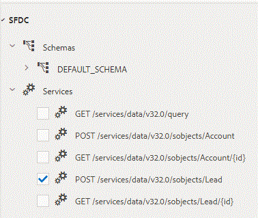

# Configurer une source de données avec Salesforce dans AEM Forms 6.3 et 6.4{#configuring-datasource-with-salesforce-in-aem-forms-and}

## Conditions préalables {#prerequisites}

Cet article est consacré à la création d’une source de données avec Salesforce.

Conditions préalables au tutoriel :

* Faites défiler jusqu’au bas de la page et téléchargez le fichier Swagger sur votre disque dur.
* AEM Forms avec SSL activé

   * [Documentation officielle sur l’activation de SSL sur AEM 6.3](https://helpx.adobe.com/fr/experience-manager/6-3/sites/administering/using/ssl-by-default.html)
   * [Documentation officielle sur l’activation de SSL sur AEM 6.4](https://helpx.adobe.com/fr/experience-manager/6-4/sites/administering/using/ssl-by-default.html)

* Vous devez disposer d’un compte Salesforce.
* Vous devez créer une application connectée. Le formulaire de documentation officiel Salesforce pour la création de l’application est disponible [ici](https://help.salesforce.com/articleView?id=connected_app_create.htm&amp;type=0).
* Indiquez les portées OAuth appropriées pour l’application (j’ai sélectionné toutes les portées OAuth disponibles à des fins de test).
* Indiquez l’URL de rappel. Dans mon cas, l’URL de rappel était

   * Si vous utilisez **AEM Forms 6.3**, l’URL de rappel est https://gbedekar-w7-1:6443/etc/cloudservices/fdm/createlead.html. Dans cette adresse URL, le nom de mon modèle de données de formulaire est createlead.

   * Si vous utilisez **AEM Forms 6.4**, l’URL de rappel est https://gbedekar-w7-:6443/libs/fd/fdm/gui/components/admin/fdmcloudservice/createcloudconfigwizard/cloudservices.html.

Dans cet exemple, gbedekar -w7-1:6443 est le nom du serveur et le port sur lequel AEM s’exécute.

Une fois que vous avez créé l’application connectée, notez la **clé client et la clé secrète**. Vous aurez besoin de ces clés lors de la création de la source de données dans AEM Forms.

Maintenant que vous avez créé votre application connectée, vous devez créer un fichier Swagger pour les opérations à effectuer dans Salesforce. Un exemple de fichier Swagger est inclus dans les ressources téléchargeables. Ce fichier Swagger vous permet de créer un objet « Lead » lors de l’envoi du formulaire adaptatif. Téléchargez et consultez ce fichier Swagger.

L’étape suivante consiste à créer une source de données dans AEM Forms. Suivez la procédure correspondant à votre version d’AEM Forms.

## AEM Forms 6.3 {#aem-forms}

* Connectez-vous à AEM Forms à l’aide du protocole https.
* Accédez aux services cloud à l’adresse : https://&lt;servername>:&lt;serverport> /etc/cloudservices.html. Par exemple, https://gbedekar-w7-1:6443/etc/cloudservices.html.
* Faites défiler jusqu’à « Modèle de données de formulaire ».
* Cliquez sur « Afficher les configurations ».
* Cliquez sur « + » pour ajouter une nouvelle configuration.
* Sélectionnez « RESTFul Service ». Donnez un titre et un nom pertinents à la configuration. Par exemple,

   * Nom : CreateLeadInSalesForce
   * Titre : CreateLeadInSalesForce

* Cliquez sur « Créer ».

**Dans l’écran suivant**

* Sélectionnez « Fichier » comme option pour votre fichier source Swagger. Accédez au fichier que vous avez téléchargé précédemment.
* Sélectionnez le type d’authentification OAuth2.0.
* Fournissez les valeurs d’ID Client et de Secret Client.
* L’URL OAuth est : **https://login.salesforce.com/services/oauth2/authorize**.
* Actualisez l’URL du jeton : **https://na5.salesforce.com/services/oauth2/token**.
* **Accédez à l’URL du jeton : https://na5.salesforce.com/services/oauth2/token**.
* Domaine d’autorisation : **api chatter_api full id openid refresh_token visualforce web**
* Gestionnaire d’authentification : porteur d’autorisation.
* Cliquez sur « Se connecter à OAUTH ». Si tout se passe bien, aucune erreur ne devrait s’afficher.

Une fois que vous avez créé votre modèle de données de formulaire à l’aide de Salesforce, vous pouvez créer une intégration de données de formulaire à l’aide de la source de données que vous venez de créer. La documentation officielle relative à la création de l’intégration des données de formulaire se trouve [ici](https://helpx.adobe.com/fr/aem-forms/6-3/data-integration.html).

Veillez à configurer le modèle de données de formulaire de manière à inclure le service POST afin de créer un objet Lead dans SFDC.

Vous devrez également configurer le service de lecture et d’écriture pour l’objet Lead. Reportez-vous aux captures d’écran en bas de cette page.

Après avoir créé le modèle de données de formulaire, vous pouvez créer des formulaires adaptatifs basés sur ce modèle et utiliser les méthodes d’envoi du modèle de données de formulaire pour créer le Lead dans SFDC.

## AEM Forms 6.4 {#aem-forms-1}

* Créer une source de données

   * [Accéder aux sources de données](http://localhost:4502/libs/fd/fdm/gui/components/admin/fdmcloudservice/fdm.html/conf/global)

   * Cliquez sur le bouton « Créer ».
   * Fournissez des valeurs significatives.

      * Nom : CreateLeadInSalesForce
      * Titre : CreateLeadInSalesForce
      * Type de service : service RESTful.

   * Cliquez sur Suivant.
   * Source Swagger : fichier.
   * Recherchez et sélectionnez le fichier Swagger que vous avez téléchargé à l’étape précédente.
   * Type d’authentification : OAuth 2.0. Spécifiez les valeurs suivantes.
   * Fournissez les valeurs d’ID Client et de Secret Client.
   * L’URL OAuth est : **https://login.salesforce.com/services/oauth2/authorize**.
   * Actualisez l’URL du jeton : **https://na5.salesforce.com/services/oauth2/token**.
   * URL du jeton d’accès : **https://na5.salesforce.com/services/oauth2/token**.
   * Domaine d’autorisation : **api chatter_api full id openid refresh_token visualforce web**
   * Gestionnaire d’authentification : porteur d’autorisation.
   * Cliquez sur le bouton « Se connecter à OAuth ». Si des erreurs s’affichent, veuillez passer en revue les étapes précédentes afin de vous assurer que toutes les informations ont été saisies avec précision.

Une fois que vous avez créé votre source de données à l’aide de SalesForce, vous pouvez créer une intégration de données de formulaire à l’aide de la source de données que vous venez de créer. La documentation relative à cela se trouve [ici](https://helpx.adobe.com/fr/experience-manager/6-4/forms/using/create-form-data-models.html).

Veillez à configurer le modèle de données de formulaire de manière à inclure le service POST afin de créer un objet Lead dans SFDC.

Vous devrez également configurer le service de lecture et d’écriture pour l’objet Lead. Reportez-vous aux captures d’écran en bas de cette page.

Après avoir créé le modèle de données de formulaire, vous pouvez créer des formulaires adaptatifs basés sur ce modèle et utiliser les méthodes d’envoi du modèle de données de formulaire pour créer le Lead dans SFDC.

>[!NOTE]
>
>Assurez-vous que l’URL du fichier Swagger correspond à votre zone géographique. Par exemple, l’URL de l’exemple de fichier Swagger est « na46.salesforce.com », car le compte a été créé en Amérique du Nord. La méthode la plus simple consiste à vous connecter à votre compte Salesforce et à vérifier l’URL.

[SampleSwaggerFile](assets/swagger-sales-force-lead.json)
