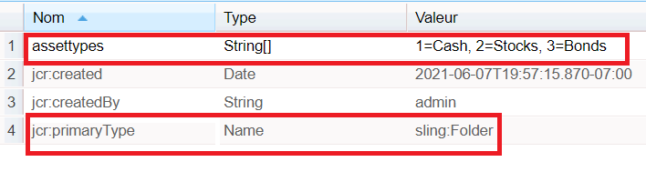

# Propriété de chargement d’élément dans AEM Forms

Configurez et renseignez la liste déroulante à l’aide de la propriété item load path .
Le champ Chemin de chargement de l’élément permet à un auteur de fournir une URL à partir de laquelle il charge les options disponibles dans une liste déroulante.
Pour créer un tel noeud dans crx, procédez comme suit :
* Connexion à crx
* Créez un noeud appelé assets (vous pouvez nommer ce noeud selon vos besoins) de type sling:folder sous content.
* Enregistrer
* Cliquez sur le noeud de ressources nouvellement créé et définissez ses propriétés comme illustré ci-dessous.
* Vous devez créer une propriété de type Chaîne appelée assettypes (vous pouvez la nommer selon vos besoins). Assurez-vous que la propriété est composée de plusieurs valeurs. Indiquez les valeurs que vous souhaitez et enregistrez.
   

Pour charger ces valeurs dans votre liste déroulante, indiquez le chemin suivant dans la propriété de chemin de chargement d’élément .  **/content/assets/assettypes**

L’exemple de package peut être [téléchargé ici](assets/item-load-path-package.zip)
