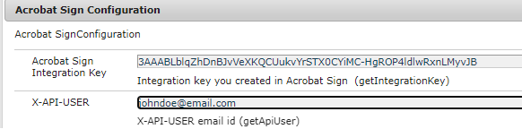

# Utilisation des méthodes d’assistance Adobe Sign

Dans certains cas d’utilisation, vous pouvez avoir la demande d’envoyer un document pour les signatures sans utiliser de processus AEM. Dans ce cas, il sera très pratique d’utiliser les méthodes wrapper exposées par l’échantillon de lot fourni dans cet article.

## Déploiement de l’exemple de lot OSGi

[Déploiement du lot OSGi](assets/AdobeSignHelperMethods.core-1.0.0-SNAPSHOT.jar) via la console web OSGi AEM. Spécifiez la clé d’intégration de l’API et l’utilisateur de l’API à l’aide de la configuration OSGi comme illustré ci-dessous, via le gestionnaire de configuration de la console web OSGi AEM.

 Veuillez noter que la variable `AdobeSignHelperMethods` Le lot OSGi n’est pas reconnu comme un code de produit Adobe Experience Manager (AEM) et, en tant que tel, il n’est pas pris en charge par la prise en charge d’Adobe.



## Documentation de l’API

Les éléments suivants sont disponibles via le `AcrobatSignHelperMethods` Service OSGi fourni dans le lot OSGi.

### getTransientDocumentID

`String getTransientDocumentID(Document documentForSigning) throws IOException`


Document utilisé pour créer un accord ou un formulaire web. Le document est d’abord téléchargé vers Acrobat Sign par l’expéditeur. On parle alors de _transient_ car il est disponible uniquement pendant les 7 jours suivant le chargement. Cette méthode accepte `com.adobe.aemfd.docmanager.Document` et renvoie l’ID de document transitoire.

### getAgreementID

`String getAgreementId(String transientDocumentID, String email) throws ClientProtocolException, IOException`

Envoyez le document à signer à l’aide de l’ID de document transitoire à l’utilisateur identifié par le paramètre de courrier électronique.

### getWidgetID

`String getWidgetID(String transientDocumentID)`

Un widget est comme un modèle réutilisable qui peut être présenté aux utilisateurs plusieurs fois et signé plusieurs fois. Utilisez cette méthode pour obtenir un identifiant de widget à l’aide de l’identifiant de document transitoire.

### getWidgetURL

`String getWidgetURL(String widgetId) throws ClientProtocolException, IOException`

Obtenez une URL de widget pour un identifiant de widget spécifique. Cette URL de widget peut ensuite être présentée aux utilisateurs pour la signature du document.

## Utilisation de l’API

La variable `AcrobatSignHelperMethods` est un service OSGi. Il doit donc être annoté à l’aide de l’annotation @Reference dans votre code Java.

```java
...
// Import the AcrobatSignHelperMethods from the provided bundle
import com.acrobatsign.core.AcrobatSignHelperMethods;
...

@Component(service = { Example.class })
public class ExampleImpl implements Example {

 // Gain a reference to the provided AcrobatSignHelperMethods OSGi service
 @Reference
 com.acrobatsign.core.AcrobatSignHelperMethods acrobatSignHelperMethods;

 function void example() { 
    ...
    // Use the AcrobatSignHelperMethods API methods in your code
    String transientDocumentId = acrobatSignHelperMethods.getTransientDocumentID(documentForSigning);

    String agreementId = acrobatSignHelperMethods.getAgreementId(transientDocumentID, "johndoe@example.com");
    ...
 }
}
```

