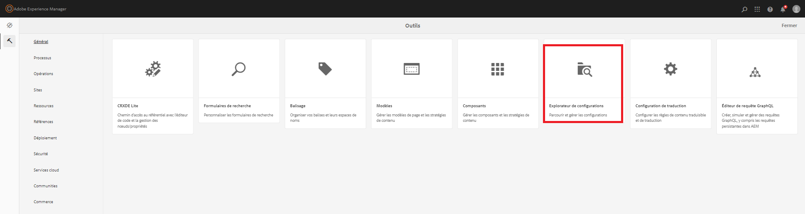
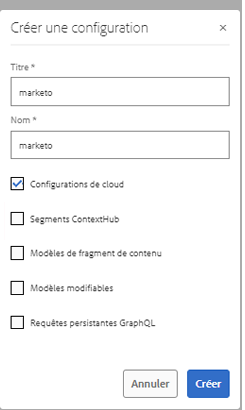
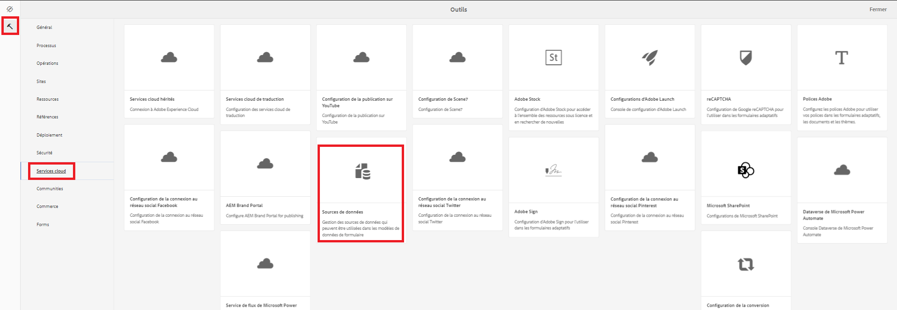
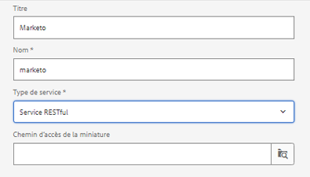
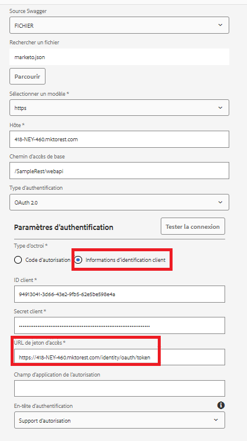

# Création d’une source de données

Les API REST de Marketo sont authentifiées avec OAuth 2.0 à 2 jambes. Nous pouvons facilement créer une source de données à l’aide du fichier swagger téléchargé à l’étape précédente.

## Création d’un conteneur de configurations

* Connectez-vous à AEM.
* Cliquez sur le menu Outils, puis sur **Explorateur de configurations** comme illustré ci-dessous.

* 

* Cliquez sur **Créer** et indiquez un nom significatif comme illustré ci-dessous. Veillez à sélectionner l’option Configurations du cloud comme illustré ci-dessous.

* 

## Création d’un service cloud

* Accédez au menu Outils, puis cliquez sur Services cloud -> Sources de données.

* 

* Sélectionnez le conteneur de configurations créé à l’étape précédente et cliquez sur **Créer** pour créer une source de données. Attribuez un nom significatif, sélectionnez le service RESTful dans la liste déroulante Type de service et cliquez sur **Suivant**.
* 

* Chargez le fichier swagger et spécifiez le type d’octroi, l’ID client, le secret client et l’URL du jeton d’accès spécifiques à votre instance Marketo, comme illustré dans la capture d’écran ci-dessous.

* Testez la connexion et, si la connexion est établie, veillez à cliquer sur le bouton bleu **Créer** pour terminer le processus de création de la source de données.

* 

## Étapes suivantes

[Création d’un modèle de données de formulaire](./part3.md)
