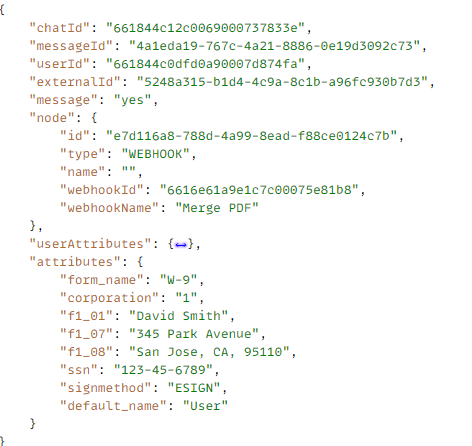

# Analyse des données ChatBot

A [webhook ChatBot](https://www.chatbot.com/help/webhooks/what-are-webhooks/) a été utilisé pour envoyer les données ChatBot à un servlet AEM.
Les données capturées dans le ChatBot sont au format JSON ; l’utilisateur les a entrées dans l’objet attributes, comme illustré ci-dessous.


Pour fusionner les données avec le modèle XDP, nous devons créer le XML suivant. Notez l’élément racine du fichier xml. Il doit correspondre à l’élément racine du modèle XDP pour que la fusion des données se déroule correctement.


```xml
<topmostSubForm>
    <f1_01>David Smith</f1_01>
    <signmethod>ESIGN</signmethod>
    <corporation>1</corporation>
    <f1_08>San Jose, CA, 95110</f1_08>
    <f1_07>345 Park Avenue</f1_07>
    <ssn>123-45-6789</ssn>
    <form_name>W-9</form_name>
</topmostSubForm>
```


## Étapes suivantes

[Fusionner les données avec le modèle XDP](./merge-data-with-template.md)
