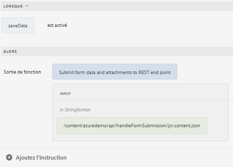

# Utilisation de l’API GuideBridge pour POST des données de formulaire

L’option &quot;Enregistrer et reprendre&quot; d’un formulaire implique de permettre aux utilisateurs d’enregistrer la progression du remplissage du formulaire et de le reprendre ultérieurement.
Les étapes suivantes ont été suivies pour utiliser l’API de géolocalisation dans Forms adaptatif. Pour réaliser ce cas d’utilisation, nous devons accéder aux données de formulaire et les envoyer à l’aide de l’API GuideBridge vers le point de terminaison REST pour le stockage et la récupération.

Les données de formulaire sont enregistrées sur l’événement click d’un bouton à l’aide de l’éditeur de règles.


La fonction JavaScript suivante a été écrite pour envoyer les données au point de terminaison spécifié.

```javascript
/**
* Submits data and attachments 
* @name submitFormDataAndAttachments Submit form data and attachments to REST end point
* @param {string} endpoint in Stringformat
* @return {string} 
 */

function submitFormDataAndAttachments(endpoint) {

    guideBridge.getFormDataObject({
        success: function(resultObj) {
            afFormData = resultObj.data.data;
            var formData = new FormData();
            formData.append("dataXml", afFormData);
            for (i = 0; i < resultObj.data.attachments.length; i++) {
                var attachment = resultObj.data.attachments[i];
                console.log(attachment.name);
                formData.append(attachment.name, attachment.data);
            }
            var xhttp = new XMLHttpRequest();
            xhttp.onreadystatechange = function() {
                if (this.readyState == 4 && this.status == 200) {
                    console.log("successfully saved");
                    var fld = guideBridge.resolveNode("$form.confirmation");
                    return " Form data was saved successfully";

                }
            };
            xhttp.open('POST', endpoint)
            xhttp.send(formData);
        }
    });

}
```


## Code côté serveur

Le code Java côté serveur suivant a été écrit pour gérer les données de formulaire. Voici le servlet Java exécuté dans AEM qui est appelé via l’appel XHR dans le code JavaScript ci-dessus.

```java
package com.azuredemo.core.servlets;
import com.adobe.aemfd.docmanager.Document;
import org.apache.sling.api.SlingHttpServletRequest;
import org.apache.sling.api.SlingHttpServletResponse;
import org.apache.sling.api.request.RequestParameter;
import org.apache.sling.api.servlets.SlingAllMethodsServlet;
import org.apache.sling.servlets.annotations.SlingServletResourceTypes;
import org.osgi.service.component.annotations.Component;
import org.slf4j.Logger;
import org.slf4j.LoggerFactory;
import javax.servlet.Servlet;
import javax.servlet.http.HttpServletResponse;
import java.io.File;
import java.io.IOException;
import java.io.Serializable;
import java.util.List;
@Component(
   service = {
      Servlet.class
   }
)
@SlingServletResourceTypes(
   resourceTypes = "azure/handleFormSubmission",
   methods = "POST",
   extensions = "json"
)
public class StoreFormSubmission extends SlingAllMethodsServlet implements Serializable {
   private static final long serialVersionUID = 1 L;
   private final transient Logger log = LoggerFactory.getLogger(this.getClass());
   protected void doPost(SlingHttpServletRequest request, SlingHttpServletResponse response) throws IOException {
      List < RequestParameter > listOfRequestParameters = request.getRequestParameterList();
      log.debug("The size of list is " + listOfRequestParameters.size());
      for (int i = 0; i < listOfRequestParameters.size(); i++) {
         RequestParameter requestParameter = listOfRequestParameters.get(i);
         log.debug("is this request parameter a form field?" + requestParameter.isFormField());
         if (!requestParameter.isFormField()) {
            Document attachmentDOC = new Document(requestParameter.getInputStream());
            attachmentDOC.copyToFile(new File(requestParameter.getName()));
         } else {
            log.debug("Not a form field " + requestParameter.getName());
            log.debug(requestParameter.getString());
         }
      }
      response.setStatus(HttpServletResponse.SC_OK);
   }
}
```
