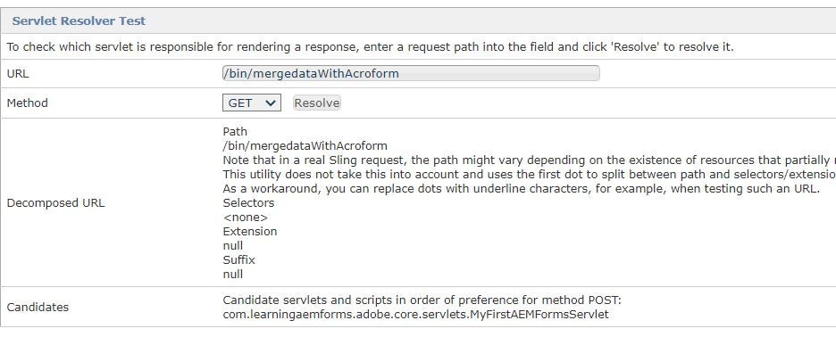

# Servlet Sling

Un servlet est une classe utilisée pour étendre les fonctionnalités des serveurs qui hébergent des applications accessibles au moyen d’un modèle de programmation de réponse aux demandes. Pour ces applications, la technologie Servlet définit des classes de servlet spécifiques à HTTP.
Toutes les servlets doivent mettre en oeuvre l’interface Servlet, qui définit les méthodes de cycle de vie.


Un servlet dans AEM peut être enregistré en tant que service OSGi : vous pouvez étendre SlingSafeMethodsServlet pour l’implémentation en lecture seule ou SlingAllMethodsServlet afin de mettre en oeuvre toutes les opérations RESTful.

## Code du servlet

```java
import javax.servlet.Servlet;

import org.apache.sling.api.SlingHttpServletRequest;
import org.apache.sling.api.SlingHttpServletResponse;
import org.apache.sling.api.servlets.SlingAllMethodsServlet;
import org.osgi.service.component.annotations.Component;
import org.osgi.service.component.annotations.Reference;

import com.adobe.aemfd.docmanager.Document;
import com.adobe.fd.forms.api.FormsService;

@Component(service={Servlet.class}, property={"sling.servlet.methods=post", "sling.servlet.paths=/bin/mergedataWithAcroform"})
public class MyFirstAEMFormsServlet extends SlingAllMethodsServlet
{
	
	private static final long serialVersionUID = 1L;
	@Reference
	FormsService formsService;
	 protected void doPost(SlingHttpServletRequest request, SlingHttpServletResponse response)
	  { 
		 String file_path = request.getParameter("save_location");
		 
		 java.io.InputStream pdf_document_is = null;
		 java.io.InputStream xml_is = null;
		 javax.servlet.http.Part pdf_document_part = null;
		 javax.servlet.http.Part xml_data_part = null;
		 	 try
		 	 {
		 		pdf_document_part = request.getPart("pdf_file");
				 xml_data_part = request.getPart("xml_data_file");
				 pdf_document_is = pdf_document_part.getInputStream();
				 xml_is = xml_data_part.getInputStream();
				 Document data_merged_document = formsService.importData(new Document(pdf_document_is), new Document(xml_is));
				 data_merged_document.copyToFile(new File(file_path));
				 
		 	 }
		 	 catch(Exception e)
		 	 {
		 		 response.sendError(400,e.getMessage());
		 	 }
	  }
}
```

## Création et déploiement

Pour créer votre projet, procédez comme suit :

* Ouvrez la **fenêtre d’invite de commande**.
* Accédez à `c:\aemformsbundles\learningaemforms\core`.
* Exécutez la commande `mvn clean install -PautoInstallBundle`
* La commande ci-dessus crée et déploie automatiquement le lot vers votre instance AEM s’exécutant sur localhost:4502

Le lot sera également disponible à l’emplacement suivant `C:\AEMFormsBundles\learningaemforms\core\target`. Le lot peut également être déployé dans AEM à l’aide de la [console web Felix.](http://localhost:4502/system/console/bundles)


## Test du résolveur de servlet

Pointez votre navigateur sur l’URL [du programme de résolution de servlets](http://localhost:4502/system/console/servletresolver?url=%2Fbin%2FmergedataWithAcroform&amp;method=POST). Cela vous indique le servlet qui sera appelé pour un chemin donné, comme le montre l’écran ci-dessous.


## Test du servlet à l’aide de Postman


