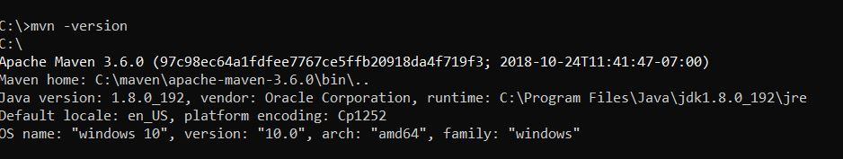

# Créer votre premier lot OSGi

Un lot OSGi est un fichier d’archive Java™ qui contient du code Java, des ressources et un manifeste qui décrit le lot et ses dépendances. Un lot est une unité de déploiement d’application. Cet article est destiné à l’équipe de développement qui souhaite créer un service ou un servlet OSGi à l’aide d’AEM Forms 6.4 ou 6.5. Pour créer votre premier lot OSGi, procédez comme suit :


## Installer JDK

Installez la version prise en charge de JDK. En ce qui me concerne, j’ai installé JDK 1.8. Vérifiez que vous avez ajouté **JAVA_HOME** dans vos variables d’environnement et qu’il pointe vers le dossier racine de votre installation JDK.
Ajoutez %JAVA_HOME%/bin au chemin.


>[!NOTE]
> N’utilisez pas JDK 15. Cette version n’est pas prise en charge par AEM.

### Tester votre version JDK

Ouvrez une nouvelle fenêtre d’invite de commande et saisissez : `java -version`. Vous devez recevoir la version JDK identifiée par la variable `JAVA_HOME`.


## Installer Maven

Maven est un outil d’automatisation de création utilisé principalement dans les projets Java. Pour installer Maven sur votre système local, procédez comme suit.

* Créez un dossier appelé `maven` dans votre lecteur C.
* Téléchargez l’[archive zip binaire](https://maven.apache.org/download.cgi).
* Procédez à l’extraction du contenu de l’archive zip dans `c:\maven`.
* Créez une variable d’environnement appelée `M2_HOME` avec la valeur suivante : `C:\maven\apache-maven-3.6.0`. J’ai installé la version 3.6.0 de **mvn**. Au moment de la rédaction de cet article, la dernière version de Maven est 3.6.3.
* Ajoutez `%M2_HOME%\bin` à votre chemin.
* Enregistrez vos modifications.
* Ouvrez une nouvelle invite de commande et saisissez `mvn -version`. La version **mvn** doit s’afficher, comme illustré dans la copie d’écran ci-dessous.




## Installer Eclipse

Installez la dernière version d’[Eclipse](https://www.eclipse.org/downloads/).

## Créer votre premier projet

Archetype est une boîte à outils permettant de créer des modèles de projet Maven. Un archétype est défini comme un modèle ou un motif d’origine à partir duquel tous les autres éléments de même type sont créés. Le nom reflète bien notre objectif de fournir un système qui offre un moyen cohérent de générer des projets Maven. Archetype permet de créer des modèles de projet Maven à destination des utilisateurs et des utilisatrices, qui peuvent générer des versions paramétrées de ces modèles de projet.
Pour créer votre premier projet Maven, procédez comme suit :

* Créez un dossier appelé `aemformsbundles` dans votre lecteur C.
* Ouvrez une invite de commande, puis accédez à `c:\aemformsbundles`.
* Exécutez la commande suivante dans l’invite de commande :

```java
mvn -B org.apache.maven.plugins:maven-archetype-plugin:3.2.1:generate -D archetypeGroupId=com.adobe.aem -D archetypeArtifactId=aem-project-archetype -D archetypeVersion=36 -D appTitle="My Site" -D appId="mysite" -D groupId="com.mysite" -D aemVersion=6.5.13
```

Une fois la création terminée, vous devriez voir un message de réussite de la création dans la fenêtre de commande.

## Créer un projet Eclipse à partir de votre projet Maven

* Remplacez votre répertoire de travail par `mysite`
* Exécutez `mvn eclipse:eclipse` à partir de la ligne de commande. La commande lit votre fichier pom et crée des projets Eclipse avec les bonnes métadonnées afin qu’Eclipse comprenne les types de projets, les relations, le chemin de classe, etc.

## Importer le projet dans Eclipse

Lancez **Eclipse**.

Accédez à **Fichier -> Importer** et sélectionnez **Projets Maven existants** comme illustré ici.


Cliquez sur Suivant.

Sélectionnez c:\aemformsbundles\mysite en cliquant sur le bouton **Parcourir**.


>[!NOTE]
>Vous pouvez choisir d’importer les modules appropriés en fonction de vos besoins. Sélectionnez et importez le module principal uniquement si vous souhaitez créer du code Java dans votre projet.

Cliquez sur **Terminer** pour lancer le processus d’import.

Le projet est importé dans Eclipse et vous pouvez voir plusieurs dossiers `mysite.xxxx`.

Développez `src/main/java` sous le dossier `mysite.core`. Il s’agit du dossier dans lequel vous écrivez la plupart de votre code.


## Inclure le SDK client AEMFD

Vous devez inclure le SDK client AEMFD dans votre projet pour tirer parti des différents services fournis avec AEM Forms. Veuillez consulter [SDK client AEMFD](https://mvnrepository.com/artifact/com.adobe.aemfd/aemfd-client-sdk) pour inclure le SDK client approprié dans votre projet Maven. Vous devez inclure le SDK client AEMFD dans la section des dépendances du `pom.xml` du projet principal, comme illustré ci-dessous.

```xml
<dependency>
    <groupId>com.adobe.aemfd</groupId>
    <artifactId>aemfd-client-sdk</artifactId>
    <version>6.0.122</version>
</dependency>
```

Pour créer votre projet, veuillez procéder comme suit :

* Ouvrez la **fenêtre d’invite de commande**.
* Accédez à `c:\aemformsbundles\mysite\core`.
* Exécutez la commande `mvn clean install -PautoInstallBundle`.
La commande ci-dessus crée et installe le lot dans le serveur AEM s’exécutant sur `http://localhost:4502`. Le lot est également disponible sur le système de fichiers à l’adresse
  `C:\AEMFormsBundles\mysite\core\target` et peut être déployé à l’aide de la [console web Felix](http://localhost:4502/system/console/bundles).

## Étapes suivantes

[Créer un service OSGi](./create-osgi-service.md)

