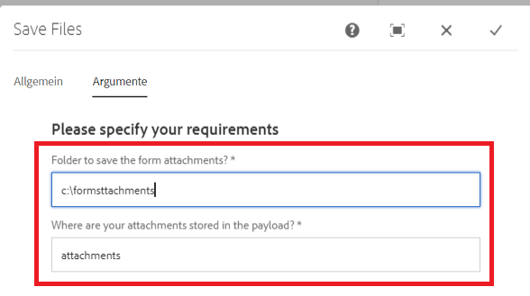

# Étape de processus personnalisée

Ce tutoriel est destiné aux clientes et clients d’AEM Forms qui doivent implémenter un composant de workflow personnalisé. La première étape de la création d’un composant de workflow est d’écrire votre code Java qui sera associé au composant de workflow. Pour les besoins de ce tutoriel, nous allons écrire une classe Java simple pour stocker les pièces jointes de formulaire adaptatif dans le système de fichiers. Ce code Java lira les arguments spécifiés dans le composant de workflow.

Les étapes suivantes sont requises pour écrire la classe Java et déployer la classe en tant que lot OSGi.

## Créer le projet Maven

La première étape consiste à créer un projet Maven à l’aide de l’archétype Maven Adobe approprié. Les étapes détaillées sont répertoriées dans cet [article](https://experienceleague.adobe.com/docs/experience-manager-learn/forms/creating-your-first-osgi-bundle/create-your-first-osgi-bundle.html?lang=fr). Une fois votre projet Maven importé dans Eclipse, vous êtes en mesure de commencer à écrire votre premier composant OSGi qui peut être utilisé dans votre étape de processus.


### Créer une classe qui implémente WorkflowProcess

Ouvrez le projet Maven dans votre IDE Eclipse. Développez le dossier **projectname** > **core**. Développez le dossier src/main/java. Vous devriez voir un package qui se termine par « core ». Créez une classe Java qui implémente WorkflowProcess dans ce package. Vous devez remplacer la méthode d’exécution. La signature de la méthode d’exécution est la suivante :
public void execute(WorkItem workItem, WorkflowSession workflowSession, MetaDataMap processArguments)throws WorkflowException

Dans ce tutoriel, nous allons écrire les pièces jointes ajoutées au formulaire adaptatif dans le système de fichiers dans le cadre du workflow AEM.

Pour réaliser ce cas d’utilisation, la classe Java suivante a été écrite :

Regardons ce code.

```java
package com.mysite.core;
import java.io.File;
import java.io.InputStream;
import java.util.HashMap;
import java.util.Map;
import javax.jcr.Node;
import javax.jcr.Session;
import org.osgi.framework.Constants;
import org.osgi.service.component.annotations.Component;
import org.osgi.service.component.annotations.Reference;
import org.slf4j.Logger;
import org.slf4j.LoggerFactory;
import com.adobe.aemfd.docmanager.Document;
import com.adobe.granite.workflow.WorkflowException;
import com.adobe.granite.workflow.WorkflowSession;
import com.adobe.granite.workflow.exec.WorkItem;
import com.adobe.granite.workflow.exec.WorkflowProcess;
import com.adobe.granite.workflow.metadata.MetaDataMap;
import com.day.cq.search.PredicateGroup;
import com.day.cq.search.Query;
import com.day.cq.search.QueryBuilder;
import com.day.cq.search.result.Hit;
import com.day.cq.search.result.SearchResult;
@Component(property = {
  Constants.SERVICE_DESCRIPTION + "=Custom component to wrtie form attachments to file system",
  Constants.SERVICE_VENDOR + "=Adobe Systems",
  "process.label" + "=Custom component to wrtie form attachments to file system"
})
public class WriteFormAttachmentsToFileSystem implements WorkflowProcess {

  private static final Logger log = LoggerFactory.getLogger(WriteFormAttachmentsToFileSystem.class);
  @Reference
  QueryBuilder queryBuilder;

  @Override
  public void execute(WorkItem workItem, WorkflowSession workflowSession, MetaDataMap metaDataMap)
  throws WorkflowException {

    String attachmentsPath = metaDataMap.get("attachmentsPath", String.class);

    log.debug("Got attachments path: " + attachmentsPath);
    String saveToLocation = metaDataMap.get("SaveToLocation", String.class);
    log.debug("Got save location: " + saveToLocation);

    log.debug("The seperator is" + File.separator);
    String payloadPath = workItem.getWorkflowData().getPayload().toString();
    Map < String, String > map = new HashMap < String, String > ();
    map.put("path", payloadPath + "/" + attachmentsPath);
    File saveLocationFolder = new File(saveToLocation);
    if (!saveLocationFolder.exists()) {
      saveLocationFolder.mkdirs();
    }

    map.put("type", "nt:file");
    Query query = queryBuilder.createQuery(PredicateGroup.create(map), workflowSession.adaptTo(Session.class));
    query.setStart(0);
    query.setHitsPerPage(20);

    SearchResult result = query.getResult();
    log.debug("Got  " + result.getHits().size() + " attachments ");
    Node attachmentNode = null;
    for (Hit hit: result.getHits()) {
      try {
        String path = hit.getPath();
        log.debug("The attachment title is  " + hit.getTitle() + " and the attachment path is  " + path);
        attachmentNode = workflowSession.adaptTo(Session.class).getNode(path + "/jcr:content");
        InputStream documentStream = attachmentNode.getProperty("jcr:data").getBinary().getStream();
        Document attachmentDoc = new Document(documentStream);
        attachmentDoc.copyToFile(new File(saveLocationFolder + File.separator + hit.getTitle()));
        attachmentDoc.close();
      } catch (Exception e) {
        log.error("Error saving file " + e.getMessage());
      }
    }
  }
}
```


* attachmentsPath : il s’agit du même emplacement que celui que vous avez spécifié dans le formulaire adaptatif lorsque vous avez configuré l’action d’envoi du formulaire adaptatif pour appeler le workflow AEM. Il s’agit du nom du dossier dans lequel vous souhaitez que les pièces jointes soient enregistrées dans AEM par rapport à la payload du workflow.

* saveToLocation : il s’agit de l’emplacement où vous souhaitez que les pièces jointes soient enregistrées sur le système de fichiers de votre serveur AEM.

Ces deux valeurs sont transmises en tant qu’arguments de processus à l’aide de la boîte de dialogue du composant de workflow.



Le service QueryBuilder est utilisé pour interroger des nœuds de type nt:file sous le dossier attachmentsPath. Le reste du code parcourt les résultats de recherche pour créer l’objet Document et l’enregistrer dans le système de fichiers.


>[!NOTE]
>
>Puisque nous utilisons l’objet Document spécifique à AEM Forms, vous devez inclure la dépendance aemfd-client-sdk dans votre projet Maven.

```xml
<dependency>
    <groupId>com.adobe.aemfd</groupId>
    <artifactId>aemfd-client-sdk</artifactId>
    <version>6.0.772</version>
</dependency>
```

#### Créer et déployer

[Créez le lot comme décrit ici.](https://experienceleague.adobe.com/docs/experience-manager-learn/forms/creating-your-first-osgi-bundle/create-your-first-osgi-bundle.html?lang=fr)
[Assurez-vous que le lot est déployé et à l’état actif.](http://localhost:4502/system/console/bundles)

## Étapes suivantes

Créer votre [composant de workflow personnalisé](./custom-workflow-component.md)

