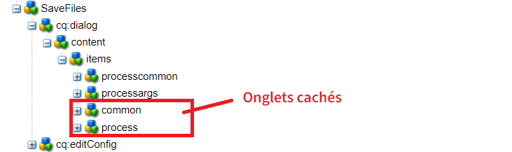
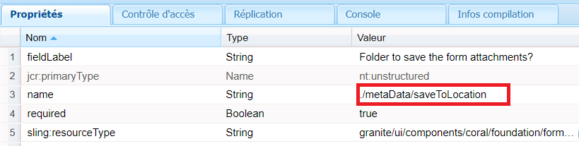
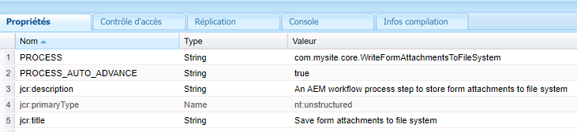

# Composant de workflow personnalisé

Ce tutoriel est destiné aux clientes et clients d’AEM Forms qui doivent créer un composant de workflow personnalisé. Le composant de workflow sera configuré pour exécuter le code écrit à l’étape précédente. Le composant de workflow peut spécifier des arguments de processus au code. Dans cet article, nous allons explorer le composant de workflow associé au code.

[Télécharger le composant de workflow personnalisé](assets/saveFiles.zip)
Importer le composant de workflow [à l’aide du gestionnaire de packages](http://localhost:4502/crx/packmgr/index.jsp)

Le composant de workflow personnalisé se trouve dans /apps/AEMFormsDemoListings/workflowcomponent/SaveFiles.

Sélectionnez le nœud SaveFiles et examinez ses propriétés.

**componentGroup** : la valeur de cette propriété détermine la catégorie du composant de workflow.

**jcr:Title** : il s’agit du titre du composant de workflow.

**sling:resourceSuperType** : la valeur de cette propriété détermine l’héritage de ce composant. Dans ce cas, nous héritons à partir du composant de processus.

## cq:dialog

Les boîtes de dialogue permettent à l’auteur ou à l’autrice d’interagir avec le composant. cq:dialog se trouve sous le nœud SaveFiles.

Les nœuds situés sous le nœud des éléments (items) représentent les onglets du composant par le biais desquels les personnes chargées de créer du contenu interagiront avec le composant. Les onglets communs et de de processus sont masqués. Les onglets communs et d’arguments sont visibles.

Les arguments de processus pour le processus se trouvent sous le nœud processargs.

La personne chargée de créer du contenu spécifie les arguments comme illustré dans la capture d’écran ci-dessous.

Les valeurs sont stockées en tant que propriétés du nœud de métadonnées. Par exemple, la valeur **c:\formsattachments** sera stockée dans la propriété saveToLocation du nœud de métadonnées.

## cq:editConfig

cq:EditConfig est simplement un nœud ave le type principal cq:EditConfig et le nom cq:editConfig sous la racine du composant.
Le comportement de modification d’un composant est configuré en ajoutant un nœud cq:editConfig de type cq:EditConfig sous le nœud du composant (de type cq:Component).

cq:formParameters (type de nœud nt:unstructured) : définit des paramètres supplémentaires qui sont ajoutés au formulaire de boîte de dialogue.

Notez les propriétés du nœud cq:formParameters.

La valeur de la propriété PROCESS indique le code Java qui sera associé au composant de workflow.
