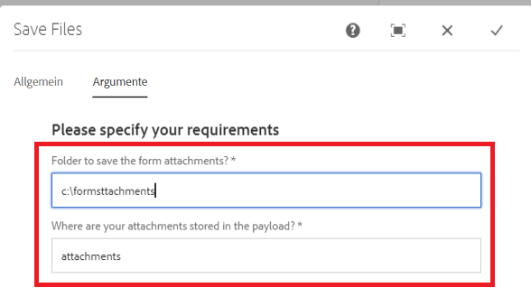

# Composant de workflow personnalisé

Ce tutoriel est destiné aux clients AEM Forms qui doivent créer un composant de workflow personnalisé. Le composant de workflow sera configuré pour exécuter le code écrit à l’étape précédente. Le composant de workflow peut spécifier des arguments de processus au code. Dans cet article, nous allons explorer le composant de workflow associé au code.

[Téléchargement du composant de workflow personnalisé](assets/saveFiles.zip)
Importation du composant de workflow [utilisation de package manager](http://localhost:4502/crx/packmgr/index.jsp)

Le composant de workflow personnalisé se trouve dans /apps/AEMFormsDemoListings/workflowcomponent/SaveFiles.

Sélectionnez le noeud SaveFiles et examinez ses propriétés.

**componentGroup** - La valeur de cette propriété détermine la catégorie du composant de workflow.

**jcr:Title** - Il s’agit du titre du composant de workflow.

**sling:resourceSuperType** La valeur de cette propriété détermine l’héritage de ce composant. Dans ce cas, nous héritons du composant de processus

## cq:dialog

Les boîtes de dialogue permettent à l’auteur d’interagir avec le composant. Le noeud cq:dialog se trouve sous le noeud SaveFiles .

Les noeuds situés sous le noeud éléments représentent les onglets du composant par le biais desquels les auteurs interagiront avec le composant. Les onglets communs et de processus sont masqués. Les onglets Commun et Arguments sont visibles.

Les arguments de processus pour le processus se trouvent sous le noeud processargs .

L’auteur spécifie les arguments comme illustré dans la capture d’écran ci-dessous

Les valeurs sont stockées en tant que propriétés du noeud de métadonnées. Par exemple, la valeur **c:\formsattachments** sera stocké dans la propriété saveToLocation du noeud de métadonnées

## cq:editConfig

Le cq:EditConfig est simplement un noeud de type Principal cq:EditConfig et le nom cq:editConfig sous la racine du composant. Le comportement de modification d’un composant est configuré en ajoutant un noeud cq:editConfig de type cq:EditConfig sous le noeud du composant (de type cq:Component).

cq:formParameters (type de nœud nt:unstructured) : définit des paramètres supplémentaires qui sont ajoutés au formulaire de la boîte de dialogue.

Notez les propriétés du noeud cq:formParameters

La valeur de la propriété PROCESS indique le code Java qui sera associé au composant de workflow.

