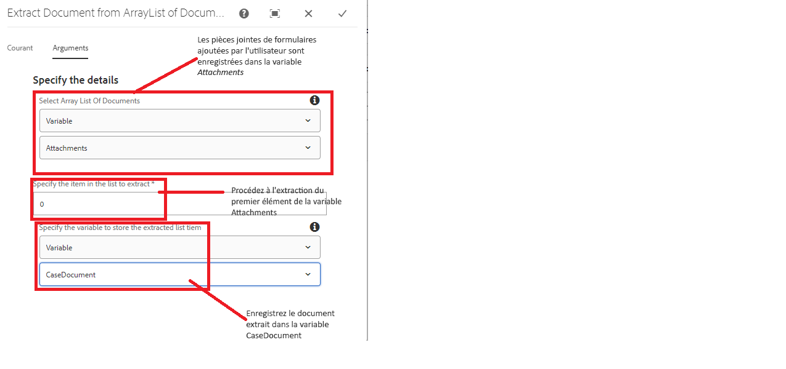
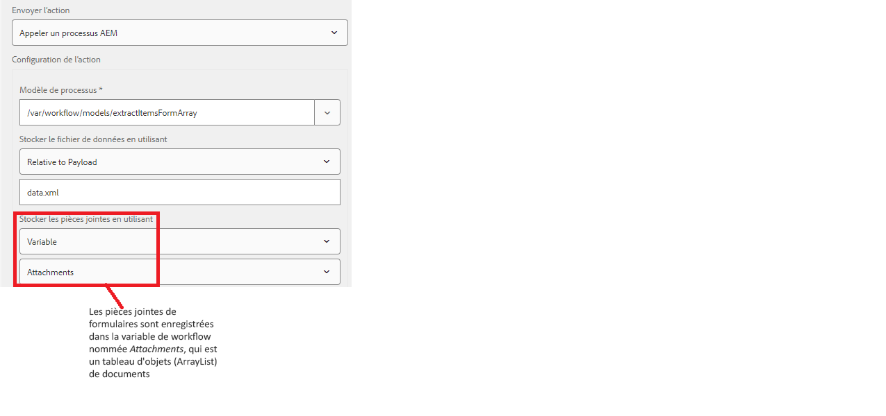

# Extraire un document de la liste des documents

Un cas d’utilisation courant consiste à envoyer les données de formulaire et la pièce jointe à un système externe à l’aide de l’étape d’appel du modèle de données de formulaire dans un workflow AEM. Par exemple, lors de la création d’un cas dans ServiceNow, vous souhaitez envoyer les détails du cas avec un document. Les pièces jointes ajoutées au formulaire adaptatif sont stockées dans une variable de type arraylist. Pour extraire un document spécifique de cette variable arraylist, vous devez écrire du code personnalisé.

Cet article décrit les étapes à suivre pour utiliser le composant de workflow personnalisé afin d’extraire et de stocker le document dans une variable de document.

## Créer un workflow

Il est nécessaire de créer un workflow pour gérer l’envoi du formulaire. Les variables suivantes doivent être définies pour le workflow.

* Une variable de type ArrayList de Document (cette variable contient les pièces jointes de formulaire ajoutées par l’utilisateur ou l’utilisatrice).
* Une variable de type Document.(Cette variable contiendra le document extrait de la variable ArrayList.)

* Ajouter le composant personnalisé à votre workflow et configurer ses propriétés
  

## Configurer un formulaire adaptatif

* Configurer l’action d’envoi du formulaire adaptatif pour déclencher le workflow d’AEM
  

## Tester la solution

[Déployer le lot personnalisé à l’aide de la console web OSGi](assets/ExtractItemsFromArray.core-1.0.0-SNAPSHOT.jar)

[Importer le composant de workflow à l’aide du gestionnaire de packages](assets/Extract-item-from-documents-list.zip)

[Importer l’exemple de workflow](assets/extract-item-sample-workflow.zip)

[Importer le formulaire adaptatif](assets/test-attachment-extractions-adaptive-form.zip)

[Prévisualisez le formulaire](http://localhost:4502/content/dam/formsanddocuments/testattachmentsextractions/jcr:content?wcmmode=disabled).

Ajoutez une pièce jointe au formulaire et envoyez-le.

>[!NOTE]
>
>Le document extrait peut ensuite être utilisé dans toute autre étape du workflow telle que Envoyer un e-mail ou Invoquer l’étape FDM.
