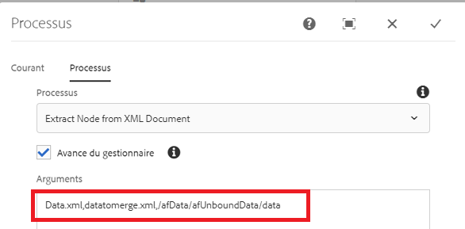

# Extraire le nœud du XML de données envoyé

Cette étape de processus personnalisée consiste à créer un document XML en extrayant le nœud d’un autre document XML. Suivez cette étape lorsque vous souhaitez fusionner les données soumises avec le modèle XDP pour générer le fichier PDF. Par exemple, lorsque vous soumettez un formulaire adaptatif, les données que vous devez fusionner avec le modèle XDP se trouvent dans l’élément de données. Dans ce cas, vous devez créer un autre document XML en en procédant à l’extraction de l’élément de données approprié.

La capture d’écran suivante montre les arguments que vous devez transmettre à l’étape de processus personnalisée.

Voici les paramètres :
* Data.xml : le fichier XML à partir duquel vous souhaitez extraire le nœud.
* datatomerge.xml : le nouveau fichier XML créé avec le nœud extrait.
* /afData/afUnboundData/data : le nœud à extraire.

La capture d’écran suivante montre le fichier datamerge.xml en cours de création sous le dossier de payload.
.

[Le lot personnalisé peut être téléchargé ici.](/help/forms/assets/common-osgi-bundles/SetValueApp.core-1.0-SNAPSHOT.jar)
