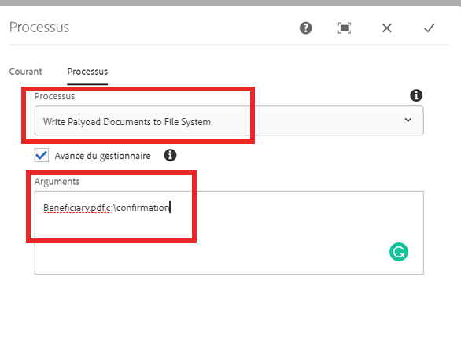

# Écrire le document dans le système de fichiers

Le cas d’utilisation courant consiste à écrire les documents générés dans le workflow dans le système de fichiers.
Cette étape personnalisée du processus de workflow facilite l’écriture des documents de workflow dans le système de fichiers.
Le processus personnalisé utilise les arguments séparés par des virgules suivants :

```java
ChangeBeneficiary.pdf,c:\confirmation
```

Le premier argument est le nom du document que vous souhaitez enregistrer dans le système de fichiers. Le deuxième argument correspond à l’emplacement du dossier dans lequel vous souhaitez enregistrer le document. Par exemple, dans le cas d’utilisation ci-dessus, le document sera écrit sur c:\confirmation\ChangeBeneficiary.pdf

La capture d’écran suivante montre les arguments que vous devez transmettre à l’étape de processus personnalisée.


[Le lot personnalisé peut être téléchargé ici](/help/forms/assets/common-osgi-bundles/SetValueApp.core-1.0-SNAPSHOT.jar)