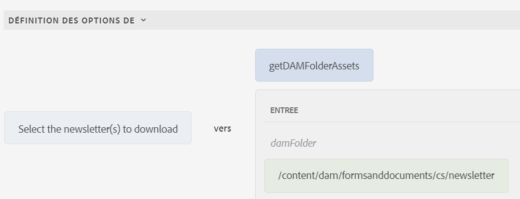

# Ajouter dynamiquement des éléments au composant de groupe de choix

AEM Forms 6.5 offre la possibilité d’ajouter dynamiquement des éléments à un composant de groupe de choix de formulaire adaptatif, comme Case à cocher, Bouton radio et Liste d’images. Dans cet article, nous allons examiner le cas d’utilisation de remplissage d’un composant de groupe de choix avec le contenu du dossier DAM. Dans la copie d’écran, les 3 fichiers se trouvent dans le dossier intitulé Newsletter. Chaque fois qu’une nouvelle newsletter est ajoutée au dossier, le composant de groupe de choix est mis à jour pour répertorier automatiquement son contenu. L’utilisateur ou l’utilisatrice peut sélectionner une ou plusieurs newsletters à télécharger.


## Créer un servlet pour renvoyer le contenu du dossier DAM

Le code suivant a été écrit pour renvoyer le contenu du dossier DAM au format JSON.

```java
package com.newsletters.core.servlets;
import static com.day.cq.commons.jcr.JcrConstants.JCR_CONTENT;
import java.io.IOException;
import java.io.PrintWriter;
import java.util.ArrayList;
import java.util.List;
import javax.servlet.Servlet;
import org.apache.sling.api.SlingHttpServletRequest;
import org.apache.sling.api.SlingHttpServletResponse;
import org.apache.sling.api.resource.Resource;
import org.apache.sling.api.servlets.SlingSafeMethodsServlet;
import org.osgi.service.component.annotations.Component;
import org.slf4j.Logger;
import org.slf4j.LoggerFactory;
import com.google.gson.Gson;
import com.google.gson.JsonObject;

@Component(service = {
  Servlet.class
}, property = {
  "sling.servlet.methods=get",
  "sling.servlet.paths=/bin/listfoldercontents"
})
public class ListFolderContent extends SlingSafeMethodsServlet {
  private static final long serialVersionUID = 1 L;
  private static final Logger log = LoggerFactory.getLogger(ListFolderContent.class);
  protected void doGet(SlingHttpServletRequest request, SlingHttpServletResponse response) {
    Resource resource = request.getResourceResolver().getResource(request.getParameter("damFolder"));
    List < JsonObject > results = new ArrayList < > ();
    resource.getChildren().forEach(child -> {
      if (!JCR_CONTENT.equals(child.getName())) {
        JsonObject asset = new JsonObject();
        log.debug("##The child name is " + child.getName());
        asset.addProperty("assetname", child.getName());
        asset.addProperty("assetpath", child.getPath());
        results.add(asset);

      }
    });
    PrintWriter out = null;
    try {
      out = response.getWriter();
    } catch (IOException e) {

      log.debug(e.getMessage());
    }
    response.setContentType("application/json");
    response.setCharacterEncoding("UTF-8");
    Gson gson = new Gson();
    out.print(gson.toJson(results));
    out.flush();
  }

}
```

## Créer une bibliothèque cliente avec une fonction JavaScript

Le servlet est appelé à partir d’une fonction JavaScript. La fonction renvoie un objet de tableau qui sera utilisé pour remplir le composant de groupe de choix.

```javascript
/**
 * Populate drop down/choice group  with assets from specified folder
 * @return {string[]} 
 */
function getDAMFolderAssets(damFolder) {
   // strUrl is whatever URL you need to call
   var strUrl = '/bin/listfoldercontents?damFolder=' + damFolder;
   var documents = [];
   $.ajax({
      url: strUrl,
      success: function(jsonData) {
         for (i = 0; i < jsonData.length; i++) {
            documents.push(jsonData[i].assetpath + "=" + jsonData[i].assetname);
         }
      },
      async: false
   });
   return documents;
}
```

## Créer un formulaire adaptatif

Créez un formulaire adaptatif et associez-le à la bibliothèque cliente **listfolderassets**. Ajoutez un composant de case à cocher à votre formulaire. Utilisez l’éditeur de règles pour remplir les options de la case à cocher, comme indiqué dans la copie d’écran.


Nous invoquons la fonction JavaScript appelée **getDAMFolderAssets** et transmettons le chemin d’accès aux ressources du dossier DAM à répertorier dans le formulaire.

## Étapes suivantes

[Assembler les ressources sélectionnées](./assemble-selected-newsletters.md)
