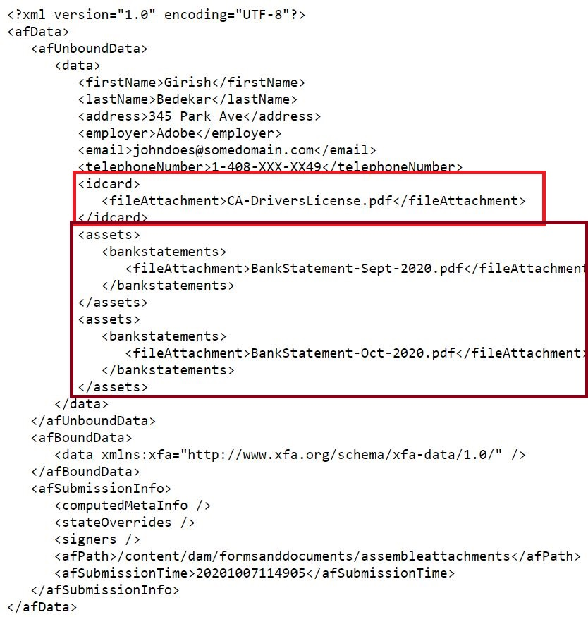

# Assemblage de pièces jointes à un formulaire

Cet article fournit des ressources pour assembler les pièces jointes des formulaires adaptatifs dans un ordre spécifié. Les pièces jointes du formulaire doivent être au format pdf pour que cet exemple de code fonctionne. Voici le cas d’utilisation.
L’utilisateur qui remplit un formulaire adaptatif joint un ou plusieurs documents pdf au formulaire.
Lors de l’envoi du formulaire, assemblez les pièces jointes du formulaire pour générer un pdf. Vous pouvez spécifier l’ordre dans lequel les pièces jointes sont assemblées pour générer le fichier pdf final.

## Créer un composant OSGi qui implémente l’interface WorkflowProcess

Créez un composant OSGi qui implémente l’interface [](https://helpx.adobe.com/experience-manager/6-5/sites/developing/using/reference-materials/javadoc/com/adobe/granite/workflow/exec/WorkflowProcess.html)com.adobe.granite.workflow.exec.WorkflowProcess. Le code de ce composant peut être associé au composant d’étape du processus dans le flux de travail AEM. La méthode execute de l’interface com.adobe.granite.workflow.exec.WorkflowProcess est implémentée dans ce composant.

Lorsqu’un formulaire adaptatif est envoyé pour déclencher un processus AEM, les données envoyées sont stockées dans le fichier spécifié sous le dossier de charge utile. Par exemple, il s’agit du fichier de données envoyé. Nous devons assembler les pièces jointes spécifiées sous la marque de carte de crédit et de relevé de compte.
.

### Obtention des noms de balise

L’ordre des pièces jointes est spécifié en tant qu’arguments d’étape du processus dans le processus, comme illustré dans la capture d’écran ci-dessous. Ici, nous assemblons les pièces jointes ajoutées à la carte de crédit sur le terrain suivies de relevés bancaires


Le fragment de code suivant extrait les noms des pièces jointes des arguments de processus.

```java
String  []attachmentNames  = arg2.get("PROCESS_ARGS","string").toString().split(",");
```

### Création de DDX à partir des noms de pièce jointe

Nous devons ensuite créer un document XML (DDX) [de description de](https://helpx.adobe.com/pdf/aem-forms/6-2/ddxRef.pdf) Document qui est utilisé par le service Assembler pour assembler des documents. Voici le DDX qui a été créé à partir des arguments de processus. Notez que les éléments source PDF sont dans le bon ordre, comme indiqué dans les arguments de processus.


### Création d’une carte des documents

Nous créons ensuite une carte des documents avec le nom de la pièce jointe comme clé et la pièce jointe comme valeur. Le service de créateur de requêtes a été utilisé pour requête des pièces jointes sous le chemin de charge utile et créer la carte des documents. Cette carte de document avec le DDX est nécessaire pour que le service Assembler puisse assembler le pdf final.

```java
public Map<String, Object> createMapOfDocuments(String payloadPath,WorkflowSession workflowSession )
{
  Map<String, String> queryMap = new HashMap<String, String>();
  Map<String,Object>mapOfDocuments = new HashMap<String,Object>();
  queryMap.put("type", "nt:file");
  queryMap.put("path",payloadPath);
  Query query = queryBuilder.createQuery(PredicateGroup.create(queryMap),workflowSession.adaptTo(Session.class));
  query.setStart(0);
  query.setHitsPerPage(30);
  SearchResult result = query.getResult();
  log.debug("Get result hits "+result.getHits().size());
  for (Hit hit : result.getHits()) {
    try {
          String path = hit.getPath();
          log.debug("The title "+hit.getTitle()+" path "+path);
          if(hit.getTitle().endsWith("pdf"))
           {
             com.adobe.aemfd.docmanager.Document attachmentDocument = new com.adobe.aemfd.docmanager.Document(path);
             mapOfDocuments.put(hit.getTitle(),attachmentDocument);
             log.debug("@@@@Added to map@@@@@ "+hit.getTitle());
           }
        }
    catch (Exception e)
       {
          log.debug(e.getMessage());
       }

}
return mapOfDocuments;
}
```

### Utiliser AssemblerService pour assembler les documents

Une fois le DDX et le mappage de document créés, l’étape suivante consiste à utiliser AssemblerService pour assembler les documents.
Le code suivant assemble et renvoie le pdf assemblé.

```java
private com.adobe.aemfd.docmanager.Document assembleDocuments(Map<String, Object> mapOfDocuments, com.adobe.aemfd.docmanager.Document ddxDocument)
{
    AssemblerOptionSpec aoSpec = new AssemblerOptionSpec();
    aoSpec.setFailOnError(true);
    AssemblerResult ar = null;
    try
    {
        ar = assemblerService.invoke(ddxDocument, mapOfDocuments, aoSpec);
        return (com.adobe.aemfd.docmanager.Document) ar.getDocuments().get("GeneratedDocument.pdf");
    }
    catch (OperationException e)
    {
        log.debug(e.getMessage());
    }
    return null;
    
}
```

### Enregistrez le fichier pdf assemblé sous le dossier de charge utile.

L’étape finale consiste à enregistrer le fichier pdf assemblé sous le dossier de charge utile. Ce pdf est alors accessible dans les étapes suivantes du flux de travaux pour un traitement ultérieur.
Le fragment de code suivant a été utilisé pour enregistrer le fichier dans le dossier de charge utile.

```java
Session session = workflowSession.adaptTo(Session.class);
javax.jcr.Node payloadNode =  workflowSession.adaptTo(Session.class).getNode(workItem.getWorkflowData().getPayload().toString());
log.debug("The payload Path is "+payloadNode.getPath());
javax.jcr.Node assembledPDFNode = payloadNode.addNode("assembled-pdf.pdf", "nt:file"); 
javax.jcr.Node jcrContentNode =  assembledPDFNode.addNode("jcr:content", "nt:resource");
Binary binary =  session.getValueFactory().createBinary(assembledDocument.getInputStream());
jcrContentNode.setProperty("jcr:data", binary);
log.debug("Saved !!!!!!"); 
session.save();
```

Voici la structure de dossiers de charge utile après l’assemblage et le stockage des pièces jointes au formulaire.


### Pour que cette fonctionnalité fonctionne sur votre serveur AEM

* Téléchargez le formulaire [](assets/assemble-form-attachments-af.zip) Assembler les pièces jointes du formulaire sur votre système local.
* Importez le formulaire à partir[de la page Formulaires et Documents](http://localhost:4502/aem/forms.html/content/dam/formsanddocuments) .
* Téléchargez [le processus](assets/assemble-form-attachments.zip) et importez-le dans AEM à l’aide de Package Manager.
* Téléchargement du lot [personnalisé](assets/assembletaskattachments.assembletaskattachments.core-1.0-SNAPSHOT.jar)
* Déploiement et début du lot à l’aide de la console [Web](http://localhost:4502/system/console/bundles)
* Pointez votre navigateur sur le formulaire [AssembleAttachments.](http://localhost:4502/content/dam/formsanddocuments/assembleattachments/jcr:content?wcmmode=disabled)
* Ajouter une pièce jointe dans le Document d’identification et quelques documents pdf à la section des relevés bancaires
* Envoyer le formulaire pour déclencher le processus
* Vérifiez le dossier de [charge utile du flux de travail dans la zone crx](http://localhost:4502/crx/de/index.jsp#/var/fd/dashboard/payload) pour le fichier pdf assemblé.

>[!NOTE]
> Si vous avez activé la journalisation pour le lot personnalisé, le DDX et le fichier assemblé sont écrits dans le dossier de votre installation AEM.

