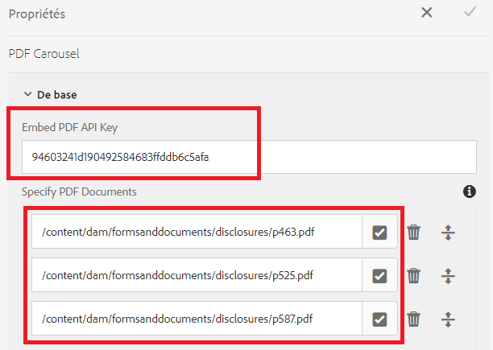

# Affichage de plusieurs documents PDF dans un carrousel

Un cas d’utilisation courant consiste à afficher plusieurs documents de PDF à l’utilisateur avant de soumettre le formulaire.

Pour réaliser ce cas d’utilisation, nous avons utilisé la variable [API Adobe PDF Incorporer](https://www.adobe.io/apis/documentcloud/dcsdk/pdf-embed.html).

[Une démonstration en direct de cet exemple peut être réalisée ici.](https://forms.enablementadobe.com/content/dam/formsanddocuments/wefinancecreditcard/jcr:content?wcmmode=disabled)

Les étapes suivantes ont été effectuées pour terminer l’intégration :

## Créer un composant personnalisé pour afficher plusieurs documents de PDF

Un composant personnalisé (pdf-carousel) a été créé pour parcourir les documents pdf.

## Bibliothèque cliente

Une bibliothèque cliente a été créée pour afficher les PDF à l’aide de l’API incorporée Adobe PDF. Les PDF à afficher sont spécifiés dans les composants pdf-carrousel.

## Créer un formulaire adaptatif

Créez un formulaire adaptatif basé sur certains onglets (cet exemple comporte 3 onglets) Ajoutez des composants de formulaire adaptatif dans les deux premiers onglets Ajoutez le composant de carrousel pdf dans le troisième onglet Configurez le composant pdf-carrousel comme illustré dans la capture d’écran ci-dessous.

**Incorporer la clé API du PDF** - Il s’agit de la clé que vous pouvez utiliser pour incorporer le pdf. Cette clé ne fonctionne qu’avec localhost. Vous pouvez créer des [votre propre clé](https://www.adobe.io/apis/documentcloud/dcsdk/pdf-embed.html) et l’associer à un autre domaine.

**Spécification de documents PDF** - Vous pouvez y spécifier les documents pdf que vous souhaitez afficher dans le carrousel.

## Déployer l’exemple sur votre serveur

Pour le tester sur votre serveur local, procédez comme suit :

1. [Importation de la bibliothèque cliente](assets/pdf-carousel-client-lib.zip) dans votre instance d’AEM locale [utilisation du gestionnaire de packages](http://localhost:4502/crx/packmgr/index.jsp)
1. [Importation du composant de carrousel pdf](assets/pdf-carousel-component.zip) dans votre instance d’AEM locale [utilisation du gestionnaire de packages](http://localhost:4502/crx/packmgr/index.jsp)
1. [Importation du formulaire adaptatif ](assets/adaptive-form-pdf-carousel.zip) dans votre instance d’AEM locale [utilisation du gestionnaire de packages](http://localhost:4502/crx/packmgr/index.jsp)
1. [Importez les exemples de pdf à afficher.](assets/pdf-carousel-sample-documents.zip) dans votre instance d’AEM locale [à l’aide du lien de chargement de fichier de ressources](http://localhost:4502/assets.html/content/dam)
1. [Aperçu du formulaire adaptatif](http://localhost:4502/content/dam/formsanddocuments/wefinancecreditcard/jcr:content?wcmmode=disabled)
1. Accédez à l’onglet Documents à réviser . Vous devriez voir trois documents PDF dans le composant du carrousel.
