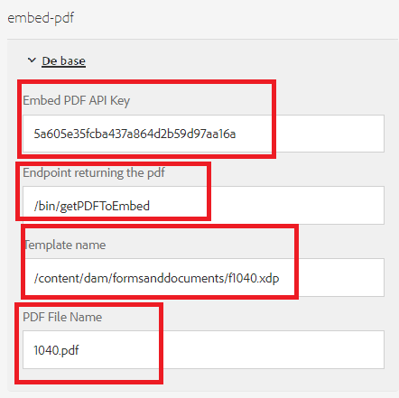

# Afficher le document d’enregistrement intégré

Un cas d’utilisation courant consiste à afficher un document PDF avec les données saisies par l’utilisateur ou l’utilisatrice du formulaire.

Pour réaliser ce cas d’utilisation, nous avons utilisé l’[API intégré Adobe PDF](https://www.adobe.io/apis/documentcloud/dcsdk/pdf-embed.html?lang=fr).

Les étapes suivantes ont été suivies pour effectuer l’intégration :

## Créer un composant personnalisé pour afficher le PDF intégré

Un composant personnalisé (embed-pdf) a été créé pour incorporer le PDF renvoyé par l’appel POST.

## Bibliothèque cliente

Le code suivant est exécuté lorsque vous cliquez sur le bouton de case à cocher `viewPDF`. Nous transmettons les données du formulaire adaptatif et le nom du modèle au point d’entrée pour générer le PDF. Le fichier PDF généré est ensuite affiché pour l’utilisateur ou l’utilisatrice du formulaire à l’aide de la bibliothèque JavaScript PDF intégrée.

```javascript
$(document).ready(function() {

    $(".viewPDF").click(function() {
        console.log("view pdfclicked");
        window.guideBridge.getDataXML({
            success: function(result) {
                var obj = new FormData();
                obj.append("data", result.data);
                obj.append("template", document.querySelector("[data-template]").getAttribute("data-template"));
                const fetchPromise = fetch(document.querySelector("[data-endpoint]").getAttribute("data-endpoint"), {
                        method: "POST",
                        body: obj,
                        contentType: false,
                        processData: false,

                    })
                    .then(response => {

                        var adobeDCView = new AdobeDC.View({
                            clientId: document.querySelector("[data-apikey]").getAttribute("data-apikey"),
                            divId: "adobe-dc-view"
                        });
                        console.log("In preview file");
                        adobeDCView.previewFile(

                            {
                                content: {
                                    promise: response.arrayBuffer()
                                },
                                metaData: {
                                    fileName: document.querySelector("[data-filename]").getAttribute("data-filename")
                                }
                            }
                        );


                        console.log("done")
                    })


            }
        });
    });


});
```

## Générer des données d’exemple pour le XDP

* Ouvrez le fichier XDP dans AEM Forms Designer.
* Cliquez sur Fichier | Propriétés du formulaire | Aperçu.
* Cliquez sur Générer les données d’aperçu.
* Cliquez sur Générer.
* Fournissez un nom de fichier significatif, tel que « form-data.xml ».

## Générer un fichier XSD à partir de données XML

Vous pouvez utiliser n’importe quel outil en ligne gratuit pour [générer un XSD](https://www.freeformatter.com/xsd-generator.html) à partir des données XML générées à l’étape précédente.

## Charger le modèle

Veillez à charger le modèle XDP dans [AEM Forms](http://localhost:4502/aem/forms.html/content/dam/formsanddocuments) à l’aide du bouton de création.


## Créer un formulaire adaptatif

Créez un formulaire adaptatif basé sur le schéma XSD de l’étape précédente.
Ajoutez un onglet au formulaire adaptatif. Ajoutez un composant de case à cocher et un composant embed-pdf à cet onglet.
Veillez à nommer la case à cocher viewPDF.
Configurez le composant embed-pdf comme illustré dans la capture d’écran ci-dessous.


**Incorporer la clé API du PDF** : il s’agit de la clé que vous pouvez utiliser pour incorporer le PDF. Cette clé ne fonctionne qu’avec localhost. Vous pouvez créer [votre propre clé](https://www.adobe.io/apis/documentcloud/dcsdk/pdf-embed.html?lang=fr) et l’associer à un autre domaine.

**Point d’entrée renvoyant le PDF** : il s’agit du servlet personnalisé qui fusionnera les données avec le modèle XDP et renverra le PDF.

**Nom du modèle** : il s’agit du chemin d’accès au XDP. En règle générale, il est stocké dans le dossier formsanddocuments.

**Nom du fichier PDF** : il s’agit de la chaîne qui apparaîtra dans le composant PDF incorporé.

## Créer un servlet personnalisé

Un servlet personnalisé a été créé pour fusionner les données avec le modèle XDP et renvoyer le PDF. Le code permettant de réaliser cette opération figure ci-dessous. Le servlet personnalisé fait partie du [lot embedpdf](assets/embedpdf.core-1.0-SNAPSHOT.jar).

```java
import java.io.ByteArrayInputStream;
import java.io.IOException;
import java.io.InputStream;
import java.io.OutputStream;
import java.io.StringReader;
import java.io.StringWriter;
import javax.servlet.Servlet;
import javax.xml.parsers.DocumentBuilder;
import javax.xml.parsers.DocumentBuilderFactory;
import javax.xml.transform.Transformer;
import javax.xml.transform.TransformerFactory;
import javax.xml.transform.dom.DOMSource;
import javax.xml.transform.stream.StreamResult;
import javax.xml.xpath.XPath;
import javax.xml.xpath.XPathConstants;
import javax.xml.xpath.XPathFactory;

import org.apache.sling.api.SlingHttpServletRequest;
import org.apache.sling.api.SlingHttpServletResponse;
import org.apache.sling.api.servlets.SlingAllMethodsServlet;
import org.osgi.service.component.annotations.Component;
import org.osgi.service.component.annotations.Reference;
import org.slf4j.Logger;
import org.slf4j.LoggerFactory;
import org.w3c.dom.Node;
import org.w3c.dom.NodeList;
import org.xml.sax.InputSource;
import com.adobe.aemfd.docmanager.Document;
import com.adobe.fd.output.api.OutputService;

package com.embedpdf.core.servlets;
@Component(service = {
   Servlet.class
}, property = {
   "sling.servlet.methods=post",
   "sling.servlet.paths=/bin/getPDFToEmbed"
})
public class StreamPDFToEmbed extends SlingAllMethodsServlet {
   @Reference
   OutputService outputService;
   private static final long serialVersionUID = 1 L;
   private static final Logger log = LoggerFactory.getLogger(StreamPDFToEmbed.class);

   protected void doPost(SlingHttpServletRequest request, SlingHttpServletResponse response) throws IOException {
      String xdpName = request.getParameter("template");
      String formData = request.getParameter("data");
      log.debug("in doPOST of Stream PDF Form Data is >>> " + formData + " template is >>> " + xdpName);

      try {

         XPathFactory xfact = XPathFactory.newInstance();
         XPath xpath = xfact.newXPath();
         DocumentBuilderFactory factory = DocumentBuilderFactory.newInstance();
         DocumentBuilder builder = factory.newDocumentBuilder();

         org.w3c.dom.Document xmlDataDoc = builder.parse(new InputSource(new StringReader(formData)));

         // get the data to merge with template

         Node afBoundData = (Node) xpath.evaluate("afData/afBoundData", xmlDataDoc, XPathConstants.NODE);
         NodeList afBoundDataChildren = afBoundData.getChildNodes();
         String afDataNodeName = afBoundDataChildren.item(0).getNodeName();
         Node nodeWithDataToMerge = (Node) xpath.evaluate("afData/afBoundData/" + afDataNodeName, xmlDataDoc, XPathConstants.NODE);
         StringWriter writer = new StringWriter();
         Transformer transformer = TransformerFactory.newInstance().newTransformer();
         transformer.transform(new DOMSource(nodeWithDataToMerge), new StreamResult(writer));
         String xml = writer.toString();
         InputStream targetStream = new ByteArrayInputStream(xml.getBytes());
         Document xmlDataDocument = new Document(targetStream);
         // get the template
         Document xdpTemplate = new Document(xdpName);
         log.debug("got the  xdp Template " + xdpTemplate.length());

         // use output service the merge data with template
         com.adobe.fd.output.api.PDFOutputOptions pdfOptions = new com.adobe.fd.output.api.PDFOutputOptions();
         pdfOptions.setAcrobatVersion(com.adobe.fd.output.api.AcrobatVersion.Acrobat_11);
         com.adobe.aemfd.docmanager.Document documentToReturn = outputService.generatePDFOutput(xdpTemplate, xmlDataDocument, pdfOptions);

         // stream pdf to the client

         InputStream fileInputStream = documentToReturn.getInputStream();
         response.setContentType("application/pdf");
         response.addHeader("Content-Disposition", "attachment; filename=AemFormsRocks.pdf");
         response.setContentLength((int) fileInputStream.available());
         OutputStream responseOutputStream = response.getOutputStream();
         int bytes;
         while ((bytes = fileInputStream.read()) != -1) {
            responseOutputStream.write(bytes);
         }
         responseOutputStream.flush();
         responseOutputStream.close();

      } catch (Exception e) {

         System.out.println("Error " + e.getMessage());
      }

   }

}
```


## Déployer l’exemple sur votre serveur

Pour tester ceci sur votre serveur local, procédez comme suit :

1. [Téléchargez et installez le lot embedpdf](assets/embedpdf.core-1.0-SNAPSHOT.jar).
Celui-ci dispose du servlet pour fusionner les données avec le modèle XDP et rediffuser le PDF en continu.
1. Ajoutez le chemin /bin/getPDFToEmbed dans la section des chemins exclus du filtre CSRF d’Adobe Granite à l’aide de [AEM ConfigMgr](http://localhost:4502/system/console/configMgr). Dans votre environnement de production, il est recommandé d’utiliser [le cadre de protection CSRF](https://experienceleague.adobe.com/docs/experience-manager-65/developing/introduction/csrf-protection.html?lang=fr).
1. [Importez la bibliothèque cliente et le composant personnalisé.](assets/embed-pdf.zip)
1. [Importez le formulaire adaptatif et le modèle.](assets/embed-pdf-form-and-xdp.zip)
1. [Prévisualisez le formulaire adaptatif](http://localhost:4502/content/dam/formsanddocuments/from1040/jcr:content?wcmmode=disabled).
1. Remplir quelques champs de formulaire
1. Appuyez sur l’onglet Afficher le PDF. Cochez la case Afficher le PDF. Un PDF doit s’afficher dans le formulaire renseigné avec les données de formulaire adaptatif.
