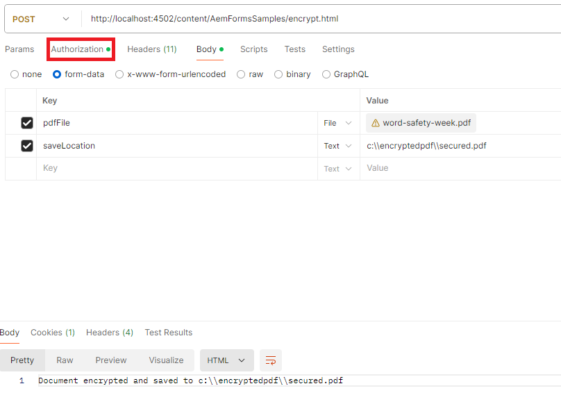

# Chiffrement d’un PDF avec un mot de passe d’autorisation

Un mot de passe d’autorisation, également appelé mot de passe propriétaire ou principal, est nécessaire pour copier, modifier ou imprimer un document PDF. Découvrez comment utiliser l’API [DocAssuranceService](https://developer.adobe.com/experience-manager/reference-materials/6-5/forms/javadocs/index.html?com/adobe/fd/docassurance/client/api/DocAssuranceService.html) pour appliquer un mot de passe d’autorisation à un PDF par programmation.

Le code JSP suivant chiffre un PDF avec un mot de passe d’autorisation :

```java
<%--
     Encrypt PDF with permissions password
--%>
    <%@include file="/libs/foundation/global.jsp"%>
<%@ page import="com.adobe.fd.docassurance.client.api.EncryptionOptions,java.util.*,java.io.*,com.adobe.fd.encryption.client.*" %>
    <%@page session="false" %>
<%
    String filePath = request.getParameter("saveLocation");
    InputStream pdfIS = null;
    com.adobe.aemfd.docmanager.Document generatedDocument = null;
    // get the pdf file
    javax.servlet.http.Part pdfPart = request.getPart("pdfFile");
    pdfIS = pdfPart.getInputStream();
    com.adobe.aemfd.docmanager.Document pdfDocument = new com.adobe.aemfd.docmanager.Document(pdfIS);


// encrypt the document with permssions password. You can only print this document
    PasswordEncryptionOptionSpec poSpec = new PasswordEncryptionOptionSpec();    
    poSpec.setCompatability(PasswordEncryptionCompatability.ACRO_X);
    poSpec.setEncryptOption(PasswordEncryptionOption.ALL);
    List<PasswordEncryptionPermission> permissionList = new ArrayList<PasswordEncryptionPermission>();
    permissionList.add(PasswordEncryptionPermission.PASSWORD_PRINT_LOW);
    //hardcoding passwords into code is for demonstration purposes only.In real life scenarios the password is sourced from a secure location
    poSpec.setPermissionPassword("adobe");
    poSpec.setPermissionsRequested(permissionList);
    EncryptionOptions encryptionOptions = EncryptionOptions.getInstance();
    encryptionOptions.setEncryptionType(com.adobe.fd.docassurance.client.api.DocAssuranceServiceOperationTypes.ENCRYPT_WITH_PASSWORD);
    encryptionOptions.setPasswordEncryptionOptionSpec(poSpec);
    com.adobe.fd.docassurance.client.api.DocAssuranceService docAssuranceService = sling.getService(com.adobe.fd.docassurance.client.api.DocAssuranceService.class);
    com.adobe.aemfd.docmanager.Document securedDocument = docAssuranceService.secureDocument(pdfDocument,encryptionOptions,null,null,null);
    securedDocument.copyToFile(new java.io.File(filePath));
    out.println("Document encrypted and saved to " +filePath);
%>
```


**Pour tester l’exemple de package sur votre système :**

[Téléchargez et installez le package à l’aide du gestionnaire de packages AEM.](assets/encryptpdf.zip)

**Après avoir installé le package, ajoutez les URL suivantes à la liste autorisée de configuration OSGi du filtre CSRF Adobe Granite :**

1. [Se connecter à configMgr](http://localhost:4502/system/console/configMgr).
1. Recherchez un filtre CSRF Adobe Granite.
1. Ajoutez le chemin suivant dans les sections exclues et enregistrez.
1. /content/AemFormsSamples/encrypt

## Test des exemples

Il existe plusieurs façons de tester l’exemple de code. La plus rapide et la plus simple est d’utiliser l’application Postman. Postman vous permet d’effectuer des requêtes POST à votre serveur. La copie d’écran suivante vous montre les paramètres de requête nécessaires au bon fonctionnement de la requête POST. Veillez à spécifier le type d’autorisation approprié avant d’envoyer la requête.


