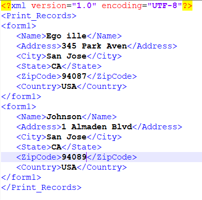

# Générer un ensemble de documents PDF à partir d’un fichier de données XML

OutputService fournit plusieurs méthodes pour créer des documents à l’aide d’une conception de formulaire et de données à fusionner avec la conception de formulaire. L’article suivant explique le cas pratique pour générer plusieurs PDF à partir d’un fichier XML volumineux contenant plusieurs enregistrements distincts.
Voici la capture d’écran d’un fichier XML contenant plusieurs enregistrements.



Le fichier XML de données comporte 2 enregistrements. Chaque enregistrement est représenté par l’élément form1. Ce fichier XML est transmis à la [méthode generatePDFOutputBatch](https://helpx.adobe.com/fr/aem-forms/6/javadocs/com/adobe/fd/output/api/OutputService.html) d’OutputService. Nous obtenons la liste des documents PDF (un par enregistrement).
La signature de la méthode generatePDFOutputBatch utilise les paramètres suivants :

* templates : carte contenant le modèle, identifié par une clé.
* data : carte contenant des documents de données XML, identifiés par clé.
* pdfOutputOptions : options de configuration de la génération de PDF.
* batchOptions : options de configuration du lot.


## Détails du cas d’utilisation{#use-case-details}

Dans ce cas d’utilisation, nous allons fournir une interface web simple pour charger le modèle et le fichier de données (XML). Une fois le chargement des fichiers terminé et la requête POST envoyée au servlet AEM, ce dernier extrait les documents et appelle la méthode generatePDFOutputBatch d’OutputService. Les fichiers PDF générés sont compressés dans un fichier ZIP et mis à la disposition de la personne finale pour les télécharger à partir du navigateur web.

## Code du servlet{#servlet-code}

Voici le fragment de code du servlet : Le code extrait le modèle (XDP) et le fichier de données (XML) de la requête. Le fichier de modèle est enregistré dans le système de fichiers. Deux mappages sont créés : templateMap et dataFileMap qui contiennent respectivement le fichier de modèle et le fichier XML (données). Un appel est alors effectué à la méthode generateMultipleRecords du service DocumentServices.

```java
for (final java.util.Map.Entry < String, org.apache.sling.api.request.RequestParameter[] > pairs: params
.entrySet()) {
final String key = pairs.getKey();
final org.apache.sling.api.request.RequestParameter[] pArr = pairs.getValue();
final org.apache.sling.api.request.RequestParameter param = pArr[0];
try {
if (!param.isFormField()) {

if (param.getFileName().endsWith("xdp")) {
    final InputStream xdpStream = param.getInputStream();
    com.adobe.aemfd.docmanager.Document xdpDocument = new com.adobe.aemfd.docmanager.Document(xdpStream);

    xdpDocument.copyToFile(new File(saveLocation + File.separator + "fromui.xdp"));
    templateMap.put("key1", "file://///" + saveLocation + File.separator + "fromui.xdp");
    System.out.println("####  " + param.getFileName());

}
if (param.getFileName().endsWith("xml")) {
    final InputStream xmlStream = param.getInputStream();
    com.adobe.aemfd.docmanager.Document xmlDocument = new com.adobe.aemfd.docmanager.Document(xmlStream);
    dataFileMap.put("key1", xmlDocument);
}
}

Document zippedDocument = documentServices.generateMultiplePdfs(templateMap, dataFileMap,saveLocation);
.....
.....
....
```

### Code d’implémentation de l’interface{#Interface-Implementation-Code}

Le code suivant génère plusieurs fichiers PDF à l’aide de la méthode generatePDFOutputBatch d’OutputService et renvoie un fichier ZIP contenant les fichiers PDF au servlet ayant effectué l’appel.

```java
public Document generateMultiplePdfs(HashMap < String, String > templateMap, HashMap < String, Document > dataFileMap, String saveLocation) {
    log.debug("will save generated documents to " + saveLocation);
    com.adobe.fd.output.api.PDFOutputOptions pdfOptions = new com.adobe.fd.output.api.PDFOutputOptions();
    pdfOptions.setAcrobatVersion(com.adobe.fd.output.api.AcrobatVersion.Acrobat_11);
    com.adobe.fd.output.api.BatchOptions batchOptions = new com.adobe.fd.output.api.BatchOptions();
    batchOptions.setGenerateManyFiles(true);
    com.adobe.fd.output.api.BatchResult batchResult = null;
    try {
        batchResult = outputService.generatePDFOutputBatch(templateMap, dataFileMap, pdfOptions, batchOptions);
        FileOutputStream fos = new FileOutputStream(saveLocation + File.separator + "zippedfile.zip");
        ZipOutputStream zipOut = new ZipOutputStream(fos);
        FileInputStream fis = null;

        for (int i = 0; i < batchResult.getGeneratedDocs().size(); i++) {
              com.adobe.aemfd.docmanager.Document dataMergedDoc = batchResult.getGeneratedDocs().get(i);
            log.debug("Got document " + i);
            dataMergedDoc.copyToFile(new File(saveLocation + File.separator + i + ".pdf"));
            log.debug("saved file " + i);
            File fileToZip = new File(saveLocation + File.separator + i + ".pdf");
            fis = new FileInputStream(fileToZip);
            ZipEntry zipEntry = new ZipEntry(fileToZip.getName());
            zipOut.putNextEntry(zipEntry);
            byte[] bytes = new byte[1024];
            int length;
            while ((length = fis.read(bytes)) >= 0) {
                zipOut.write(bytes, 0, length);
            }
            fis.close();
        }
        zipOut.close();
        fos.close();
        Document zippedDocument = new Document(new File(saveLocation + File.separator + "zippedfile.zip"));
        log.debug("Got zipped file from file system");
        return zippedDocument;


    } catch (OutputServiceException | IOException e) {

        e.printStackTrace();
    }
    return null;


}
```

### Déployer sur votre serveur{#Deploy-on-your-server}

Pour tester cette fonctionnalité sur votre serveur, suivez les instructions ci-dessous :

* [Télécharger et extraire le contenu du fichier ZIP vers votre système de fichiers](assets/mult-records-template-and-xml-file.zip). Ce fichier ZIP contient le fichier de modèle et le fichier de données XML.
* [Pointer votre navigateur vers la console web Felix](http://localhost:4502/system/console/bundles)
* [Déployez le lot Developingwithserviceuser.](/help/forms/assets/common-osgi-bundles/DevelopingWithServiceUser.jar).
* [Déployez le lot AEMFormsDocumentServices personnalisé](/help/forms/assets/common-osgi-bundles/AEMFormsDocumentServices.core-1.0-SNAPSHOT.jar). Lot personnalisé qui génère les fichiers PDF à l’aide de l’API OutputService.
* [Pointer votre navigateur vers le gestionnaire de packages](http://localhost:4502/crx/packmgr/index.jsp)
* [Télécharger et installer le package](assets/generate-multiple-pdf-from-xml.zip). Ce package contient une page HTML qui permet de déposer les fichiers de modèle et de données.
* [Pointer votre navigateur vers MultiRecords.html](http://localhost:4502/content/DocumentServices/Multirecord.html?)
* Faites glisser et déposez ensemble le fichier de modèle et le fichier de données XML.
* Téléchargez le fichier ZIP créé. Ce fichier ZIP contient les fichiers PDF générés par OutputService.

>[!NOTE]
>Il existe plusieurs façons de déclencher cette fonctionnalité. Dans cet exemple, nous avons utilisé une interface web pour déposer les fichiers de modèle et de données pour démontrer la fonctionnalité.
