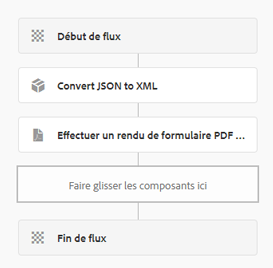

# Générer un PDF avec les données de l’envoi de formulaire basé sur des composants principaux

Voici le texte révisé avec « Composants principaux » en majuscule :

Un scénario classique consiste à générer un PDF à partir des données soumises via un formulaire adaptatif basé sur des composants principaux. Ces données sont toujours au format JSON. Pour générer un PDF à l’aide de l’API Render PDF, il est nécessaire de convertir les données JSON au format XML. La méthode `toString` `org.json.XML` est utilisée pour cette conversion. Pour plus de détails, reportez-vous à la [documentation de la méthode `org.json.XML.toString`](https://www.javadoc.io/doc/org.json/json/20171018/org/json/XML.html#toString-java.lang.Object-).

## Formulaire adaptatif basé sur un schéma JSON

Veuillez suivre ces étapes pour créer un schéma JSON pour votre formulaire adaptatif :

### Générer des données d’exemple pour le XDP

Pour rationaliser le processus, suivez ces étapes affinées :

1. Ouvrez le fichier XDP dans AEM Forms Designer.
1. Accédez à « Fichier » > « Propriétés du formulaire » > « Aperçu ».
1. Sélectionnez « Générer les données d’aperçu ».
1. Cliquez sur « Générer ».
1. Attribuez un nom de fichier significatif, tel que `form-data.xml`.

### Générer un schéma JSON à partir de données XML

Vous pouvez utiliser n’importe quel outil en ligne gratuit pour [convertir des données XML en JSON](https://jsonformatter.org/xml-to-jsonschema) en utilisant les données XML générées à l’étape précédente.

### Processus de workflow personnalisé pour convertir JSON en XML

Le code fourni convertit JSON en XML, stockant le XML résultant dans une variable de processus de workflow nommée `dataXml`.

```java
import org.slf4j.LoggerFactory;
import com.adobe.granite.workflow.WorkflowException;
import java.io.InputStream;
import java.io.BufferedReader;
import java.io.InputStreamReader;
import javax.jcr.Node;
import javax.jcr.Session;
import org.json.JSONObject;
import org.json.XML;
import org.slf4j.Logger;
import org.osgi.service.component.annotations.Component;
import com.adobe.granite.workflow.WorkflowSession;
import com.adobe.granite.workflow.exec.WorkItem;
import com.adobe.granite.workflow.exec.WorkflowProcess;
import com.adobe.granite.workflow.metadata.MetaDataMap;

@Component(property = {
    "service.description=Convert JSON to XML",
    "process.label=Convert JSON to XML"
})
public class ConvertJSONToXML implements WorkflowProcess {

    private static final Logger log = LoggerFactory.getLogger(ConvertJSONToXML.class);

    @Override
    public void execute(final WorkItem workItem, final WorkflowSession workflowSession, final MetaDataMap arg2) throws WorkflowException {
        String processArgs = arg2.get("PROCESS_ARGS", "string");
        log.debug("The process argument I got was " + processArgs);
        
        String submittedDataFile = processArgs;
        String payloadPath = workItem.getWorkflowData().getPayload().toString();
        log.debug("The payload in convert json to xml " + payloadPath);
        
        String dataFilePath = payloadPath + "/" + submittedDataFile + "/jcr:content";
        try {
            Session session = workflowSession.adaptTo(Session.class);
            Node submittedJsonDataNode = session.getNode(dataFilePath);
            InputStream jsonDataStream = submittedJsonDataNode.getProperty("jcr:data").getBinary().getStream();
            BufferedReader streamReader = new BufferedReader(new InputStreamReader(jsonDataStream, "UTF-8"));
            StringBuilder stringBuilder = new StringBuilder();
            String inputStr;
            while ((inputStr = streamReader.readLine()) != null) {
                stringBuilder.append(inputStr);
            }
            JSONObject submittedJson = new JSONObject(stringBuilder.toString());
            log.debug(submittedJson.toString());
            
            String xmlString = XML.toString(submittedJson);
            log.debug("The json converted to XML " + xmlString);
            
            MetaDataMap metaDataMap = workItem.getWorkflow().getWorkflowData().getMetaDataMap();
            metaDataMap.put("xmlData", xmlString);
        } catch (Exception e) {
            log.error("Error converting JSON to XML: " + e.getMessage(), e);
        }
    }
}
```

### Créer un workflow

Pour gérer les envois de formulaires, créez un workflow qui comprend deux étapes :

1. La première étape utilise un processus personnalisé pour transformer les données JSON soumises en XML.
1. L&#39;étape suivante génère un PDF en combinant les données XML avec le modèle XDP.




## Déployer l’exemple de code

Pour le tester sur votre serveur local, suivez cette procédure rationnalisée :

1. [Téléchargez et installez le lot personnalisé via la console web AEM OSGi](assets/convertJsonToXML.core-1.0.0-SNAPSHOT.jar).
1. [Importez le package de workflow](assets/workflow_to_render_pdf.zip).
1. [Importez l’exemple de formulaire adaptatif et le modèle XDP](assets/adaptive_form_and_xdp_template.zip).
1. [Prévisualisez le formulaire adaptatif](http://localhost:4502/content/dam/formsanddocuments/f23/jcr:content?wcmmode=disabled).
1. Remplissez quelques champs du formulaire.
1. Envoyez le formulaire pour déclencher le workflow AEM.
1. Recherchez le PDF rendu dans le dossier de payload du workflow.
