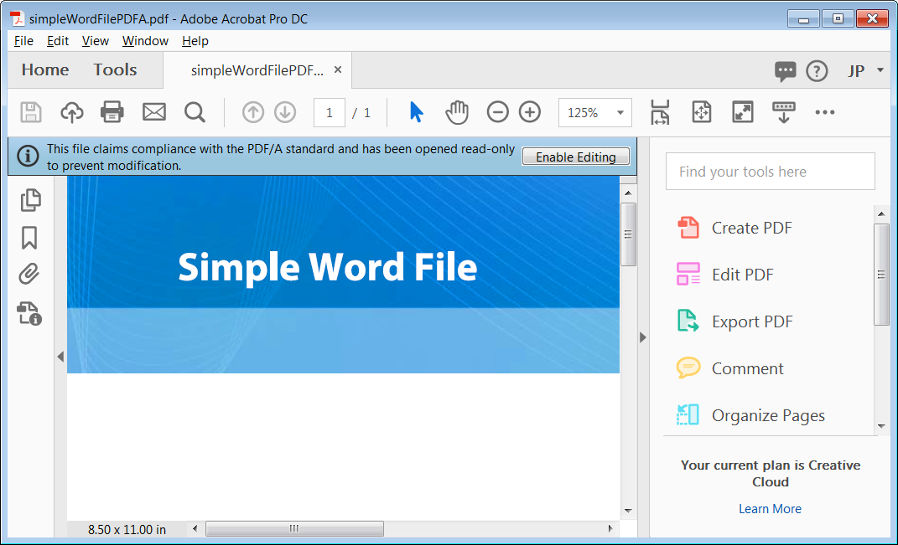

# PDF

Portable Document Format (PDF) est en fait une famille de formats de fichier, et cet article détaille ceux qui sont les plus pertinents pour les développeurs de formulaires. De nombreux détails techniques et normes de différents types de PDF évoluent et changent. Certains de ces formats et spécifications sont des normes de l’Organisation internationale de normalisation (ISO), et d’autres sont une propriété intellectuelle spécifique appartenant à l’Adobe.

Cet article vous explique comment créer différents types de fichiers PDF. Cela vous aide à comprendre comment et pourquoi utiliser chacun d’eux. Tous ces types fonctionnent mieux dans l’outil client principal pour l’affichage et l’utilisation de PDF—Adobe Acrobat DC.

Voici un exemple de fichier PDF/A dans Acrobat DC.

Les exemples de fichiers peuvent être [téléchargés ici](assets/pdf-file-types.zip)

## Xml Forms Architecture PDF

Adobe utilise le terme formulaire PDF pour faire référence au Forms interactif et dynamique que vous créez avec AEM Forms Designer. Les Forms et les fichiers que vous créez avec Designer sont basés sur l’architecture XML Forms (XFA) d’Adobe. Le format de fichier PDF XFA est plus proche d’un fichier HTML qu’d’un fichier PDF traditionnel. Par exemple, le code suivant vous montre à quoi ressemble un objet de texte simple dans un fichier PDF XFA.

XFA Forms est basé sur XML. Ce format bien structuré et flexible permet à un serveur AEM Forms de transformer vos fichiers Designer en différents formats, y compris les formats PDF, PDF/A traditionnels et HTML. Vous pouvez voir la structure XML complète de votre Forms dans Designer en sélectionnant le panneau Source XML de l’éditeur de mise en forme. Vous pouvez créer des Forms XFA statiques et dynamiques dans AEM Forms Designer.

## PDF statique

La mise en page statique des PDF forms XFA ne change jamais au moment de l’exécution, mais elle peut être interactive pour l’utilisateur. Voici quelques avantages des PDF forms XFA statiques :

* La mise en page statique des PDF forms XFA ne change jamais au moment de l’exécution, mais elle peut être interactive pour l’utilisateur.
* Forms statique prend en charge les outils de commentaire et de balisage d’Acrobat.
* Forms statique vous permet d’importer et d’exporter des commentaires Acrobat.
* Les Forms statiques prennent en charge le sous-paramétrage des polices. Il s’agit d’une technique pouvant être réalisée sur un serveur AEM Forms.
* Le rendu de Forms statique peut être effectué à l’aide de la visionneuse PDF intégrée fournie avec les navigateurs modernes.

>[!NOTE]
>
> Vous pouvez créer des PDF statiques à l’aide d’AEM Forms Designer en enregistrant le fichier XDP en tant que Adobe de formulaire PDF statique.

## Formats PDF

Portable Document Format (PDF) est en fait une famille de formats de fichier, et cet article détaille ceux qui sont les plus pertinents pour les développeurs de formulaires. De nombreux détails techniques et normes de différents types de PDF évoluent et changent. Certains de ces formats et spécifications sont des normes de l’Organisation internationale de normalisation (ISO), et d’autres sont une propriété intellectuelle spécifique appartenant à l’Adobe.

Cet article vous explique comment créer différents types de fichiers PDF. Cela vous aidera à comprendre comment et pourquoi utiliser chacun d’eux. Tous ces types fonctionnent mieux dans l’outil client principal pour l’affichage et l’utilisation de PDF—Adobe Acrobat DC.

Il s’agit d’un exemple de fichier PDF/A dans Acrobat DC.

Les exemples de fichiers peuvent être [téléchargés ici](assets/pdf-file-types.zip)

### XFA PDF

Adobe utilise le terme formulaire PDF pour désigner les formulaires interactifs et dynamiques que vous créez à l’aide d’AEM Forms Designer. Il est important de noter qu’il existe un autre type de formulaire PDF, appelé Acroform, différent des PDF forms que vous créez dans AEM Forms Designer. Les formulaires et les fichiers que vous créez avec Designer sont basés sur l’architecture Forms XML (XFA) d’Adobe. Le format de fichier PDF XFA est plus proche d’un fichier HTML qu’d’un fichier PDF traditionnel. Par exemple, le code suivant vous montre à quoi ressemble un objet de texte simple dans un fichier PDF XFA.

Comme vous pouvez le constater, les formulaires XFA sont basés sur XML. Ce format bien structuré et flexible permet à un serveur AEM Forms de transformer vos fichiers Designer en différents formats, y compris les formats PDF, PDF/A et HTML traditionnels. Vous pouvez voir la structure XML complète de vos formulaires dans Designer en sélectionnant le panneau Source XML de l’éditeur de mise en forme. Vous pouvez créer des formulaires XFA statiques et dynamiques dans AEM Forms Designer.

### PDF statique

Les PDF forms XFA statiques ne modifieront pas leur disposition au moment de l’exécution, mais ils peuvent être interactifs pour l’utilisateur. Voici quelques avantages des PDF forms XFA statiques :

* Les PDF forms XFA statiques ne modifieront pas leur disposition au moment de l’exécution, mais ils peuvent être interactifs pour l’utilisateur.
* Les formulaires statiques prennent en charge les outils de commentaire et de balisage d’Acrobat.
* Les formulaires statiques vous permettent d’importer et d’exporter des commentaires Acrobat.
* Les formulaires statiques prennent en charge le sous-paramétrage des polices, une technique qui peut être réalisée sur un serveur AEM Forms.
* Les formulaires statiques peuvent être rendus à l’aide de la visionneuse PDF intégrée fournie avec les navigateurs modernes.

>[!NOTE]
> Vous pouvez créer des fichiers PDF statiques à l’aide d’AEM Forms Designer en enregistrant le fichier XDP en tant que Adobe de formulaire PDF statique.

### Forms dynamique

Les fichiers PDF XFA dynamiques peuvent modifier leur mise en page au moment de l’exécution. Les fonctions de commentaire et de balisage ne sont donc pas prises en charge. Toutefois, les fichiers PDF XFA dynamiques offrent les avantages suivants :

* Les formulaires dynamiques prennent en charge les scripts côté client qui modifient la mise en page et la pagination du formulaire. Par exemple, le fichier Purchase Order.xdp s’agrandit et s’agrandit pour s’adapter à une quantité infinie de données si vous l’enregistrez en tant que formulaire dynamique.
* Les formulaires dynamiques prennent en charge toutes les propriétés de votre formulaire au moment de l’exécution, tandis que les formulaires statiques ne prennent en charge qu’un sous-ensemble.

>[!NOTE]
>
> Vous pouvez créer des formulaires PDF dynamiques à l’aide d’AEM Forms Designer en enregistrant le fichier XDP en tant que Adobe de formulaire XML dynamique.

>[!NOTE]
>
> Les formulaires dynamiques ne peuvent pas être rendus à l’aide des visionneuses PDF intégrées des navigateurs modernes.

### Fichier PDF (PDF traditionnel)

Un document certifié fournit au document PDF et aux destinataires Forms des garanties supplémentaires d’authenticité et d’intégrité.

Le format PDF le plus populaire et le plus répandu est le fichier PDF traditionnel. Il existe de nombreuses façons de créer un fichier PDF traditionnel, notamment en utilisant Acrobat et de nombreux outils tiers. Acrobat offre toutes les méthodes suivantes pour créer des fichiers PDF traditionnels. Si Acrobat n’est pas installé, il se peut que ces options ne s’affichent pas sur votre ordinateur.

* En capturant le flux d’impression d’une application de bureau : Choisissez la commande Imprimer d’une application de création et sélectionnez l’icône d’imprimante Adobe PDF. Au lieu d’une copie imprimée du document, vous aurez créé un fichier PDF du document.
* En utilisant le module externe Acrobat PDFMaker avec les applications Microsoft Office : Lorsque vous installez Acrobat, un menu Adobe PDF est ajouté aux applications Microsoft Office et une icône est ajoutée au ruban Office. Vous pouvez utiliser ces fonctions ajoutées pour créer des fichiers PDF directement dans Microsoft Office.
* En utilisant Acrobat Distiller pour convertir des fichiers Postscript et Encapsulated Postscript (EPS) au format PDF : Distiller est généralement utilisé dans la publication imprimée et dans d’autres workflows qui nécessitent une conversion du format Postscript au format PDF.
* En arrière-plan, un PDF traditionnel est très différent d’un PDF XFA. Il n’a pas la même structure XML, et comme il est créé en capturant le flux d’impression d’un fichier, un PDF traditionnel est un fichier statique et en lecture seule.

Un document certifié fournit au document PDF et aux destinataires de formulaires des garanties supplémentaires d’authenticité et d’intégrité.

### Acro

Les Acroforms sont une ancienne technologie de formulaire interactif d’Adobe. ils remontent à Acrobat version 3. Adobe fournit la [référence de l’API Forms Acrobat](assets/FormsAPIReference.pdf), datée de mai 2003, pour fournir les détails techniques de cette technologie. Les Acroforms sont une combinaison de
éléments suivants :

* Un fichier PDF traditionnel qui définit la disposition statique et les graphiques du formulaire.
* Champs de formulaire interactifs verrouillés au-dessus des outils de formulaire du programme Adobe Acrobat. Ces outils de formulaire constituent un petit sous-ensemble de ce qui est disponible dans AEM Forms Designer.

### PDF/A (PDF pour archive)

PDF/A (PDF for Archives) s’appuie sur les avantages de stockage de documents des fichiers PDF traditionnels avec de nombreux détails spécifiques qui améliorent l’archivage à long terme. Le format de fichier PDF traditionnel offre de nombreux avantages pour le stockage de documents à long terme. La nature compacte du PDF facilite le transfert et conserve de l’espace, et sa nature bien structurée permet de puissantes fonctions d’indexation et de recherche. Le format PDF traditionnel prend en charge les métadonnées de manière étendue. Le format PDF prend en charge depuis longtemps différents environnements informatiques.

Tout comme PDF, PDF/A est une norme ISO. Il a été développé par un groupe de travail comprenant AIIM (Association for Information and Image Management), NPES (National Printing Equipment Association) et le bureau administratif des tribunaux américains. Comme l’objectif de la spécification PDF/A est de fournir un format d’archive à long terme, de nombreuses fonctions PDF sont omises afin que les fichiers puissent être autonomes. Voici quelques points clés concernant la spécification qui améliore la reproductibilité à long terme du fichier PDF/A :

* Tout le contenu doit être contenu dans le fichier et il ne peut pas y avoir de dépendances à des sources externes telles que des hyperliens, des polices ou des logiciels.
* Toutes les polices doivent être incorporées et il doit s’agir de polices disposant d’une licence d’utilisation illimitée pour les documents électroniques.
* JavaScript non autorisé
* La transparence n’est pas autorisée
* Le chiffrement n’est pas autorisé
* Le contenu audio et vidéo n’est pas autorisé
* Les espaces colorimétriques doivent être définis indépendamment de l’appareil.
* Toutes les métadonnées doivent respecter certaines normes.

### Affichage d’un fichier PDF/A

Deux fichiers des exemples de fichiers ont été créés à partir du même fichier Microsoft Word. L’un a été créé au format PDF traditionnel, l’autre au format PDF/A. Ouvrez ces deux fichiers dans Acrobat Professional :

* simpleWordFile.pdf
* simpleWordFilePDFA.pdf

Bien que les documents semblent identiques, le fichier PDF/A s’ouvre avec une barre bleue en haut, indiquant que vous affichez ce document en mode PDF/A. Cette barre bleue est la barre de message d’Acrobat, qui s’affiche lorsque vous ouvrez certains types de fichiers PDF.

La barre de message du document contient des instructions et éventuellement des boutons pour vous aider à effectuer une tâche. Il est codé en couleur, et vous verrez la couleur bleue lorsque vous ouvrez des types spéciaux de fichiers PDF (comme ce fichier PDF/A) ainsi que des fichiers PDF certifiés et signés numériquement. La barre devient violette pour les PDF forms et jaune lorsque vous participez à une révision PDF.

>[!NOTE]
>
> Si vous cliquez sur Activer la modification, vous sortez ce document de la conformité PDF/A.

